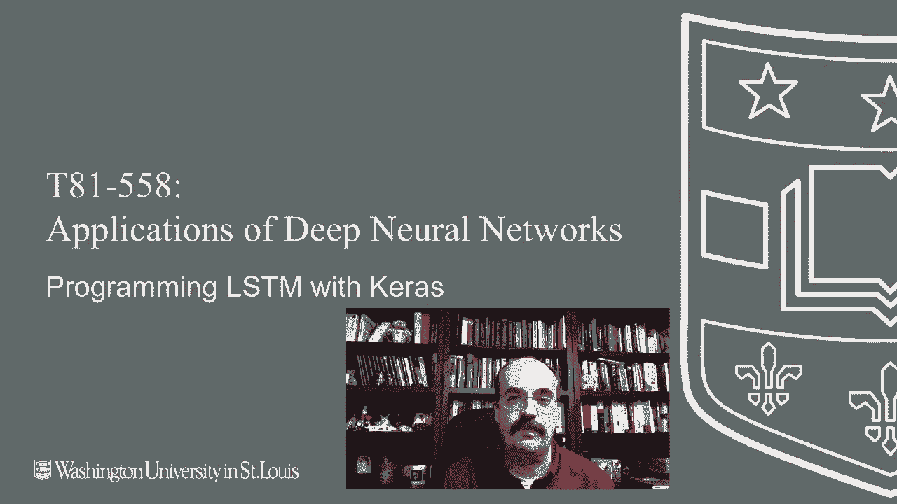
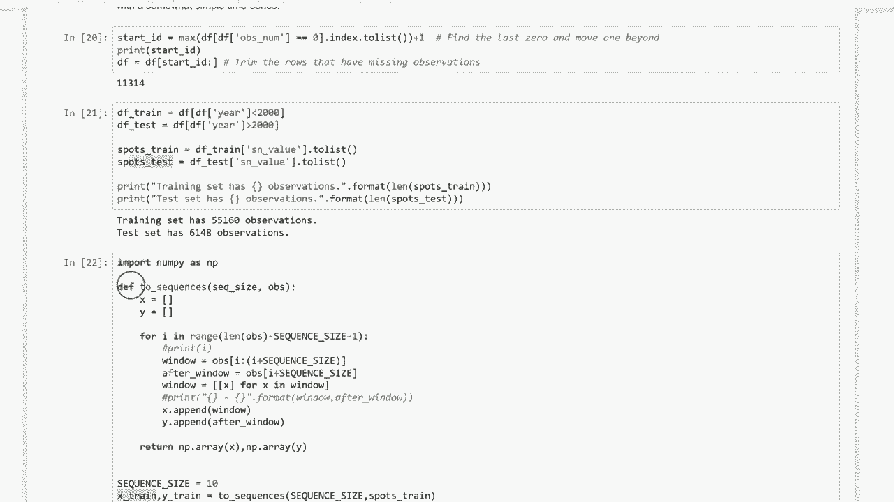

# T81-558 ｜ 深度神经网络应用-P53：L10.2- 使用Keras和TensorFlow编程LSTM 🧠

在本节课中，我们将学习用于处理时间序列数据的两种重要神经网络：长短期记忆网络（LSTM）和门控循环单元（GRU）。我们将从经典的循环神经网络（RNN）概念入手，逐步理解LSTM和GRU的工作原理，并通过Keras和TensorFlow的代码示例，展示如何构建和训练这些模型来识别序列模式并预测时间序列数据。



---

## 经典循环神经网络（RNN）与上下文神经元

上一节我们介绍了神经网络的基础。本节中，我们来看看循环神经网络（RNN）如何处理具有时间依赖性的数据。

循环神经网络通常包含**上下文神经元**的概念，它代表一种短期记忆。上下文神经元在对神经网络的调用之间保持一个值。当使用神经网络进行预测（即一次调用）时，上下文神经元初始值为零。随着序列数据的逐项输入，上下文神经元的值会更新并影响后续处理。


在每个新序列开始时，上下文神经元的值会重置为零。这是一个非常重要的特性，确保了序列之间的独立性。

以下是经典RNN中信息流动的一个简化描述：

*   输入层接收数据（例如，输入1，输入2）。
*   隐藏层神经元（例如，Hi 1和Hi 2）基于输入的加权和及激活函数产生输出。
*   在经典前馈网络中，这些输出会直接传递到下一层。
*   在RNN中，隐藏神经元的输出值会被**复制**到对应的上下文神经元中。
*   在下一次网络调用时，隐藏层神经元的输入不仅来自前一层，还**加权**接收来自上下文神经元的值。

因此，隐藏层神经元始终保留着上一次调用的输出值，并将其作为下一次调用输入的一部分。这种反馈机制使得网络能够学习数据随时间变化的模式，从而处理时间序列。

---

## LSTM网络：引入记忆“门控”机制 🚪

经典RNN存在梯度消失或爆炸的问题，难以学习长期依赖。LSTM网络通过引入“门”结构来解决这个问题。

我们可以将LSTM的“门”类比为计算器上的记忆按钮：
*   **输入门**：决定是否将新信息存入记忆（类似 `M+`）。
*   **遗忘门**：决定是否从记忆中丢弃旧信息（类似 `MC`）。
*   **输出门**：决定是否将记忆中的信息读取出来用于当前计算（类似 `MR`）。

LSTM单元的内部结构如下图所示，它包含了这些门以及`sigmoid`和`tanh`等激活函数：



以下是LSTM单元在每个时间步 `t` 的核心计算公式：

1.  **计算三个门的值**（使用`sigmoid`函数，输出范围0到1，决定“开”或“关”）：
    *   遗忘门：`f_t = σ(W_f · [h_{t-1}, x_t] + b_f)`
    *   输入门：`i_t = σ(W_i · [h_{t-1}, x_t] + b_i)`
2.  **计算候选记忆细胞值**（使用`tanh`函数，输出范围-1到1）：
    *   `C̃_t = tanh(W_C · [h_{t-1}, x_t] + b_C)`
3.  **更新记忆细胞状态**：
    *   `C_t = f_t * C_{t-1} + i_t * C̃_t`
4.  **计算输出门和最终输出**：
    *   输出门：`o_t = σ(W_o · [h_{t-1}, x_t] + b_o)`
    *   单元输出：`h_t = o_t * tanh(C_t)`

其中：
*   `x_t` 是当前输入。
*   `h_{t-1}` 是上一时间步的输出。
*   `C_{t-1}` 是上一时间步的记忆状态。
*   `W` 和 `b` 是可训练的权重和偏置参数。
*   `σ` 是sigmoid函数，`*` 表示逐元素相乘。

---

## GRU网络：LSTM的简化变体

GRU是LSTM的一种流行变体，它合并了记忆细胞状态和隐藏状态，并且使用了更少的门，结构更简单，计算效率通常更高。

GRU主要包含两个门：
*   **更新门**：决定有多少过去的信息需要传递到未来。
*   **重置门**：决定如何将新的输入信息与过去的记忆结合。

研究表明，在许多任务上，GRU能达到与LSTM相近的精度，但由于参数更少，其训练速度往往更快。

---

## 实践示例1：使用LSTM识别简单序列模式

为了直观展示LSTM的能力，我们首先看一个非常简单的例子。这个例子演示了LSTM如何识别一个序列中“车辆颜色”的模式，即使该模式在序列中出现的位置不同。

假设我们有一个“针孔相机”，每次只观察一个时间点。序列 `[0, 1, 1, 0, 0, 0]` 表示一辆单色车驶过（1代表颜色）。序列 `[0, 0, 2, 2, 3, 0]` 表示一辆双色车驶过。我们的目标是让LSTM学会识别车辆是单色、双色还是三色，而不受颜色在序列中位置的影响。

以下是使用Keras构建和训练模型的简化步骤：

```python
import numpy as np
from tensorflow.keras.models import Sequential
from tensorflow.keras.layers import LSTM, Dense

# 1. 准备数据
# 假设 X_train 是形状为 (样本数, 时间步长, 特征数) 的序列数据
# 假设 y_train 是对应的标签（0，1，2 代表单色，双色，三色）
# 示例数据构造（此处为示意）
X_train = np.array([[[0],[1],[1],[0],[0],[0]],
                    [[0],[0],[2],[2],[3],[0]],
                    ... ]) # 更多训练样本
y_train = np.array([0, 1, ...]) # 对应标签

# 2. 构建模型
model = Sequential()
model.add(LSTM(units=50, activation='relu', input_shape=(6, 1))) # 6个时间步，每个步长1个特征
model.add(Dense(1, activation='linear')) # 回归任务，输出一个数值

# 3. 编译模型
model.compile(optimizer='adam', loss='mse')

# 4. 训练模型
model.fit(X_train, y_train, epochs=200, verbose=1)

# 5. 预测
test_sequence = np.array([[[0],[0],[1],[1],[0],[0]]])
prediction = model.predict(test_sequence)
print(f"预测的车辆颜色数: {np.round(prediction[0][0])}")
```
通过训练，LSTM能够成功识别出 `[0,0,1,1,0,0]` 这样的序列代表一辆双色车，尽管颜色“1”出现的位置与训练样本不同。

---

## 实践示例2：预测太阳黑子时间序列 🌞

现在，我们来看一个更实际的例子：使用LSTM预测太阳黑子数量。我们将使用历史太阳黑子数据，将其构建为监督学习问题。

关键步骤是将时间序列数据转换为LSTM所需的3D格式 `[样本， 时间步长， 特征]`。

```python
import pandas as pd
from sklearn.preprocessing import MinMaxScaler

# 1. 加载和预处理数据
# 假设 df 包含‘Sunspots’列
data = df['Sunspots'].values.reshape(-1, 1)
scaler = MinMaxScaler(feature_range=(0, 1))
scaled_data = scaler.fit_transform(data)

# 2. 创建序列函数（核心步骤）
def create_sequences(data, seq_length):
    X, y = [], []
    for i in range(len(data) - seq_length):
        X.append(data[i:i + seq_length]) # 取 seq_length 个时间步作为输入
        y.append(data[i + seq_length])   # 下一个时间步的值作为标签
    return np.array(X), np.array(y)

SEQ_LENGTH = 10
X, y = create_sequences(scaled_data, SEQ_LENGTH)

# 3. 划分训练集和测试集（例如按2000年前后划分）
train_size = int(len(X) * 0.8)
X_train, X_test = X[:train_size], X[train_size:]
y_train, y_test = y[:train_size], y[train_size:]

# 4. 构建并训练LSTM模型
model = Sequential()
model.add(LSTM(units=50, return_sequences=True, input_shape=(SEQ_LENGTH, 1)))
model.add(LSTM(units=50))
model.add(Dense(1))
model.compile(optimizer='adam', loss='mse')

# 添加早停法以防止过拟合
from tensorflow.keras.callbacks import EarlyStopping
early_stop = EarlyStopping(monitor='val_loss', patience=5)

history = model.fit(X_train, y_train,
                    epochs=1000,
                    validation_data=(X_test, y_test),
                    callbacks=[early_stop],
                    verbose=1)

# 5. 评估模型
predictions = model.predict(X_test)
predictions = scaler.inverse_transform(predictions) # 反归一化
y_test_actual = scaler.inverse_transform(y_test)

# 计算均方根误差（RMSE）
rmse = np.sqrt(np.mean((predictions - y_test_actual)**2))
print(f'测试集RMSE: {rmse}')
```
通过这个流程，LSTM模型能够学习太阳黑子活动的历史模式，并对未来的值进行预测。`create_sequences` 函数是连接时间序列数据和LSTM模型的关键桥梁。

---

## 总结

本节课中我们一起学习了：
1.  **经典RNN** 通过**上下文神经元**实现短期记忆，用于处理序列数据。
2.  **LSTM网络** 通过**输入门、遗忘门、输出门**的机制，更有效地控制长期和短期记忆，解决了传统RNN的梯度问题。其核心状态更新由公式 `C_t = f_t * C_{t-1} + i_t * C̃_t` 描述。
3.  **GRU网络** 作为LSTM的简化变体，使用更少的门（更新门、重置门），常能获得相近性能且计算更高效。
4.  **实践应用**：我们通过Keras和TensorFlow，演示了如何构建LSTM模型来识别简单的序列模式，以及如何将时间序列数据（如太阳黑子数据）转换为合适的格式，并训练模型进行预测。


理解LSTM和GRU的门控机制是掌握现代序列建模的关键。下一节课，我们将探讨如何将LSTM与卷积神经网络（CNN）结合使用，以处理更复杂的任务。