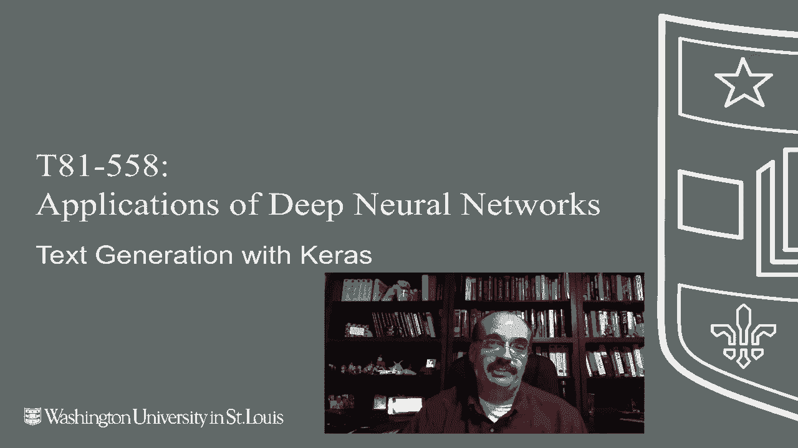
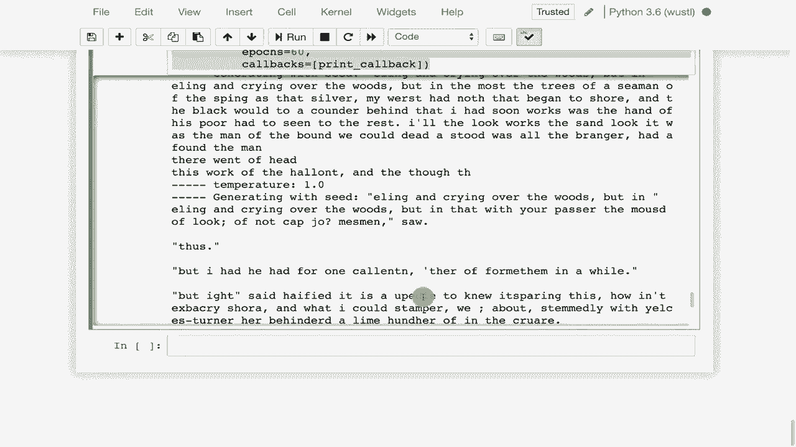

# T81-558 ｜ 深度神经网络应用-P54：L10.3- 使用Keras和TensorFlow生成文本 📝

在本节课中，我们将学习如何使用长短期记忆网络（LSTM）进行文本生成。我们将从零开始，训练一个神经网络阅读文本（例如《金银岛》），并让它生成具有相似风格的新文本。这是理解更高级应用（如图像字幕生成）的重要基础。

## 概述：文本生成的魅力 ✨



循环神经网络，特别是LSTM，在文本生成领域取得了显著成果。这项技术能够学习任何给定文本的语法、风格和结构，并创造出看似合理的新内容。从生成莎士比亚风格的戏剧到模仿编程代码，LSTM展示了其从数据中学习复杂模式的能力。

上一节我们介绍了LSTM的基本概念，本节中我们来看看如何具体实现一个文本生成模型。

## 文本生成示例展示 🎭

在深入代码之前，让我们先了解LSTM能做什么。以下是几个著名的生成示例：

*   **生成文章**：LSTM在阅读了大量文章后，可以生成包含标点、段落甚至看似合理逻辑的新文本。
*   **生成莎士比亚戏剧**：模型学会了戏剧的格式，包括角色名称和对话的排列方式。
*   **生成维基百科标记**：它甚至能模仿维基百科的特定语法格式，如双括号链接 `[[链接]]`。
*   **生成LaTeX代码**：在学术论文LaTeX源码上训练后，模型能生成包含数学公式和图表引用的、基本可编译的代码。
*   **生成C语言源代码**：模型学习了C语言的语法结构，能生成缩进正确、分号和括号使用合理的代码片段，尽管其中的变量可能是未定义的。

这些示例的共同点是，模型完全通过阅读文本自学了语言的结构规则，而非通过硬编码的语法。

## 实战：生成海盗故事 ⚓

接下来，我们将动手实现一个文本生成器，以罗伯特·路易斯·史蒂文森的《金银岛》为训练材料，生成新的海盗故事。

### 第一步：准备数据

首先，我们需要导入必要的库并加载文本数据。

```python
import numpy as np
import random
import sys
from keras.models import Sequential
from keras.layers import Dense, LSTM
from keras.optimizers import RMSprop
```

我们将从古腾堡计划获取《金银岛》的文本，并清理掉非ASCII字符，使模型专注于英语文本。

```python
# 读取文本文件
path = 'treasure_island.txt'
text = open(path).read().lower()
# 移除非ASCII字符
text = ''.join(char for char in text if ord(char) < 128)
print('语料库长度：', len(text))
```

### 第二步：创建训练序列

模型通过字符序列来学习。我们设定一个序列长度（例如40个字符），然后让模型根据这40个字符预测第41个字符。

以下是创建输入序列和对应标签的步骤：

1.  提取文本中所有连续的、长度为 `maxlen` (40) 的字符片段作为输入序列。
2.  将每个输入序列之后的下一个字符作为该序列的预测目标（标签）。
3.  为了增加数据量，我们使用步长（例如3）在文本上滑动窗口，获取大量重叠的序列。

```python
maxlen = 40  # 序列长度
step = 3     # 采样步长
sentences = [] # 输入序列
next_chars = [] # 目标字符

for i in range(0, len(text) - maxlen, step):
    sentences.append(text[i: i + maxlen])
    next_chars.append(text[i + maxlen])

print('序列数量：', len(sentences))
```

### 第三步：向量化数据

计算机无法直接理解字符，所以我们需要将字符转化为数字。我们为语料库中所有唯一的字符建立索引，然后将每个序列表示为数字列表，并将标签（下一个字符）进行独热编码。

```python
# 获取所有唯一字符
chars = sorted(list(set(text)))
char_indices = dict((char, i) for i, char in enumerate(chars))
indices_char = dict((i, char) for i, char in enumerate(chars))

# 向量化
x = np.zeros((len(sentences), maxlen, len(chars)), dtype=np.bool)
y = np.zeros((len(sentences), len(chars)), dtype=np.bool)

for i, sentence in enumerate(sentences):
    for t, char in enumerate(sentence):
        x[i, t, char_indices[char]] = 1
    y[i, char_indices[next_chars[i]]] = 1
```

### 第四步：构建LSTM模型

现在构建一个简单的LSTM模型。模型接收形状为 `(序列长度, 字符种类数)` 的输入，并输出一个概率分布，表示下一个字符是词汇表中每个字符的可能性。

```python
model = Sequential()
model.add(LSTM(128, input_shape=(maxlen, len(chars))))
model.add(Dense(len(chars), activation='softmax'))
optimizer = RMSprop(learning_rate=0.01)
model.compile(loss='categorical_crossentropy', optimizer=optimizer)
```

### 第五步：定义文本生成函数

在训练过程中，我们希望看到模型生成的文本如何随着训练轮次改进。我们定义一个生成函数，它接受一个种子文本和“温度”参数，温度控制生成文本的随机性。

**温度公式**：在通过softmax获得概率分布后，我们通过调整温度 `τ` 来重新调整概率。
`P_i' = exp(log(P_i) / τ) / sum(exp(log(P_j) / τ))`
其中，`τ` 越高（>1），概率分布越平缓，生成更随机、更有创意的文本；`τ` 越低（<1），概率分布越尖锐，生成更保守、更可预测的文本。

```python
def sample(preds, temperature=1.0):
    preds = np.asarray(preds).astype('float64')
    preds = np.log(preds) / temperature
    exp_preds = np.exp(preds)
    preds = exp_preds / np.sum(exp_preds)
    probas = np.random.multinomial(1, preds, 1)
    return np.argmax(probas)
```

### 第六步：训练模型并生成文本

我们将生成函数设置为回调，在每轮训练结束后，使用不同的温度生成文本示例，以便观察模型的学习进展。

```python
for epoch in range(1, 60):
    print('Epoch', epoch)
    model.fit(x, y, batch_size=128, epochs=1)
    # 选择一个随机种子文本
    start_index = random.randint(0, len(text) - maxlen - 1)
    generated_text = text[start_index: start_index + maxlen]
    print('--- 种子文本: "' + generated_text + '"')

    for temperature in [0.2, 0.5, 1.0, 1.2]:
        print('------ 温度:', temperature)
        sys.stdout.write(generated_text)

        # 从种子开始生成400个字符
        for i in range(400):
            sampled = np.zeros((1, maxlen, len(chars)))
            for t, char in enumerate(generated_text):
                sampled[0, t, char_indices[char]] = 1.

            preds = model.predict(sampled, verbose=0)[0]
            next_index = sample(preds, temperature)
            next_char = indices_char[next_index]

            generated_text += next_char
            generated_text = generated_text[1:] # 保持输入长度为40

            sys.stdout.write(next_char)
            sys.stdout.flush()
        print()
```

随着训练的进行，你会看到生成的文本从最初的杂乱无章，逐渐变得具有语法结构，甚至模仿出《金银岛》的海盗叙事风格。

## 总结 🎯

本节课中我们一起学习了如何使用Keras和TensorFlow构建一个基于LSTM的文本生成器。我们涵盖了从数据预处理、序列创建、模型构建到文本生成和温度参数调节的完整流程。核心在于，LSTM能够通过阅读大量文本，自主学习语言的潜在规律和风格。



这项技术是许多高级自然语言处理应用的基础。在下一节课中，我们将探讨如何将类似的原理应用于计算机视觉领域，实现从图像自动生成描述性字幕的功能。