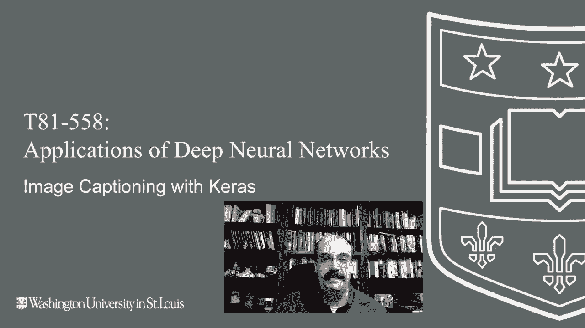
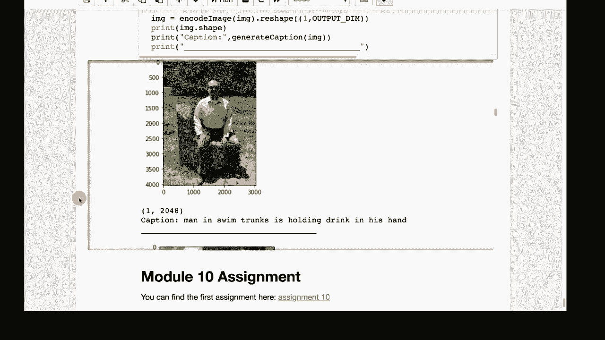

# T81-558 ｜ 深度神经网络应用 - P55：L10.4 - 使用Keras和TensorFlow进行图像描述生成 📝



在本节课中，我们将学习如何结合卷积神经网络（CNN）和长短期记忆网络（LSTM）来为图像生成描述性文字。我们将使用迁移学习技术，并利用预训练的Inception V3模型和GloVe词向量来构建一个能够理解图像内容并生成连贯句子的系统。

---

## 概述

图像描述生成是一项结合了计算机视觉和自然语言处理的任务。其目标是让机器能够“看到”图像中的多个元素，并用一句自然语言来描述它。我们将使用Keras和TensorFlow来实现这一功能，并利用Flickr8K数据集进行训练。

---

## 核心概念与工作流程

整个系统的工作流程基于一个关键思想：将图像特征与文本序列结合起来，逐步生成描述。以下是核心步骤：

1.  **图像特征提取**：使用预训练的CNN模型（如Inception V3）提取图像的深度特征向量。
2.  **文本序列处理**：将描述文本（标题）转换为词序列，并使用GloVe词嵌入将其转换为稠密向量。
3.  **模型构建**：构建一个具有两个输入的神经网络。一个输入接收图像特征，另一个输入接收逐步构建的词序列。网络的核心是一个LSTM层，用于学习序列的上下文信息。
4.  **训练与预测**：使用图像-描述对训练模型。在预测时，模型从“开始”标记出发，结合图像特征，递归地预测下一个最可能的词，直到生成“结束”标记。

---

## 数据准备

我们需要准备图像数据和对应的文本描述。

以下是数据处理的关键步骤：

*   **加载数据集**：使用Flickr8K数据集，它包含约8000张图像，每张图像有5个不同的描述。
*   **清理文本**：将所有描述转换为小写，移除标点符号和非常短的单词，并统计词汇表。
*   **确定序列长度**：找出所有描述中的最大长度，这将决定模型输入序列的长度。
*   **加载词嵌入**：加载预训练的GloVe词向量，为词汇表中的每个词提供一个200维的向量表示。

---

## 模型架构详解

我们的模型使用Keras的函数式API构建，因为它需要处理多个输入。

以下是模型的主要组成部分：

1.  **图像输入分支**：输入是来自Inception V3的2048维特征向量。通过一个全连接层进行进一步处理。
    ```python
    # 伪代码示意
    image_input = Input(shape=(2048,))
    image_features = Dense(256, activation='relu')(image_input)
    ```
2.  **文本输入分支**：输入是词索引序列。首先通过一个嵌入层，利用GloVe矩阵将词索引转换为200维的词向量。
    ```python
    # 伪代码示意
    text_input = Input(shape=(max_length,))
    text_embedding = Embedding(vocab_size, 200, weights=[embedding_matrix])(text_input)
    ```
3.  **特征融合与序列学习**：将处理后的图像特征向量复制并连接到文本序列的每一步。然后将融合后的序列输入到LSTM层中。
    ```python
    # 伪代码示意：将图像特征重复并添加到每个词向量上
    # 然后输入LSTM
    merged = add([image_features_expanded, text_embedding]) # 此处为概念示意，实际为合并操作
    lstm_out = LSTM(256)(merged)
    ```
4.  **输出层**：最后一个全连接层使用softmax激活函数，输出词汇表中每个词作为下一个词的概率分布。
    ```python
    # 伪代码示意
    outputs = Dense(vocab_size, activation='softmax')(lstm_out)
    model = Model(inputs=[image_input, text_input], outputs=outputs)
    ```

---

## 训练策略

由于训练数据量很大（每张图片的每个描述都会生成多个训练样本），我们使用生成器来动态产生批次数据，以避免内存溢出。

以下是训练过程的关键点：

*   **使用生成器**：编写一个数据生成器函数，使用`yield`关键字逐批产生图像特征和对应的词序列标签。
*   **损失函数与优化器**：使用分类交叉熵损失函数，因为这是一个多分类问题（预测下一个词）。优化器使用Adam。
*   **学习率调度**：训练分为多个阶段，每个阶段使用不同的学习率，例如前10个周期使用较高的学习率，后10个周期降低学习率。

---

## 生成描述

训练完成后，我们可以使用模型为新的图像生成描述。

以下是生成过程的步骤：

1.  使用Inception V3提取新图像的特征向量。
2.  初始化一个序列，只包含“开始”标记，并用零填充至最大长度。
3.  将图像特征和当前序列输入模型，得到下一个词的概率分布。
4.  选择概率最高的词，将其添加到序列中。
5.  重复步骤3和4，直到模型预测出“结束”标记或达到最大序列长度。
6.  将词索引序列转换回单词，形成最终的描述句子。

---

## 结果分析与局限性

在Flickr8K测试集上，模型能够生成基本符合图像内容的描述，例如“一只狗在草地上奔跑”或“两个人在骑自行车”。然而，描述并不完美，有时会混淆细节（如颜色、性别、物体数量）。

当我们使用完全不在训练集中的个人照片进行测试时，模型的局限性更加明显。它可能会生成语法正确但内容不准确的描述，例如将“一个人站在电话亭旁”描述为“一个穿黑色衬衫的男人在街上”。这表明模型严重依赖于训练数据的分布。

模型的性能可以通过以下方式提升：
*   使用更大、更多样化的数据集进行训练。
*   使用更强大的预训练图像模型和词嵌入模型。
*   调整模型架构和超参数。

---

## 总结



本节课我们一起学习了如何使用Keras和TensorFlow构建一个图像描述生成系统。我们了解了如何将CNN提取的图像特征与LSTM处理的文本序列相结合，利用迁移学习（Inception V3和GloVe）来有效训练模型。虽然当前模型的结果尚有改进空间，但它清晰地展示了多模态学习（结合视觉与语言）的基本原理和强大潜力。通过本教程，你应该掌握了构建此类应用的核心步骤和代码框架。