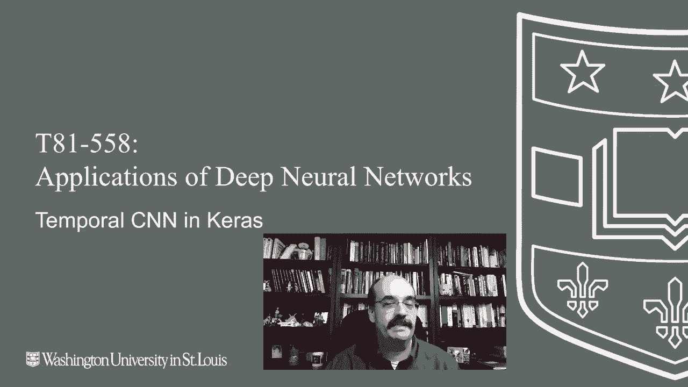
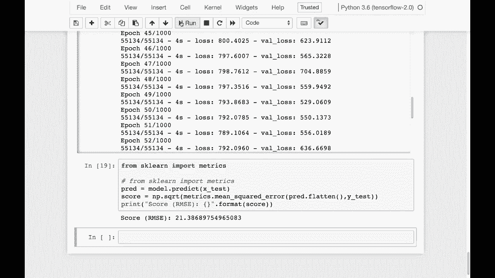

# T81-558 ｜ 深度神经网络应用 - P56：L10.5 - Keras中的时间卷积神经网络 ⏳🧠

在本节课中，我们将要学习如何使用卷积神经网络来处理时间序列数据。我们将看到，尽管循环神经网络（如LSTM）在时间序列预测中很常见，但卷积神经网络（CNN）也能在此类任务中表现出色，甚至在某些复杂场景中更具优势。

## 概述



我是杰夫·伊顿，欢迎来到华盛顿大学的深度神经网络应用课程。传统上，LSTM和循环神经网络被广泛用于时间序列预测。然而，最新的研究表明，卷积神经网络也能有效处理时间序列和自然语言处理任务。本节课程将展示如何在Keras中使用时间卷积神经网络。

## 时间卷积神经网络简介

你通常会将卷积神经网络视为处理图像的工具。如今，CNN的应用范围已大大扩展，特别是在时间序列分析领域。许多最新研究使CNN在一些复杂的时序任务中占据了优势。

Keras在时间卷积神经网络方面没有非常先进的预构建库。一个较好的库链接已提供，但目前与TensorFlow 2.0不兼容。这个问题预计在本学期开始时会得到解决，届时我将提供更新。

## 实践示例：玩具数据集

在本节中，我们将使用两个时间序列示例进行演示。第一个是玩具数据集，第二个是太阳黑子数据。我们将展示如何用CNN层替换之前LSTM示例中的层，而数据输入格式（3D张量）保持不变。

以下是设置3D张量输入的代码片段：
```python
# 假设 X_train 是原始序列数据
X_train = np.reshape(X_train, (X_train.shape[0], X_train.shape[1], 1))
```

这个玩具数据集模拟了用一束激光探测前方汽车的场景。颜色1的汽车被分类为1，颜色2的汽车被分类为2。数据集旨在演示LSTM的使用，但这里我们将其替换为Conv1D层。

我们使用Keras内置的`Conv1D`层来实现时间卷积。更高级的版本会使用残差连接，类似于ResNet中的结构。本学期我们将坚持使用`Conv1D`层，以确保代码版本的稳定性。

模型训练完成后，我们可以进行预测。例如，将汽车放置在序列的不同位置，模型应能正确识别其类别。

## 实践示例：太阳黑子预测

第二个示例是预测月度太阳黑子数量。太阳黑子数量会随时间波动，我们的目标是利用历史数据预测未来值。

首先需要下载数据文件并放置在工作目录中。我们加载数据，并剔除早期的缺失值。然后将数据按时间顺序划分为训练集（2000年之前）和测试集（2000年之后）。

以下是数据预处理的关键步骤：
1.  将时间序列数据转换为监督学习格式。
2.  定义序列长度（例如25），即用过去25个月的数据预测下一个月。
3.  将数据重塑为模型所需的3D格式 `[样本数, 时间步长, 特征数]`。

接着，我们构建并训练卷积神经网络模型。训练过程中会使用早停法来防止过拟合。

模型训练完成后，我们在训练集和测试集上计算均方根误差（RMSE）来评估性能。在这个例子中，测试集RMSE为21，考虑到太阳黑子数值通常在几百的范围内，这个精度是可以接受的。

## 核心概念与代码

上一节我们介绍了两个实践示例，本节中我们来看看其中的核心操作：使用`Conv1D`层构建模型。

以下是一个简单的时间卷积神经网络模型构建示例：
```python
from tensorflow.keras.models import Sequential
from tensorflow.keras.layers import Conv1D, Flatten, Dense

model = Sequential()
model.add(Conv1D(filters=64, kernel_size=3, activation='relu', input_shape=(时间步长, 1)))
model.add(Flatten())
model.add(Dense(50, activation='relu'))
model.add(Dense(1)) # 回归任务输出层
model.compile(optimizer='adam', loss='mse')
```
在这个模型中：
*   **`Conv1D`** 层在一维序列上进行卷积操作，提取局部特征。
*   **`Flatten`** 层将卷积后的多维输出展平，以便连接全连接层。
*   **`Dense`** 层用于最终的解释或预测。

## 总结



本节课中我们一起学习了如何将卷积神经网络应用于时间序列预测。我们了解到，CNN不仅是图像处理的利器，通过`Conv1D`层，它也能有效地捕捉时间序列中的局部依赖关系和模式。我们通过一个玩具数据集和一个真实的太阳黑子预测任务，实践了如何构建、训练和评估一个简单的时间卷积神经网络模型。记住，数据预处理成正确的3D格式 `[样本数, 时间步长, 特征数]` 是关键的第一步。随着研究的进展，更复杂的结构（如残差网络）可能会被引入到这个领域。