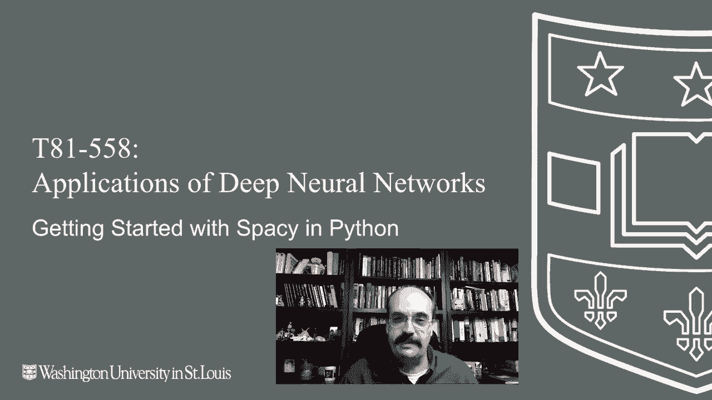
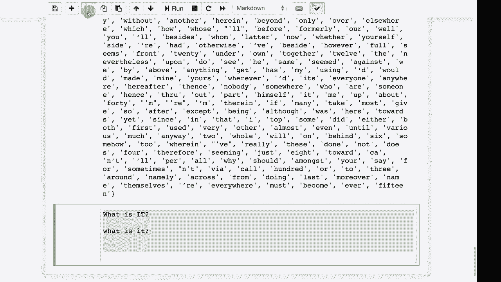

# T81-558 ｜ 深度神经网络应用 - P57：L11.1 - Python中的Spacy入门 🚀

在本节课中，我们将学习自然语言处理的基础知识，并重点介绍如何使用Python库Spacy对文本进行预处理。我们将探讨分词、词形还原等核心概念，为后续将文本数据输入神经网络做好准备。



---

## 概述

自然语言处理涉及处理字符和单词。一种方法是按字符级别处理，另一种是按单词级别处理。本课将重点介绍单词级别的处理技术。在将单词送入神经网络之前，可以使用Python中的额外库对其进行处理。字符级别处理的优点是让神经网络自行理解英语的后缀、前缀等语法结构。不同技术各有优劣。传统NLP方法涉及大量语法分析，而现代新技术几乎是端到端的，神经网络直接在原始文本上操作。然而，有时仍然需要在单词级别进行一些预处理。

## Spacy简介

我们将学习如何使用一些Python包来处理文本中的实际单词，然后再将它们发送到神经网络。除了TensorFlow，Python中还有几个可用的NLP库，其中两个特别突出的是NLTK和Spacy。NLTK出现时间更早，已使用一段时间。目前两者我都使用过，但我更喜欢Spacy。这就是我们将在课堂上使用的工具。它更面向对象，这种方式很好。它可能会以一种细致的面向对象方式实现，意味着它实际上将单词转换为个体对象，从而提供关于这些单词的相当多信息。

## 安装Spacy

安装Spacy时，它应该在你完成模块1的所有Pip安装时已经安装过。Spacy是我指定的你应该安装的包之一。然而，如果你只是安装Spacy，它是无法工作的。它需要一个语言模型。我建议你为这门课安装英语语言模型，因为我们将使用它。如果你还没有安装语言模型，可能在运行这个模块中的代码时会遇到错误。

最佳安装命令如下，如果你遇到问题，可以搜索它们，或者在课堂论坛上发帖。我遇到过几乎所有可以想象的错误。虽然并非总是能调试所有内容，但如果你遇到错误，复制并粘贴错误信息到搜索引擎，你可能会被引导到相关解决方案页面。

## 核心概念：分词

你将听到的一个术语是**分词**。分词是将句子拆分成单个单词的过程。这比听起来更困难。

考虑以下句子：
*   `这是一个测试` 很容易分词，单词是“这”、“是”、“一个”、“测试”。
*   `好的，但这怎么样？` 现在你需要决定如何进行分词。你可能不想失去那个逗号，或者你可能希望逗号消失。如果你把它拆分成一个单词列表，可能会变成 `[‘好的’， ‘，’， ‘但’， ‘这’， ‘怎么样’， ‘？’]`。你必须决定是基于空格还是其他规则进行拆分。
*   `U.S.A` 如果你是基于标点符号进行分词，结果将是 `[‘U’, ‘.’, ‘S’, ‘.’, ‘A’]`，你希望把它们保持在一起。但是，除非你对语言有一些知识，否则这些看起来只是三个不连贯的字母。这就是为什么需要为此安装语言模型。
*   带有连字符的单词，例如 `state-of-the-art`。你可能不想把它们分成多个单词。但有时连字符确实表示分隔。

这些是在尝试分词句子时会遇到的一些问题。运行以下代码，我将展示Spacy的分词结果。分词是你在单词级别自然语言处理过程中最常做的事情之一。

```python
import spacy
nlp = spacy.load("en_core_web_sm")
text = "这是一个测试。U.S.A. state-of-the-art"
doc = nlp(text)
print([token.text for token in doc])
```

## 核心概念：词形还原

另一个常见的操作是将单词简化为其根形式，即**词形还原**。例如，“buying”会变成“buy”。这样你会失去一些时态信息，但“look”会保持为“look”。这将其分解成一个标准化的词组，这样你就不必自己解析和进行标记化。相信我，不要自己用正则表达式找空格和分词，这实际上是一个相当困难的问题，需要语言知识。这样你就可以将“U.K.”这样的词保持在一起。

```python
# 词形还原示例
text2 = "buying looked running"
doc2 = nlp(text2)
print([token.lemma_ for token in doc2])  # 输出: ['buy', 'look', 'run']
```

## 词性标注与依存解析

Spacy还可以对词语进行词性标注（如名词、动词）和依存句法分析。虽然我通常不使用这些进行深度学习，但有时看到句子的语法结构图示挺有趣的。运行图示时有一个常见问题，它可能需要启动一个网络服务器来显示，所以可能会较慢。最好在不需要时断开它。

```python
# 词性标注示例
for token in doc:
    print(token.text, token.pos_, token.dep_)
```

## 停用词处理

停用词是自然语言处理中的一个非常常见的术语。这些是英语中非常常见的词，但通常（我强调通常）对语义贡献价值很低。例如，“the”, “is”, “at”等。因此，停用词通常被移除或降权。Spacy提供了一个停用词列表。

你通常会做的是遍历句子并移除停用词。在进行基于词频的简单统计分析时，可能需要移除停用词。不过，需要注意一个陷阱：过度移除可能丢失信息。例如，句子“What is it?”在转换为小写并移除停用词（“what”, “is”, “it”）后，会变成一个空行，但这本身是一个合法的疑问句。因此，必须对这些自然语言处理的事项保持警觉。

```python
# 停用词示例
print(spacy.lang.en.stop_words.STOP_WORDS) # 查看停用词列表
# 移除停用词
filtered_tokens = [token.text for token in doc if not token.is_stop]
print(filtered_tokens)
```

---

## 总结



本节课中，我们一起学习了Python中Spacy库的基础应用。我们了解了它在自然语言处理预处理阶段的重要性，特别是**分词**和**词形还原**这两个核心操作。我们还探讨了词性标注、依存解析以及**停用词处理**的概念与注意事项。使用Spacy可以高效地将原始文本转换为更适合神经网络处理的格式化数据，而无需手动处理复杂的语言规则。在下一个视频中，我们将讨论更多NLP工具，特别是Word2Vec。

感谢观看。