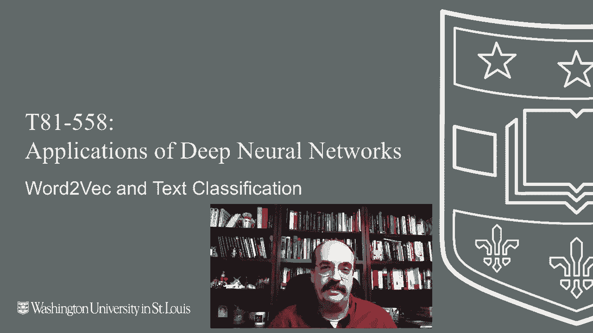
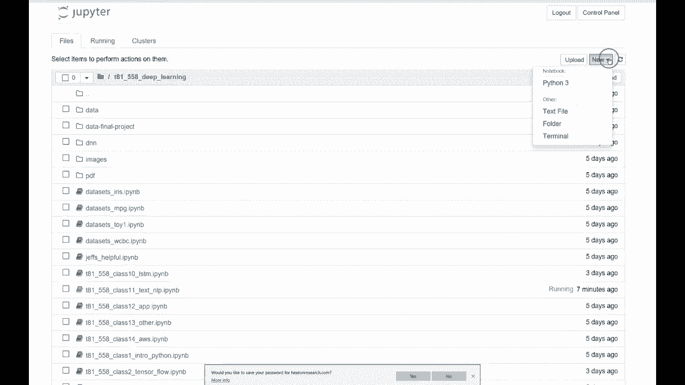
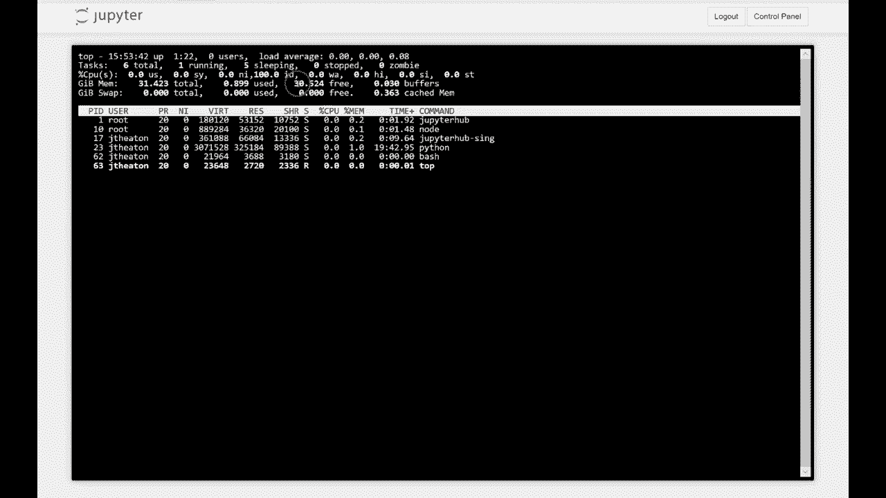
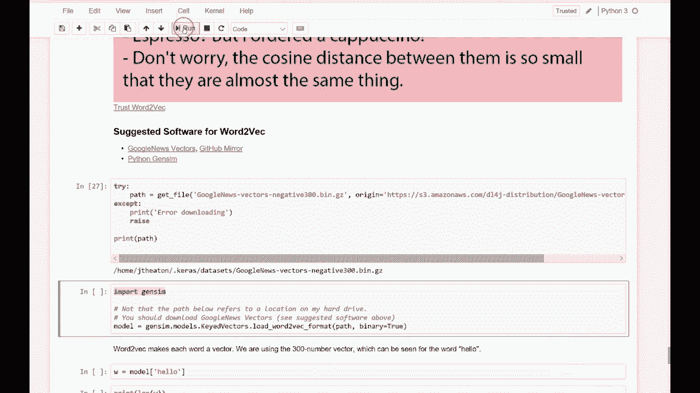
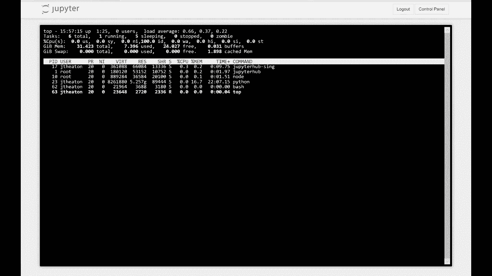
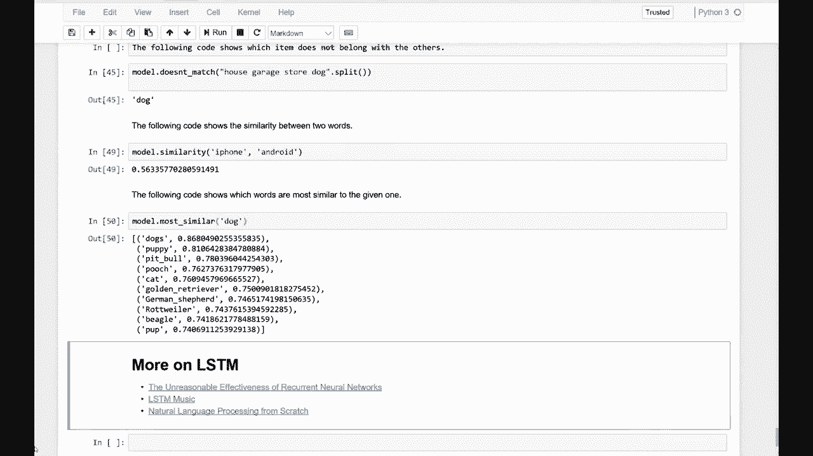

# T81-558 ｜ 深度神经网络应用-P58：L11.2- Word2Vec和文本分类 📚

在本节课中，我们将要学习Word2Vec，这是一种将单词转换为向量表示的预训练模型。我们将探讨其工作原理、如何获取与加载，以及如何利用它进行文本分类等自然语言处理任务。

---

## 概述 📖



Word2Vec是一种解决如何将单词转换为向量问题的技术。我们之前看到的编码方法主要是使用虚拟变量和索引，将每个单词转换为一个编号。这种方法对于端到端的神经网络有效。

但随着词汇量的增大，这种方法效率会降低。Word2Vec提供了一种将单词映射到向量空间的方法，使得相似的单词在向量空间中彼此靠近，从而可以进行各种线性代数运算。

---

## Word2Vec的核心概念 🔑

Word2Vec本质上是一个将单词映射到高维向量空间的模型。其核心思想是，语义相近的单词在向量空间中的位置也相近。

**公式表示**： 给定一个单词 `w`，Word2Vec模型 `M` 将其映射为一个 `d` 维的向量：
`vec(w) = M[w] ∈ R^d`
通常 `d` 为 100, 200 或 300。

**代码示例**： 加载模型后，可以像字典一样查询单词的向量。
```python
# 假设 model 是已加载的 Word2Vec 模型
vector_hello = model['hello']
print(len(vector_hello))  # 输出: 300
```

上一节我们介绍了Word2Vec的基本概念，本节中我们来看看如何获取和使用一个预训练的Word2Vec模型。



---

## 获取与加载模型 💾

一个常用的大型预训练模型是谷歌基于谷歌新闻训练的Word2Vec模型，它使用300维向量。

以下是获取和加载该模型的步骤：
1.  **下载模型文件**： 文件较大（约1.5GB），需要从可靠的镜像（如GitHub）下载。
2.  **确保足够内存**： 加载完整的模型需要较大的内存（建议16GB以上）。
3.  **使用`gensim`库加载**： `gensim`是Python中处理Word2Vec的常用库。





**代码示例**：
```python
import gensim.downloader as api
# 下载并加载‘word2vec-google-news-300’模型
model = api.load('word2vec-google-news-300')
```
加载过程会消耗大量内存，需要耐心等待。

---

## 探索词向量运算 🧮



Word2Vec的强大之处在于，词向量之间的数学运算可以反映单词之间的语义关系。

以下是几个典型的运算示例：

**计算单词相似度**：
我们可以计算两个词向量之间的余弦相似度，值越接近1，表示单词越相似。
```python
similarity = model.similarity('cat', 'dog')
print(f"猫和狗的相似度: {similarity:.4f}")
```

**寻找相似词**：
可以查找与给定单词最相似的其他单词。
```python
similar_words = model.most_similar('king', topn=5)
print(similar_words)  # 输出与‘king’最相似的5个词及相似度
```

**经典的向量类比运算**：
最著名的例子是：`king - man + woman ≈ queen`。
```python
result = model.most_similar(positive=['woman', 'king'], negative=['man'], topn=1)
print(result)  # 输出最可能的结果，通常是‘queen’
```

上一节我们看到了词向量的基础运算，本节中我们通过一个具体任务来加深理解。

---

## 应用示例：找出异类词

我们可以利用词向量来判断一组词中哪一个与其他词在语义上最不相关。

以下是执行该任务的代码逻辑：
```python
def find_odd_one_out(words, model):
    """
    找出words列表中语义上的‘异类’词。
    """
    # 计算每个词与其他所有词的平均相似度
    mean_similarities = {}
    for target_word in words:
        similarities = [model.similarity(target_word, w) for w in words if w != target_word]
        mean_similarities[target_word] = sum(similarities) / len(similarities)
    # 平均相似度最低的词就是异类
    odd_one_out = min(mean_similarities, key=mean_similarities.get)
    return odd_one_out

# 示例
words = ['breakfast', 'cereal', 'dinner', 'lunch']
odd_word = find_odd_one_out(words, model)
print(f"异类词是: {odd_word}")  # 很可能输出‘cereal’
```

---

## 在文本分类中的应用 📝

Word2Vec可以为文本分类任务提供高质量的单词特征。传统方法使用独热编码，维度高且稀疏。而使用Word2Vec：
*   每个单词被表示为稠密的低维向量（如300维）。
*   语义相似的单词拥有相似的向量，为模型提供了更丰富的信息。
*   可以将一句话中所有单词的向量取平均或求和，作为整个句子的特征向量，输入到分类器（如神经网络）中。

这种方法比使用大型的虚拟变量字典更加高效和有效。

---

## 总结与延伸 🎯

本节课中我们一起学习了Word2Vec的核心概念与应用。我们了解到：
1.  Word2Vec将单词映射为语义向量，相似单词向量相近。
2.  可以通过`gensim`库加载大型预训练模型（如谷歌新闻模型）。
3.  词向量支持相似度计算、类比推理等语义运算。
4.  词向量可以作为特征，显著提升文本分类等NLP任务的性能。



Word2Vec是深度学习自然语言处理的重要基石。掌握了词向量的使用，就为学习更复杂的模型（如LSTM、Transformer）打下了坚实的基础。建议多尝试不同的单词和运算，直观感受词向量的魅力。

---
*注：本教程内容基于课程视频整理，涉及的软件包（如`gensim`）更新较快，实践中请关注最新版本和文档。*