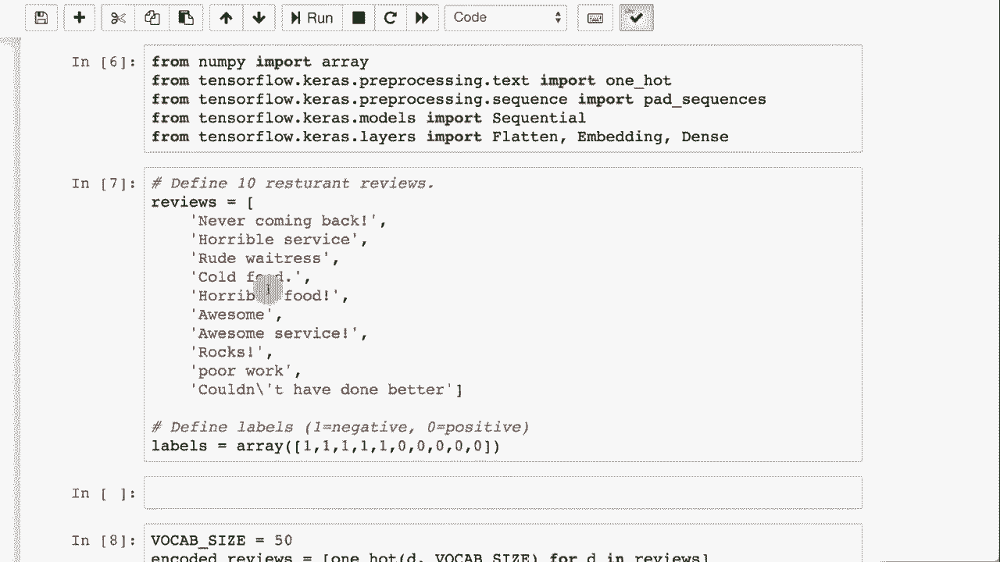

# T81-558 ｜ 深度神经网络应用-P59：L11.3- Keras中的嵌入层 🧠


在本节课中，我们将学习Keras中的嵌入层。嵌入层是深度学习中处理高维分类数据（尤其是自然语言处理）的强大工具。我们将了解它的工作原理、如何创建、以及如何将其应用于实际任务。

## 概述 📋

嵌入层是Keras提供的一种特殊层类型，主要用于自然语言处理任务。它的核心功能是将高维的离散分类数据（如单词）映射到低维的连续向量空间。这可以看作是独热编码的一种高效替代方案。

## 什么是嵌入层？ 🤔

上一节我们介绍了嵌入层的概念，本节中我们来看看它的具体作用。Keras的嵌入层通常用于自然语言处理，但它并不局限于NLP。嵌入层本质上是独热编码的替代品。独热编码使用虚拟变量处理分类值。

假设一个分类变量有100种不同的可能性。使用独热编码，你需要创建100个虚拟变量。当基数非常大时，这种方法变得不切实际。例如，对英语单词进行独热编码，需要为每个单词创建一个虚拟变量。

嵌入层可以学习将词汇或任何分类值编码成低维向量。这通常用于序列数据，并可以输入到LSTM或时序卷积神经网络中。

## 嵌入层的工作原理 ⚙️

让我们看一个简单的嵌入层示例。以下是如何在Keras中创建一个嵌入层：

```python
from tensorflow.keras.models import Sequential
from tensorflow.keras.layers import Embedding

model = Sequential()
model.add(Embedding(input_dim=10, output_dim=4, input_length=2))
```

在这个例子中：
*   `input_dim=10`：表示有10个不同的类别或单词（词汇量大小）。
*   `output_dim=4`：表示每个输入将被编码成一个包含4个数字的向量。
*   `input_length=2`：表示输入序列的长度为2。

嵌入层本质上是一个**查找表**。它将输入的整数索引映射到`output_dim`维度的向量。这个查找表有`input_dim`行和`output_dim`列。在训练开始前，表中的值（即权重）是随机初始化的。

我们可以查看这个嵌入层的权重：

```python
print(model.layers[0].get_weights()[0].shape)  # 输出: (10, 4)
```

这将显示一个10行4列的矩阵。每一行对应一个输入类别（索引），每一列是学习到的向量表示的一个维度。

## 嵌入层 vs. 独热编码 🔄

为了理解嵌入层的优势，我们将其与独热编码进行比较。独热编码将一个类别表示为只有一个元素是1，其余都是0的稀疏向量。

以下是如何用嵌入层模拟一个3类别的独热编码：

```python
import numpy as np
from tensorflow.keras.models import Sequential
from tensorflow.keras.layers import Embedding

# 创建一个模拟独热编码的嵌入层
model_dummy = Sequential()
model_dummy.add(Embedding(input_dim=3, output_dim=3, input_length=1))

# 手动设置权重为独热编码矩阵（单位矩阵）
weights = model_dummy.layers[0].get_weights()
weights[0] = np.eye(3)  # 3x3的单位矩阵
model_dummy.layers[0].set_weights(weights)

# 预测
test_input = np.array([[0], [1], [2]])
print(model_dummy.predict(test_input))
```

这段代码创建了一个嵌入层，并将其权重固定为单位矩阵。这样，输入索引0、1、2将分别输出向量`[1,0,0]`, `[0,1,0]`, `[0,0,1]`，完美模拟了独热编码。

然而，嵌入层的真正威力在于**可训练性**。当处理像20000个单词这样的大词汇表时，使用20000维的独热编码效率极低。相反，你可以定义一个嵌入层，将输出维度设置为较小的数字（如20、50或100），这是一个需要调整的超参数。然后，通过反向传播和梯度下降，模型会自动学习如何将每个单词映射到一个有意义的低维向量中，这些向量能捕捉单词之间的语义关系。

## 实战：训练一个嵌入层 🏋️

上一节我们比较了两种编码方式，本节中我们来看看如何实际训练一个嵌入层来完成情感分类任务。

我们将构建一个简单的神经网络，用于判断餐厅评论的情感是正面（0）还是负面（1）。网络将学习评论中单词的嵌入表示。

以下是实现步骤：

1.  **准备数据**：我们有一些简单的餐厅评论和对应的标签。
2.  **文本预处理**：使用Keras的`Tokenizer`将句子转换为整数序列。
3.  **填充序列**：确保所有输入序列长度一致。
4.  **构建模型**：创建一个包含嵌入层、展平层和稠密层的序列模型。
5.  **训练模型**：在数据上训练模型，嵌入层的权重会随之更新。
6.  **评估模型**：查看模型在训练数据上的性能。

核心模型构建代码如下：

```python
from tensorflow.keras.models import Sequential
from tensorflow.keras.layers import Embedding, Flatten, Dense
from tensorflow.keras.preprocessing.text import Tokenizer
from tensorflow.keras.preprocessing.sequence import pad_sequences
import numpy as np

# 1. 示例数据
texts = [
    ‘never coming back‘, ‘terrible service‘, ‘very rude‘, ‘awful food‘,
    ‘great‘, ‘excellent service‘, ‘amazing‘, ‘poor job‘, ‘did well‘
]
labels = np.array([1, 1, 1, 1, 0, 0, 0, 1, 0]) # 1:负面, 0:正面

# 2. 文本标记化和序列化
vocab_size = 50
tokenizer = Tokenizer(num_words=vocab_size)
tokenizer.fit_on_texts(texts)
sequences = tokenizer.texts_to_sequences(texts)

# 3. 填充序列
max_length = 4
data = pad_sequences(sequences, maxlen=max_length)

# 4. 构建模型
model = Sequential()
model.add(Embedding(input_dim=vocab_size, output_dim=8, input_length=max_length))
model.add(Flatten())
model.add(Dense(1, activation=‘sigmoid‘))

model.compile(optimizer=‘adam‘, loss=‘binary_crossentropy‘, metrics=[‘accuracy‘])

# 5. 训练模型
model.fit(data, labels, epochs=100, verbose=0)

# 6. 查看学习到的嵌入权重和评估
print(“嵌入层权重形状:“, model.layers[0].get_weights()[0].shape)
loss, accuracy = model.evaluate(data, labels, verbose=0)
print(f“模型准确率: {accuracy:.2f}“)
```

在这个例子中，嵌入层`(input_dim=50, output_dim=8)`会学习一个50x8的查找表。模型通过训练调整这个表中的值（即每个单词的8维向量），使得最终的分类更准确。

## 总结 🎯

本节课中我们一起学习了Keras中的嵌入层。

*   我们首先了解了嵌入层是处理高维分类数据（如NLP中的单词）的有效工具，可作为独热编码的替代。
*   然后，我们深入探讨了其工作原理，即作为一个可训练的**查找表**，将整数索引映射到低维连续向量。
*   接着，我们通过代码示例对比了嵌入层与独热编码，突出了嵌入层在维度和效率上的优势。
*   最后，我们完成了一个实战练习，构建并训练了一个使用嵌入层进行简单文本情感分类的神经网络，见证了模型如何自动学习单词的有用向量表示。

嵌入层是连接原始离散数据与深度学习模型的强大桥梁，尤其在自然语言处理领域不可或缺。在接下来的课程中，我们将探索更复杂的端到端自然语言处理应用。



