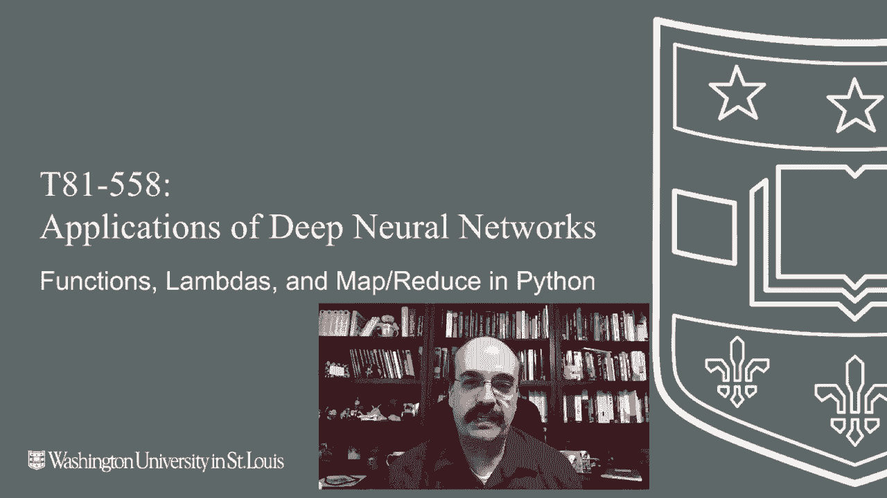
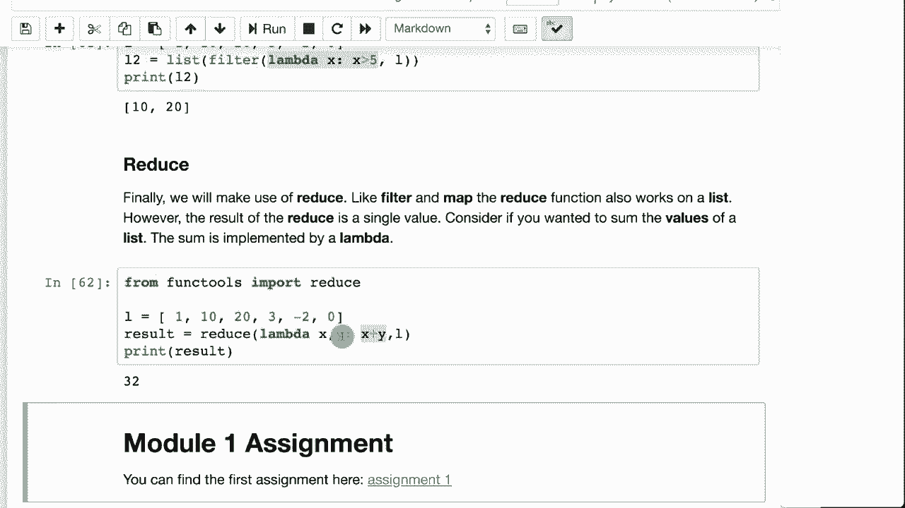

# T81-558 ｜ 深度神经网络应用-P6：L1.5- Python 函数、Lambda 与 Map/Reduce 🐍

在本节课中，我们将学习 Python 编程语言中关于函数、Lambda 表达式以及 `map`、`filter`、`reduce` 等函数式编程工具的核心概念。掌握这些知识对于高效处理数据至关重要，尤其是在后续使用 Pandas 库进行数据分析时。

---

## 概述 📋

函数是编程中用于封装和重用代码的基本单元。Python 不仅支持常规函数，还支持匿名函数（Lambda），并能将函数作为参数传递给其他函数（如 `map`、`filter`、`reduce`）。这种特性使得数据处理操作更加灵活和强大。

---

## 1. 定义与使用函数

函数允许你将代码块打包，避免在程序中重复编写。在 Python 中，使用 `def` 关键字定义函数。函数可以返回值，也可以不返回（此时称为“过程”）。



以下是一个定义函数的示例：

```python
def say_hello(speaker, person, greeting="你好"):
    print(f"{greeting}，{person}，我是{speaker}。")
```

这个函数名为 `say_hello`，它接受三个参数：`speaker`（发言者）、`person`（被问候的人）和 `greeting`（问候语，默认值为“你好”）。它不返回任何值，只是执行打印操作，因此它是一个“过程”。

我们可以这样调用它：

```python
say_hello("杰夫", "约翰")
say_hello("杰夫", "约翰", "再见")
say_hello(person="约翰", speaker="杰夫", greeting="你好")
```

第一次调用使用了默认问候语“你好”。第二次调用指定了问候语“再见”。第三次调用使用了命名参数，可以任意调整参数顺序。

---

## 2. 返回值的函数

一个真正的函数会通过 `return` 语句返回一个值。以下示例定义了一个处理字符串的函数：

```python
def process_string(s):
    s = s.strip()
    return s[0].upper() + s[1:]
```

这个函数 `process_string` 接收一个字符串 `s`，首先使用 `strip()` 方法去除其首尾的空白字符。然后，它将字符串的第一个字符（索引为0）转换为大写，并与从索引1开始到末尾的剩余部分拼接起来，最后返回这个新字符串。

调用示例：

```python
result = process_string("  hello  ")
print(result)  # 输出：Hello
```

---

上一节我们介绍了如何定义和使用常规函数，本节中我们来看看如何将函数作为参数传递给其他函数，这是函数式编程的核心。

## 3. Map 函数

`map` 函数源于函数式编程，它接受一个函数和一个可迭代对象（如列表），并将该函数依次应用到可迭代对象的每个元素上，返回一个新的 `map` 对象（可转换为列表）。

以下是使用 `map` 的示例：

```python
def process_string(s):
    s = s.strip()
    return s[0].upper() + s[1:]

my_list = ["  hello  ", "  world  "]
result = list(map(process_string, my_list))
print(result)  # 输出：['Hello', 'World']
```

`map(process_string, my_list)` 将 `process_string` 函数应用到 `my_list` 中的每个字符串上。`list()` 将结果转换为列表以便显示。

`map` 的功能与 Python 的**列表推导式**类似。以下是使用列表推导式实现相同功能的代码：

```python
result = [process_string(x) for x in my_list]
print(result)  # 输出：['Hello', 'World']
```

列表推导式是 Python 特有的语法，而 `map` 函数在其他编程语言中也常见。开发者可根据团队习惯或代码可读性选择使用哪种方式。

---

## 4. Filter 函数

`filter` 是另一个函数式编程工具。它接受一个函数和一个可迭代对象，并返回一个迭代器，其中只包含使函数返回 `True` 的元素。

以下是一个使用 `filter` 的示例：

```python
def greater_than_five(x):
    return x > 5

my_list = [1, 3, 5, 10, 20]
result = list(filter(greater_than_five, my_list))
print(result)  # 输出：[10, 20]
```

`filter(greater_than_five, my_list)` 会检查 `my_list` 中的每个数字，只保留大于5的数字。

---

## 5. Lambda 表达式

Lambda 表达式用于创建匿名函数（即没有名字的函数）。它通常只有一行，非常适合作为简单函数的快捷方式传递给 `map`、`filter`、`reduce` 等函数。

以下是使用 Lambda 表达式重写上面 `filter` 示例的代码：

```python
my_list = [1, 3, 5, 10, 20]
result = list(filter(lambda x: x > 5, my_list))
print(result)  # 输出：[10, 20]
```

这里的 `lambda x: x > 5` 直接定义了一个判断 `x > 5` 的函数，并传递给了 `filter`，无需先单独定义一个命名函数。

---

上一节我们了解了如何使用 Lambda 创建简洁的匿名函数，本节中我们来看看 `reduce` 函数，它用于将列表“缩减”为单个值。

## 6. Reduce 函数

`reduce` 函数（在 Python 3 的 `functools` 模块中）用于对一个序列中的元素进行累积操作，最终将其缩减为一个单一的值。它接受一个二元函数（接受两个参数）和一个可迭代对象。

以下是使用 `reduce` 计算列表元素总和的示例：

```python
from functools import reduce

my_list = [1, 2, 3, 4, 5]
sum_result = reduce(lambda acc, val: acc + val, my_list)
print(sum_result)  # 输出：15
```

Lambda 函数 `lambda acc, val: acc + val` 中的 `acc` 是累加器（初始为列表第一个元素，后续为上一次计算的结果），`val` 是当前遍历到的列表元素。`reduce` 会依次将每个 `val` 与累加器 `acc` 相加，最终得到总和。

`map` 和 `filter` 接受一个列表并返回一个列表，而 `reduce` 接受一个列表并返回一个单一的值。



---

## 总结 🎯

本节课中我们一起学习了 Python 函数式编程的几个核心工具：
*   **函数**：使用 `def` 定义，用于封装可重用的代码块。
*   **`map` 函数**：将给定函数应用于序列中的每个元素。
*   **`filter` 函数**：根据给定函数的条件过滤序列中的元素。
*   **Lambda 表达式**：用于创建简洁的匿名函数。
*   **`reduce` 函数**：使用一个二元函数将序列中的元素累积计算为一个单一值。

理解并熟练运用函数、Lambda 以及 `map`/`filter`/`reduce`，能够让你以更声明式、更高效的方式处理和转换数据，为后续学习 Pandas 数据分析和构建神经网络数据管道打下坚实基础。

在下一个模块中，我们将开始学习如何使用 Python 的 Pandas 库来为表格数据和神经网络准备数据。