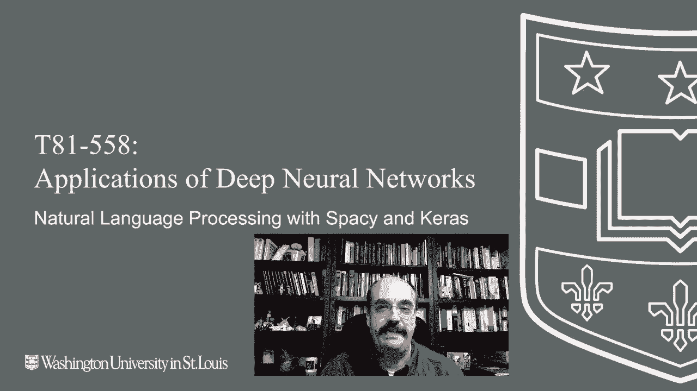
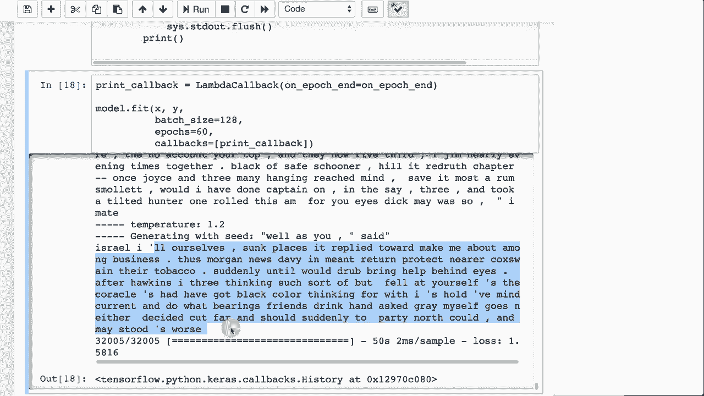

# T81-558 ｜ 深度神经网络应用-P60：L11.4- 使用Spacy和Keras进行自然语言处理 🧠📚

在本节课中，我们将学习如何结合使用Spacy和Keras进行单词级别的自然语言处理与文本生成。我们将以小说《金银岛》为例，构建一个能够生成连贯海盗故事的神经网络模型。

---

## 概述

上一节我们介绍了字符级别的文本生成。本节中，我们将探讨单词级别的文本生成方法。单词级生成通常需要先对文本进行分词，并可能引入额外的语言特征。我们将使用Spacy库进行高效的分词处理，并利用Keras构建LSTM神经网络模型。

---

## 准备工作



首先，我们需要导入必要的Python库并加载文本数据。

```python
import spacy
from keras.models import Sequential
from keras.layers import LSTM, Dense
# 其他必要的导入...
```

我们获取《金银岛》的文本内容，这与字符级生成时的数据源相同。

---

## 使用Spacy进行文本分词

由于我们按单词进行处理，因此需要将原始文本拆分成独立的单词（即分词）。Spacy库能高效地完成此任务。

以下是使用Spacy进行分词和预处理的关键步骤：

1.  **加载Spacy模型并处理文本**：将文本输入Spacy管道，生成一系列词元（Token）。
2.  **字符过滤**：我们仅保留ASCII码在0到127之间的字符，以去除版权符号等非常规字符。
3.  **清理词元**：我们过滤掉空白字符、纯数字、URL和电子邮件地址等。对于此示例，我们选择直接剔除它们。
4.  **统计词汇**：经过处理后，我们得到了一个包含6421个唯一单词的词汇表。

预处理后，我们打印部分词汇进行查看。其中可能包含罗马数字，但这不影响后续处理。

---

## 构建词汇查找表

为了将文本转换为神经网络可处理的数值形式，我们需要创建两个查找表。

*   **单词到索引的映射**：将每个单词（如“lonely”）映射为一个唯一的整数ID。
*   **索引到单词的映射**：用于后续将模型输出的索引转换回单词。

**注意**：在生产环境中，应确保这些映射关系固定不变，否则重新训练时若索引改变，模型将无法正常工作。

接着，我们将《金银岛》的原始文本中的每个单词替换为其对应的索引号，从而得到数值化的序列。

---

## 创建训练序列

本节我们将构建用于训练模型的输入序列（X）和输出目标（y）。

我们采用与字符级生成类似的滑动窗口方法，但处理单位是单词。

*   **序列长度**：我们设定每个输入序列包含连续的6个单词。
*   **步长**：窗口每次向前移动3个单词。较小的步长会产生更多重叠的序列，增加训练数据量。
*   **训练目标**：对于每一个由6个单词组成的输入序列，我们的目标是预测第7个单词。

我们查看生成的前几个序列，以理解其结构。这些序列将用于训练神经网络。

---

## 数据向量化

我们需要将单词索引序列转换为适合Keras模型训练的格式。

*   **输入（X）**：被转换为一个形状为 `(序列数量, 序列长度, 词汇表大小)` 的三维数组，这里使用了独热编码（one-hot encoding）。
*   **输出（y）**：同样使用独热编码，表示下一个单词在词汇表中的概率分布。

最终，我们得到约32005个训练序列。虽然使用嵌入层（Embedding Layer）可以更高效地处理这种数据，但当前的数据量在内存允许范围内。

---

## 构建与训练LSTM模型

现在，我们构建一个简单的LSTM神经网络模型。

```python
model = Sequential()
model.add(LSTM(128, input_shape=(max_sequence_len, vocab_size)))
model.add(Dense(vocab_size, activation='softmax'))
model.compile(optimizer='rmsprop', loss='categorical_crossentropy')
model.summary()
```

该模型包含一个具有128个神经元的LSTM层，输出层使用Softmax激活函数，以在词汇表上产生概率分布。模型总参数量约为400万。

我们使用RMSprop优化器和分类交叉熵损失函数进行编译和训练。

---

## 文本生成函数

我们定义一个`sample`函数，用于在训练过程中根据模型预测生成新文本。

该函数的核心是一个Softmax操作，它接收模型对下一个单词的预测概率。

*   **温度参数**：一个关键超参数，用于控制生成的随机性。
    *   温度**越高**，概率分布越平缓，生成结果更具“创造性”和随机性。
    *   温度**越低**，概率分布越尖锐，模型更倾向于选择最高概率的单词，生成结果更保守、更可预测。

函数确保所有单词的概率之和为1，并依据此概率分布采样出下一个单词。

我们在每个训练周期（epoch）结束时调用此函数，生成一段文本以观察模型的进步。

---

## 生成海盗故事

我们开始训练模型，并在训练过程中定期生成文本。

1.  **初始化**：从文本中随机抽取一个长度为6的单词序列作为起始点。
2.  **迭代生成**：将当前序列输入模型，预测下一个单词，然后将该单词加入序列末端，同时移除序列首端的单词，形成新的输入序列，如此循环。
3.  **输出结果**：我们设定生成100个单词。经过一段时间的训练后，模型开始生成语法基本正确、内容连贯的文本。

例如，模型可能生成：“我自己沉没了几段，它回复让我在商业中感到不安。摩根新闻。Davy在薄荷中回归。”

**观察**：模型成功学习到了单词间的搭配和基本的句子结构。有趣的是，分词器将“I”和“I’ll”视为不同的词，而模型学会了在“I”后面合理接续“’ll”或其他单词，这表明它在一定程度上理解了上下文。

---

## 总结

本节课中，我们一起学习了如何使用Spacy和Keras实现单词级别的文本生成。

1.  **分词与预处理**：我们使用Spacy将原始文本转换为干净的单词序列，并构建了词汇映射表。
2.  **序列化与向量化**：我们通过滑动窗口创建了用于监督学习的输入-输出单词序列对，并将其转换为独热编码格式。
3.  **模型构建与训练**：我们搭建了一个LSTM神经网络，并利用处理好的数据对其进行训练。
4.  **控制生成**：我们引入了温度参数来控制文本生成的创造性与保守性。
5.  **结果评估**：最终模型能够生成在单词搭配和句子结构上都较为合理的海盗故事文本。

深度学习，特别是LSTM等循环神经网络，使得在单词级别进行高质量的自然语言生成成为可能。即使没有复杂的特征工程，模型也能学习到丰富的语言模式。



---

在下一个视频中，我们将深入探讨自然语言处理中的嵌入层技术。敬请关注后续更新。🚀