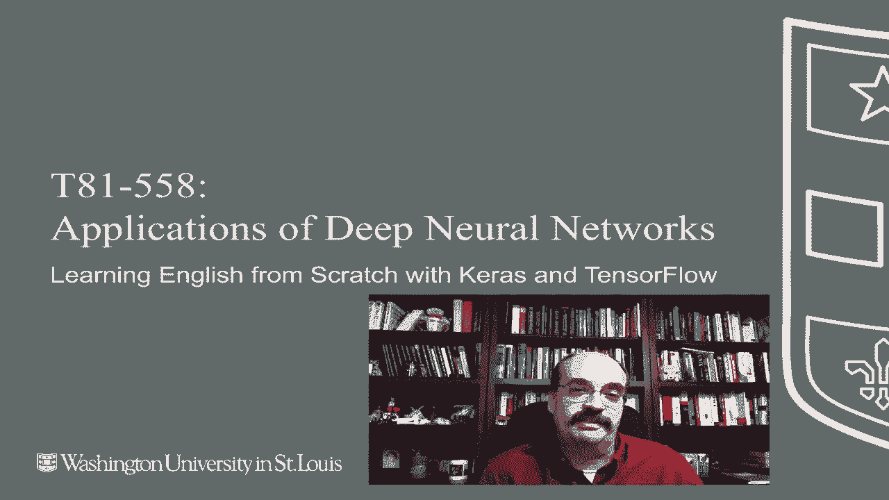
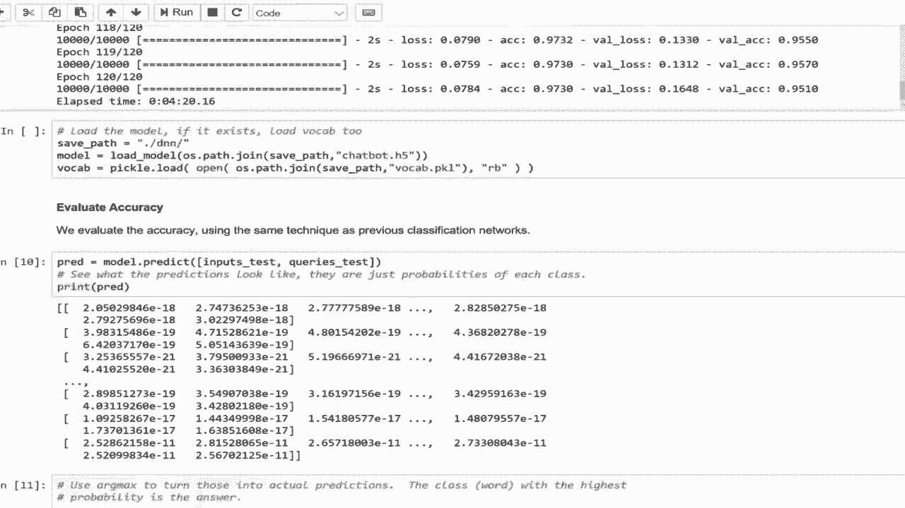

# T81-558 ｜ 深度神经网络应用-P61：L11.5- 使用Keras和TensorFlow从头开始学习英语 🧠➡️📖



在本节课中，我们将学习如何构建一个端到端的神经网络，使其能够像人类一样“阅读”简单的故事并回答问题。我们将使用Keras和TensorFlow框架，从零开始训练一个模型，理解其核心原理，并最终测试它的问答能力。

## 概述

传统的自然语言处理（NLP）通常依赖于复杂的预处理和特征工程。本节课我们将采用一种不同的思路：让神经网络直接从原始文本中学习语言规则。这种方法被称为“端到端”学习。我们将通过一个具体的任务——基于故事回答问题——来演示这一过程。

## 数据准备与理解

首先，我们需要准备和理解训练数据。数据通常以“故事-问题-答案”的格式组织。

以下是数据处理的关键步骤：

1.  **标记化**：使用正则表达式将句子分割成独立的单词（标记）。
    ```python
    import re
    def tokenize(sent):
        return [x.strip() for x in re.split('(\W+)?', sent) if x.strip()]
    ```
2.  **解析故事**：将原始数据分解为三个部分：故事文本、相关问题和答案（答案总是一个单词）。
3.  **构建词汇表**：收集所有故事和问题中出现的独特单词，并为每个单词分配一个唯一的数字索引。这是将文本转换为神经网络可处理数字的关键一步。

## 模型输入：向量化

上一节我们介绍了如何将文本分解为单词。本节中我们来看看如何将这些单词转换为模型能够理解的数字形式，即向量化。

神经网络无法直接处理文本，因此我们需要将单词转换为数字。具体做法是，根据构建好的词汇表，将每个单词替换为其对应的索引数字。为了保持输入尺寸一致，我们需要对较短的句子进行“填充”，即在句子开头添加零（代表空值），使其达到最大长度。

例如，一个故事和问题经过向量化后，会变成两个数字序列：
*   **故事向量**：一个固定长度（如68）的数字序列。
*   **问题向量**：一个固定长度（如4）的数字序列。

这两个序列将共同作为神经网络的输入。

## 构建端到端神经网络

现在，我们已经准备好了数字化的输入数据。接下来，我们将构建能够处理这些数据的神经网络架构。

由于Keras没有内置的端到端记忆网络层，我们需要手动构建计算图。核心思想是创建多个“编码器”：
*   两个编码器用于处理输入的故事句子，从中提取“事实”。
*   一个编码器用于处理问题。
*   然后将提取的事实与编码后的问题信息相结合，送入一个LSTM（长短期记忆网络）层。
*   最后，通过一个Softmax层输出答案，该答案对应词汇表中某个单词的概率。

以下是模型编译的核心代码框架：
```python
from keras.models import Model
from keras.layers import Input, Embedding, LSTM, Dense, Dropout

# 定义输入层
story_input = Input(shape=(max_story_len,))
question_input = Input(shape=(max_question_len,))

# 构建编码器、交互层等（此处为示意，具体层连接略）
# ...
# 最终输出层
answer = Dense(vocab_size, activation='softmax')(final_layer)

# 创建模型
model = Model(inputs=[story_input, question_input], outputs=answer)
model.compile(optimizer='adam', loss='categorical_crossentropy', metrics=['accuracy'])
```

## 训练与保存模型

构建好模型后，我们就可以开始训练了。由于训练可能耗时较长，保存训练好的模型和词汇表至关重要。

以下是训练过程的关键点：
*   我们使用准备好的训练数据（故事向量和问题向量）以及对应的答案标签来训练模型。
*   训练会进行多轮（Epochs），模型通过调整内部权重来最小化预测误差。
*   训练完成后，我们将模型保存为`.h5`文件，将词汇表保存为`.pkl`文件，以便后续直接加载使用，无需重新训练。

## 模型评估与交互测试

模型训练完成后，我们需要评估其性能，并最有趣的是——与它进行交互，测试其“阅读”新故事的能力。

首先，我们在独立的测试集上评估模型，通常能达到很高的准确率（例如95%）。然后，我们可以进行临时查询：

1.  加载已保存的模型和词汇表。
2.  将我们编写的新故事和问题，按照同样的流程进行标记化和向量化。
3.  将向量输入模型，获取预测结果。
4.  模型会输出一个概率分布，我们取概率最高的单词作为答案。

例如，输入故事“玛丽去了花园。约翰去了花园。”，问题“玛丽在哪里？”，模型应能正确回答“花园”。

**重要提示**：模型的词汇量有限。如果新故事中包含词汇表之外的单词，程序会出错。此外，模型的能力受限于训练数据中的模式。例如，如果故事中人物位置发生变更，模型倾向于以最后提到的位置作为答案。

## 总结

本节课中我们一起学习了端到端神经网络的构建与应用。我们从一个简单的文本问答任务出发，完整经历了数据标记化、向量化、模型构建、训练保存以及交互测试的全过程。虽然当前模型处理的词汇和句子结构相对简单，但它清晰地展示了神经网络如何不依赖显式规则，而是通过数据驱动的方式学习语言逻辑。通过调整网络结构、增加训练数据量和词汇量，可以扩展其处理更复杂语言任务的能力。

---



接下来的模块我们将探讨强化学习，这个内容变化频繁，因此请订阅频道以便及时了解本课程和其他人工智能主题。