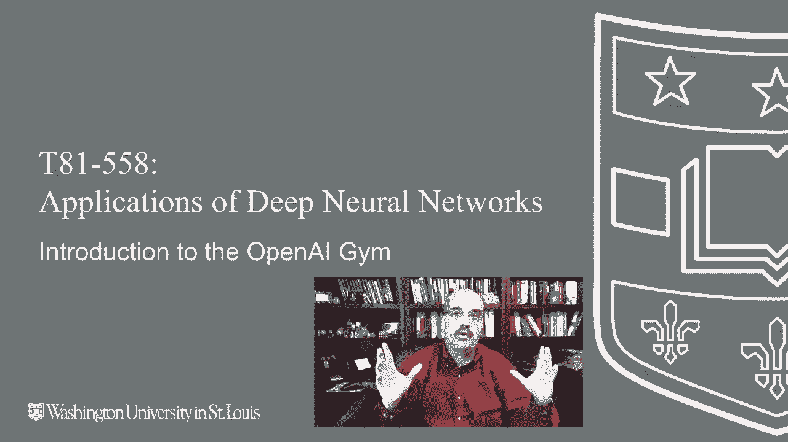
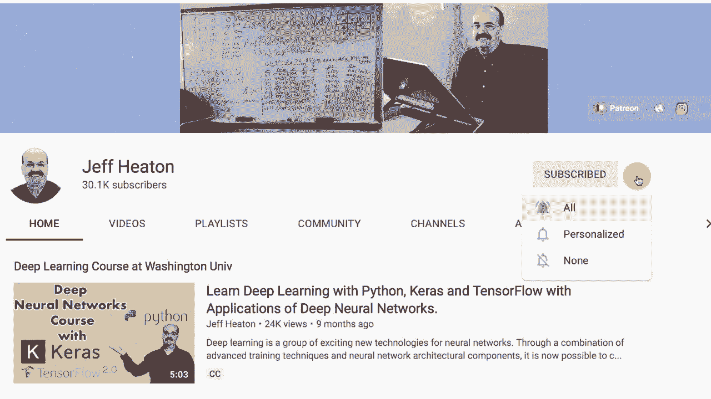
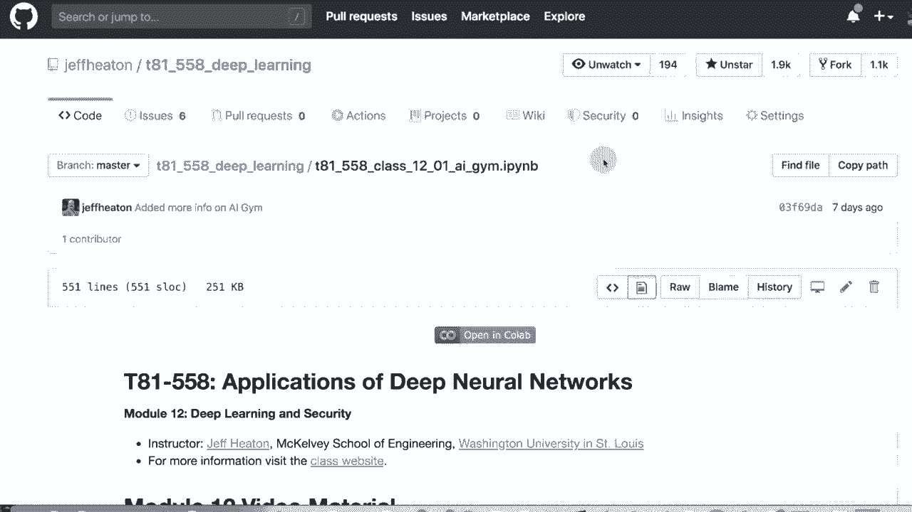
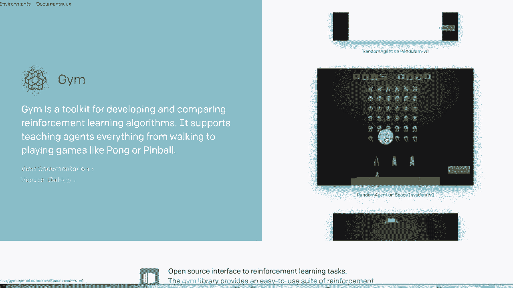
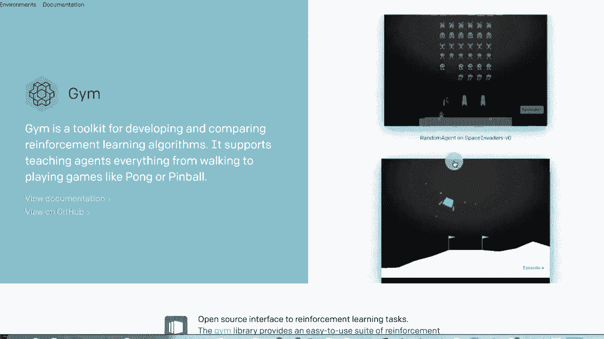
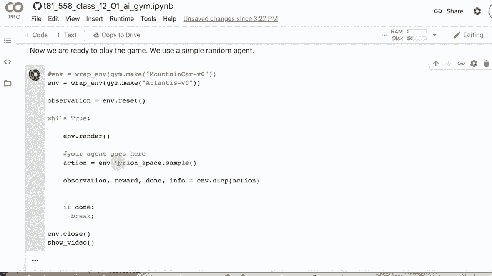
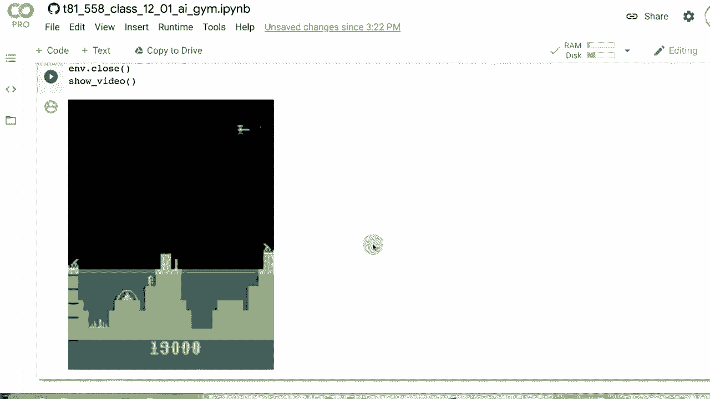

# T81-558 ｜ 深度神经网络应用 - P62：L12.1 - OpenAI Gym介绍 🎮

## 概述
在本节课中，我们将学习OpenAI Gym。OpenAI Gym是一个用于开发和比较强化学习算法的基准平台。它提供了多种环境，包括经典的控制任务和Atari游戏，允许我们评估和训练自己的强化学习程序。



---



## OpenAI Gym简介
OpenAI Gym是一个基准平台，让你可以在Python中评估你的强化学习程序，并与著名游戏如Atari游戏等进行对比。我们将学习如何与这个平台交互，并使用它来观看游戏在屏幕上播放，或以离线方式进行训练。

上一节我们介绍了OpenAI Gym的基本概念，本节中我们来看看它的核心组成部分。

### 环境与接口
在OpenAI Gym中，每个游戏或任务被称为一个“环境”。你的程序（称为“智能体”）通过与这些环境交互来学习。以下是使用Gym的基本步骤：

1.  **导入Gym库**：首先需要导入`gym`库。
2.  **创建环境**：使用`gym.make(‘环境名称’)`来创建一个特定的游戏环境。
3.  **与环境交互**：智能体在每一步选择一个动作，环境返回新的状态和奖励。



以下是一个简单的代码示例，展示了如何启动一个环境：

```python
import gym

# 创建‘CartPole-v1’环境
env = gym.make(‘CartPole-v1’)





# 重置环境，获得初始状态
initial_state = env.reset()

# 执行一个随机动作
action = env.action_space.sample()
next_state, reward, done, info = env.step(action)

# 关闭环境
env.close()
```

---

## 核心概念解析
为了有效地使用OpenAI Gym，我们需要理解几个关键概念。

### 动作空间
动作空间定义了智能体在环境中可以执行的所有可能动作。它主要分为两种类型：
*   **离散动作空间**：动作是有限的、可数的。例如，在“CartPole”中，动作是“向左推”或“向右推”。
*   **连续动作空间**：动作在一个连续范围内取值。例如，在“MountainCarContinuous”中，油门是一个连续的力值。

你可以通过`env.action_space`来查询环境的动作空间类型。

### 观察空间
观察空间是环境返回给智能体的状态信息。它描述了“世界”在某一时刻的样子。观察空间也可以是离散的或连续的（通常是连续的数值向量或图像像素）。

例如，在“CartPole”中，观察空间包含四个连续值：小车位置、小车速度、杆子角度和杆子末端速度。你可以通过`env.observation_space`来查询。

### 奖励与回合
*   **奖励**：智能体每执行一个动作后，环境会返回一个奖励值。这个值告诉智能体其行为的好坏。智能体的目标通常是最大化长期累积奖励。
*   **回合**：一个完整的游戏过程称为一个回合。每个回合由一系列步骤组成。当游戏达到终止条件（如成功、失败或达到最大步数）时，一个回合结束。

---

## 环境示例分析
让我们具体分析两个经典的控制环境，以加深理解。

### 山地车环境
山地车环境的目的是让一辆动力不足的小车爬上右侧的山坡。由于动力不足，小车需要前后摆动以积累足够的动量才能最终冲上目标坡顶。

以下是该环境的关键信息：
*   **动作空间**：离散的3个动作（例如：向左加速、不加速、向右加速）。
*   **观察空间**：2个连续值（小车的位置和速度）。
*   **挑战**：奖励非常“吝啬”，智能体只有在成功到达目标时才获得正奖励，这使得学习过程更具挑战性。

上一节我们看了山地车，本节中我们来看看另一个经典问题：倒立摆。

### 倒立摆环境
倒立摆环境的目的是通过左右移动小车，来平衡其顶部的杆子，使其不倒。

以下是该环境的关键信息：
*   **动作空间**：离散的2个动作（向左推或向右推）。
*   **观察空间**：4个连续值（小车位置、小车速度、杆子角度、杆子末端速度）。
*   **目标**：保持杆子直立的时间越长越好。

---

## 在Colab中使用OpenAI Gym
由于Google Colab是一个云端环境，无法直接弹出游戏窗口。但我们可以通过一些方法录制并观看游戏过程。

以下是关键步骤：
1.  安装必要的库来模拟显示。
2.  定义一个函数，将环境渲染的帧保存下来。
3.  将保存的帧合成为视频进行播放。

以下代码片段展示了如何在Colab中录制一个随机玩“Atlantis”游戏的视频：

```python
# 安装虚拟显示库（在Colab中需要）
!apt-get install -y xvfb x11-utils
!pip install pyvirtualdisplay Pillow

# 设置虚拟显示
from pyvirtualdisplay import Display
display = Display(visible=0, size=(1400, 900))
display.start()

# 导入其他库并定义录制函数
import gym
from IPython.display import HTML
from base64 import b64encode
import imageio

# ... (此处省略具体的录制和视频生成函数代码)

# 创建环境并运行随机策略进行录制
env = gym.make(‘Atlantis-v0’)
record_video_of_random_agent(env, ‘atlantis_random.mp4’)
env.close()

# 在笔记本中显示视频
show_video(‘atlantis_random.mp4’)
```



运行上述代码后，你将能看到一个由随机动作生成的游戏视频片段。

---



## 总结
本节课中我们一起学习了OpenAI Gym的基础知识。我们了解到OpenAI Gym是一个用于强化学习的标准平台，提供了丰富的环境用于算法开发和测试。我们学习了核心概念，包括**环境**、**动作空间**、**观察空间**、**奖励**和**回合**。我们还具体分析了“山地车”和“倒立摆”两个环境，并学会了如何在Google Colab中运行和录制游戏过程。在接下来的课程中，我们将利用这个平台来构建和训练我们自己的强化学习智能体。