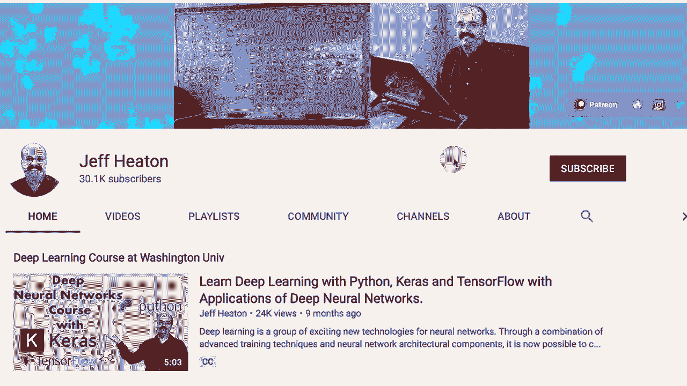
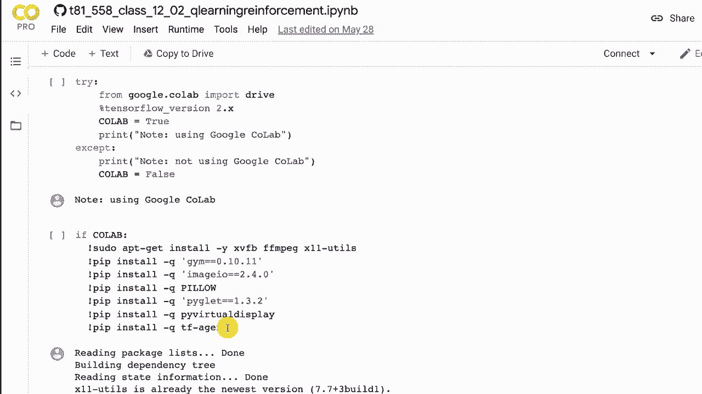
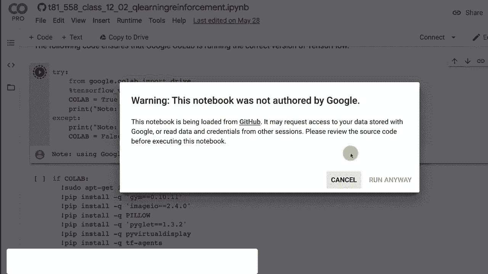
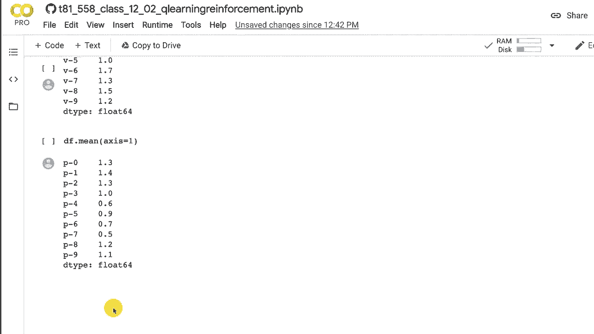

# T81-558 ｜ 深度神经网络应用-P63：L12.2- 用于游戏学习的Q-Learning算法简介 🎮

在本节课中，我们将学习强化学习中的核心算法之一：Q-Learning。我们将从一个简单的“山地车”游戏环境入手，了解Q-Learning如何通过构建一个查找表（Q表）来学习最佳行动策略。本节内容将为后续引入深度Q网络（DQN）奠定基础。



## 概述与环境设定

上一节我们介绍了OpenAI Gym环境。本节中，我们将对其应用Q-Learning算法。我们将看到如何利用机器学习构建一个基本的查找表，以指导代理在环境的各种状态下应采取的最佳行动。这标志着深度Q神经网络学习的起点。

以下是运行代码前的环境设置，我们使用TensorFlow 2。

```python
# 设置代码，用于在Google Colab中安装必要库（如TF-Agents）
# 此部分代码会根据环境自动执行安装
```





## Q-Learning核心概念与术语

在深入算法之前，我们需要理解几个关键术语：

*   **代理**：执行学习的智能体，例如游戏中的玩家。
*   **环境**：代理所处并与之交互的“世界”，其状态会因代理的行动而改变。
*   **状态**：描述环境当前情况的信息，例如小车的位置和速度。
*   **动作**：代理在给定状态下可以执行的操作（如向左、向右加速）。
*   **步骤**：代理执行一个动作并观察到结果的一个完整周期。
*   **回合**：从开始到任务完成（胜利/失败）或模拟结束所经历的一系列步骤。
*   **奖励**：代理在执行一个动作后从环境获得的反馈信号，用于评估动作的好坏。

Q-Learning的目标就是建立一个Q表，为每个`(状态, 动作)`对分配一个值（Q值），这个值代表了在该状态下采取该动作所能获得的**预期未来总奖励**。代理通过学习选择Q值最高的动作来优化其行为。

## 山地车环境演示 🚗

我们使用“MountainCar-v0”环境。在这个环境中，一辆动力不足的小车位于两山之间，目标是冲上右侧山顶。代理只有三个离散动作：向左加速（0）、不加速（1）、向右加速（2）。

首先，我们看看一个使用简单硬编码策略（非学习）的代理表现：

```python
def hardcoded_policy(state):
    position, velocity = state
    if position > 0:
        return 2  # 如果位置大于0，向右加速
    else:
        return 0  # 否则，向左加速
```

这个策略基于一个简单的启发式规则：如果车在中心右侧，就向右推；否则向左推，以积累势能。它能成功完成任务，但缺乏通用性。

接下来，我们看一个仅使用最大向右加速的随机策略，它通常无法成功，这说明了学习的重要性。

## Q-Learning算法原理

Q-Learning的核心是更新Q表的算法。其更新公式如下：

**`Q(s, a) = Q(s, a) + α * [ R + γ * max(Q(s', a')) - Q(s, a) ]`**

让我们分解这个公式：
*   **`Q(s, a)`**：在状态`s`下采取动作`a`的当前Q值（旧值）。
*   **`α`**：学习率，控制新信息覆盖旧知识的程度（例如设为0.1）。
*   **`R`**：在状态`s`执行动作`a`后立即获得的奖励。
*   **`γ`**：折扣因子，表示对未来奖励的重视程度（例如设为0.95）。值越接近1，代理越有远见。
*   **`max(Q(s', a'))`**：在新状态`s'`下，所有可能动作`a'`中最大的Q值。这代表了**对最佳未来奖励的估计**。
*   **`[R + γ * max(Q(s', a'))]`**：可以理解为“目标Q值”或“新值”。
*   **`[目标Q值 - 旧Q值]`**：是TD误差，即当前估计与更优估计之间的差距。

整个公式的含义是：将当前Q值向“立即奖励`R`加上折扣后的未来最佳估计`γ * max(Q(s', a'))`”的方向调整一小步（由学习率`α`控制）。

## Q-Learning实现详解

以下是实现Q-Learning来解决山地车问题的主要步骤和概念。

### 状态离散化

由于原始状态（位置、速度）是连续值，而Q表需要离散索引，我们必须将连续状态空间“装箱”或离散化。例如，将位置和速度各自划分为10个区间。

```python
def discretize_state(state, bins):
    # 将连续状态值映射到离散的区间索引
    discretized = []
    for i in range(len(state)):
        disc = np.digitize(state[i], bins[i]) - 1
        discretized.append(disc)
    return tuple(discretized)
```

### ε-贪婪策略

为了平衡探索（尝试新动作）和利用（使用已知最佳动作），我们使用ε-贪婪策略。
*   **ε**：探索率。以概率ε随机选择动作，以概率`1-ε`选择当前Q值最高的动作。
*   **衰减**：通常，ε会随着训练回合增加而逐渐衰减（例如从1.0线性衰减到0.01）。初期鼓励广泛探索，后期侧重于利用学到的知识。

```python
def choose_action(state, q_table, epsilon):
    if np.random.random() < epsilon:
        # 探索：随机选择动作
        return env.action_space.sample()
    else:
        # 利用：选择Q值最高的动作
        return np.argmax(q_table[state])
```

### 训练循环

训练过程在一个个回合中进行，每个回合包含多个步骤，直到任务终止。

以下是训练流程的关键步骤：
1.  初始化Q表（通常为零）。
2.  对于每个训练回合：
    *   重置环境，获取初始状态`s`，并离散化。
    *   当回合未结束时：
        *   根据ε-贪婪策略选择动作`a`。
        *   在环境中执行动作`a`，得到奖励`R`、新状态`s'`和完成标志`done`。
        *   离散化新状态`s'`。
        *   使用Q-Learning公式更新Q表中`Q(s, a)`的值。
        *   将当前状态更新为`s'`。
    *   随着回合数增加，逐渐减小ε值。

通过大量回合的迭代，Q表逐渐收敛，能够为每个状态指示出期望回报最高的动作。

## 结果分析与可视化

训练完成后，我们可以观察代理的表现并分析学习到的Q表。

*   **成功率**：绘制随着训练回合增加，代理成功到达山顶的比率。可以观察到，在训练初期成功率很低，随着探索和学习的进行，成功率逐渐上升并趋于稳定。
*   **Q表可视化**：由于状态是二维的（位置、速度），我们可以将Q值可视化。例如，对每个位置区间，计算不同速度下某个动作（如“向右加速”）的平均Q值。通常会发现，在位置偏右的区域，“向右加速”的Q值较高，这符合直觉。

通过这种方式，我们验证了Q-Learning算法成功地让代理从零开始，通过与环境交互，学会了完成山地车任务的策略。

## 总结与展望

本节课中，我们一起学习了强化学习中的经典表格型Q-Learning算法。我们了解了其核心更新公式，并实践了如何通过离散化状态、使用ε-贪婪策略平衡探索与利用，来训练一个代理解决“山地车”问题。

然而，表格型Q-Learning有其局限性：它无法处理高维或连续的状态空间（如Atari游戏的图像像素），因为Q表的大小会随状态维度指数级增长。



在下一节课中，我们将探讨如何用深度神经网络来近似表示这个巨大的Q表，从而引向**深度Q网络**。这将使我们能够处理更复杂、更真实的环境，并开启深度强化学习的大门。