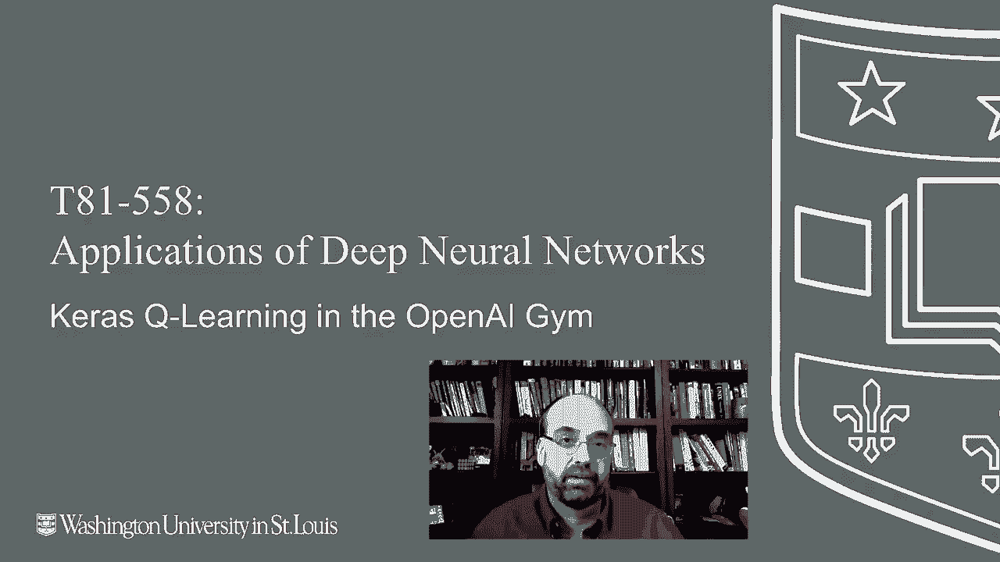
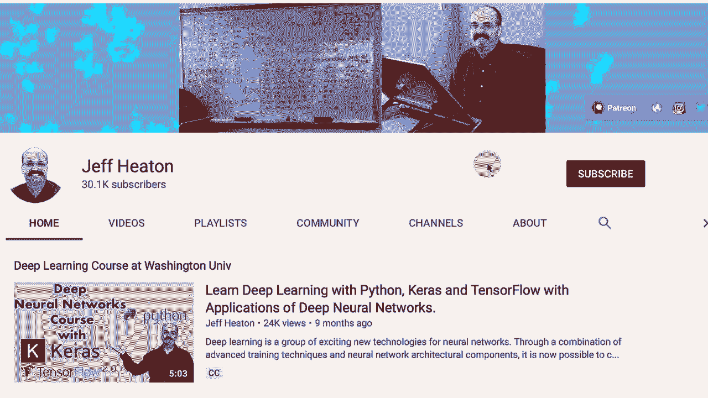
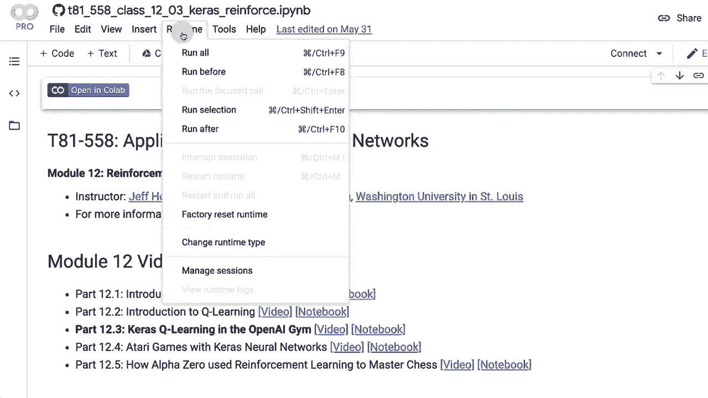
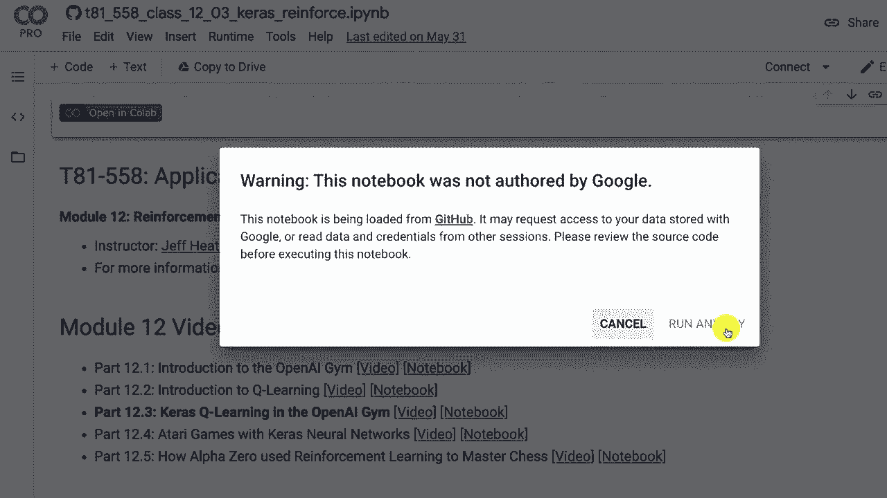
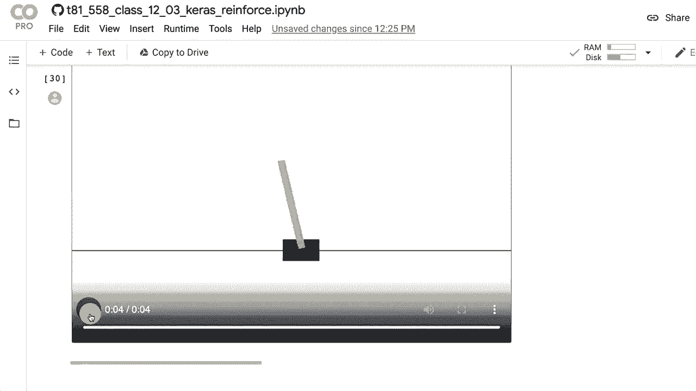

# T81-558 ｜ 深度神经网络应用-P64：L12.3- OpenAI Gym中的Keras Q-Learning 🤖

在本节课中，我们将学习如何使用深度Q神经网络（DQN）进行强化学习。我们将从一个简单的例子开始，使用OpenAI Gym的CartPole环境，并借助TF-Agents库来实现一个能够学习平衡杆子的智能体。

---





## 概述 📋



深度Q学习是强化学习与深度神经网络结合的一种方法。它允许计算机通过与环境交互来自主学习策略，例如玩视频游戏。本节课，我们将构建一个DQN智能体，在CartPole环境中学习如何保持杆子直立。

---



## 环境设置与问题排查 🔧

首先，我们需要设置运行环境。由于TensorFlow和相关库版本更新频繁，有时会遇到兼容性问题。以下步骤可以帮助你顺利开始。

以下是设置环境的关键步骤：

1.  **安装必要库**：我们需要安装`tf-agents`、`gym`等库。在Google Colab等环境中，可能需要先安装特定版本的TensorFlow。
2.  **处理常见错误**：如果遇到类似“需要重启运行时”的错误，通常是因为安装新包后环境状态未更新。重启运行时环境可以解决此问题。
3.  **验证安装**：运行一个简单的导入代码块，确保所有库都能正确导入，没有报错。

> **提示**：机器学习生态变化迅速，建议定期查看官方仓库或课程提供的Github代码库以获取最新可运行的代码版本。

---

## 理解CartPole环境 🎮

上一节我们完成了环境设置，本节中我们来看看将要使用的CartPole环境。这是一个经典的强化学习测试环境。

CartPole环境模拟了一个小车，其顶部通过一个铰链连接着一根杆子。智能体的目标是通过向左或向右移动小车，来防止杆子倒下。

*   **观察空间**：环境返回4个观测值，分别是小车位置、小车速度、杆子角度和杆子角速度。
*   **动作空间**：动作是离散的，只有两个：`0`（向左施力）和`1`（向右施力）。
*   **奖励**：每保持杆子直立一个时间步，就获得+1的奖励。当杆子倾斜角度过大或小车超出边界时，回合结束。

我们可以用以下代码初始化并查看环境：

```python
import gym
env = gym.make(‘CartPole-v1’)
print(‘观察空间:’, env.observation_space)
print(‘动作空间:’, env.action_space)
```

---

## 深度Q学习（DQN）核心概念 🧠

理解了环境后，我们需要掌握智能体学习的原理。传统的Q学习使用一个Q表来存储每个“状态-动作”对的预期奖励。但在状态空间巨大或连续时（如游戏画面），Q表将变得不切实际。

深度Q网络（DQN）用神经网络替代了Q表。其核心思想是：

*   **神经网络作为函数近似器**：输入一个状态`s`，神经网络输出该状态下每个可能动作`a`对应的Q值（预期回报）。
*   **选择动作**：智能体通常选择Q值最高的动作（贪婪策略），有时也会随机探索（探索策略）。
*   **训练目标**：网络的目标是使其预测的Q值尽可能接近实际的回报。我们通过最小化损失函数来训练网络，其中目标Q值由以下公式计算：
    `target = reward + gamma * max_a‘ Q(next_state, a’)`
    这里`gamma`是折扣因子，表示对未来奖励的重视程度。

DQN还引入了**经验回放缓冲区**，它存储智能体经历过的`(状态, 动作, 奖励, 下一状态)`元组。训练时，从缓冲区中随机采样一批经验，这有助于打破数据间的相关性，使训练更稳定。

---

## 代码实现：构建与训练DQN智能体 ⚙️

掌握了核心概念，现在我们来具体实现。我们将使用TF-Agents库，它提供了构建强化学习智能体的高级API。

以下是实现的主要步骤：

1.  **定义超参数**：这些参数控制训练过程。
    *   `num_iterations`：训练迭代次数，至关重要。
    *   `collect_steps_per_iteration`：每次迭代收集多少步的经验数据。
    *   `batch_size`：训练神经网络时使用的批次大小。
    *   `learning_rate`：优化器的学习率，需要仔细调整。
2.  **创建环境**：将Gym环境包装成TF-Agents可用的环境。
3.  **构建Q网络**：创建一个深度神经网络，其输入是环境状态，输出是每个动作的Q值。
4.  **创建DQN智能体**：将Q网络、优化器和其他参数组合成智能体。
5.  **初始化经验回放缓冲区**：用于存储和采样训练数据。
6.  **收集初始数据**：使用随机策略运行环境若干步，用初始数据填充缓冲区。
7.  **训练循环**：核心训练过程。在每次迭代中：
    *   使用当前策略收集数据并存入缓冲区。
    *   从缓冲区采样一个批次的数据。
    *   用这批数据训练（更新）Q网络。
8.  **定期评估**：每隔一定迭代次数，使用训练好的策略运行环境几个回合，计算平均回报以监控性能。

关键训练循环的简化逻辑如下：
```python
for iteration in range(num_iterations):
    # 收集经验
    collect_data(agent, env, buffer, collect_steps)
    # 从缓冲区采样
    experience = buffer.sample(batch_size)
    # 训练智能体
    train_loss = agent.train(experience).loss
    # 定期评估
    if iteration % eval_interval == 0:
        avg_return = compute_avg_return(env, agent.policy)
```

---

## 结果可视化与评估 📊

训练完成后，我们需要评估智能体的表现。一个直观的方法是观看智能体实际运行环境的视频。

随着训练的进行，评估得到的**平均回报**会逐渐上升。在CartPole中，最高回报通常是200（即完美平衡200个时间步）。通过绘制训练曲线，我们可以看到学习过程是否稳定、有效。

你可以使用以下类似代码来渲染智能体的表现：
```python
# 使用训练好的策略运行一个回合并录制视频
frames = []
state = env.reset()
while not done:
    action_step = agent.policy.action(state)
    state, reward, done, _ = env.step(action_step.action)
    frames.append(env.render(mode=‘rgb_array’))
# 将frames保存或显示为视频
```

---

## 总结 🎯

本节课中，我们一起学习了深度Q神经网络的基本原理及其在OpenAI Gym环境中的应用。我们从设置环境、理解CartPole问题开始，深入探讨了DQN用神经网络替代Q表的核心思想，并逐步实现了使用TF-Agents库构建和训练DQN智能体的完整流程。

我们了解到，通过定义合适的网络结构、设置关键超参数（如学习率、迭代次数）以及利用经验回放缓冲区，智能体能够有效地从环境中学习最优策略。最终，我们通过观察智能体平衡杆子的表现，直观地验证了训练成果。



在接下来的课程中，我们将把相同的技术应用于更复杂的Atari游戏环境，挑战更具难度的视觉输入和决策问题。