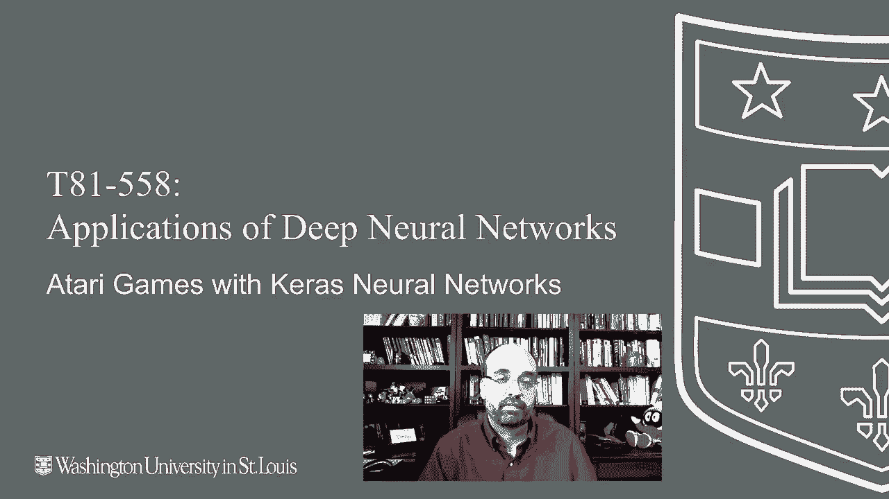
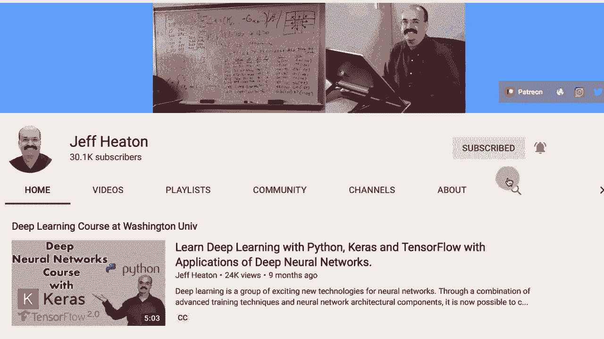
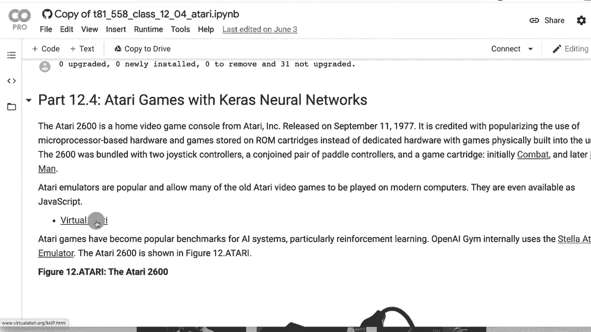
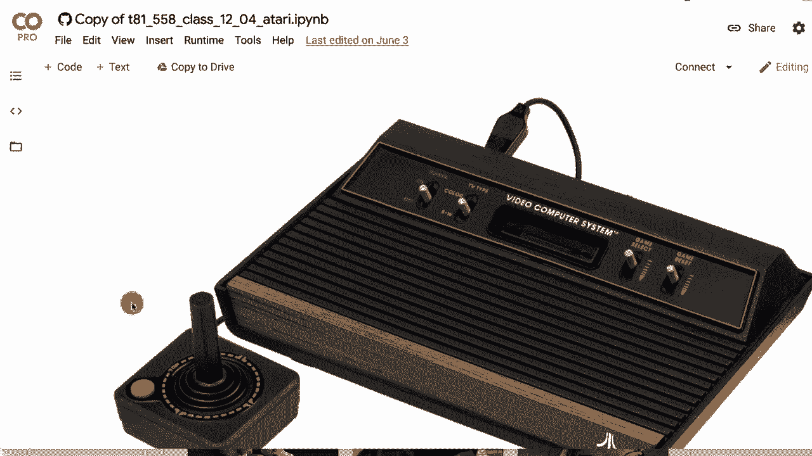
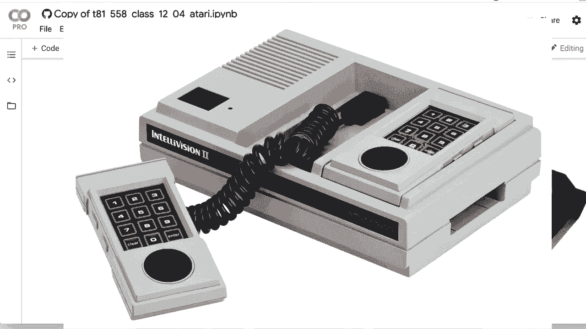
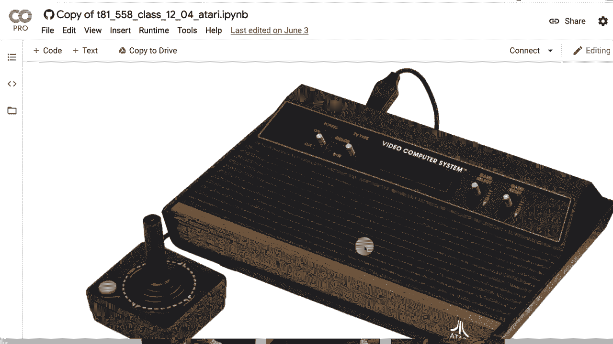
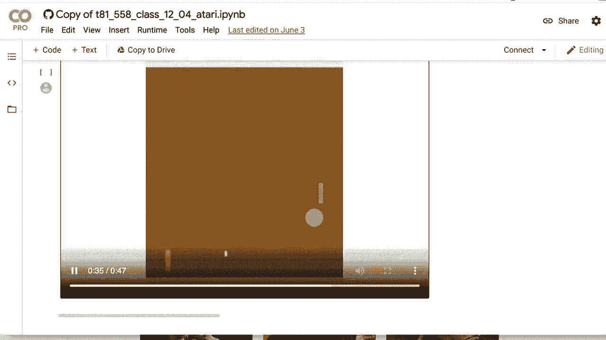
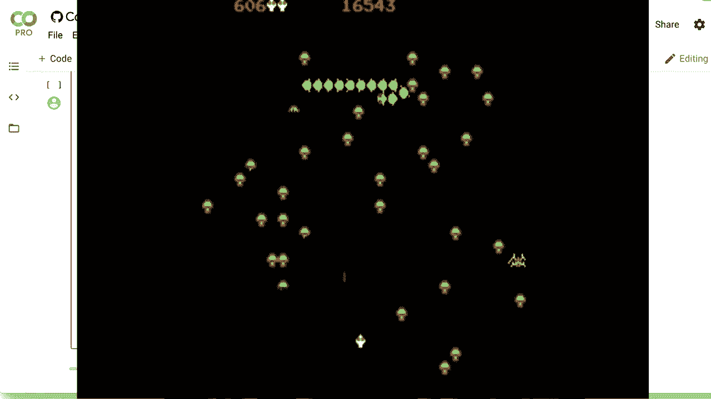

# T81-558 ｜ 深度神经网络应用 - P65：L12.4 - 使用Keras TF-Agents玩转Atari游戏 🎮

在本节课中，我们将学习如何应用深度强化学习技术，具体是使用Keras和TF-Agents库来训练一个智能体玩经典的Atari游戏。我们将以“Pong”（乒乓球）游戏为例，但所学的技术几乎可以应用于任何Atari游戏。通过本教程，你将了解如何设置环境、构建网络、训练代理并评估其性能。

---

## 概述与背景



上一节我们介绍了深度强化学习的基本概念。本节中，我们将看看一个非常流行的应用场景：玩Atari游戏。Atari 2600是早期的游戏主机，其游戏环境相对简单，是测试和演示强化学习算法的理想平台。



Atari 2600的典型游戏画面分辨率较低，例如40x192像素，其游戏状态可以有效地输入到卷积神经网络中进行处理。我们将使用TF-Agents库，它提供了便捷的包装器来加载和处理Atari游戏环境。

---

## 环境设置与依赖安装

首先，我们需要在支持GPU的环境中运行代码，因为训练过程计算量很大。以下是在Google Colab上设置环境的步骤。请注意，安装过程可能会因为库版本更新而发生变化。

以下是必要的安装和导入代码块。如果在导入时遇到错误，建议重启运行时（Runtime）然后再次运行所有代码单元。

```python
# 安装必要的包
!pip install tf-agents[reverb]
!pip install gym[atari]
!pip install gym[accept-rom-license]

# 导入库
import tensorflow as tf
from tf_agents.agents.dqn import dqn_agent
from tf_agents.environments import suite_atari
from tf_agents.environments import tf_py_environment
from tf_agents.networks import q_network
from tf_agents.utils import common
import matplotlib.pyplot as plt
```

---



## 超参数配置

训练深度Q网络（DQN）需要配置一系列超参数。以下是我为“Pong”游戏调整后的一组参数。对于其他游戏（如“Breakout”或“Space Invaders”），你可能需要重新调整这些值。

```python
# 超参数配置
num_iterations = 250000  # 总训练迭代次数
collect_steps_per_iteration = 10  # 每次迭代收集的步数
replay_buffer_max_length = 100000  # 经验回放缓冲区大小

batch_size = 64  # 训练批大小
learning_rate = 1e-4  # 学习率
log_interval = 200  # 日志记录间隔
eval_interval = 1000  # 评估间隔
```

**核心公式**：深度Q学习的目标是学习一个动作价值函数 Q(s, a)，其更新遵循贝尔曼方程：
`Q(s, a) = R + γ * max_a' Q(s', a')`
其中，R是奖励，γ是折扣因子。



---





## 创建Atari游戏环境

我们使用TF-Agents提供的`suite_atari`来加载游戏环境。需要为训练和评估分别创建环境实例。

```python
# 加载Atari游戏环境
env_name = 'PongNoFrameskip-v4'
train_py_env = suite_atari.load(env_name)
eval_py_env = suite_atari.load(env_name)

# 将Python环境转换为TensorFlow环境以提高效率
train_env = tf_py_environment.TFPyEnvironment(train_py_env)
eval_env = tf_py_environment.TFPyEnvironment(eval_py_env)
```

为了加速训练并减少计算负担，我们通常会跳过一些游戏帧（frame skipping），并且对图像进行预处理（如灰度化和缩放）。

---

## 构建Q网络

我们的智能体使用一个卷积神经网络（CNN）来近似Q函数。网络首先处理图像，然后通过全连接层输出每个可能动作的Q值。

以下是构建Q网络的代码：

```python
# 定义Q网络
q_net = q_network.QNetwork(
    train_env.observation_spec(),
    train_env.action_spec(),
    conv_layer_params=[(32, (8, 8), 4), (64, (4, 4), 2), (64, (3, 3), 1)],
    fc_layer_params=(512,)
)
```

**网络结构说明**：
*   **卷积层**：使用三层卷积来提取图像特征。
*   **全连接层**：一个包含512个神经元的全连接层。
*   **输出层**：输出维度等于游戏动作空间的大小。

---

## 创建DQN智能体

有了Q网络后，我们可以创建DQN智能体。它负责根据当前策略选择动作，并利用收集的经验来更新网络。

```python
# 创建DQN智能体
optimizer = tf.keras.optimizers.RMSprop(learning_rate=learning_rate)
train_step_counter = tf.Variable(0)

agent = dqn_agent.DqnAgent(
    train_env.time_step_spec(),
    train_env.action_spec(),
    q_network=q_net,
    optimizer=optimizer,
    td_errors_loss_fn=common.element_wise_squared_loss,
    train_step_counter=train_step_counter
)
agent.initialize()
```

---

## 经验回放与数据收集

深度强化学习通常使用经验回放缓冲区来存储和采样过去的经验（状态、动作、奖励、下一状态），这有助于打破数据间的相关性并提高学习稳定性。

以下是相关设置：

```python
from tf_agents.replay_buffers import tf_uniform_replay_buffer

# 创建经验回放缓冲区
replay_buffer = tf_uniform_replay_buffer.TFUniformReplayBuffer(
    data_spec=agent.collect_data_spec,
    batch_size=train_env.batch_size,
    max_length=replay_buffer_max_length
)
```

---

## 训练循环

训练过程是一个循环：智能体与环境交互收集数据，将数据存入缓冲区，然后从缓冲区中采样一批数据来更新网络权重。

以下是训练循环的核心结构：

```python
# 训练循环（简化示意）
for iteration in range(num_iterations):
    # 收集数据
    collect_data(train_env, agent, replay_buffer, collect_steps_per_iteration)

    # 从缓冲区采样
    experience, _ = replay_buffer.get_next(sample_batch_size=batch_size)

    # 训练智能体（更新网络）
    train_loss = agent.train(experience).loss

    # 定期评估
    if iteration % eval_interval == 0:
        avg_return = compute_avg_return(eval_env, agent.policy, num_eval_episodes=10)
        print(f'迭代 {iteration}：平均回报 = {avg_return}')
```

在训练初期，智能体的得分可能非常低（例如持续得负分）。通过调整超参数（如学习率、网络结构）和增加训练时间，性能会逐步提升。

---

## 评估智能体表现

训练完成后，我们需要评估智能体的表现。我们让智能体在评估环境中运行多个回合，并计算其平均得分。

```python
def compute_avg_return(environment, policy, num_episodes=10):
    total_return = 0.0
    for _ in range(num_episodes):
        time_step = environment.reset()
        episode_return = 0.0
        while not time_step.is_last():
            action_step = policy.action(time_step)
            time_step = environment.step(action_step.action)
            episode_return += time_step.reward
        total_return += episode_return
    avg_return = total_return / num_episodes
    return avg_return.numpy()[0]

# 计算最终平均回报
final_avg_return = compute_avg_return(eval_env, agent.policy, num_episodes=10)
print(f'最终评估平均回报: {final_avg_return}')
```

一个训练良好的智能体在“Pong”游戏中的得分应该显著高于随机行动的智能体，并且能够展现出有策略的游戏行为。

---

## 总结

本节课中，我们一起学习了如何使用Keras和TF-Agents库来实现深度强化学习，并训练了一个玩Atari“Pong”游戏的智能体。我们涵盖了从环境设置、超参数配置、网络构建到训练和评估的完整流程。





**核心要点总结**：
1.  **环境**：使用TF-Agents可以方便地加载和预处理Atari游戏环境。
2.  **网络**：卷积神经网络适合处理图像输入，用于近似Q函数。
3.  **智能体**：DQN智能体适用于离散动作空间的问题。
4.  **训练**：经验回放和适当的超参数调优对训练成功至关重要。
5.  **评估**：通过多回合的平均回报来客观衡量智能体的性能。

虽然我们以“Pong”为例，但相同的框架可以迁移到其他Atari游戏乃至自定义的非游戏环境中。在接下来的课程中，我们将探索如何将深度强化学习应用于金融模拟等更广泛的领域。