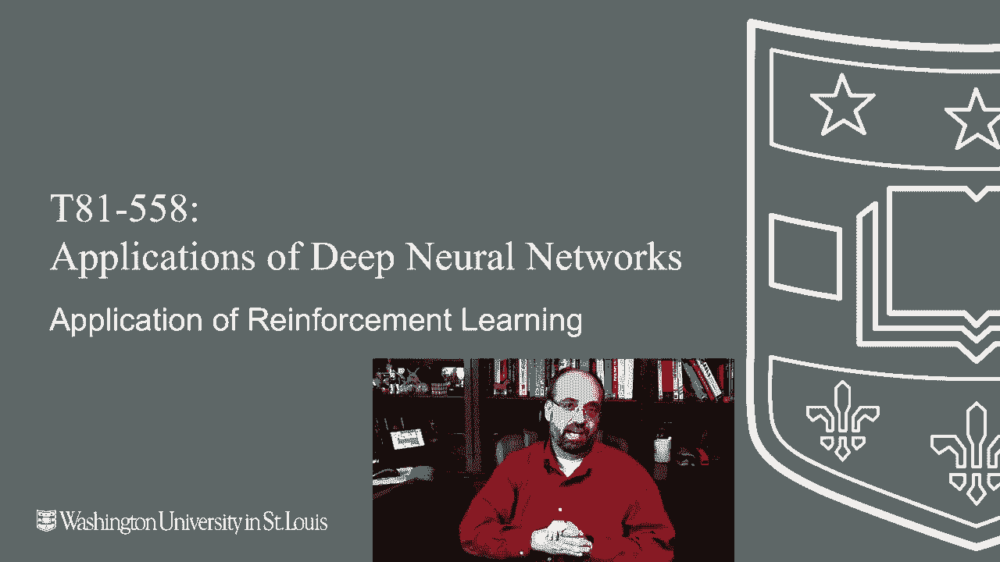
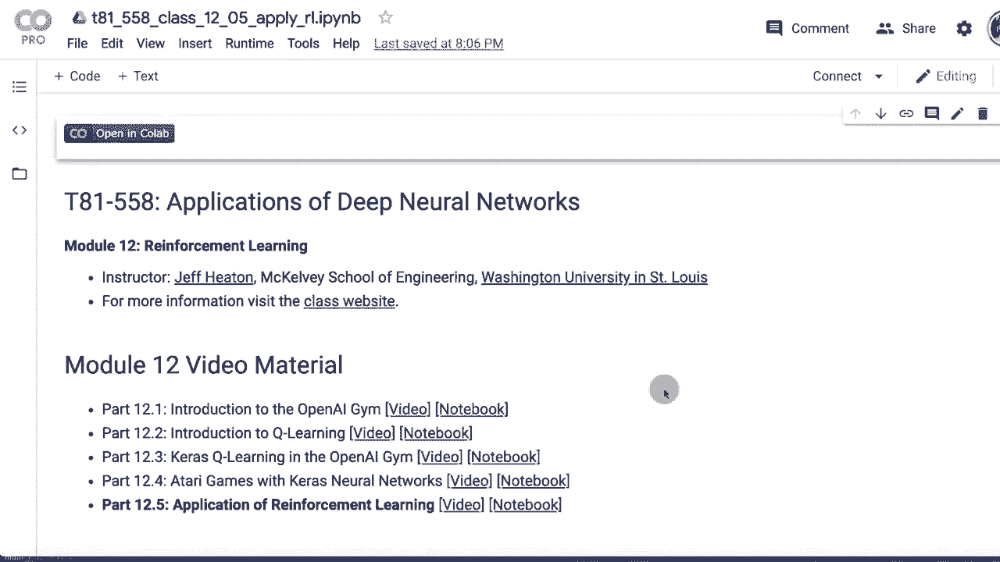
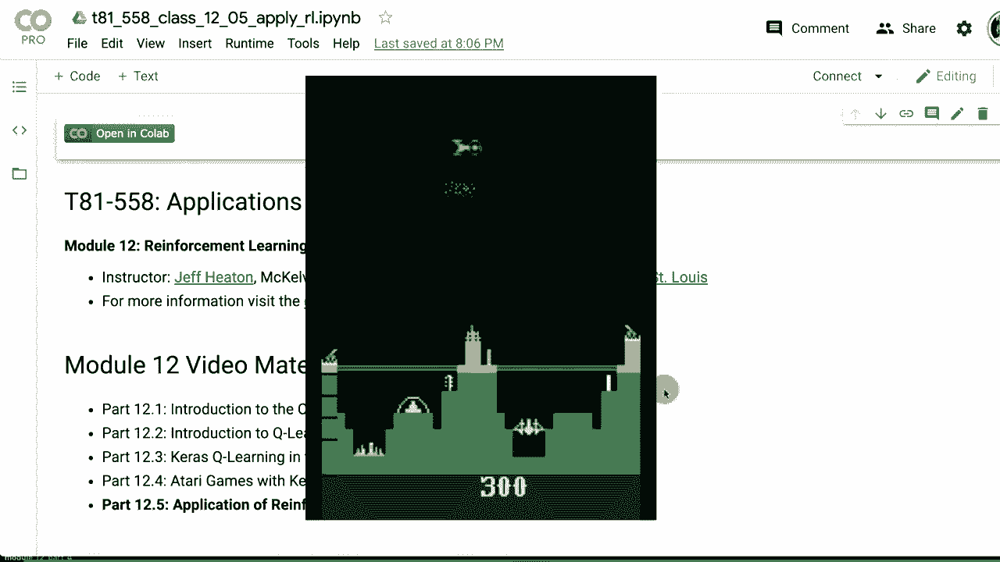
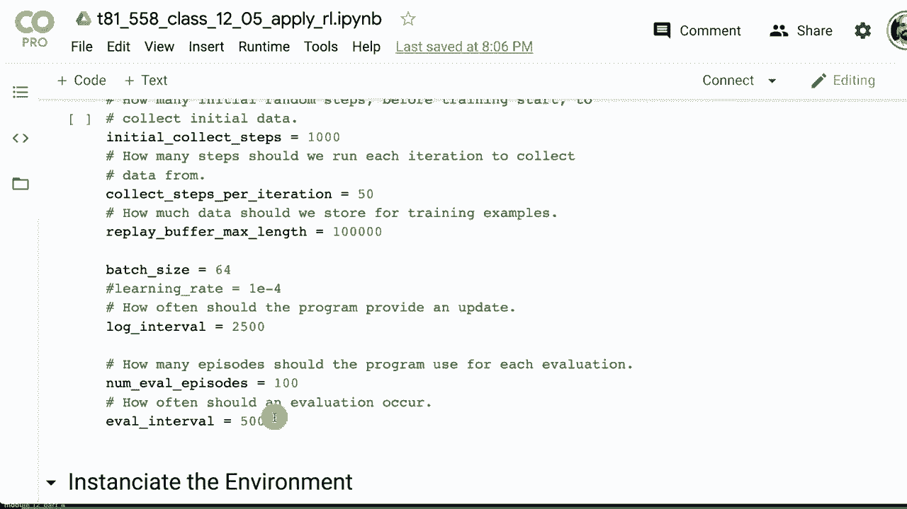
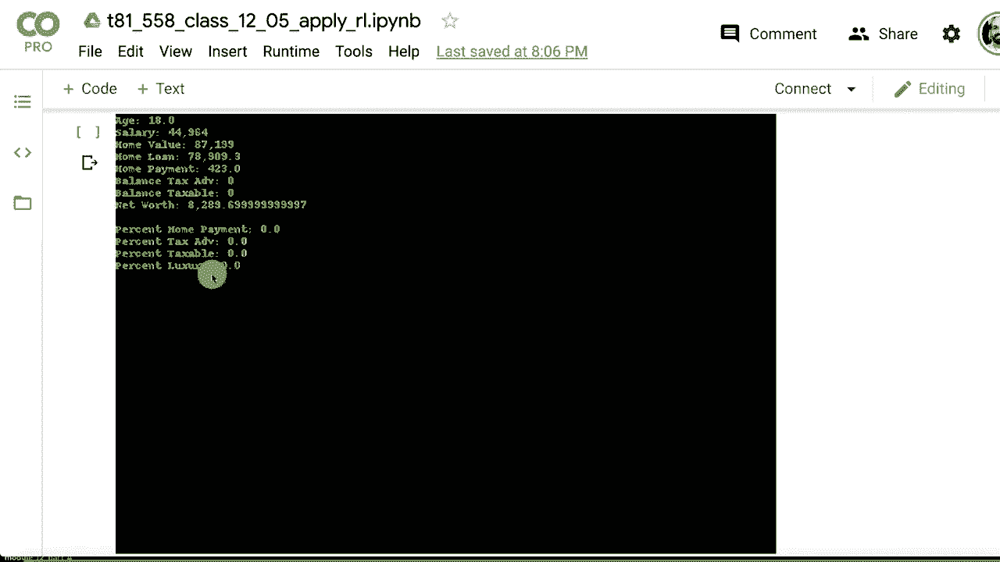
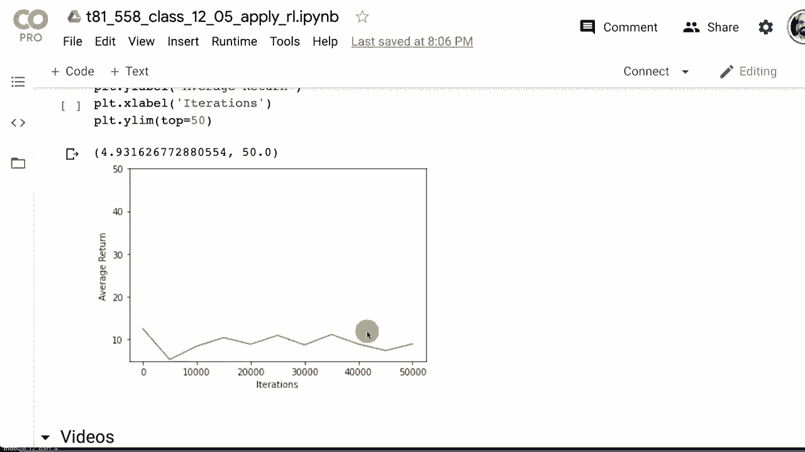
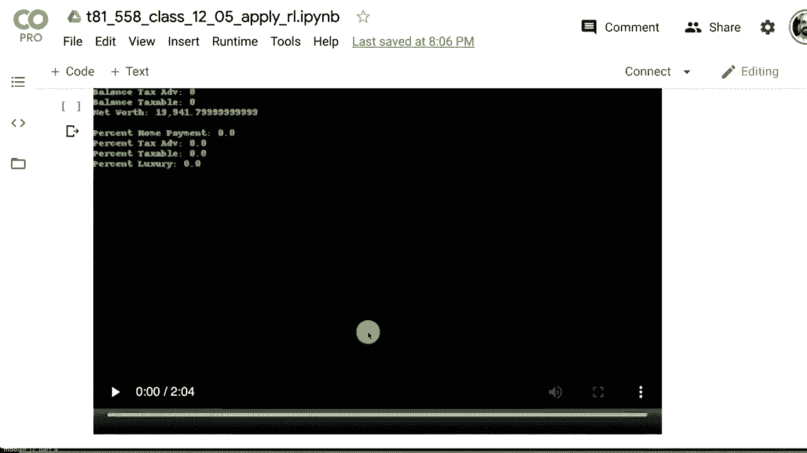
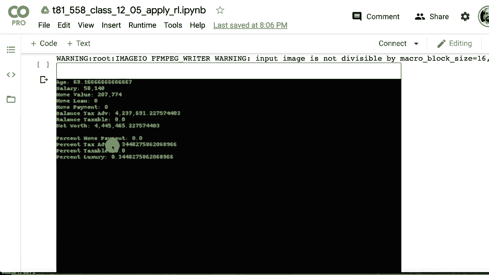
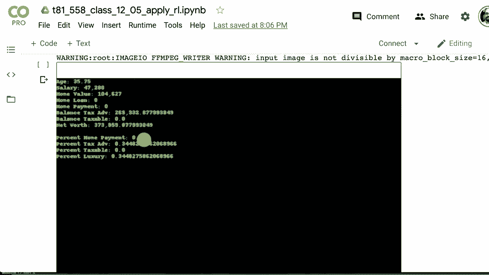

# T81-558 ｜ 深度神经网络应用-P66：L12.5- 非游戏TF-Agent的强化学习 💰

在本节课中，我们将学习如何将强化学习应用于非游戏场景，特别是创建一个自定义的金融模拟环境。我们将使用TF-Agents库，并重点关注连续动作空间的处理。

## 概述

强化学习通常被演示用于玩Atari游戏或物理模拟。本节将展示如何将其应用于自定义问题，例如个人财富积累的金融模拟。我们将从头创建一个环境，并应用深度确定性策略梯度算法进行训练。





## 创建自定义环境



上一节我们介绍了强化学习的基本概念，本节中我们来看看如何创建自己的环境。在TF-Agents中，自定义环境需要继承自`gym.Env`类并实现特定方法。

以下是创建自定义环境必须实现的规则：

*   必须是`gym.Env`的子类。
*   必须实现`seed`函数，以确保环境可复现。
*   必须实现`reset`函数，用于重启环境。
*   必须实现`render`函数，用于可视化环境状态。
*   必须实现`step`函数，用于执行动作并返回新状态和奖励。
*   需要注册环境，以便TF-Agents能够识别。

## 金融模拟环境设计

我们将设计一个简化的个人理财模拟环境。代理是一个为退休储蓄并进行投资的人。

### 状态空间

状态由以下7个值组成的向量表示：
*   `age`：人的年龄（月数）
*   `salary`：月薪
*   `home_value`：房屋价值
*   `mortgage_payment`：所需月供
*   `ira_balance`：税收优惠账户（如IRA）余额
*   `taxable_balance`：应税储蓄账户余额
*   `luxury`：奢侈品消费预算（本模拟中无实际益处，仅作区分）

为便于神经网络处理，所有金额单位被归一化为“百万”。

### 动作空间

动作是一个包含4个浮点数的数组，代表将月薪分配至以下四项的**比例**：
1.  房贷还款
2.  税收优惠储蓄账户
3.  应税储蓄账户
4.  奢侈品消费

代码会将这些数值归一化，使其总和为1。这是一个**连续动作空间**。

```python
# 动作空间示例：代理输出四个原始值
raw_actions = [0.3, 0.4, 0.2, 0.1]
# 归一化后得到分配比例
normalized_actions = [0.3, 0.4, 0.2, 0.1] / sum([0.3, 0.4, 0.2, 0.1]) # 结果仍为 [0.3, 0.4, 0.2, 0.1]
```

### 模拟规则

环境遵循以下简化规则：
*   起始薪资在4万至6万美元之间随机生成。
*   初始房贷为薪资的1.5到4倍。
*   房贷为30年固定利率，有固定月供。
*   支付低于月供将导致逾期，逾期超过15次将触发止赎（房屋被拍卖，产生损失）。
*   支付高于月供可加速还款。
*   税收优惠账户有年度存款上限（类似401(k)）。
*   所有账户会产生投资回报，并受随机通货膨胀影响。
*   每月有固定必需支出（如食物、水电）。
*   代理工作至80岁，目标是最大化最终净资产。

净资产计算公式为：
`净资产 = 房屋价值 - 房贷剩余本金 + 税收优惠账户余额 + 应税账户余额`

## 实现环境类

以下是环境类`SimpleLifeGameEnv`的核心结构摘要：

```python
import gym
import numpy as np

class SimpleLifeGameEnv(gym.Env):
    def __init__(self, verbose=False):
        super(SimpleLifeGameEnv, self).__init__()
        # 定义动作空间：4个介于0和1之间的连续值
        self.action_space = gym.spaces.Box(low=0.0, high=1.0, shape=(4,), dtype=np.float32)
        # 定义状态空间：7个值的向量，并设定合理范围
        self.observation_space = gym.spaces.Box(low=0.0, high=10.0, shape=(7,), dtype=np.float32)
        self.verbose = verbose
        self.log = []
        # ... 初始化其他参数（利率、税率、通胀率等）

    def reset(self):
        """重置环境到初始状态"""
        # 重置年龄、随机生成薪资和房贷等
        # 返回初始状态向量
        return self._get_state()

    def step(self, action):
        """执行一个动作步进"""
        # 1. 评估并归一化动作
        percentages = self._evaluate_action(action)
        # 2. 处理每月事件：计算支出、税款、存款、投资回报、房贷还款等
        # 3. 检查是否逾期或止赎
        # 4. 更新所有状态值
        # 5. 计算奖励（例如：净资产的变化）
        reward = self._calculate_reward()
        # 6. 检查是否终止（如年龄达到80岁）
        done = (self.age >= self.retirement_age)
        # 7. 返回新状态、奖励、终止标志和信息
        return self._get_state(), reward, done, {}

    def render(self, mode='human'):
        """渲染当前环境状态（本例中输出文本到控制台）"""
        if mode == 'human':
            print(f"年龄: {self.age}月, 薪资: ${self.salary:.2f}, 净资产: ${self._net_worth():.2f}")
        # 也可以使用Pillow生成图像

    def _evaluate_action(self, action):
        """将原始动作值转换为百分比分配"""
        total = np.sum(action)
        if total <= 1e-6: # 防止除零
            return np.zeros_like(action)
        return action / total

    def _get_state(self):
        """获取当前状态向量（归一化后）"""
        state = np.array([
            self.age,
            self.salary,
            self.home_value,
            self.mortgage_payment,
            self.ira_balance,
            self.taxable_balance,
            self.luxury_spent
        ], dtype=np.float32)
        return state / 1_000_000.0 # 归一化为百万单位

    def _net_worth(self):
        """计算当前净资产"""
        return (self.home_value - self.mortgage_principal) + self.ira_balance + self.taxable_balance
```

## 注册与测试环境

创建环境后，需要注册以便使用。

```python
from gym.envs.registration import register

register(
    id='SimpleLifeGame-v0',
    entry_point='your_module:SimpleLifeGameEnv', # 替换为你的模块和类名
    max_episode_steps=80*12, # 最多80年*12月
)
```

然后可以像使用标准Gym环境一样测试它：

```python
import gym
env = gym.make('SimpleLifeGame-v0')
state = env.reset()
for _ in range(120): # 模拟10年
    action = env.action_space.sample() # 随机动作
    state, reward, done, info = env.step(action)
    env.render()
    if done:
        break
env.close()
```

## 使用DDPG算法进行训练

上一节我们创建了环境，本节中我们来看看如何用合适的算法进行训练。由于我们的动作空间是连续的，不能使用之前的DQN算法。我们将采用**深度确定性策略梯度算法**。

### DDPG算法简介

DDPG是一种适用于连续动作空间的Actor-Critic算法。它包含两个神经网络：
*   **Actor网络**：输入当前状态，输出一个具体的连续动作值。
*   **Critic网络**：输入当前状态和Actor建议的动作，评估该动作的预期回报（Q值）。





两个网络协同工作，Actor试图提出能最大化Critic所评估Q值的动作。

### 训练流程

以下是使用TF-Agents的DDPG代理进行训练的核心步骤：

1.  **创建环境**：分别创建用于训练和评估的环境。
2.  **构建神经网络**：
    *   创建Actor网络（一个输出层为4个单元的全连接网络）。
    *   创建Critic网络（接受状态和动作作为联合输入）。
3.  **创建DDPG代理**：将Actor、Critic网络、优化器及相关参数组合成代理。
4.  **数据收集**：运行环境一定步数，用随机策略或初始策略收集经验数据（状态、动作、奖励、下一状态）。
5.  **训练循环**：代理从经验回放缓冲区中采样数据，更新Actor和Critic网络。
6.  **定期评估**：在评估环境中运行当前策略，计算平均回报以监控进度。

关键训练参数示例：
*   `num_iterations=50000`：总训练迭代次数。
*   `collect_steps_per_iteration=50`：每次迭代收集的经验步数。
*   `batch_size=64`：从缓冲区采样训练的批次大小。

## 结果与分析

训练完成后，代理学会了分配收入以最大化最终净资产。一个成功的策略通常是：
1.  优先保证房贷月供，避免止赎。
2.  在达到税收优惠账户年度上限前，尽可能向其存款。
3.  将剩余资金存入应税账户。
4.  避免奢侈品消费（因其在本模拟中不产生回报）。

通过多次训练，代理能学会适应模拟中的随机性（如投资回报波动和通货膨胀），并稳定地增长财富。

## 总结







本节课中我们一起学习了如何将强化学习应用于非游戏场景。我们完成了一个完整的流程：
1.  **设计问题**：将个人财富管理抽象为强化学习问题，定义了状态、动作和奖励。
2.  **创建环境**：实现了Gym规范的自定义环境类，模拟金融动态。
3.  **选择算法**：针对连续动作空间，选择了DDPG算法。
4.  **训练代理**：使用TF-Agents框架配置并训练了DDPG代理，使其学会优化财富分配策略。



这个示例的核心价值在于展示了强化学习的灵活性。你可以借鉴此模式，通过定义合适的状态、动作和奖励函数，将强化学习应用于机器人控制、资源管理、个性化推荐等广泛领域。关键在于将你的问题建模为**智能体与环境交互并通过试错学习**的过程。