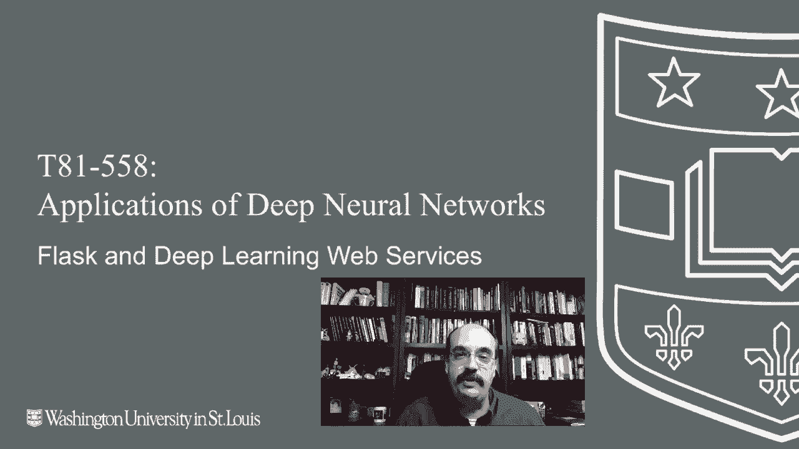
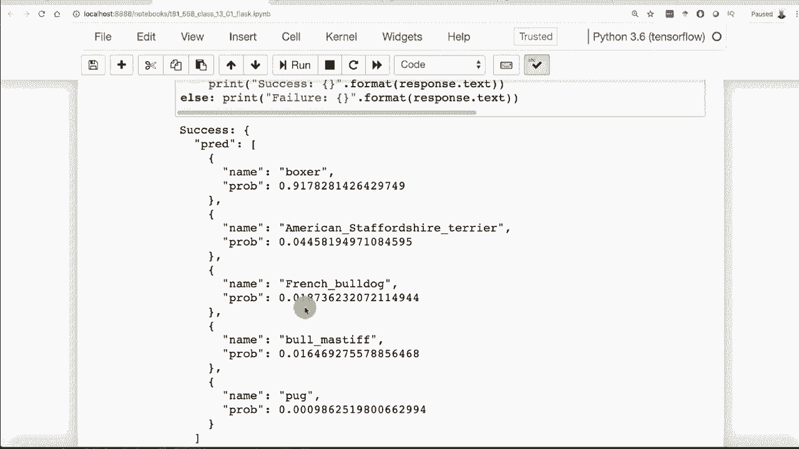

# T81-558 ｜ 深度神经网络应用 - P67：L13.1 - Flask与深度学习Keras/TensorFlow Web服务搭建 🚀

在本节课中，我们将学习如何使用Flask框架，将基于Keras或TensorFlow训练的深度学习模型部署为Web服务。我们将创建一个能够接收HTTP请求、处理数据并返回模型预测结果的API端点。

---

## 概述

Flask是一个轻量级的Python Web框架，它允许开发者将Python应用程序（例如训练好的神经网络模型）快速转化为Web服务。通过创建API端点，其他程序或网站可以向我们的服务发送请求，并获取模型的预测结果。本节将演示如何搭建一个基础的Flask应用来服务一个预测汽车每加仑英里数（MPG）的神经网络模型。



---

## Flask简介与运行环境

上一节我们介绍了课程目标，本节中我们来看看Flask的基本概念和运行环境。

Flask是一个Web服务器框架，其设计初衷是接收来自浏览器的HTTP请求并返回响应。它非常适合用于快速开发API，将机器学习模型的功能暴露给外部调用。

需要注意的是，Flask主要是一个开发平台。虽然很多人将其用于生产环境，但它并非为此而优化。对于需要处理高并发请求的生产环境，建议使用如 **gunicorn** 这样的WSGI HTTP服务器，它能更好地处理多个同时到来的请求，避免因Python的全局解释器锁（GIL）导致的性能瓶颈。

通常，Flask应用通过命令行运行，而不是在Jupyter Notebook或Google Colab中运行，因为这些环境不适合长期运行Web服务。

---

## 第一个Flask应用示例

以下是创建一个最简单的Flask应用的步骤。这个应用将在本地运行，并响应根路径的请求。

```python
from flask import Flask
app = Flask(__name__)

@app.route('/')
def hello_world():
    return 'Hello, World!'

if __name__ == '__main__':
    app.run(host='0.0.0.0', port=9000)
```

运行上述代码后，Flask服务器将在本地主机的9000端口启动。访问 `http://localhost:9000` 将会看到返回的“Hello, World!”信息。在生产环境中，你可能会将服务部署在80端口，或通过Docker容器进行端口映射。

---

## 部署Keras模型为Web服务

上一节我们运行了一个简单的Flask应用，本节中我们来看看如何集成一个训练好的Keras模型。

我们的目标是部署一个预测汽车MPG的神经网络。首先，我们需要在Jupyter Notebook中完成模型的训练和保存。

### 模型训练与保存

以下是训练并保存模型的核心代码：

```python
# 假设 `model` 是已经训练好的Keras模型
model.save('dna/models/mpg_model.h5')
```

训练过程通常包括数据加载、预处理、模型构建和评估。一旦模型达到满意的性能（例如均方根误差RMSE约为3），就将其保存为H5格式的文件，供后续Flask应用加载。

### 创建Flask API端点

接下来，我们创建一个Flask应用来加载这个模型并提供预测服务。

以下是创建MPG预测API端点的关键步骤：

1.  **加载模型**：在应用启动时加载保存的H5模型文件，避免每次请求时重新训练。
2.  **定义API路由**：创建一个路由（例如 `/api/mpg`）来接收POST请求。
3.  **处理请求数据**：从请求中解析JSON格式的输入数据。
4.  **数据验证**：检查输入数据的完整性和有效性（例如，字段是否齐全、数值是否在训练集范围内）。
5.  **进行预测**：将验证后的数据转换为模型所需的格式（如NumPy数组），调用模型的 `predict` 方法。
6.  **返回结果**：将预测结果封装成JSON格式返回给客户端。

以下是核心代码框架：

```python
from flask import Flask, request, jsonify
import numpy as np
from tensorflow.keras.models import load_model

app = Flask(__name__)
model = load_model('dna/models/mpg_model.h5')

@app.route('/api/mpg', methods=['POST'])
def predict_mpg():
    data = request.get_json()
    errors = []

    # 数据验证逻辑
    expected_fields = ['cylinders', 'displacement', 'horsepower', 'weight', 'acceleration', 'year', 'origin']
    for field in expected_fields:
        if field not in data:
            errors.append(f"Missing field: {field}")
        # 还可以检查数值范围...

    if errors:
        return jsonify({'errors': errors, 'transaction_id': 'some_unique_id'}), 400

    # 准备输入数据
    input_data = np.array([[data['cylinders'], data['displacement'], ...]]) # 按训练顺序排列
    prediction = model.predict(input_data)
    mpg = prediction[0][0]

    return jsonify({'mpg': mpg, 'transaction_id': 'some_unique_id'})

if __name__ == '__main__':
    app.run(host='0.0.0.0', port=9000)
```

### 错误处理的重要性

在API中实施健壮的错误处理至关重要。当客户端发送了格式错误或超出范围的数据时，返回清晰、描述性的错误信息（例如“缺少字段：weight”），而不是让Python抛出晦涩的异常。这能极大地方便客户端调试，并减少生产环境下的运维压力。

---

## 测试Web服务

上一节我们构建了MPG预测API，本节中我们来看看如何测试它。

我们可以使用多种工具来测试我们的Flask API。

### 使用Postman测试

Postman是一个强大的API测试工具。测试步骤如下：
1.  将请求方法设置为 **POST**。
2.  输入API地址：`http://localhost:9000/api/mpg`。
3.  在“Body”选项卡中选择 **raw** 和 **JSON** 格式。
4.  输入符合模型要求的JSON数据，例如：
    ```json
    {
        "cylinders": 8,
        "displacement": 307,
        "horsepower": 130,
        "weight": 3504,
        "acceleration": 12,
        "year": 70,
        "origin": 1
    }
    ```
5.  点击“Send”，查看返回的MPG预测值和事务ID。

### 使用Python代码测试

我们也可以直接在Python脚本中使用 `requests` 库来调用API：

```python
import requests
import json

url = 'http://localhost:9000/api/mpg'
data = {
    "cylinders": 8,
    "displacement": 307,
    "horsepower": 130,
    "weight": 3504,
    "acceleration": 12,
    "year": 70,
    "origin": 1
}

response = requests.post(url, json=data)
print(response.json())
```

运行这段代码将程序化地获得与Postman相同的预测结果。

---

## 处理图像预测的API

神经网络不仅用于处理数值数据，也广泛应用于图像识别。接下来，我们看看如何创建一个接收图像并返回分类结果的API。

我们将使用预训练的MobileNet模型。与MPG API类似，但需要处理文件上传。

以下是图像预测API的核心步骤：

1.  **定义路由**：创建如 `/api/image` 的路由来处理POST请求。
2.  **接收图像**：通过HTTP的多部分表单数据（multipart/form-data）上传接收图像文件。
3.  **验证格式**：检查文件格式（如.jpg, .png）是否被支持。
4.  **预处理图像**：将上传的图像转换为模型所需的格式（调整大小、归一化等）。
5.  **进行预测**：将处理后的图像数据输入MobileNet模型。
6.  **返回结果**：将模型输出的分类标签和概率以JSON格式返回。

关键代码片段如下：

```python
from flask import request, jsonify
from PIL import Image
import numpy as np
from tensorflow.keras.applications.mobilenet import MobileNet, preprocess_input, decode_predictions

model = MobileNet(weights='imagenet')

@app.route('/api/image', methods=['POST'])
def predict_image():
    if 'image' not in request.files:
        return jsonify({'error': 'No image provided'}), 400

    file = request.files['image']
    # 检查文件扩展名...
    
    # 将图像转换为模型输入
    img = Image.open(file.stream).convert('RGB')
    img = img.resize((224, 224))
    img_array = np.array(img)
    img_array = np.expand_dims(img_array, axis=0)
    img_array = preprocess_input(img_array)

    predictions = model.predict(img_array)
    decoded_predictions = decode_predictions(predictions, top=3)[0] # 取最可能的前3个结果

    results = [{'label': label, 'probability': float(prob)} for (_, label, prob) in decoded_predictions]
    return jsonify({'predictions': results})
```

同样，我们可以使用Postman（选择“form-data”并上传文件）或Python的 `requests` 库来测试这个图像API。

---

## 总结

本节课中我们一起学习了如何使用Flask框架将深度学习模型部署为Web服务。我们涵盖了以下核心内容：
*   Flask的基本概念及其作为开发Web服务器的作用。
*   如何训练并保存一个Keras模型（H5格式）。
*   如何构建一个Flask应用来加载模型，并通过API端点提供预测服务，重点包括数据验证和错误处理。
*   如何使用Postman和Python代码测试我们的API。
*   如何扩展API以处理图像上传和预测，使用预训练的MobileNet模型作为示例。



通过将这些API部署到云端（例如使用Docker和gunicorn），你可以构建可扩展的、可供其他应用程序调用的机器学习服务。