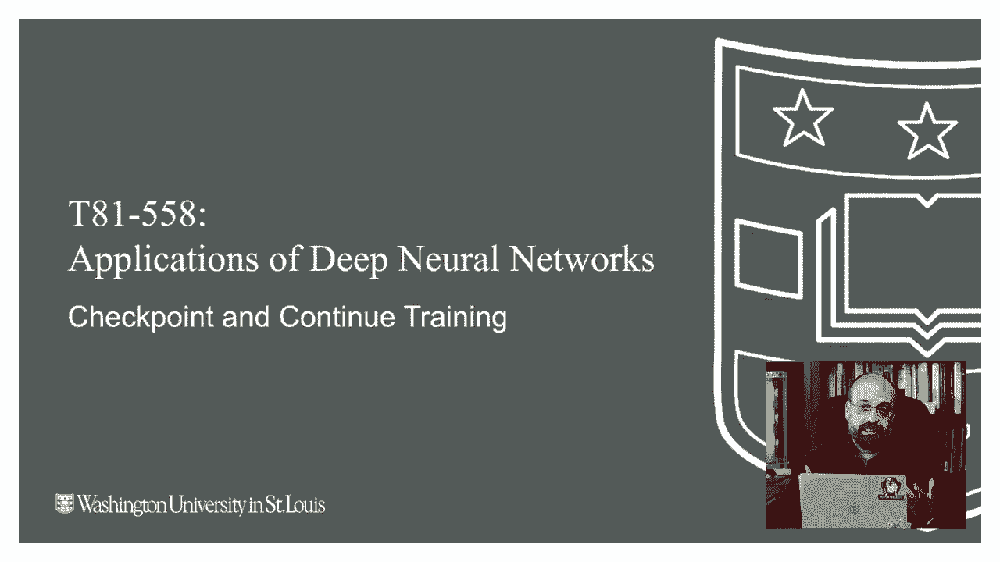
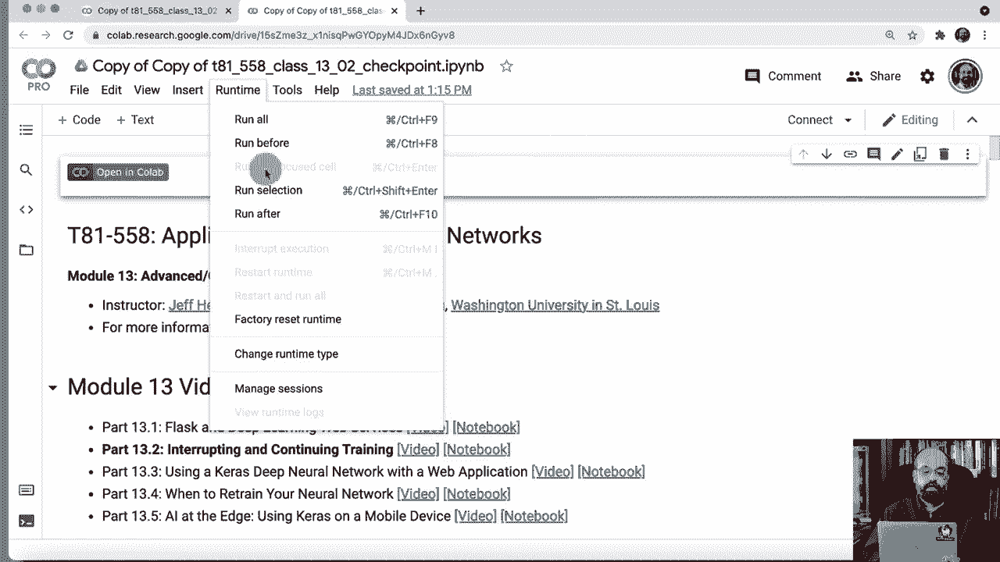
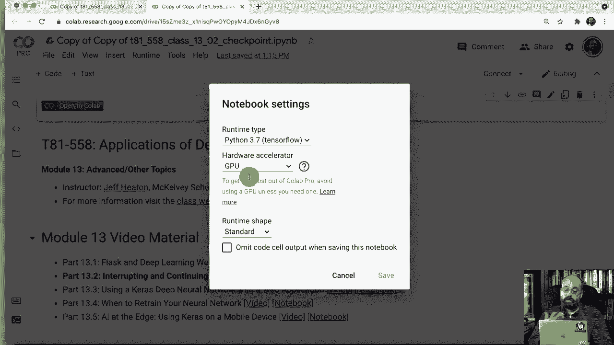
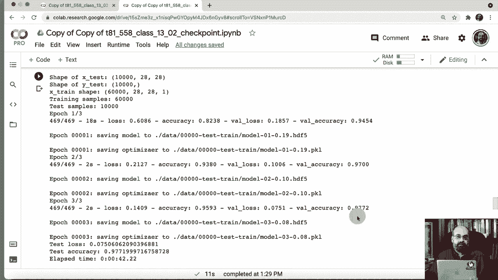

# T81-558 ｜ 深度神经网络应用 - P68：L13.2 - 在Python TensorFlow Keras中恢复训练和检查点 🧠



在本节课中，我们将学习如何在TensorFlow Keras中实现模型检查点功能，以便在训练中断后能够恢复训练。这对于训练耗时数天的大型复杂模型至关重要。

## 概述与准备工作 📋

上一节我们介绍了模型训练的基本流程，本节中我们来看看如何保存训练进度并在之后恢复。

首先，需要准备课程笔记和运行环境。课程笔记位于Github仓库中。我们将使用Google Colab进行演示，并确保运行时类型设置为GPU以加速训练过程。

以下是一段用于计算和格式化耗时的辅助函数代码：





```python
import time
def format_time(seconds):
    # 将秒转换为人类可读的格式
    ...
```

此外，为了在长时间训练中更好地管理输出，我们引入了一个日志记录类。这个类基于NVIDIA StyleGAN2 ADA项目中的代码，它能将标准输出同时记录到日志文件中。

```python
class Logger:
    # 包装代码，将输出记录到文件
    ...
```

## 设置检查点保存路径 🗂️

接下来，我们需要指定保存检查点文件的位置。检查点将保存神经网络的完整状态和训练状态（如优化器状态、当前周期数等）。

这类似于大学中途休学后复学：你希望从离开时的学期（周期）继续，而不是从头开始。神经网络的知识（权重）和训练进度（优化器状态）都需要被保存。

我们将检查点保存在一个名为`data`的目录中。同时，定义本次实验的名称和批量大小等参数。

```python
checkpoint_dir = './data/'
experiment_name = '001_test_train'
batch_size = 64
num_classes = 10  # 手写数字分类，共10类
```

## 创建自定义检查点回调 ⚙️

Keras提供了`ModelCheckpoint`回调，但它默认只保存模型权重。为了能完全恢复训练，我们需要自定义一个回调来同时保存优化器状态。

以下是自定义检查点回调`MyModelCheckpoint`的核心代码：

```python
from tensorflow.keras.callbacks import ModelCheckpoint
import pickle

class MyModelCheckpoint(ModelCheckpoint):
    def on_epoch_end(self, epoch, logs=None):
        # 1. 首先调用父类方法保存模型
        super().on_epoch_end(epoch, logs)
        # 2. 构建优化器状态的文件名
        optimizer_path = self.filepath.replace('.h5', '.pkl')
        # 3. 保存优化器状态和当前周期数
        optimizer_state = {
            'optimizer': self.model.optimizer.get_config(),
            'epoch': epoch
        }
        with open(optimizer_path, 'wb') as f:
            pickle.dump(optimizer_state, f)
```

这个回调在每个训练周期结束时触发，会生成两个文件：一个`.h5`文件保存模型，一个`.pkl`文件保存优化器状态和当前周期。

## 配置学习率调度器 📉

在长时间训练中，动态调整学习率是常见做法。我们使用一个指数衰减调度器。

学习率衰减公式可以表示为：
`new_lr = initial_lr * decay_rate ^ (epoch / decay_steps)`

以下是Keras中对应的代码实现：

```python
from tensorflow.keras.callbacks import LearningRateScheduler
import math

def lr_schedule(epoch):
    initial_lr = 1e-3
    decay = 0.75
    step = 10
    return initial_lr * math.pow(decay, math.floor(epoch/step))

lr_scheduler = LearningRateScheduler(lr_schedule)
```

## 构建与训练模型 🏗️

现在，我们构建一个用于手写数字分类的卷积神经网络模型。模型结构对本例来说不是重点，我们更关注训练流程。

以下是构建和编译模型的代码：

```python
from tensorflow.keras import layers, models

def build_model():
    model = models.Sequential([
        layers.Conv2D(32, (3,3), activation='relu', input_shape=(28,28,1)),
        layers.MaxPooling2D((2,2)),
        layers.Flatten(),
        layers.Dense(64, activation='relu'),
        layers.Dense(num_classes, activation='softmax')
    ])
    return model

model = build_model()
model.compile(optimizer='adam',
              loss='sparse_categorical_crossentropy',
              metrics=['accuracy'])
```

接下来是训练函数。它需要处理两种情况：从头开始训练，或从检查点恢复训练。

```python
def train_model(model, initial_epoch, max_epochs):
    # 创建自定义检查点回调
    checkpoint_callback = MyModelCheckpoint(
        filepath=f'{checkpoint_dir}model_epoch{{epoch:02d}}.h5',
        save_weights_only=False
    )
    # 组合回调
    callbacks_list = [checkpoint_callback, lr_scheduler]
    # 开始训练
    history = model.fit(
        train_dataset,
        epochs=max_epochs,
        initial_epoch=initial_epoch,
        callbacks=callbacks_list,
        validation_data=val_dataset
    )
    return history
```

我们首先进行一轮初始训练，设置`initial_epoch=0`, `max_epochs=3`。训练结束后，检查点目录中会生成模型和优化器状态文件。

## 从检查点恢复训练 🔄

训练可能因各种原因中断（如计算机关机、云实例被抢占）。此时，我们需要从最新的检查点恢复。

恢复训练包含以下关键步骤：

1.  **加载模型**：使用`keras.models.load_model`加载`.h5`文件。
2.  **加载训练状态**：从对应的`.pkl`文件中读取优化器配置和中断时的周期数。
3.  **重新编译模型**：用加载的优化器状态重新编译模型。注意，这不会重置模型权重。
4.  **继续训练**：调用`train_model`函数，并传入加载的周期作为`initial_epoch`。

以下是恢复训练的代码：

```python
import pickle

def load_model_and_optimizer(model_path, optimizer_path):
    # 1. 加载模型
    model = models.load_model(model_path)
    # 2. 加载优化器状态和周期数
    with open(optimizer_path, 'rb') as f:
        optimizer_state = pickle.load(f)
    # 3. 重新编译模型
    model.compile(optimizer='adam', # 使用相同的优化器类型
                  loss='sparse_categorical_crossentropy',
                  metrics=['accuracy'])
    # 手动将保存的配置赋予优化器
    model.optimizer.from_config(optimizer_state['optimizer'])
    return model, optimizer_state['epoch']

# 指定要加载的检查点文件
model_path = './data/model_epoch03.h5'
optimizer_path = './data/model_epoch03.pkl'

# 加载并恢复
model, last_epoch = load_model_and_optimizer(model_path, optimizer_path)
print(f"从第 {last_epoch} 周期恢复训练。")
# 继续训练，例如再训练3个周期
train_model(model, initial_epoch=last_epoch, max_epochs=last_epoch+3)
```

运行上述代码后，你将看到训练从上次结束的周期（例如第3周期）开始，准确率也承接了之前的结果，而不是从零开始。

## 总结 🎯

本节课中我们一起学习了在Keras中实现检查点和恢复训练的全过程。

以下是核心要点总结：
*   **检查点的必要性**：对于长时间训练，保存进度以防中断是必须的。
*   **保存完整状态**：有效的检查点需要同时保存**模型权重**和**训练状态**（优化器、当前周期等）。
*   **自定义回调**：通过继承`ModelCheckpoint`并重写`on_epoch_end`方法，可以轻松实现完整状态的保存。
*   **恢复流程**：恢复训练时，需按顺序加载模型、加载优化器状态、重新编译模型，然后指定正确的起始周期继续训练。



掌握这项技术能让你更从容地管理大规模神经网络训练任务，无论是在本地进行还是在可能被中断的云Spot实例上运行。