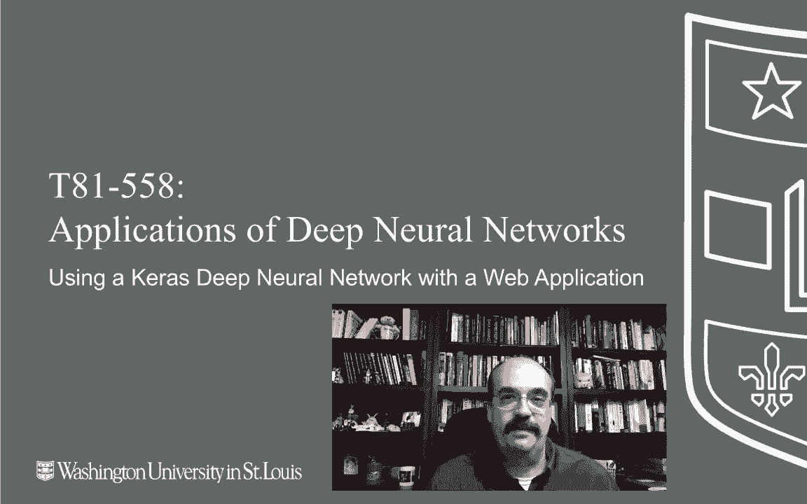
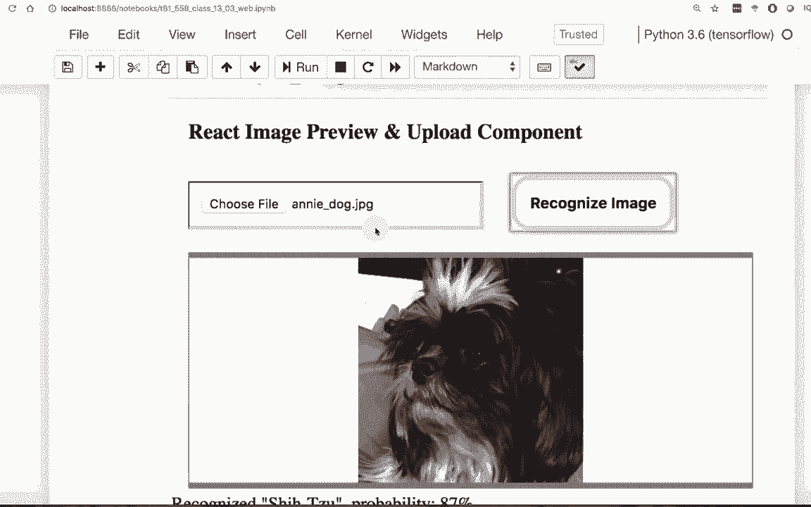
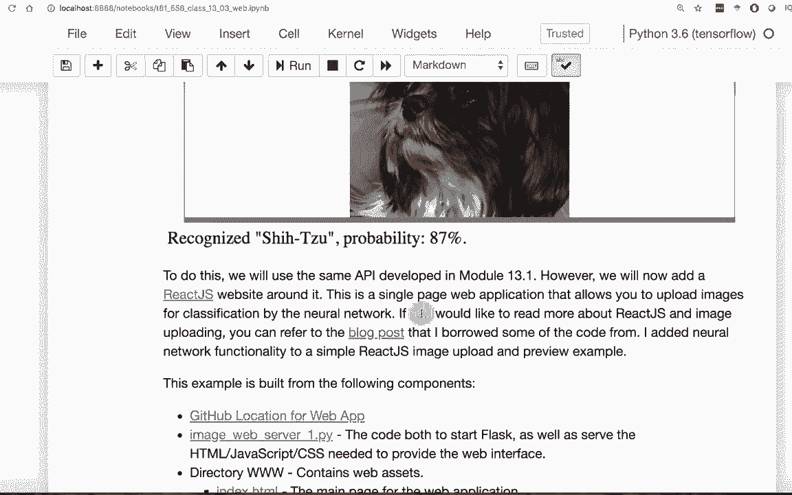
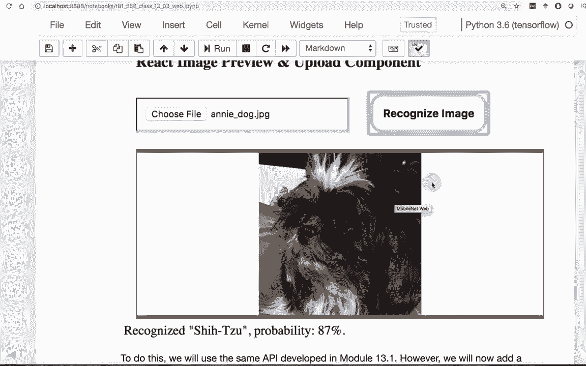
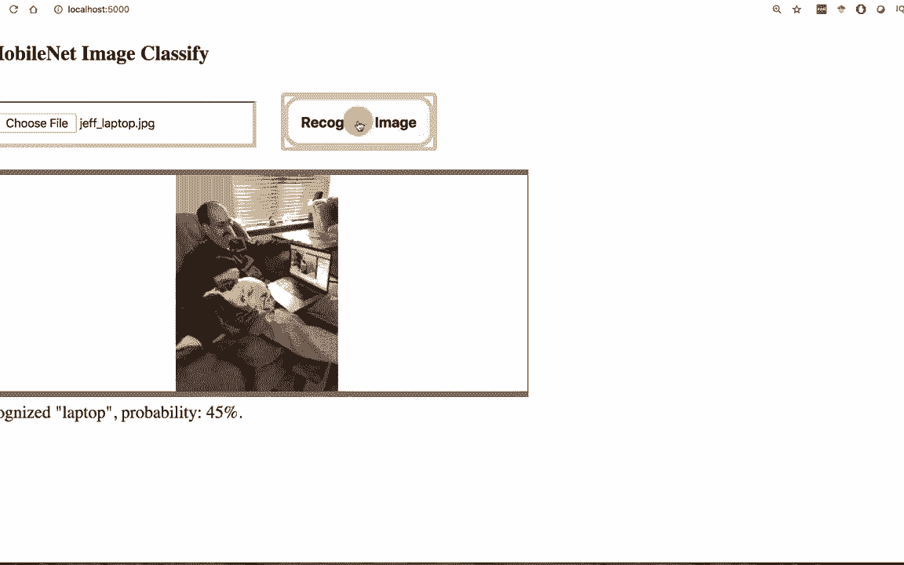

# T81-558 ｜ 深度神经网络应用 - P69：L13.3 - 在Web应用程序中使用Keras深度神经网络 🚀

## 概述

在本节课中，我们将学习如何将一个训练好的Keras深度神经网络模型部署到一个交互式网页应用程序中。我们将使用Flask框架构建后端API服务，并使用React框架构建前端用户界面，实现从用户上传图片到模型预测并展示结果的完整流程。





---

## 从API到Web应用

在之前的课程中，我们学习了如何创建一个Flask网络服务，将神经网络模型包装成API。这是构建网页应用的第一步。本节中，我们将在此基础上，创建一个完整的网页应用程序。

该应用程序将从用户表单获取数据，通过API请求发送到Flask服务，获取模型预测结果，最后将结果呈现给用户。下图展示了最终应用程序的界面。






## 前端框架：React JS

我们将使用React JS作为前端框架。React是一个用于构建用户界面的JavaScript库，它允许你以组件化的方式表示图形用户界面元素。

市面上存在许多前端框架，例如jQuery、Angular以及较新的Vue.js等。React是其中之一，它试图让开发者脱离传统的、直接操作文档对象模型（DOM）的开发模式。

本教程不会深入讲解React的细节，因为那属于网页开发范畴。但我们会提供足够的代码示例，让你能够理解如何将AI模型与网站前端连接起来。


## 项目结构与运行

请注意，这个网页应用程序无法直接从Jupyter Notebook中运行。我们需要在终端中启动它。

以下是项目包含的主要文件：

*   **Web服务器 (`webserver.py`)**：这是用Python编写的Flask应用，驱动整个后端服务。
*   **前端文件 (`index.html`, `script.js`, `style.css`)**：这些文件构成了用户界面和交互逻辑。

## 构建后端API服务

我们的后端服务基于之前创建的、用于包装MobileNet图像分类模型的Flask API，并增加了一些新功能。

以下是`webserver.py`的核心步骤：

1.  **暴露静态目录**：我们将设置一个目录（如`www`）来存放CSS、图片、HTML等静态文件。这使得Flask应用更像一个完整的Web服务器。
2.  **处理API请求**：这个API同时服务于外部应用程序和我们自己创建的Web应用。这种“API优先”的开发模式优势在于，你首先设计好API，然后在其上构建静态展示层。
3.  **图像预处理与预测**：
    *   从HTTP请求中直接流式读取上传的图像数据，**无需创建临时文件**。
    *   调整图像维度，使其符合卷积神经网络的输入形状。
    *   一个有用的步骤是处理图像的Alpha通道（透明度），确保它不会干扰模型。相关代码如下：
        ```python
        # 如果图像有4个通道（RGBA），则去除Alpha通道
        if image.shape[2] == 4:
            image = image[..., :3]
        ```
    *   调用模型进行预测，并解码结果，获取前5个最可能的类别及其置信度。
4.  **返回结果**：将预测结果封装成JSON格式返回给前端。前端可以决定显示前1名或前几名结果。

## 构建前端交互界面

前端使用React来处理用户交互、构建API请求并更新界面。所有代码都在用户的浏览器中运行。

`script.js`文件主要包含三个部分：

以下是核心功能：

*   **构造函数与状态管理**：React使用`state`来管理应用状态（例如，当前上传的文件、预测结果消息）。当状态改变时，React会自动重新渲染相关的界面部分。
*   **处理图像上传**：当用户选择文件后，前端会生成一个预览图。
*   **发送预测请求**：当用户点击上传按钮时，JavaScript会构建一个HTTP请求，**直接将用户上传的图像数据发送到后端API**。
    *   这里的关键是异步处理：JavaScript不会阻塞等待请求完成，而是附加一个回调函数。当请求返回时，回调函数被触发。
*   **处理响应并更新界面**：在回调函数中，我们检查HTTP状态，解析返回的JSON数据（包含分类概率），然后更新React组件的`state`。状态更新后，React会自动重新渲染，在图像下方显示预测结果消息。

**核心请求代码逻辑如下：**
```javascript
// 构建FormData，包含图像文件
let formData = new FormData();
formData.append('image', this.state.file);

// 发送POST请求到API端点
fetch('/api/classify', {
    method: 'POST',
    body: formData
})
.then(response => {
    if (!response.ok) {
        throw new Error(`HTTP error! status: ${response.status}`);
    }
    return response.json();
})
.then(data => {
    // 处理返回的预测数据，更新状态
    this.setState({ message: `预测结果: ${data.predictions[0].label}` });
})
.catch(error => {
    // 处理错误
    console.error('Error:', error);
});
```

整个流程涉及两种编程语言：前端使用**JavaScript**，后端使用**Python**。

## 运行应用程序

要运行应用程序，需要在终端中进入项目目录，并启动Flask服务器。

```bash
cd your_project_directory
python webserver.py
```

服务器启动后（通常在`http://localhost:5000`），你可以在浏览器中访问该地址，看到我们构建的网页应用。所有GUI元素都是由React动态渲染的。

你可以尝试上传一张图片进行测试。例如，上传一张包含笔记本电脑的图片，模型可能会以较高的置信度将其识别为“笔记本电脑”。



## 总结

本节课中，我们一起学习了将Keras深度神经网络部署到Web应用程序的完整过程。

我们首先回顾了如何使用Flask创建模型API服务，然后引入了React前端框架来构建交互式用户界面。关键点在于前后端的分离协作：前端负责收集用户输入和展示结果，后端专注于运行模型计算。两者通过定义良好的API（使用JSON格式）进行通信。


通过这种“API优先”的方式，同一个训练好的模型可以轻松地服务于网站、移动应用或其他任何能发送HTTP请求的客户端，极大地提高了模型的可用性和复用性。