# T81-558 ｜ 深度神经网络应用 - P7：🍎 在 Mac OSX M1 中安装 TensorFlow 2.5、Keras 和 Python 3.9

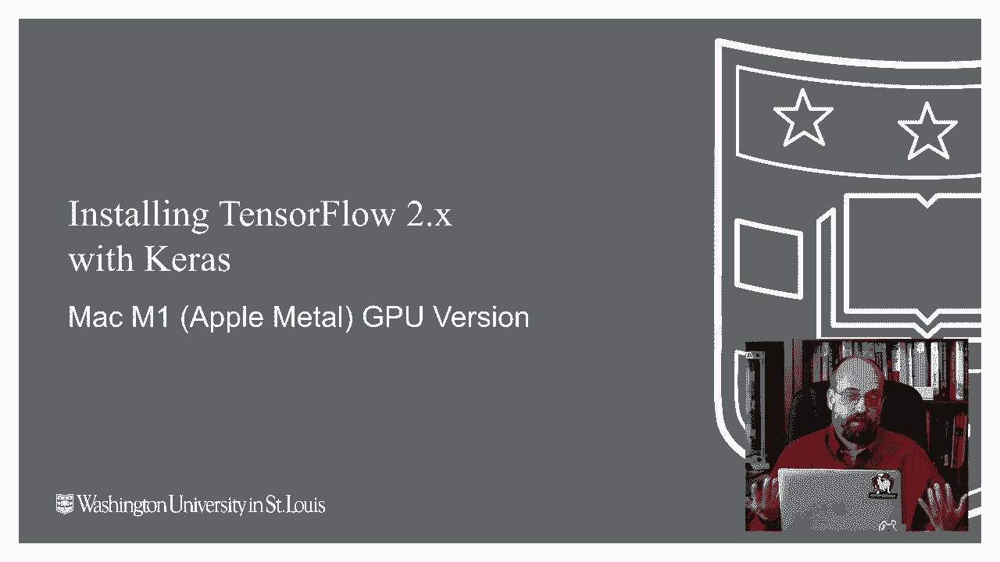

在本节课中，我们将学习如何在搭载 Apple Silicon M1 芯片的 Mac 电脑上，安装运行深度学习课程所需的软件环境，包括 TensorFlow 2.5、Keras 和 Python 3.9。我们将使用 Miniforge 作为包管理工具，并配置 Apple Metal 插件以启用 GPU 加速。

---

## 概述与准备工作

上一节我们介绍了课程的整体情况，本节中我们来看看具体的环境搭建。对于 Apple M1 芯片的 Mac，安装过程与 Intel 芯片的 Mac 或 Windows 电脑有所不同。核心区别在于，为了使用 M1 内置的 GPU 进行加速，我们需要通过 Miniforge 安装专门为 ARM 架构优化的 TensorFlow 版本，而不是使用传统的 Anaconda。

如果你使用的是 Windows 或 Intel Mac，可以参考描述中的其他视频。此外，你也可以选择使用 Google Colab 在线环境来完成整个课程，无需本地安装。

---

## 第一步：安装 Homebrew 🍺

Homebrew 是 macOS 上一个强大的包管理器，类似于 Linux 系统中的 `yum` 或 `apt-get`。我们将通过它来安装后续所需的工具。

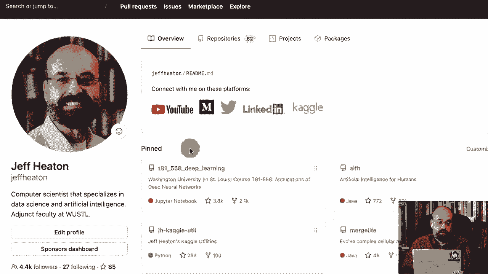

以下是安装 Homebrew 的步骤：

1.  打开终端应用程序。
2.  访问 Homebrew 官网，复制提供的安装命令。
3.  在终端中粘贴并运行该命令。命令类似：
    ```bash
    /bin/bash -c "$(curl -fsSL https://raw.githubusercontent.com/Homebrew/install/HEAD/install.sh)"
    ```
4.  根据提示输入你的电脑密码。安装过程会自动下载并安装 Xcode 命令行工具。

安装完成后，建议关闭并重新打开终端，以确保环境变量正确加载。你可以通过运行 `brew --version` 来验证安装是否成功。

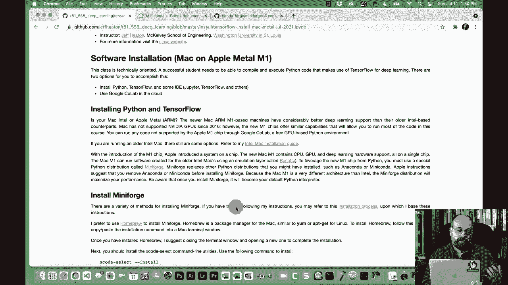

---

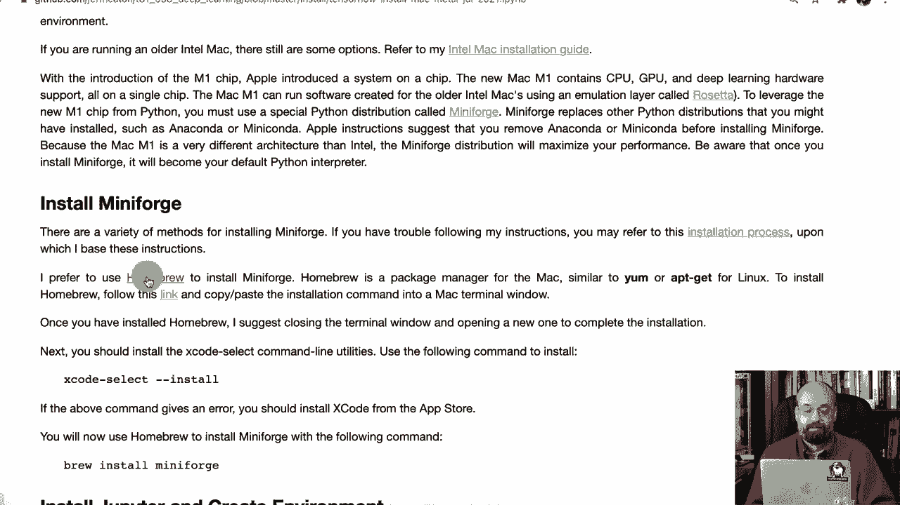

## 第二步：安装 Miniforge

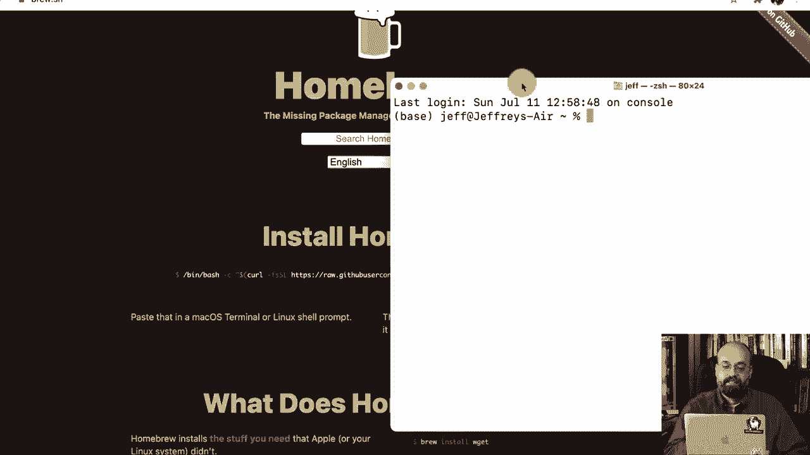

Miniforge 是一个支持多种 CPU 架构（包括 Apple M1）的 Conda 发行版。为了在 M1 上使用 TensorFlow 的 GPU 加速功能，我们需要使用 Miniforge 而不是标准的 Anaconda。

以下是安装 Miniforge 的步骤：

1.  在终端中运行以下命令：
    ```bash
    brew install miniforge
    ```
2.  安装完成后，初始化你的 shell 以使用 Conda。对于默认的 Z shell，通常运行：
    ```bash
    conda init zsh
    ```
    然后重新启动终端。

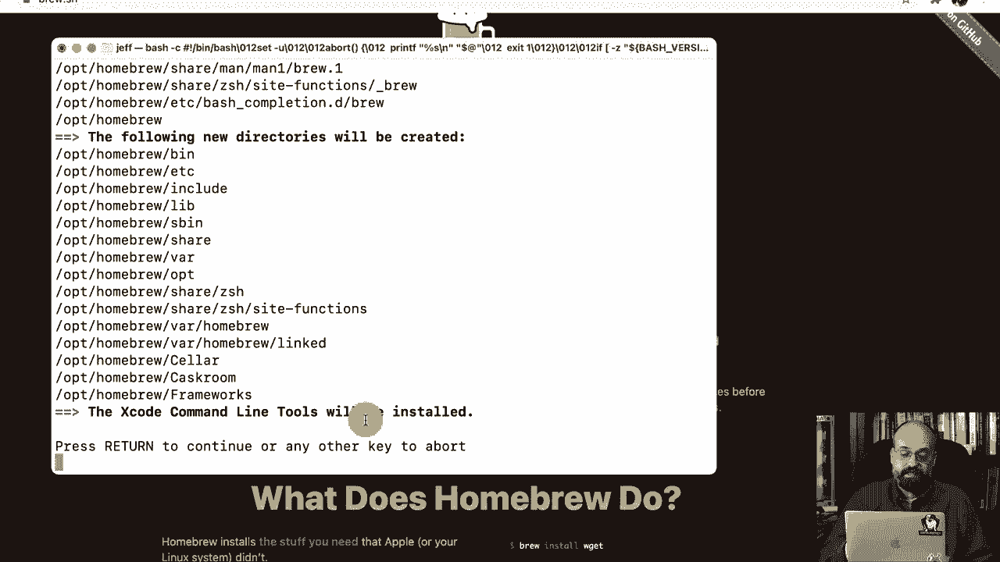

现在，你的基础 Python 环境应该已经切换到了 Miniforge 提供的版本。可以通过运行 `which python` 命令来确认。

---

## 第三步：创建 TensorFlow 环境

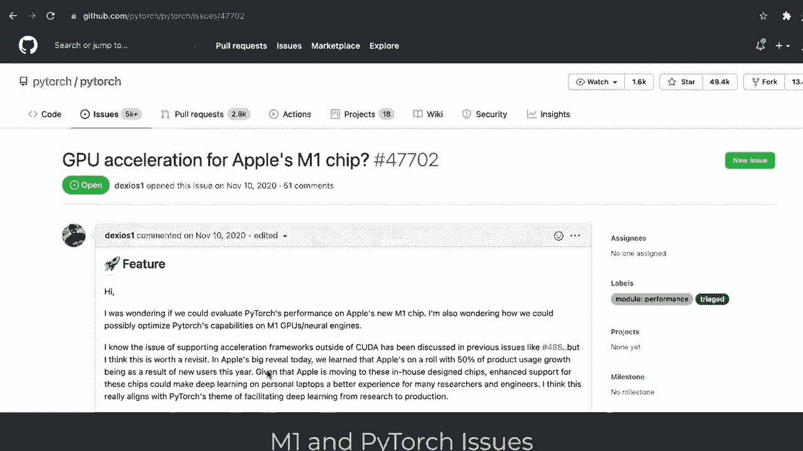

我们将创建一个独立的 Conda 环境，专门用于本课程，并在其中安装所有必要的软件包。

以下是创建环境的步骤：

1.  首先，安装 Jupyter Notebook，这是我们编写和运行代码的主要工具：
    ```bash
    conda install -c conda-forge jupyter
    ```
2.  你需要一个 YAML 配置文件来定义要安装的包。可以从课程网站下载该文件，或使用包含以下核心内容的文件：
    ```yaml
    name: tensorflow
    channels:
      - apple
      - conda-forge
    dependencies:
      - python=3.9
      - pip
      - jupyter
      - scikit-learn
      - pandas
      - tensorflow-deps
      - pip:
        - tensorflow-macos
        - tensorflow-metal
    ```
    假设该文件名为 `environment.yml`。
3.  在终端中，导航到存放 `environment.yml` 文件的目录，然后运行以下命令来创建环境：
    ```bash
    conda env create -f environment.yml
    ```
    这个过程会下载并安装所有依赖，需要一些时间。

---

## 第四步：激活环境并配置 Jupyter

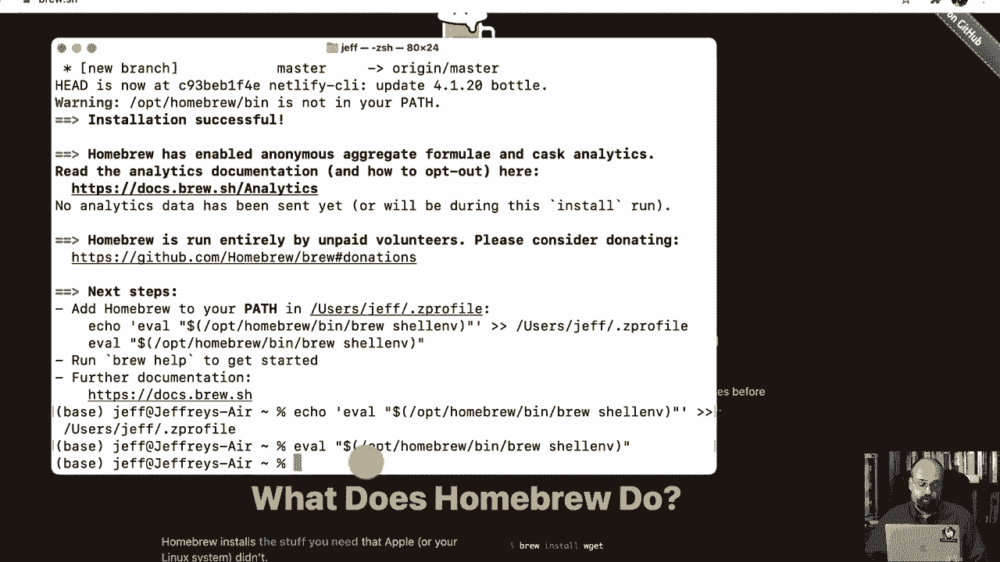

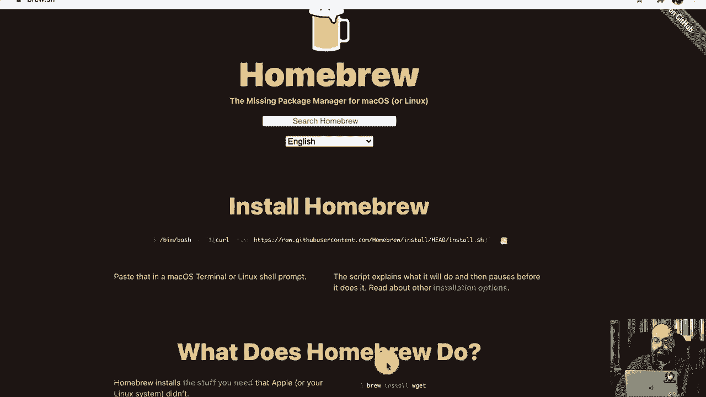

环境创建完成后，需要激活它，并将其内核注册到 Jupyter 中，以便在 Notebook 中使用。

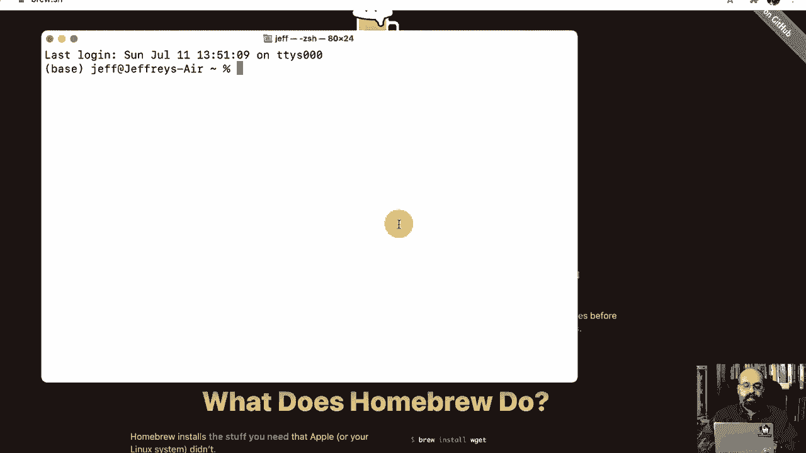

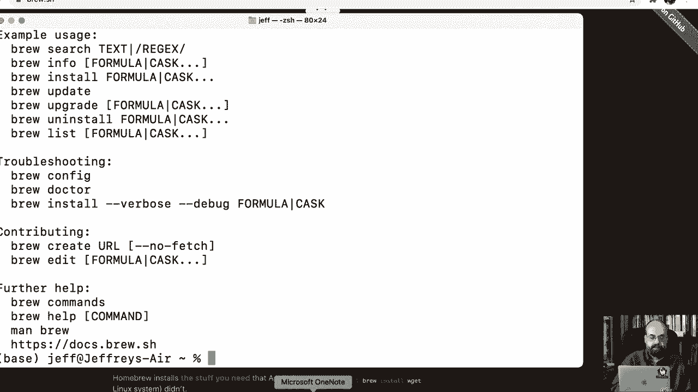

以下是配置步骤：

1.  激活刚刚创建的 TensorFlow 环境：
    ```bash
    conda activate tensorflow
    ```
2.  将该环境的 Python 内核安装到 Jupyter 中：
    ```bash
    python -m ipykernel install --user --name tensorflow --display-name "Python 3.9 (TensorFlow)"
    ```

---

## 第五步：验证安装

现在，让我们验证 TensorFlow 是否安装成功，并且能否识别 Apple M1 的 GPU。

以下是验证步骤：

1.  启动 Jupyter Notebook：
    ```bash
    jupyter notebook
    ```
2.  在 Jupyter 界面中，新建一个 Notebook，并确保右上角的内核选择为 “Python 3.9 (TensorFlow)”。
3.  在第一个单元格中，输入并运行以下测试代码：
    ```python
    import tensorflow as tf

    # 打印 TensorFlow 版本
    print(f"TensorFlow Version: {tf.__version__}")

    # 检查是否能够识别 GPU
    gpu_devices = tf.config.list_physical_devices('GPU')
    if gpu_devices:
        print(f"GPU is available: {gpu_devices}")
        for device in gpu_devices:
            details = tf.config.experimental.get_device_details(device)
            print(f"Device details: {details}")
    else:
        print("GPU is NOT available.")
    ```
4.  如果输出显示 TensorFlow 版本，并提示 “GPU is available” 以及设备信息中包含 “Apple M1”，则说明安装和 GPU 加速配置成功。

运行一个简单的模型（例如，课程材料中的 ResNet 训练示例），并打开“活动监视器”查看 GPU 使用率，可以进一步确认 GPU 正在参与计算。

---

## 注意事项与兼容性说明

上一节我们完成了安装验证，本节中我们来看看一些重要的注意事项。目前，Apple Metal 的生态系统仍在发展中，虽然能支持本课程约 90% 的内容，但存在一些限制：

*   **PyTorch**：在 M1 上的安装和运行可能更为复杂，某些功能可能无法使用。
*   **自定义 CUDA 内核**：一些高级库（例如，某些 StyleGAN2-ADA 的实现）使用了直接编写的 CUDA（C99）内核代码，这些代码与 Apple Metal 不兼容，因此无法在 M1 上运行。

如果你在课程中遇到此类不兼容的代码，建议使用 Google Colab（提供免费的 GPU 资源）来运行。

---

## 总结

本节课中我们一起学习了如何在 Apple Silicon M1 芯片的 Mac 上搭建深度学习开发环境。我们通过 Homebrew 安装了 Miniforge，创建了独立的 Conda 环境，并配置了支持 GPU 加速的 TensorFlow。最后，我们验证了安装结果并了解了当前平台的一些兼容性限制。

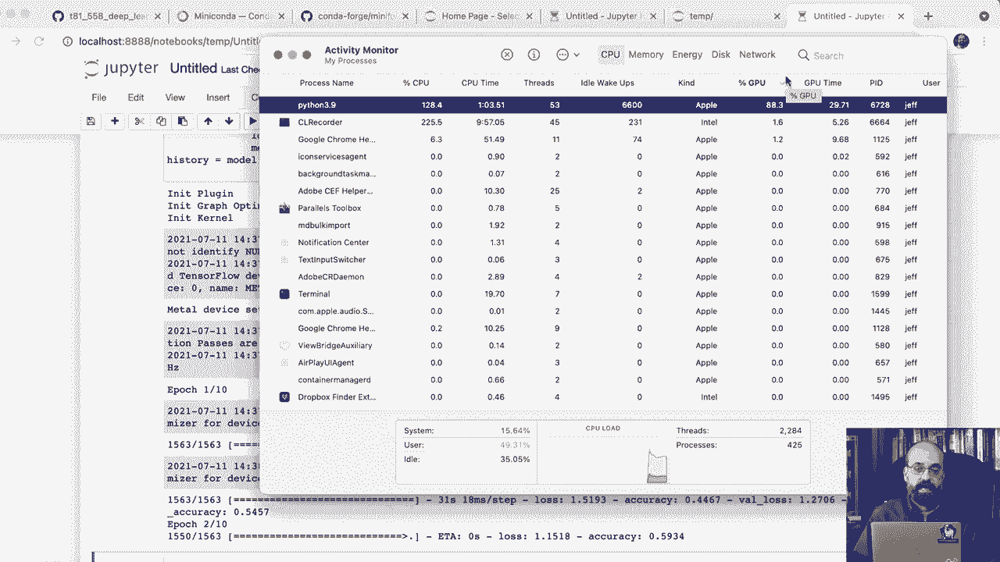

现在，你的 Mac M1 已经准备好运行本课程的大部分实践代码了。如果在安装过程中遇到问题，请参考课程网站上的最新说明或社区讨论。