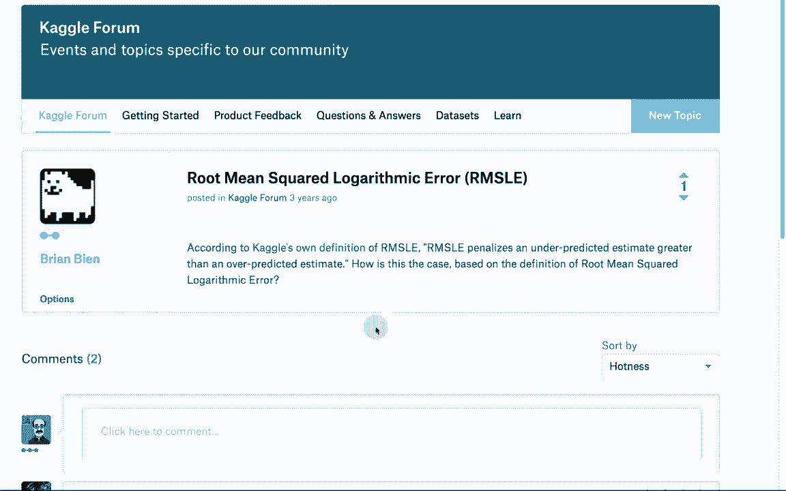
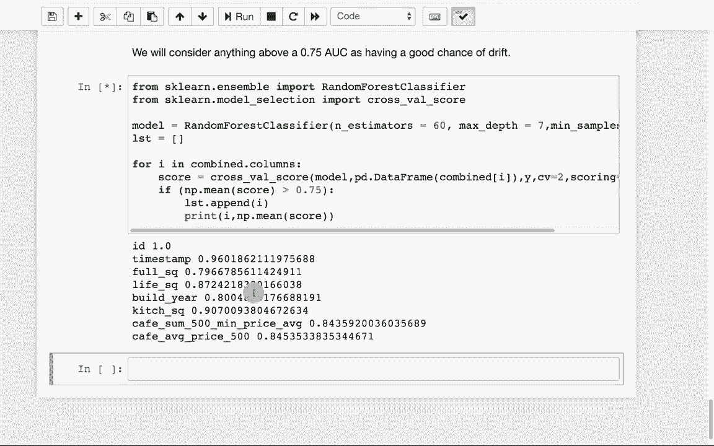

# T81-558 ｜ 深度神经网络应用 - P70：L13.4 - 何时重新训练您的神经网络 🧠

在本节课中，我们将学习一个在生产环境中部署神经网络时至关重要的概念：如何判断模型是否因数据变化而失效，以及何时需要重新训练它。


## 概述 📋

上一节我们讨论了模型的部署。本节中，我们将探讨一个部署后可能遇到的现实问题：模型漂移。当模型投入生产后，其预测所基于的数据分布可能会随时间发生变化，导致模型性能下降。我们将学习如何检测这种变化，并决定何时需要重新训练神经网络。

## 什么是模型漂移？ 🎯

模型漂移，也称为数据漂移或协方差变化，是指模型训练时所使用的数据分布与当前实际遇到的数据分布不一致的现象。这会导致模型在新数据上的预测准确性下降。

一个典型的例子是汽车油耗预测模型。如果模型使用1970年代和1980年代的汽车数据进行训练，那么它很可能无法准确预测现代汽车的油耗，因为汽车技术、材料和驾驶习惯都已发生变化。

在商业应用中，例如人寿保险风险评估，随着整体健康水平提升、吸烟率下降等社会趋势变化，人群的“平均风险”也在变化。这意味着模型的“真实情况”基准发生了改变。

**核心概念**：模型性能依赖于训练数据与预测数据分布的一致性。当分布发生变化（`P_train(X) ≠ P_live(X)`），就可能发生模型漂移。

## 在封闭数据集上观察漂移 🔍

在学术研究或竞赛中，我们常使用封闭数据集，即数据被一次性收集并划分为固定的训练集和测试集。

以下是评估封闭数据集中是否存在漂移的步骤：

1.  **划分数据**：将数据集明确划分为训练集和测试集。
2.  **分析差异**：比较训练集和测试集中特征变量的分布。
3.  **使用K折交叉验证**：通过交叉验证技术来观察模型在不同数据子集上的性能稳定性。

让我们通过一个线性模型的示例图来理解：


*   **蓝色点**代表训练数据。
*   **红色曲线**代表真实的函数关系。
*   **绿色直线**是模型从蓝色训练数据中学到的线性函数。

可以看到，测试数据（出现在时间上稍晚）的分布与训练数据不同，集中在图的右侧。绿色线性模型在训练数据上表现尚可，但在测试数据区域（右侧）则与真实红色曲线偏差很大。这表明数据分布随时间发生了变化，最初的线性模型已不适用，可能需要引入非线性模型或使用新数据重新训练。

## 如何检测漂移？ 🛠️

有多种统计方法可以量化训练数据与新数据（或测试数据）之间的分布差异。我们将重点介绍两种实用技术。

### 方法一：卡方统计量检验

卡方检验可用于比较两个分类变量分布的相似性。在连续数据中，我们通常先将数据分箱（离散化），然后进行比较。

**核心公式/概念**：
卡方统计量计算公式为：
`χ² = Σ [ (观测频数 - 期望频数)² / 期望频数 ]`
P值用于判断差异是否显著。通常，P值低于0.05表示两个分布存在显著差异。

在实际操作中，我们可以对数据集的每一列（特征）分别计算训练集和测试集之间的卡方统计量和P值。

以下是操作思路：



1.  对每个特征列，分别从训练集和测试集中提取数据。
2.  将连续数据分箱，形成频率分布。
3.  计算卡方统计量和对应的P值。
4.  筛选出P值低（如<0.05）且统计量值大的特征，这些特征的分布在训练和测试集间差异显著。

### 方法二：使用分类模型检测

这是一种在Kaggle竞赛中常见的巧妙方法。其核心思想是：如果训练集和测试集的数据分布完全相同，那么我们应该无法区分某个数据样本来自哪个集合。

**操作步骤**：

1.  **标记数据**：给原始训练集的所有样本添加一个标签（例如 `source=0`），给测试集的所有样本添加另一个标签（例如 `source=1`）。
2.  **合并与打乱**：将两个带标签的数据集合并，并彻底打乱顺序。
3.  **构建分类器**：使用这个合并后的数据集训练一个分类模型（如随机森林），目标是预测每个样本的 `source` 标签（即来自训练集还是测试集）。
4.  **评估结果**：
    *   如果分类器的预测性能很差（例如AUC接近0.5），说明它无法区分数据来源，意味着训练集和测试集分布相似，没有严重漂移。
    *   如果分类器预测性能很好（例如AUC远高于0.5，比如超过0.75），则意味着它能够根据特征值有效区分数据来源。这强烈表明训练集和测试集的特征分布存在系统性差异，即发生了数据漂移。

这种方法的好处是，你甚至不需要新数据的真实标签（目标变量），只需特征数据即可进行漂移检测。

## 实战示例：分析Kaggle数据集 📊

为了具体演示，我们使用Kaggle上的“俄罗斯住房市场”数据集。我们将加载训练和测试数据，并进行基本的预处理（如处理缺失值和分类编码）。

以下是检测漂移的核心代码逻辑演示：

```python
# 假设 df_train 和 df_test 是预处理后的训练和测试特征DataFrame（不含目标变量）

# 方法1示例：计算某一列的卡方统计量（需先分箱）
from scipy.stats import chi2_contingency
# 假设‘kitchen_sq’是特征列名
chi2, p, dof, ex = chi2_contingency([df_train[‘kitchen_sq’].value_counts(), df_test[‘kitchen_sq’].value_counts()])
print(f”卡方统计量: {chi2:.4f}, P值: {p:.4f}“)

# 方法2示例：使用分类模型检测
import pandas as pd
from sklearn.ensemble import RandomForestClassifier
from sklearn.metrics import roc_auc_score

# 1. 标记数据源
df_train[‘is_test’] = 0
df_test[‘is_test’] = 1
# 2. 合并与打乱
combined_df = pd.concat([df_train, df_test], ignore_index=True).sample(frac=1).reset_index(drop=True)
# 3. 准备特征X和标签y
X = combined_df.drop(‘is_test’, axis=1)
y = combined_df[‘is_test’]
# 4. 划分训练验证集（此处简化，实际应使用交叉验证）
from sklearn.model_selection import train_test_split
X_train, X_val, y_train, y_val = train_test_split(X, y, test_size=0.3, random_state=42)
# 5. 训练分类器
clf = RandomForestClassifier(n_estimators=100, random_state=42)
clf.fit(X_train, y_train)
# 6. 评估
y_pred_proba = clf.predict_proba(X_val)[:, 1]
auc_score = roc_auc_score(y_val, y_pred_proba)
print(f”检测数据源的模型AUC分数: {auc_score:.4f}“)
# AUC越高（如>0.75），表明漂移可能性越大
```

运行此类分析后，你可能会发现某些特征（如与时间强相关的ID、时间戳）在训练集和测试集之间极易区分，这本身就暗示了采样可能不是时间均匀的，存在漂移风险。

## 总结 🎓

本节课中我们一起学习了模型漂移的概念及其重要性。我们了解到，当模型部署后，真实世界的数据分布可能发生变化，导致模型性能下降。

我们介绍了两种检测漂移的实用方法：
1.  **统计检验法**（如卡方检验）：直接比较特征分布的差异。
2.  **分类模型法**：训练一个模型来区分数据来自旧集合还是新集合，其区分能力暗示了分布差异的程度。

关键在于定期监控。当检测到显著的数据漂移，并且模型在新数据上的性能评估确认下降时，就是考虑收集新数据、重新训练或调整模型的时候了。



通过本节课的学习，你掌握了确保生产环境中神经网络持续有效的重要工具。记住，一个成功的AI应用不仅在于构建模型，更在于对其生命周期的维护。