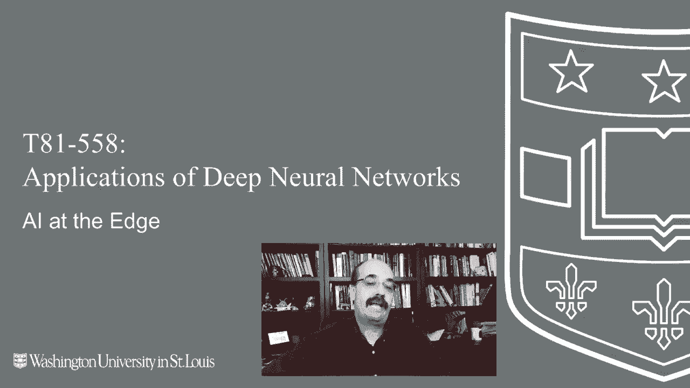
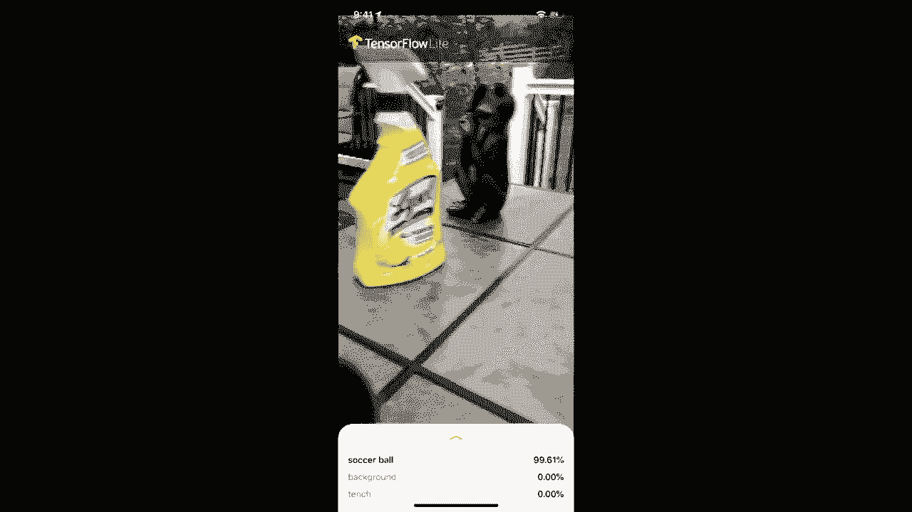
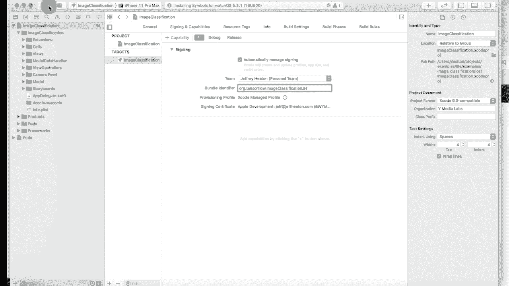
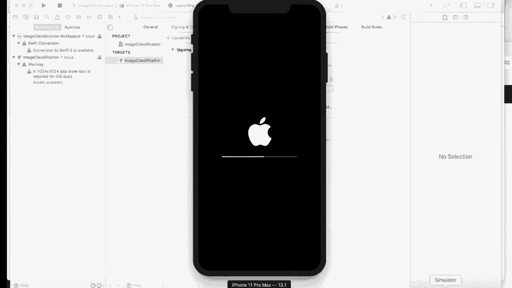
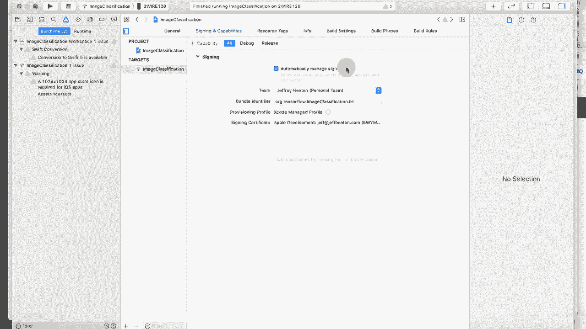
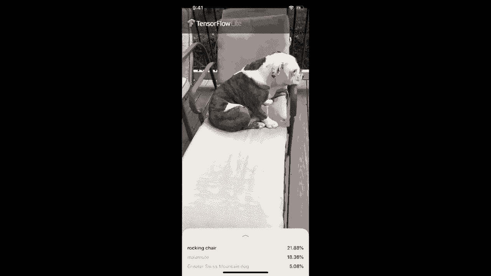

# T81-558 ｜ 深度神经网络应用-P71：L13.5- 用于iOS开发的TensorFlow Lite 📱

在本节课中，我们将学习如何为iOS设备开发一个基于TensorFlow Lite的神经网络应用。我们将了解如何将训练好的模型部署到移动设备上，实现本地推理，并构建一个简单的图像分类应用。



---


## 概述

边缘人工智能是指在设备本地而非云端运行AI模型。本教程将指导你使用TensorFlow Lite在iOS设备上构建一个图像分类应用。我们将涵盖从环境设置到应用运行的全过程。

---

## 环境准备 🛠️

上一节我们介绍了课程目标，本节中我们来看看运行此应用所需的软硬件环境。

以下是运行此应用的前提条件列表：

*   **iOS设备**：需要一部运行iOS 12.0或更高版本的iPhone或iPad，并且设备需配备摄像头。
*   **Mac电脑**：iOS应用开发必须在macOS系统上进行。
*   **Xcode**：需要安装Xcode 10.0或更高版本。这是苹果官方的集成开发环境。
*   **Apple开发者账号**：需要一个有效的Apple ID。若要将应用发布到App Store，则需要付费加入Apple开发者计划，但本教程的本地测试无需付费。
*   **命令行工具**：需要安装Xcode的命令行工具。
*   **CocoaPods**：这是iOS的依赖管理工具，类似于Python的pip，用于安装TensorFlow Lite库。

确保你的Mac已安装Xcode。你可以通过运行以下命令来安装或验证命令行工具：



```bash
xcode-select --install
```

接下来，使用以下命令安装CocoaPods：

```bash
sudo gem install cocoapods
```

---

## 获取并构建示例项目 📦

环境准备就绪后，我们需要获取TensorFlow官方提供的示例代码。

首先，克隆包含所有示例的TensorFlow仓库。打开终端，执行以下命令：

```bash
git clone https://github.com/tensorflow/examples
```

克隆完成后，进入iOS图像分类示例的目录：

```bash
cd examples/lite/examples/image_classification/ios
```

在该目录下，使用CocoaPods安装项目依赖（主要是TensorFlow Lite框架）：

```bash
pod install
```

此命令会读取项目中的`Podfile`文件，并下载安装所需的库。安装完成后，会生成一个`.xcworkspace`文件，这是你接下来要在Xcode中打开的文件。

---

## 在Xcode中配置项目 ⚙️

上一节我们准备好了项目代码，本节中我们将在Xcode中对其进行配置，以便能在真机上运行。

1.  打开Xcode。
2.  选择 `File` -> `Open`，然后导航到之前克隆的示例项目目录，选择 `ImageClassification.xcworkspace` 文件并打开。
3.  在Xcode项目导航器中，点击顶部的项目名称 `ImageClassification`。
4.  在中间的面板中，选择 `ImageClassification` 目标，然后切换到 `Signing & Capabilities` 标签页。
5.  在 `Team` 下拉菜单中，选择你的Apple ID个人团队。如果未列出，请点击 `Add Account` 添加你的Apple ID。
6.  Xcode可能会自动生成一个Bundle Identifier。如果提示冲突，你可以将其修改为唯一值，例如在末尾添加你的名字缩写。

核心的配置步骤是设置**开发团队签名**，这允许你在自己的设备上安装和测试应用。其本质是向系统证明应用的来源。

---

## 在iOS设备上运行应用 ▶️

项目配置完成后，就可以将应用安装到设备上运行了。



1.  使用USB数据线将你的iPhone或iPad连接到Mac。
2.  在Xcode窗口顶部的设备选择区域（靠近运行按钮），将目标从模拟器切换为你连接的iOS设备。
3.  点击左上角的三角形运行按钮（或按 `Cmd + R`）。
4.  首次运行时，可能会在Mac和iOS设备上弹出多次安全提示，要求你输入密码并信任开发者。请根据提示在**Mac和手机**上均完成授权。
5.  应用构建并安装完成后，你可能会在iOS设备上看到“未受信任的开发者”提示。此时需要进入设备的 `设置` -> `通用` -> `设备管理`（或 `VPN与设备管理`），找到你的Apple ID证书，并点击“信任”。



完成上述步骤后，你就能在设备主屏幕上找到并打开名为“TF Classify”的应用了。

---

## 测试图像分类应用 📸

应用成功运行后，让我们来测试它的功能。

打开“TF Classify”应用，界面将直接启动摄像头。将摄像头对准不同的物体，应用会实时显示它识别出的物体名称及置信度。



你可以尝试对以下物品进行分类：
*   咖啡杯
*   足球
*   椅子
*   订书机
*   你的宠物狗（看看它被识别成什么犬种）

该应用使用了在ImageNet数据集上预训练的MobileNet模型。模型通过TensorFlow Lite转换和量化，得以在移动设备上高效运行。其核心推理代码大致遵循以下流程：

```swift
// 伪代码流程
1. 从摄像头捕获一帧图像。
2. 将图像预处理（缩放、归一化）为模型所需的输入格式。
3. 将处理后的数据输入TensorFlow Lite解释器（Interpreter）。
4. 调用解释器进行推理（invoke）。
5. 获取输出层的分类结果。
6. 将结果中置信度最高的类别名称显示在屏幕上。
```

---

## 总结

本节课中我们一起学习了如何为iOS设备部署TensorFlow Lite模型。我们完成了从环境配置、获取示例代码、使用CocoaPods管理依赖、在Xcode中配置项目签名，到在真机上运行和测试图像分类应用的完整流程。



这个过程的关键在于理解**边缘计算**的优势（隐私、实时性、离线可用）以及**TensorFlow Lite**作为跨平台推理框架的作用。虽然本教程以iOS为例，但使用TensorFlow Lite为Android或其他平台开发应用的总体思路是相似的，主要区别在于平台特定的原生开发部分。

如果你想进一步探索，可以访问[TensorFlow Lite官方文档](https://www.tensorflow.org/lite)，了解更多关于模型转换、优化以及为其他平台开发的信息。