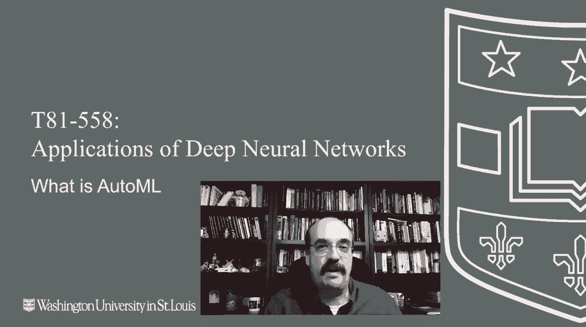
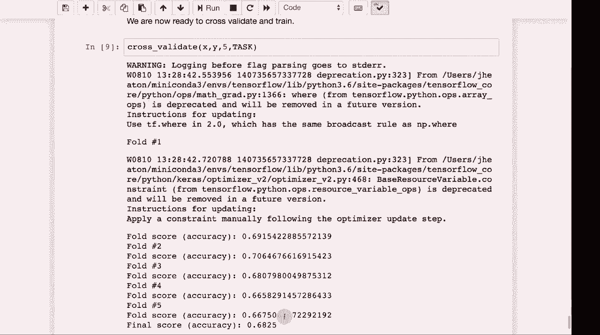

# T81-558 ｜ 深度神经网络应用-P72：L14.1- 用于Keras和TensorFlow的自动机器学习(AutoML) 🚀

在本节课中，我们将要学习自动机器学习（AutoML）的概念，了解其如何简化神经网络模型的构建与调优过程。我们将探讨商业AutoML工具，并动手实现一个简单的AutoML系统。



## 概述

AutoML旨在自动化机器学习工作流中的关键步骤，例如数据预处理、模型选择和超参数调优。本节将介绍AutoML的基本思想，展示一个商业工具的使用示例，并指导你使用Python和Keras构建一个基础的AutoML系统。

## AutoML简介

上一节我们介绍了复杂的模型调优过程。本节中我们来看看如何利用AutoML来简化这些工作。

作为数据科学家，我经常被问到人工智能是否会取代人类工作。答案通常是否定的，我们旨在提供增强工具以帮助人们更好地工作。但如果说“是”能让人感觉好些，那么数据科学家们也在积极尝试用AutoML自动化自身的工作。

AutoML能够自动处理超参数调整，以获取模型的最佳性能。它还能自动处理各种数据类型，使用虚拟变量和其他编码技术将数据转换为神经网络可处理的形式。你只需提供数据，AutoML会自行决定编码方式、选择神经网络架构并开始训练。其核心是使用机器学习来构建机器学习，通常依赖于强大的计算能力。

## 商业AutoML工具

目前市场上有许多商业AutoML产品，它们通常价格昂贵。以下是一些主要的商业解决方案：

*   **RapidMiner**：一个存在时间较长的平台，提供免费版本。
*   **DataRobot**：被认为是AutoML领域的先驱之一，由Kaggle竞赛大师创立。
*   **H2O Driverless AI**：提供强大的自动机器学习功能。
*   **Dataiku**：一个涵盖AutoML的低代码/无代码平台，适合公民数据科学家使用。
*   **Google Cloud AutoML**：谷歌提供的云端AutoML解决方案。

这些工具多为商业闭源产品，对于大型企业可能适用，但对个人或小团队而言成本较高。

## RapidMiner实践演示

我们将以RapidMiner为例，演示商业AutoML工具的基本工作流程。选择RapidMiner并非因其是最佳选择，而是因为它提供可用的免费版本。

首先，在RapidMiner中创建新项目并选择“Auto Model”功能。接着，上传本地数据集（例如一个用于产品分类的示例数据）。指定预测目标（如“产品”列）后，工具会自动分析数据，建议忽略无关特征（如ID列），并尝试多种机器学习模型。

运行完成后，它会展示不同模型的准确率。例如，可能显示深度学习模型在此数据集上获得了最佳性能（约70%的准确率）。你还可以查看模型详情、超参数以及特征相关性分析，从而获得对数据的解释性见解。

## 构建简易Python AutoML系统

了解了商业工具后，我们来看看如何在Python中创建一个简单的AutoML系统。我们将使用Keras和TensorFlow来实现核心功能。

以下是一个简化版的AutoML类结构，它负责自动分析数据并生成预处理流水线：

```python
class SimpleAutoML:
    def __init__(self, config):
        self.config = config
        # 初始化分析器、转换器等

    def analyze(self, data_path):
        # 分析数据：识别类型、缺失值、唯一值等
        # 生成一个控制文件（control.csv），记录如何处理每一列
        pass

    def transform(self, data_path, control_path):
        # 根据控制文件转换数据（如虚拟编码、标准化）
        # 返回处理后的特征向量
        pass

    def build_model(self, input_dim, output_type):
        # 根据输入维度和问题类型（分类/回归）自动构建神经网络模型
        if output_type == 'classification':
            model = Sequential([
                Dense(128, activation='relu', input_dim=input_dim),
                Dropout(0.2),
                Dense(64, activation='relu'),
                Dense(num_classes, activation='softmax')
            ])
            model.compile(optimizer='adam', loss='categorical_crossentropy', metrics=['accuracy'])
        # ... 回归模型构建
        return model
```

### 系统工作流程

以下是该简易AutoML系统的主要步骤：

1.  **数据分析**：系统首先读取数据，分析每一列的数据类型（分类或数值）、唯一值数量、缺失值情况，并生成一个`control.csv`文件。该文件记录了每条列的建议处理方式（例如，对某列进行Z-score标准化，对另一列进行独热编码）。
2.  **数据转换**：根据`control.csv`的指导，系统自动对原始数据进行转换，生成可供神经网络直接处理的数值型特征向量。
3.  **模型构建与训练**：系统根据转换后的数据维度及目标变量类型（分类或回归），自动构建一个合适的Keras神经网络模型，并进行交叉验证训练。
4.  **性能评估**：训练完成后，系统输出模型在验证集上的性能指标（如准确率）。

运行此系统在一个示例数据集上，其自动预处理和建模流程能够达到接近商业工具RapidMiner免费版本的性能（准确率略低几个百分点），但优势在于完全免费、可定制且不受使用限制。

## 总结



本节课中我们一起学习了自动机器学习（AutoML）的核心概念。我们了解到AutoML可以自动化数据预处理、模型选择和调优等繁琐任务。通过演示RapidMiner，我们看到了商业AutoML工具的强大与便捷。最后，我们动手实现了一个简易的Python AutoML系统，它展示了自动数据分析、转换和模型构建的基本原理。虽然简易，但该系统体现了AutoML的核心思想，为理解更复杂的自动化流程奠定了基础。