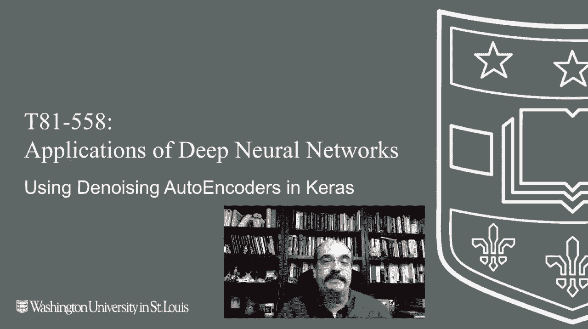
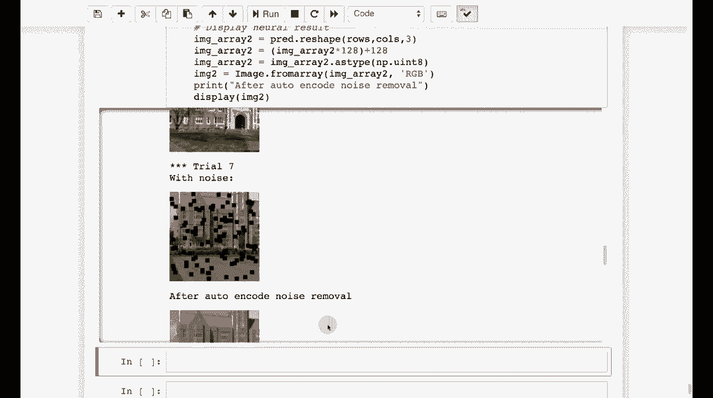

# T81-558 ｜ 深度神经网络应用-P73：L14.2- 在Keras中使用去噪自动编码器 🧠

在本节课中，我们将学习自编码器，特别是去噪自编码器。自编码器是一种特殊的神经网络，能够学习数据的压缩表示，并用于重建数据。去噪自编码器则更进一步，它能从被噪声破坏的输入中恢复出原始、干净的信号。我们将从基础概念开始，逐步构建一个能够处理图像的去噪自编码器。

---



## 1. 函数逼近与回归 📈

上一节我们介绍了神经网络的基础。本节中，我们来看看一个具体的应用：函数逼近，这本质上是一种回归任务。

我们将定义一个简单的正弦函数，并训练一个神经网络来逼近它。以下是核心代码：

```python
# 示例：使用神经网络逼近正弦函数
model = Sequential()
model.add(Dense(10, input_dim=1, activation='relu'))
model.add(Dense(1))
model.compile(loss='mean_squared_error', optimizer='adam')
# 使用正弦波数据 (x, sin(x)) 进行训练
```

运行训练后，神经网络能够很好地跟踪正弦波。即使在期望值中加入少量噪声，预测值与实际值依然非常接近。这展示了神经网络强大的函数拟合能力。

---

## 2. 多输出回归 🔄

理解了单输出回归后，我们进一步探讨多输出回归。这对于理解自编码器至关重要，因为自编码器通常要求输出与输入维度相同。

自编码器的核心思想是：**输入的数量与输出的数量相匹配**。神经网络被训练来重现其输入。以下是构建一个简单自编码器的思路：

```python
# 自编码器结构示例：输入层 -> 编码层（压缩） -> 解码层（重建）
input_data = Input(shape=(input_dim,))
encoded = Dense(encoding_dim, activation='relu')(input_data) # 压缩层
decoded = Dense(input_dim, activation='sigmoid')(encoded) # 重建层
autoencoder = Model(input_data, decoded)
```

我们训练这个网络，输入是随机数字（例如0到9），期望输出是相同的数字。网络通过一个狭窄的“瓶颈”层（如两个神经元）学习压缩和重建信息。训练后，它能够成功地将输入重建出来。

---

## 3. 自编码器在图像上的应用 🖼️

通常，自编码器被用于处理图像数据，学习图像的有效压缩表示。

以下是处理流程：
1.  **加载与标准化图像**：确保所有图像尺寸一致（如128x128），并进行像素值归一化。
2.  **构建自编码器**：输入是图像像素向量，输出是重建的图像像素向量。中间层进行高度压缩。
3.  **训练**：目标是让输出图像尽可能接近输入图像。

通过训练，自编码器学会了仅用少量数值（编码）来表征一张图像，并能据此重建出有意义的图像。

---

## 4. 去噪自动编码器 🧹

现在，我们进入本节课的核心：去噪自动编码器。它的目标不是简单地重建输入，而是从被噪声污染的输入中恢复出原始数据。

**工作原理**：
*   **训练数据**：输入是带有噪声（如随机遮挡框）的图像，而期望输出是原始的、干净的图像。
*   **网络学习**：通过这种训练，网络学会了识别并过滤掉噪声模式，重建出未被破坏的内容。

以下是关键步骤的简述：
```python
# 概念流程：使用噪声图像作为输入，干净图像作为目标进行训练
noisy_images = add_random_noise(clean_images) # 添加噪声
autoencoder.fit(noisy_images, clean_images, epochs=50) # 训练去噪
reconstructed_images = autoencoder.predict(noisy_test_images) # 去噪预测
```

运行训练后，即使输入图像被严重遮挡，去噪自编码器也能输出一个清晰、接近原始图像的版本。虽然在一些细节上可能存在轻微失真，但其去噪效果非常显著。

---

## 总结 📝

本节课中我们一起学习了自编码器的核心概念与应用。我们从基础的函数逼近和**多输出回归**入手，理解了自编码器**输入与输出维度相同**的基本结构。随后，我们将其应用于图像数据，学习了数据压缩与重建。最后，我们重点探讨了**去噪自动编码器**，它通过接受带噪声的输入并学习重建原始数据，从而获得了强大的去噪能力。



自编码器的用途非常广泛，在下一部分，我们将探讨如何利用它们进行异常检测。