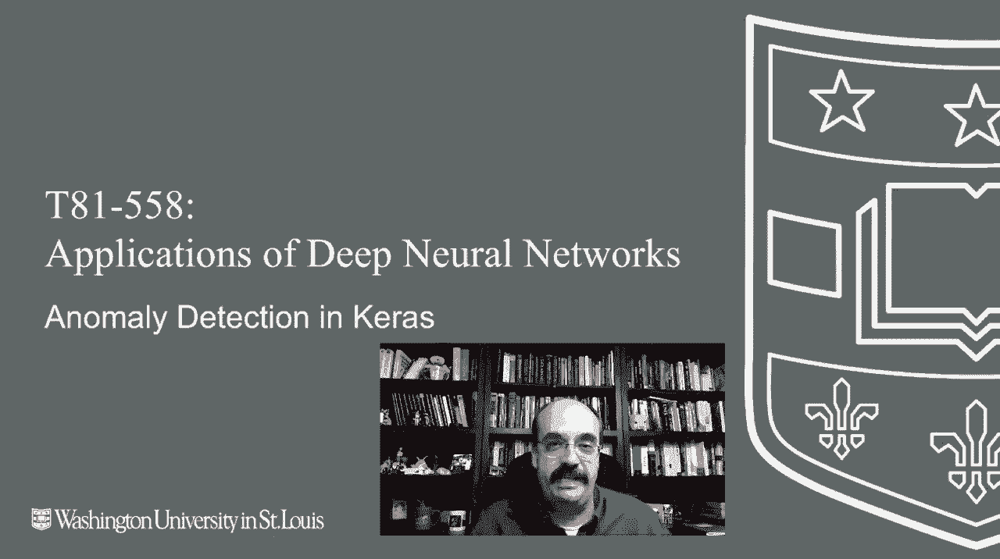
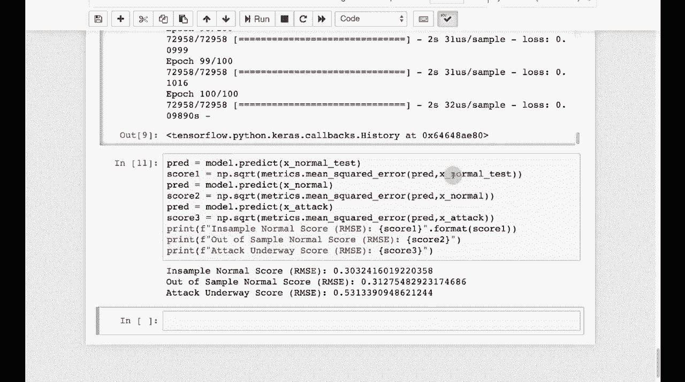

# T81-558 ｜ 深度神经网络应用-P74：L14.3- 使用自动编码器在Keras中进行异常检测 🕵️♂️

在本节课中，我们将学习如何使用自动编码器进行异常检测。异常检测旨在识别不符合预期模式的数据，这在计算机安全等领域有广泛应用。我们将使用KDD99数据集，通过构建一个自动编码器模型，来区分正常网络流量和攻击流量。

## 概述

我们将利用自动编码器的重构误差来检测异常。其核心思想是：一个在正常数据上训练好的自动编码器，能够以较小的误差重构正常数据，而对于异常的、未见过的数据，其重构误差会显著增大。



## 数据集介绍

我们使用的数据集是KDD99。这是一个发布于1999年的网络入侵检测数据集，虽然年代较久，但数据规模适中、特征丰富，非常适合用于教学和原理演示。


数据集包含多种模拟攻击类型，如缓冲区溢出、FTP攻击、密码猜测等。我们的目标是将“正常”流量与所有这些“攻击”流量区分开来。

## 数据预处理

在构建模型之前，我们需要对数据进行预处理。以下是主要的处理步骤：

我们定义了两个函数来帮助预处理数据：一个用于对数值特征进行Z-score标准化，另一个用于对分类特征进行独热编码。

```python
# 示例：数据预处理步骤
def encode_zscore(df, columns):
    # Z-score标准化逻辑
    pass

def encode_dummy(df, columns):
    # 独热编码逻辑
    pass
```

处理完成后，我们移除了包含NaN值的行，并将数据根据“结果”标签分离为“正常”数据和“攻击”数据。

## 构建自动编码器模型

上一节我们介绍了数据集和预处理，本节中我们来看看如何构建用于异常检测的自动编码器。

自动编码器是一种特殊的神经网络，其目标是学习输入数据的压缩表示（编码），并尽可能准确地重构原始输入（解码）。其结构通常呈“沙漏”形，中间有一个“瓶颈”层。

**核心公式**：自动编码器的目标是最小化重构误差，例如均方误差（MSE）：
`Loss = MSE(X, X') = 1/n * Σ (X_i - X'_i)^2`
其中 `X` 是原始输入，`X'` 是重构输出。

我们的模型结构如下：输入层 -> 隐藏层1（25个神经元）-> 隐藏层2（25个神经元）-> 瓶颈层（3个神经元）-> 隐藏层3（25个神经元）-> 输出层。我们仅在“正常”数据上训练这个模型。

```python
# 示例：Keras中的自动编码器模型结构
from keras.models import Sequential
from keras.layers import Dense

model = Sequential()
model.add(Dense(25, activation='relu', input_dim=input_dim))
model.add(Dense(25, activation='relu'))
model.add(Dense(3, activation='relu')) # 瓶颈层
model.add(Dense(25, activation='relu'))
model.add(Dense(25, activation='relu'))
model.add(Dense(output_dim, activation='sigmoid'))
model.compile(optimizer='adam', loss='mse')
```

## 模型训练与异常检测原理

模型训练完成后，我们用它来对数据进行预测。检测异常的原理基于重构误差：对于训练过的正常数据，重构误差较小；对于未见过或不同的攻击数据，重构误差会变大。

这类似于早期手机语音压缩的原理：压缩算法针对人声优化，能高质量重构人声。但如果输入音乐等异常声音，重构质量就会变差，产生失真。这种“失真”就是异常信号。

## 评估结果

现在，让我们在测试集上评估模型的效果。

我们分别在正常测试数据和攻击测试数据上进行预测，并计算它们的均方根误差（RMSE）。

以下是评估步骤的概要：

1.  对正常测试集进行预测，计算RMSE。
2.  对攻击测试集进行预测，计算RMSE。
3.  比较两者的RMSE值。

运行评估后，我们发现正常数据的RMSE较低（约0.3），而攻击数据的RMSE显著更高。这证实了我们的自动编码器能够有效区分正常与异常流量。



## 总结


本节课中我们一起学习了如何使用自动编码器进行异常检测。我们介绍了KDD99数据集，完成了数据预处理，构建并训练了一个具有“瓶颈”结构的自动编码器模型。关键点在于，我们仅在正常数据上训练模型，并利用模型对输入数据重构误差的大小来判定其是否异常。这种方法不仅适用于网络安全，也可用于监控系统状态、识别金融欺诈等众多需要发现“不同寻常”模式的场景。