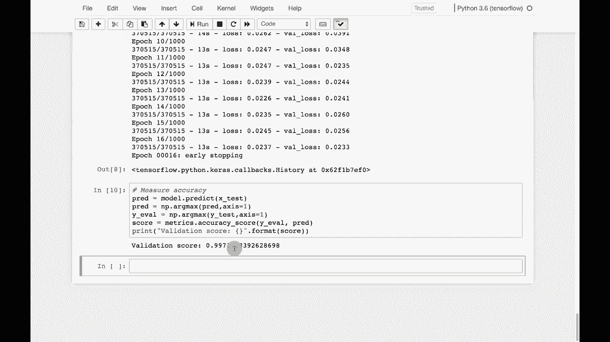

# T81-558 ｜ 深度神经网络应用 - P75：L14.4 - 使用 Keras 训练入侵检测系统（KDD99） 🛡️

在本节课中，我们将学习如何使用 Keras 构建一个入侵检测系统。我们将使用经典的 KDD99 数据集，通过神经网络模型来区分正常网络连接和不同类型的网络攻击。

---

## 概述

入侵检测系统是网络安全的重要组成部分。本节我们将利用 KDD99 数据集，演示如何从数据加载、预处理到训练一个神经网络分类器的完整流程。我们将重点关注数据编码和模型构建的关键步骤。

---

## 数据集介绍：KDD99

上一节我们介绍了入侵检测的概念，本节中我们来看看我们将要使用的数据集。KDD99 数据集是 1999 年发布的一个网络安全基准数据集，常用于异常检测和入侵检测研究。

请注意，该数据集已有约 20 年历史。攻击手段在过去 20 年中可能已经发生变化。因此，本教程主要将其作为一个演示机器学习流程的经典示例，而非用于构建当前实际可用的安全系统。


## 数据加载与初步分析

首先，我们需要加载数据。由于版权原因，数据无法直接内置在代码中。如果你在使用 Google Colab，需要自行下载并加载该数据集。

以下是加载数据并显示前几行的示例代码：
```python
import pandas as pd
# 假设数据文件为 'kddcup.data_10_percent.gz'
df = pd.read_csv('kddcup.data_10_percent.gz', header=None)
print(df.head())
```
输出将展示数据的前几行，其内容呈现典型的 TCP/IP 网络连接特征。

为了理解数据结构和特征类型，我们可以运行一个分析脚本来获得概览。这对后续的特征工程至关重要。

以下是用于初步数据分析的代码示例：
```python
def analyze_dataset(df):
    for col in df.columns:
        print(f"Column: {col}")
        print(f"Unique values: {df[col].nunique()}")
        # 计算最常见值的占比
        if df[col].nunique() < 20:
            top_val = df[col].value_counts().iloc[0]
            top_pct = (top_val / len(df)) * 100
            print(f"Most common value accounts for {top_pct:.2f}%")
        print("-" * 30)
```
分析结果会显示，例如“协议类型”特征中，ICMP 约占 57%，TCP 约占 38%。而像“源字节”这样的特征，重复值占比为 0%，表明它是一个连续型特征。

这个分析帮助我们区分哪些特征是分类变量（取值有限），哪些是连续变量（取值多样），为下一步的编码工作提供指导。

## 数据预处理与特征编码

在了解了数据特征后，我们需要对其进行编码，以便神经网络能够处理。我们将采用两种编码方式：对分类特征进行独热编码，对连续特征进行 Z-score 标准化。

以下是两个核心的编码函数：
```python
from sklearn.preprocessing import StandardScaler
import pandas as pd

def encode_text_dummy(df, name):
    """对指定列进行独热编码"""
    dummies = pd.get_dummies(df[name])
    for x in dummies.columns:
        dummy_name = f"{name}-{x}"
        df[dummy_name] = dummies[x]
    df.drop(name, axis=1, inplace=True)
    return df

def encode_numeric_zscore(df, name):
    """对指定列进行Z-score标准化"""
    mean = df[name].mean()
    sd = df[name].std()
    df[name] = (df[name] - mean) / sd
    return df
```
在实际操作中，我们会遍历所有特征列，根据其类型（分类或连续）调用相应的函数。这会将原始数据转换为数值型的特征向量。

对于需要高精度的实际项目，特征工程通常会更复杂和具有创新性。这里的编码是基础的第一步。

## 构建与训练神经网络

数据准备就绪后，我们就可以构建神经网络模型了。我们的目标是预测连接的“结果”标签，即判断它是“正常”连接还是具体的某种攻击类型（如 Smurf, Neptune 等）。

我们将使用分类交叉熵作为损失函数，因为它适用于多分类问题。

以下是使用 Keras 构建和训练模型的示例代码：
```python
from tensorflow.keras.models import Sequential
from tensorflow.keras.layers import Dense, Dropout

model = Sequential()
model.add(Dense(128, input_dim=x_train.shape[1], activation='relu'))
model.add(Dropout(0.5))
model.add(Dense(64, activation='relu'))
model.add(Dense(y_train.shape[1], activation='softmax')) # 输出层，神经元数等于类别数

model.compile(loss='categorical_crossentropy', optimizer='adam', metrics=['accuracy'])
history = model.fit(x_train, y_train, validation_data=(x_val, y_val), epochs=10, batch_size=128)
```
训练过程需要一些时间。训练完成后，我们可以在测试集上评估模型的性能。

## 模型评估与结果分析

神经网络训练完毕后，我们可以测量其准确性。在 KDD99 数据集上，通常很容易获得很高的准确率，例如 0.997（99.7%）。

这是因为该数据集经过长期研究，不同类别之间的区分度已经非常明显。即使在 2019 年，仍有学术论文讨论如何在该数据集上达到 99% 以上的准确率。

这提醒我们，KDD99 更多地是作为一个教学和算法验证的示例数据集。它展示了入侵检测系统的基本构建方法，但在实际部署时，需要使用更新、更贴近当前威胁环境的数据。

---

## 总结

本节课中，我们一起学习了使用 Keras 和 KDD99 数据集构建入侵检测系统的完整流程。



我们首先介绍了 KDD99 数据集的历史和局限性。接着，我们演示了如何加载数据并进行初步分析，以区分特征类型。然后，我们使用独热编码和 Z-score 标准化对数据进行预处理。最后，我们构建了一个神经网络模型，对其进行训练，并评估了其在高区分度数据集上所能达到的优秀性能。

通过这个示例，你掌握了将原始网络数据转化为可用于神经网络训练的特征向量，并构建一个分类模型的核心步骤。这对于理解机器学习在网络安全领域的应用是一个很好的起点。