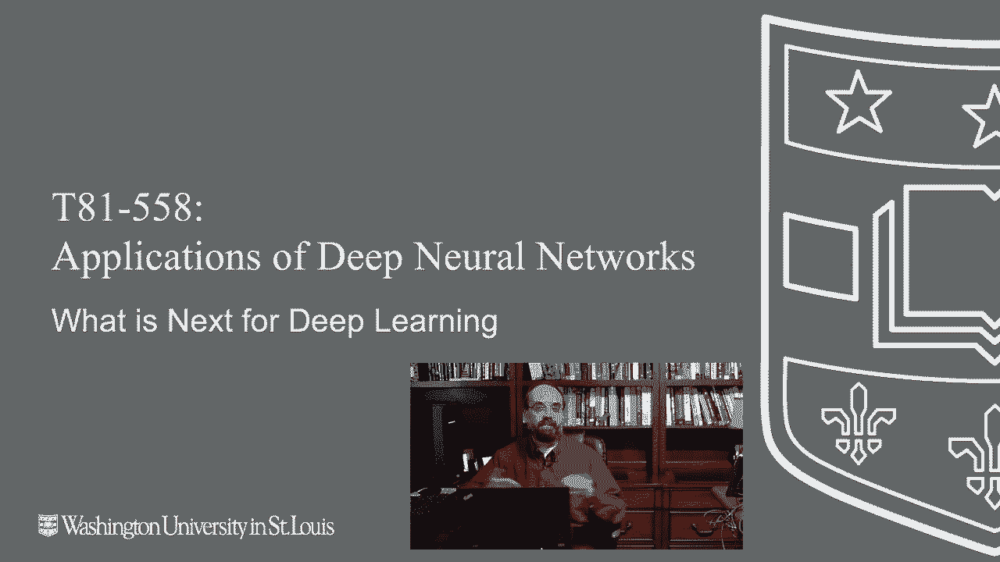
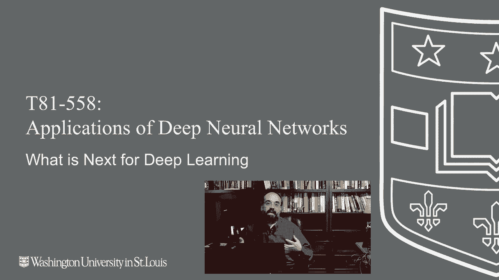
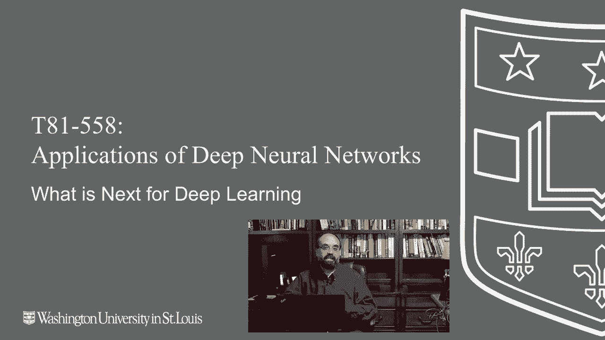

# T81-558 ｜ 深度神经网络应用 - P76：L14.5 - 新深度学习技术介绍 🚀



在本节课中，我们将探讨深度学习领域的新兴技术与发展方向，并为你完成本课程后的学习路径提供建议。



---



## 概述 📋

恭喜你完成了本课程的最后一个模块。在本节中，我们将讨论如何应用已学到的深度学习知识，并介绍一些值得关注的新技术和未来趋势。

---

## 持续学习与内容更新 🔄

上一节我们完成了核心课程内容，本节中我们来看看如何保持知识的更新。

我鼓励你订阅我的YouTube频道。你已经完成了这门课程，可以观看我发布的、基于本课程材料的进阶应用视频。我也会发布新视频来更新课程的部分内容。

这门课程会定期更新。每当有视频被更换，你会收到更新通知。这样你就能了解我认为值得加入课程的新深度学习技术。

你可以在GitHub或YouTube频道上关注我，以便及时获取更改或新增内容。我每年至少会重新录制一次关于“新技术雷达”的这部分内容。

本课程每学期运行一次，因此我每隔一个学期就会尝试更新“下一步是什么”以及我雷达上的技术，因为深度学习领域的变化非常迅速。

---

## 当前值得关注的新技术 🎯

以下是目前在我技术雷达上的一些重要方向。

### 1. Transformer 模型

在本课程中，对Transformer的覆盖可能不足。这是一项你需要熟悉的技术，尤其如果你对自然语言处理感兴趣。尽管它也开始在计算机视觉领域取得进展。

Transformer的核心标志是**序列到序列**（Sequence-to-Sequence）建模。模型接受一个序列并输出另一个序列。序列是可变长度的向量，可以是字符、单词或一系列图像。

随着计算能力的增强，我们可能会看到更强大的**视频到视频**的转换应用。虽然深度伪造（Deepfake）技术并非完全使用Transformer，但可被视为同类技术。

例如，你可以给Transformer一个英语句子列表和一个法语句子列表，它将学习如何进行翻译。其核心注意力机制可表示为：

**公式：** `Attention(Q, K, V) = softmax(QK^T / sqrt(d_k)) V`

### 2. 更高级的迁移学习

本课程已经涵盖了迁移学习，这是一个非常重要的主题。通常，我们讨论的是引入一个预训练神经网络，进行微调，并添加一些新层。

关键是找到已经预训练好的模型，从而避免高昂的训练成本。一些最先进的神经网络是在拥有1024个GPU的阵列上训练的，训练费用可能高达25万美元。因此，站在“巨人肩膀上”至关重要。

我建议你关注两个资源：
*   **Hugging Face**：提供可直接导入Python使用的预训练模型，主要用于自然语言处理。
*   **NVIDIA GPU Cloud (NGC)**：包含许多可用于各种目的的迁移学习模型。

未来，我们可能会看到多个神经网络串联工作，构建出更复杂的个人助理系统。

### 3. 数据增强技术

数据增强技术极大地推动了计算机视觉的发展。你可以使用Keras中的`ImageDataGenerator`来处理图像。

**代码示例（Keras）：**
```python
from tensorflow.keras.preprocessing.image import ImageDataGenerator
datagen = ImageDataGenerator(rotation_range=40,
                             width_shift_range=0.2,
                             horizontal_flip=True)
```
生成器可以翻转、旋转、改变图像颜色等，从而生成训练集中不存在的额外训练数据。

最近发布的一些技术（如NVIDIA的StyleGAN2 ADA）利用增强技术为鉴别器提供更多图像，用于在生成器学习创建假图像时使用。

### 4. 超越TF-Agents的强化学习

本课程使用TF-Agents来教授强化学习，主要是因为它与TensorFlow无缝集成。

然而，我推荐你关注**Stable-Baselines3**。当TF-Agents的某些示例（如Atari游戏示例）可能无法正常工作时，Stable-Baselines3通常可以直接运行，并提供良好的入门示例。它的接口更简单，无需暴露太多内部细节，这对于入门课程来说更合适。

---

## 编程语言生态的观察 💻

目前，Python在机器学习和深度学习领域占据主导地位，数据科学领域也是如此。

但其他语言正在逐渐侵蚀Python的领地。历史表明，主流编程语言会变迁。Python最终可能像COBOL或Java一样，成为某个时代的“主流”语言。

其他值得关注的语言包括：
*   **Go**：作为Python在实际机器学习应用中的潜在替代品，最令我感兴趣。
*   **Julia**：为科学计算和高性能而设计。
*   **Swift**：虽然主要被视为移动开发语言，但在机器学习领域也有一定兴趣。

Python很可能在未来一段时间内仍是机器学习的核心语言，但这个“一段时间”在快速变化的机器学习领域可能并不长。

对于应用开发，可以考虑以下语言方向：
*   **iOS应用开发**：Swift。
*   **Android应用开发**：Kotlin或Java。
*   **网页开发**：Node.js和JavaScript（前端无法避免JavaScript）。
*   **跨平台桌面应用**：使用Electron或React Native的JavaScript（例如VS Code就是基于Electron开发的）。

在所有这些语言中，除了Python，我最感兴趣的是**JavaScript**（以及服务器端的**Node.js**）。

---

## 关于PyTorch与TensorFlow的讨论 ⚖️

本课程使用TensorFlow和Keras教学。关于选择TensorFlow还是PyTorch，在机器学习社区中存在类似“宗教辩论”的激烈讨论。

我创建这个TensorFlow课程主要有两个原因：
1.  2016年我创建此课程时，PyTorch还不存在（或未普及）。
2.  PyTorch需要编写更多的底层代码（如训练循环），感觉更像机器学习框架中的“Java”，提供了极大的灵活性和微调能力，这也是它在研究领域取得显著进展的原因。

**代码对比示例（简化）：**
```python
# TensorFlow/Keras 风格 (简化)
model.compile(optimizer='adam', loss='categorical_crossentropy')
model.fit(x_train, y_train, epochs=10)

# PyTorch 风格 (简化)
optimizer = torch.optim.Adam(model.parameters())
for epoch in range(10):
    # ... 手动编写训练循环 ...
    loss = criterion(outputs, labels)
    optimizer.zero_grad()
    loss.backward()
    optimizer.step()
```

我认为两者将继续竞争。对我而言，切换到PyTorch需要等到我觉得其中一个明显落后。回顾2008年，我曾坚定选择Java进行机器学习，后来完全转向了Python。技术选择会随着生态发展而变化。

---

## 实用工具与职业建议 🛠️

接下来，我们看看一些能帮助你进一步发展的实用工具和职业建议。

### Google Colab Pro

我推荐使用**Google Colab Pro**。它让我能够使用V100 NVIDIA GPU。对于运行几个小时的临时任务，这种灵活性非常有用，无需占用本地正在进行长时间训练的RTX GPU。我与Google并无关联，但非常喜欢这个工具。

### 专业认证与技能展示

你可以考虑获取**TensorFlow认证**，作为向雇主展示你已掌握该技术的凭证。此外，完成Coursera等平台的课程也可以丰富你的简历。

建立并完善你的**LinkedIn个人资料**非常重要。

### 积累实践经验

对于招聘者而言，实际项目经验非常有分量。我建议你：
*   **寻找实习机会**，获取实际知识。
*   **参与项目**，将理论应用于实践。
*   **参加感兴趣的Kaggle竞赛**。
*   **将你的作品推送到GitHub**。
*   **获得特定领域的知识**。

许多人完成了数据科学课程，但缺乏真实世界的项目经验。自己承担项目、研究特定领域并学习如何将理论应用于真实数据，会极大地提升你的竞争力。

---

## 总结 🎓

本节课中，我们一起探讨了深度学习的新兴技术，包括Transformer、高级迁移学习、数据增强和强化学习的新工具。我们还讨论了编程语言的发展趋势以及TensorFlow与PyTorch的选择。最后，我们提供了一些实用工具推荐和职业发展建议，鼓励你通过实践项目来巩固和深化知识。

感谢你跟随本课程学习。无论你在深度学习和机器学习旅程中的下一步是什么，我都祝你一切顺利。如果你有任何想法，例如是否应将本课程改为PyTorch，或者你最喜欢哪些新技术，欢迎在评论区告诉我。请记得订阅频道，并在GitHub和Twitter上关注我，以获取最新动态。