# T81-558 ｜ 深度神经网络应用 - P8：使用 CONDA 安装 TensorFlow/Keras (CPU/GPU 版本) 🛠️

在本节课中，我们将学习如何在自己的计算机上安装 Python、TensorFlow 和 Keras 环境。这对于运行课程示例和完成作业至关重要。我们将分别介绍 CPU 版本和 GPU 版本的安装流程，并利用 Anaconda (Miniconda) 来简化环境管理。

如果你不熟悉命令行操作，或者不想在本地安装复杂软件，也可以选择使用 **Google Colab** 在线平台，它同样提供 GPU 支持。

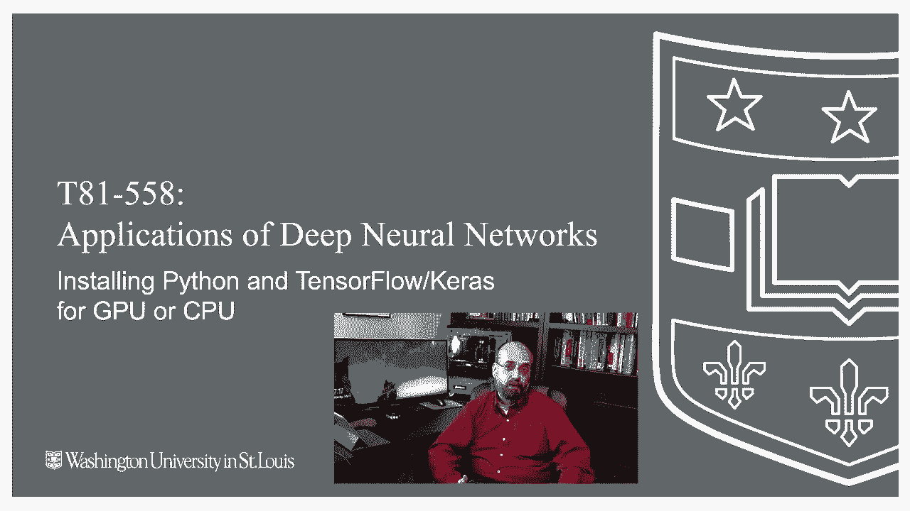

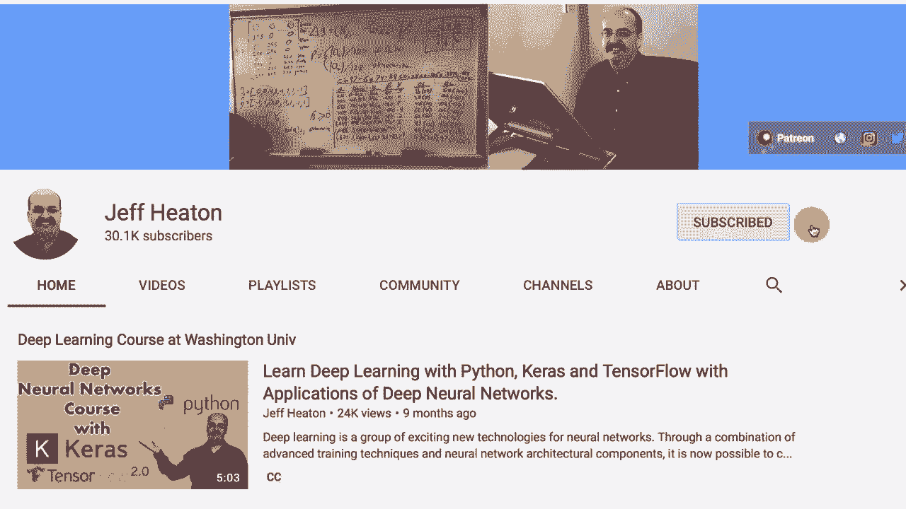

---

## 概述与准备工作

上一节我们介绍了课程的基本要求。本节中，我们来看看具体的安装步骤。首先，你需要准备一台计算机。如果你的计算机配备的是 **NVIDIA** 显卡且型号较新，则可以尝试安装 GPU 版本以获得更快的计算速度。否则，安装 CPU 版本或使用 Google Colab 是更简单可靠的选择。

以下是安装前需要下载的文件和工具：

1.  **课程示例代码**：从 Jeff Heaton 教授的 GitHub 仓库下载。
2.  **Miniconda (或 Anaconda)**：用于创建和管理 Python 环境。

---

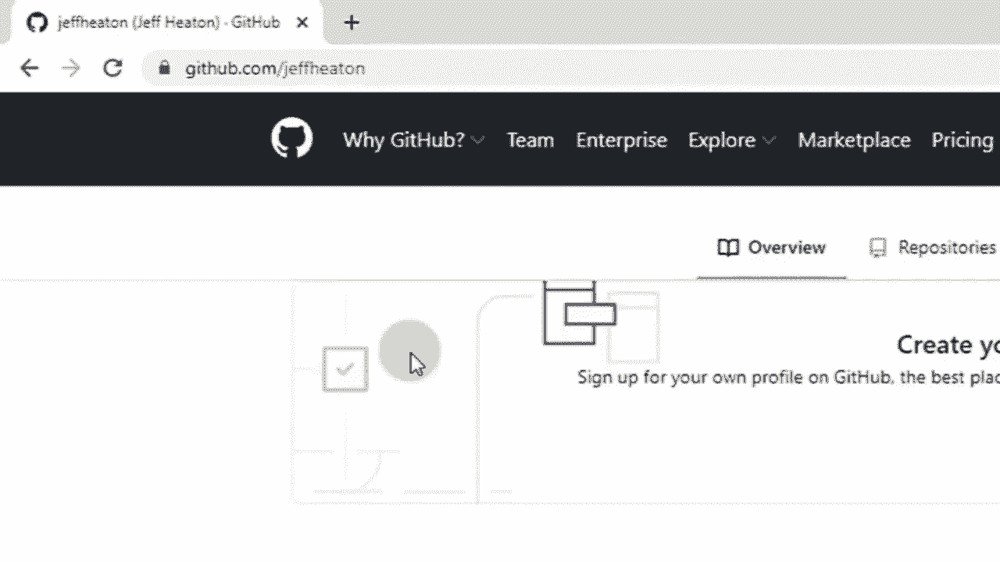

## 第一步：下载课程文件与 Miniconda

首先，访问 Jeff Heaton 教授的 GitHub 主页，找到名为 “T81-558” 的仓库，下载整个项目的 ZIP 压缩包并解压到本地目录。

接下来，访问 Miniconda 官网，下载适用于你操作系统（Windows/Mac/Linux）的 **Python 3.7 64位** 安装程序。TensorFlow 不支持 32 位系统。

运行 Miniconda 安装程序。在安装过程中，建议勾选 **“Add Anaconda to my PATH environment variable”** 选项，以便在命令行中直接使用 `conda` 命令。

---

## 第二步：安装 Jupyter Notebook 并创建环境

安装完成后，打开命令行工具（如 Windows 的 Command Prompt 或 Anaconda Prompt）。首先安装 Jupyter Notebook：

```bash
conda install -y jupyter
```

安装完成后，为 TensorFlow 项目创建一个独立的 Conda 环境。这可以避免不同项目间的库版本冲突。

```bash
conda create -n tensorflow python=3.7
```

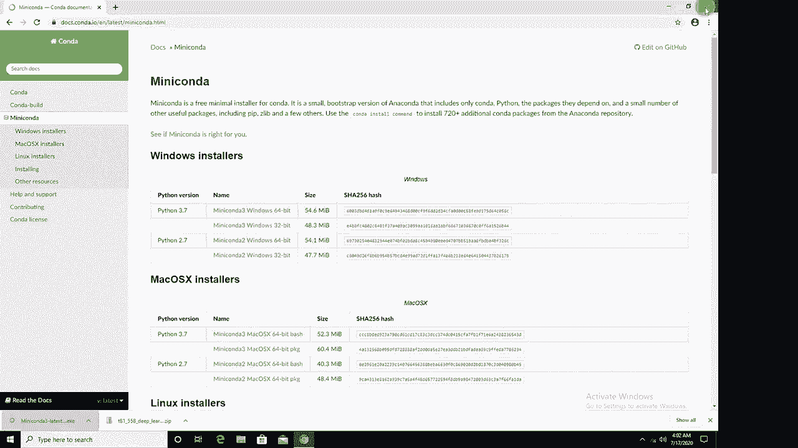

环境创建成功后，激活该环境：

```bash
conda activate tensorflow
```

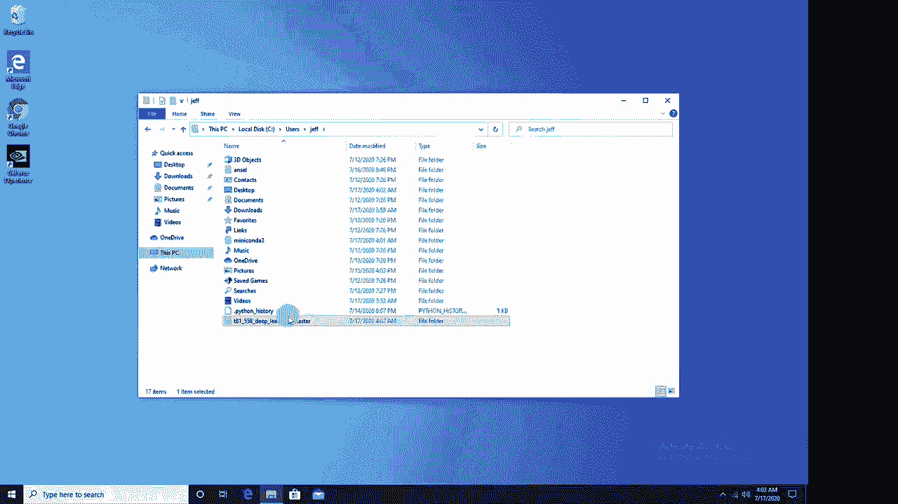

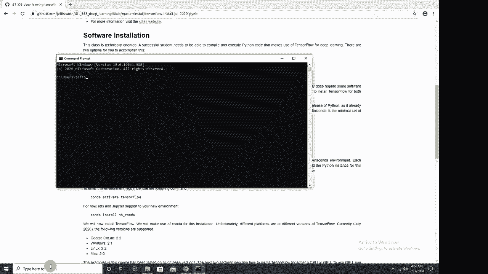

**请注意**：后续所有安装命令都必须在激活的 `tensorflow` 环境中执行，否则可能导致 DLL 加载错误。

---

## 第三步：安装 TensorFlow (CPU 或 GPU 版本)

现在，我们将在激活的环境中安装 TensorFlow。你可以根据硬件条件选择安装 CPU 版本或 GPU 版本。

*   **安装 CPU 版本**：
    ```bash
    conda install -y tensorflow
    ```

*   **安装 GPU 版本**：
    ```bash
    conda install -y tensorflow-gpu
    ```

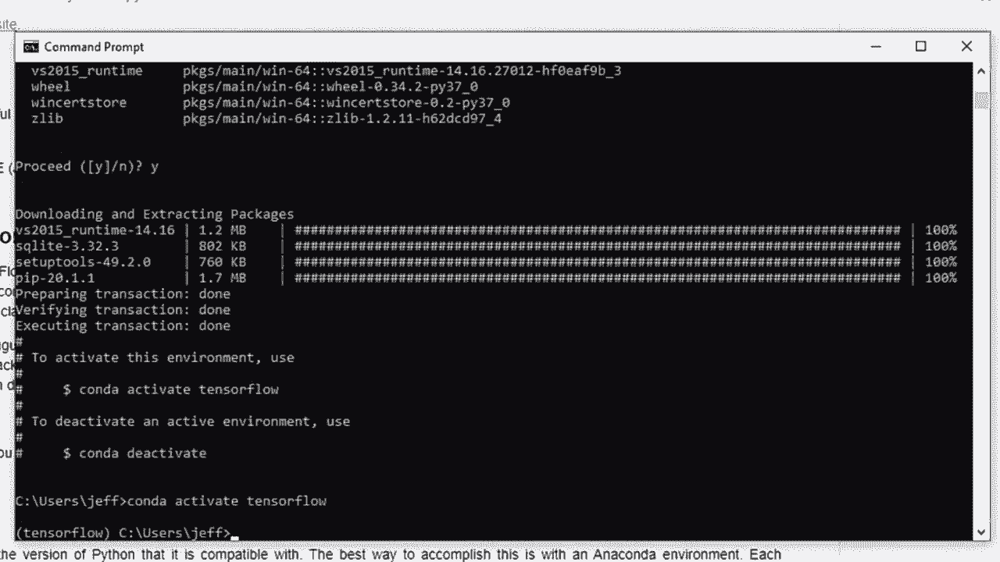

GPU 版本的安装会自动处理 CUDA 和 cuDNN 等驱动依赖，这比手动安装要简单得多。如果安装失败，你可能需要参考更详细的显卡驱动安装教程。

---

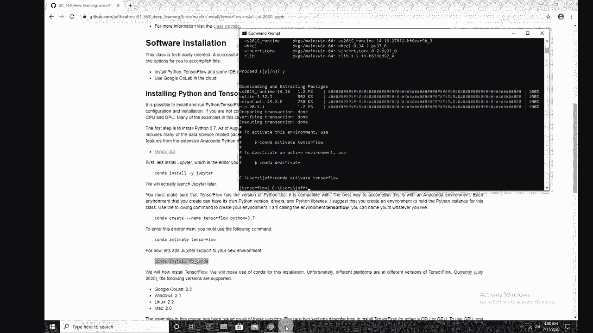

## 第四步：安装课程所需的额外库

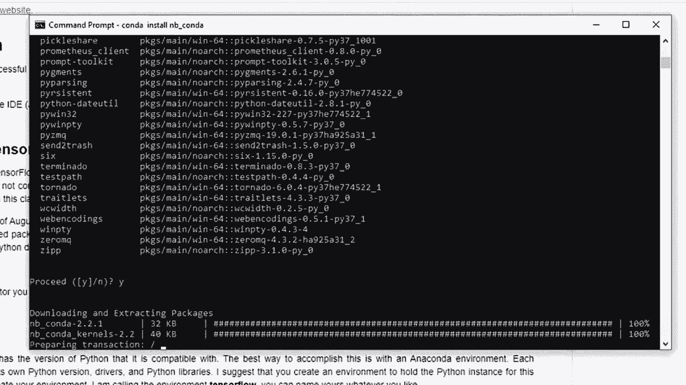

课程示例代码运行还需要一些常用的数据科学库。我们已经将这些依赖项整理在一个 `environment.yml` 文件中，它位于你下载的课程代码压缩包内。

在激活的 `tensorflow` 环境中，运行以下命令来安装所有额外库：

```bash
conda env update -f environment.yml
```

此命令会安装如 `scikit-learn`, `pandas`, `matplotlib` 等库。

---

## 第五步：将环境链接到 Jupyter Notebook

为了让 Jupyter Notebook 能够识别并使用我们新建的 `tensorflow` 环境，需要安装一个内核链接工具。

首先安装 `nb_conda`：

```bash
conda install nb_conda
```

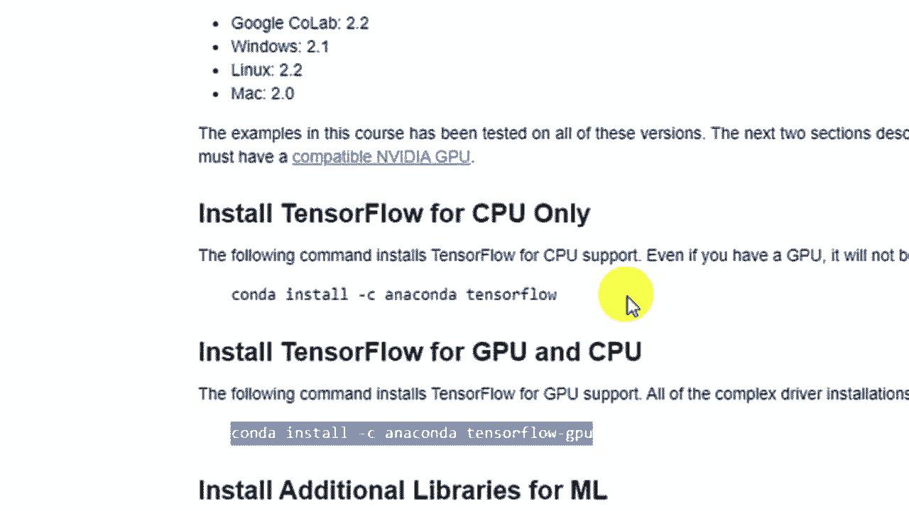

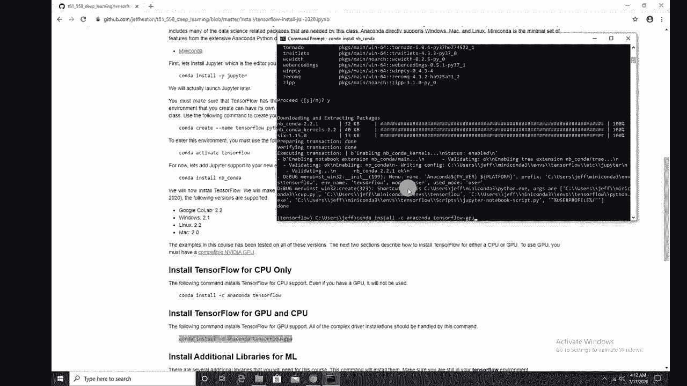

然后，为当前环境创建 Jupyter 内核：

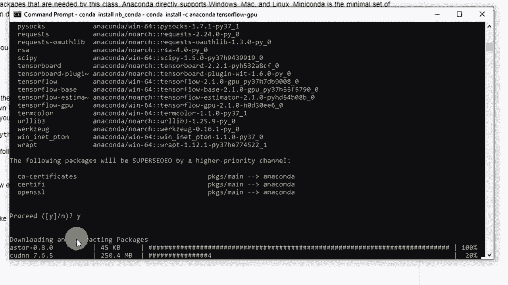

```bash
python -m ipykernel install --user --name tensorflow --display-name "Python 3.7 (tensorflow)"
```

---

## 第六步：验证安装

所有安装步骤完成后，让我们验证环境是否配置正确。

1.  确保你仍在 `tensorflow` 环境中。
2.  启动 Jupyter Notebook：
    ```bash
    jupyter notebook
    ```
3.  在打开的浏览器中，导航到课程示例文件（例如 `class_1_overview.ipynb`）。
4.  在 Notebook 的菜单栏中，选择 **Kernel -> Change kernel**，确保选中你刚刚创建的 **“Python 3.7 (tensorflow)”** 内核。
5.  运行包含以下代码的单元格，检查版本和 GPU 是否可用：

```python
import tensorflow as tf
print(f"TensorFlow Version: {tf.__version__}")
print(f"GPU Available: {tf.config.list_physical_devices('GPU')}")
```

如果输出显示 TensorFlow 版本（例如 2.1.0）并列出可用的 GPU 设备，则说明 GPU 版本安装成功。如果显示 GPU 不可用，则你运行的是 CPU 版本。

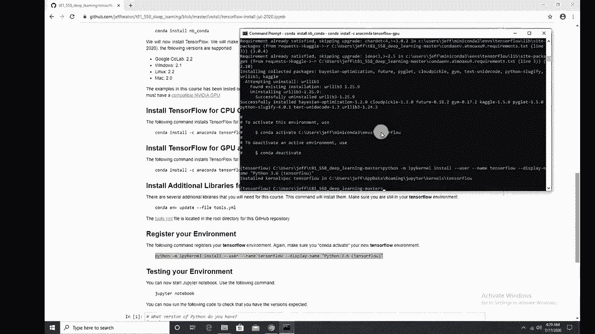

---

## 常见问题与解决

在安装过程中，你可能会遇到一些问题。以下是两个最常见的问题及其解决方法：

1.  **DLL 加载失败错误**：
    *   **原因**：未在 `tensorflow` 环境中启动 Jupyter Notebook。
    *   **解决**：始终先在命令行中执行 `conda activate tensorflow` 激活环境，然后再运行 `jupyter notebook`。

2.  **在 Jupyter 中看不到新环境**：
    *   **原因**：可能遗漏了安装 `nb_conda` 或创建内核的步骤。
    *   **解决**：返回并执行 **第五步** 中的两个命令。

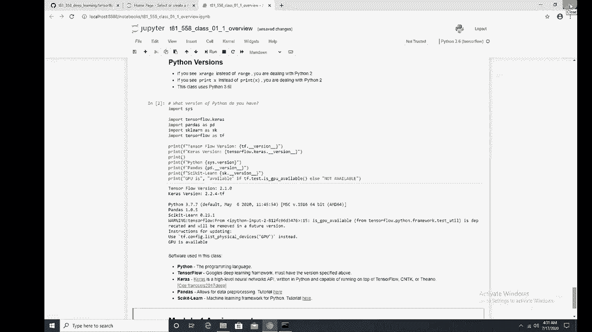

如果遇到其他错误，建议将完整的错误信息复制到搜索引擎（如 Google）或 Stack Overflow 上查找解决方案。

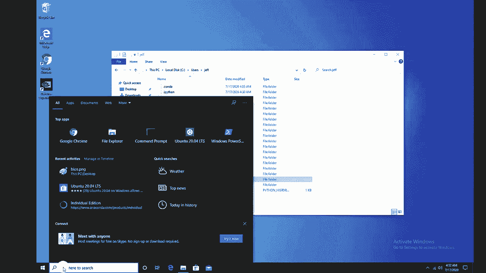

---

## 总结与备选方案

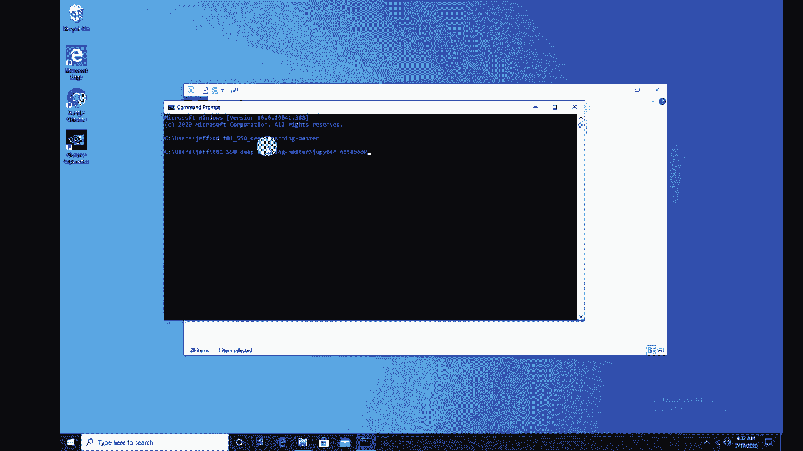

本节课中，我们一起学习了如何使用 Conda 在本地计算机上安装 TensorFlow 和 Keras 的完整开发环境。我们涵盖了从下载工具、创建独立环境、安装 CPU/GPU 版本的 TensorFlow，到配置 Jupyter Notebook 和验证安装的全过程。

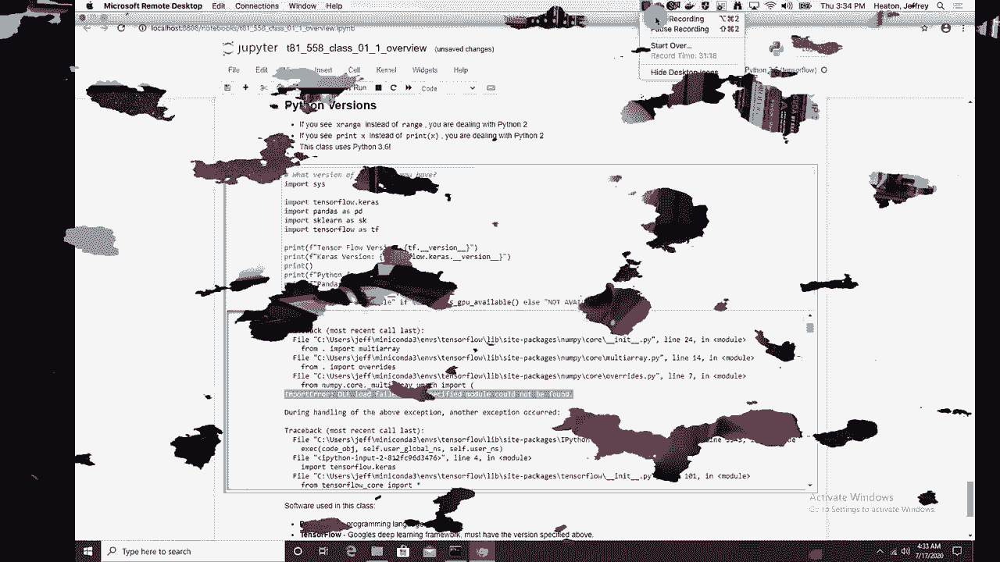

尽管本地安装能提供最大的灵活性，但如果你在安装过程中遇到难以解决的问题，或者你的计算机没有兼容的 NVIDIA GPU，**Google Colab** 是一个极佳的备选方案。它提供了在线的、预配置好的 Python 环境，并且免费提供 GPU 资源，非常适合学习和运行深度学习代码。

希望本教程对你有所帮助。如果你觉得内容有用，请考虑订阅 Jeff Heaton 教授的 YouTube 频道以获取更多人工智能相关的教程。祝你学习愉快！🚀