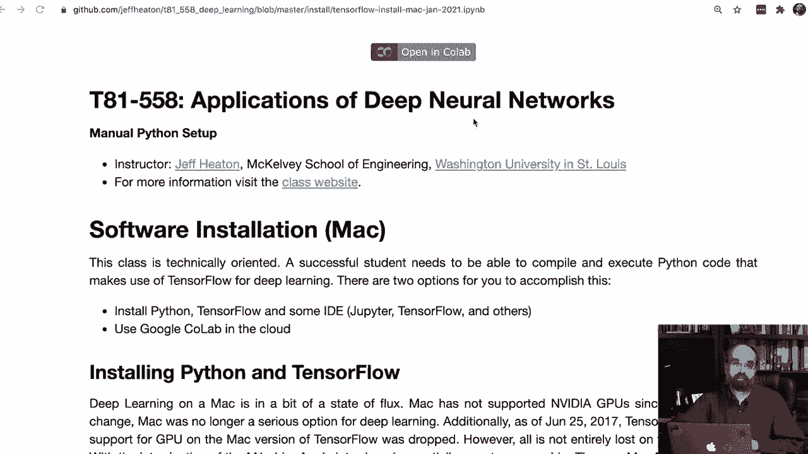
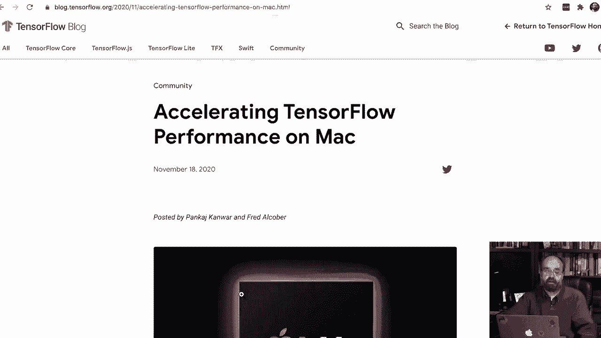
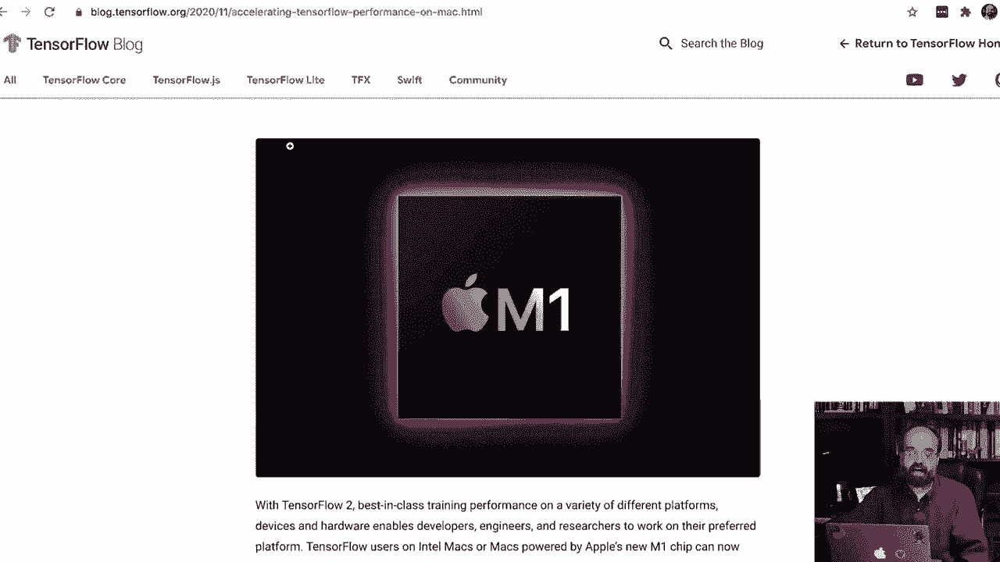
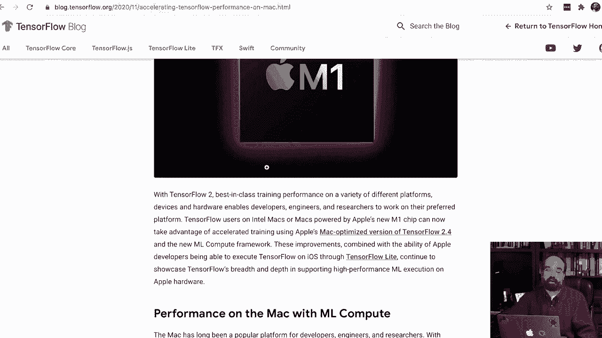
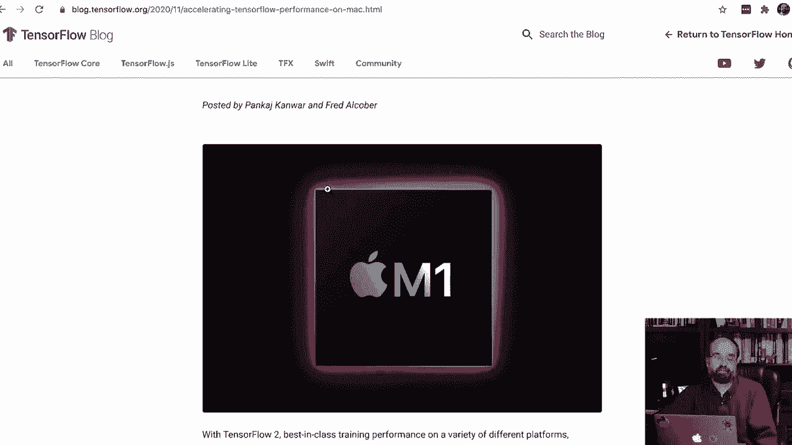
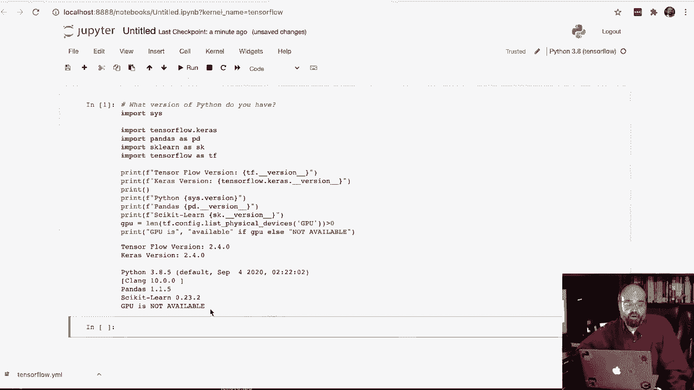

# T81-558 ｜ 深度神经网络应用 - P9：在 Mac OSX 中安装 TensorFlow 2.4、Keras 和 Python 3.8 💻


在本节课中，我们将学习如何在 Mac OSX 系统中安装 TensorFlow 2.4、Keras 和 Python 3.8。请注意，此安装仅支持 CPU 运行，因为 TensorFlow 早已停止对 Mac 的 GPU 支持。对于使用 Apple M1 芯片的新款 Mac，其支持尚属新功能，本教程暂不涉及。

## 概述与准备工作



上一节我们介绍了课程背景，本节中我们来看看具体的安装步骤。首先，我们需要下载并安装 Miniconda，这是一个轻量级的 Python 环境管理工具。







以下是安装 Miniconda 的步骤：
1.  访问 Miniconda 官网，下载适用于 Mac 的最新版本安装包（例如 Python 3.8）。
2.  打开下载的 `.pkg` 文件。
3.  按照安装向导的提示进行操作：点击“继续”，同意许可证协议，选择默认安装位置，然后点击“安装”。
4.  安装过程需要输入密码进行身份验证，完成后将 Miniconda 移至应用程序文件夹。



## 配置 Python 环境

安装完成后，我们需要打开终端应用程序。请注意，较新版本的 MacOS 默认使用 Zsh 作为 shell。你可以通过输入 `echo $SHELL` 来确认。如果显示的是 bash，你可能需要切换到 Zsh。

接下来，我们需要确保使用的是正确的 Python 版本。在终端中输入以下命令检查：
```bash
python --version
```
如果显示的版本不是 3.8 或更高，或者你看到的是 Mac 自带的古老 Python 2.7 版本，你可能需要重启终端或更新系统路径。通常，安装 Miniconda 会自动处理好环境变量。

## 安装 Jupyter Notebook

为了后续的代码编写和测试，我们需要安装 Jupyter Notebook。在终端中运行以下命令：
```bash
conda install -y jupyter
```
这个命令会安装 Jupyter Notebook 及其依赖，过程可能需要一些时间。

## 创建 TensorFlow 专用环境

为了避免不同 Python 包之间的版本冲突，我们创建一个独立的 TensorFlow 环境。这能确保 TensorFlow 的安装不会影响系统中的其他 Python 项目。

首先，你需要下载课程提供的环境配置文件（通常是一个 `.yml` 文件）。将其保存到你的用户目录（例如 `/Users/你的用户名/`）下。

然后，在终端中导航到该文件所在的目录，并运行以下命令来创建环境（请根据你下载的文件名调整命令）：
```bash
conda env create -f tensorflow_env.yml
```
此命令会根据配置文件创建名为 `tensorflow` 的环境，并自动安装 Python 3.8 和 TensorFlow 2.4 等指定版本的包。

## 激活环境并配置 Jupyter

环境创建完成后，每次使用前都需要激活它。在终端中运行：
```bash
conda activate tensorflow
```
激活环境后，你需要将此环境添加到 Jupyter Notebook 的内核列表中，以便在 Jupyter 中可以选择使用它。运行以下命令：
```bash
python -m ipykernel install --user --name=tensorflow
```
这个命令会将名为 `tensorflow` 的内核注册到 Jupyter 中。

## 测试安装

现在，让我们测试安装是否成功。首先，在激活的 `tensorflow` 环境中启动 Jupyter Notebook：
```bash
jupyter notebook
```
Jupyter 会在你的浏览器中打开。在界面中，点击“New”按钮，你应该能看到一个名为“Python [tensorflow]”的选项，选择它来创建一个新的 Notebook。

在新的 Notebook 单元格中，输入并运行以下测试代码：
```python
import tensorflow as tf
import keras
print(f"TensorFlow Version: {tf.__version__}")
print(f"Keras Version: {keras.__version__}")
print(f"Python Version: {sys.version}")
```
首次运行可能会花费一点时间加载库。如果安装成功，你将看到输出的 TensorFlow 版本为 2.4.x，Keras 版本为 2.4.x，以及 Python 3.8.x。同时，你可能会看到“GPU 不可用”的提示，这在 Mac 上是正常现象。

## 总结



本节课中我们一起学习了在 Mac OSX 上安装深度学习环境的完整流程。我们首先通过 Miniconda 管理 Python 环境，然后创建了一个独立的 TensorFlow 环境来安装指定版本的 TensorFlow 2.4、Keras 和 Python 3.8，最后配置了 Jupyter Notebook 并进行了成功验证。记住，每次使用这个环境进行开发时，都需要先在终端中运行 `conda activate tensorflow` 来激活它。