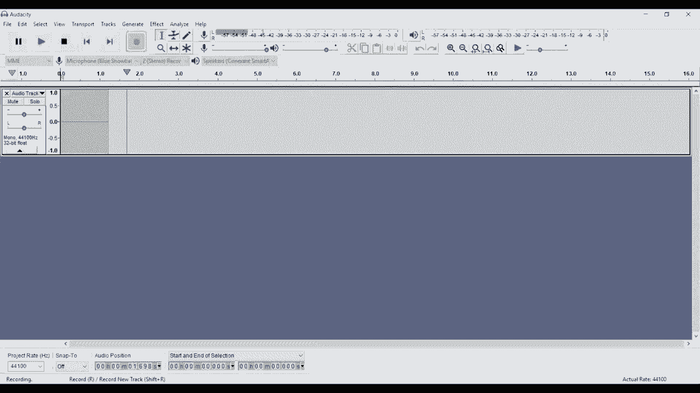
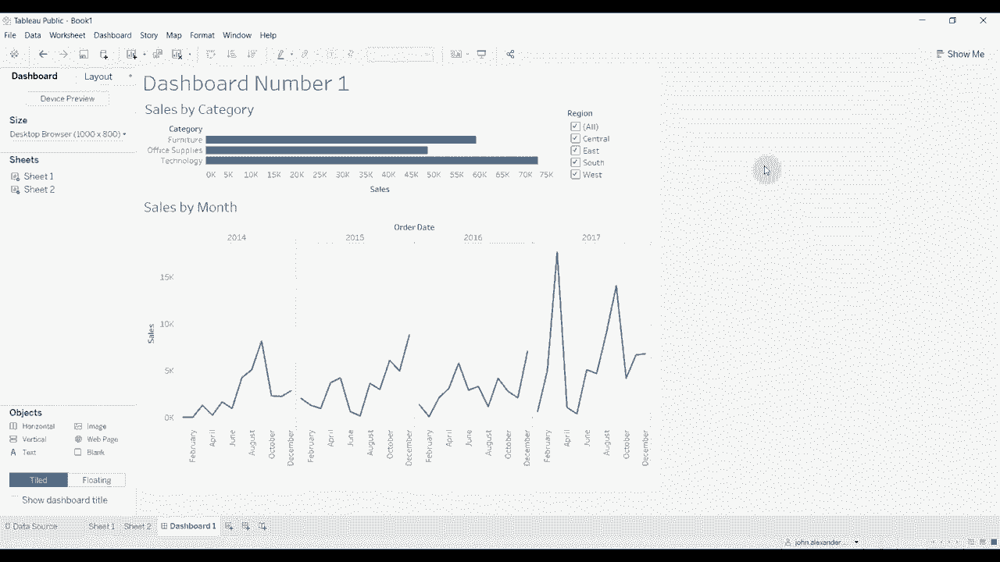

# Tableau操作详解 P1：基础知识入门 📊

在本节课中，我们将学习Tableau的基础知识。课程将从第一次打开软件开始，逐步引导你创建一个基本的仪表板。这为你观看本频道或其他频道的进阶视频提供了一个知识框架。

***

当你打开Tableau时，首先看到的是起始屏幕。屏幕左侧提供了连接数据的选项，具体选项取决于你使用的Tableau版本（如Public、Professional或Personal）。Tableau Public的选项通常最有限，尤其是在连接服务器数据时。屏幕中间会显示最近打开的文件缩略图。

连接数据最简单的方式是通过“Microsoft Excel”或“文本文件”。我们将使用Excel来连接数据，文本文件的连接过程与此非常相似。

选择“超市销售数据集”并打开后，会进入一个新页面，你可以在此定义要导入工作簿的数据。左侧列出了该工作簿中的三个工作表。我们将“订单”表拖到中央面板上，这会将该表的所有数据导入工作簿。

我们也可以将“人员”表拖入，并将其与“订单”表建立连接。“人员”表包含了地区及其负责人的信息。点击“连接”可以定义连接方式，例如通过“订单ID”字段进行关联。你还可以在此添加“退货”表。这些连接类似于SQL中的连接类型，包括内连接、左连接、右连接和全连接。对于初学者，暂时无需深究，但了解这种灵活性是有益的。

数据准备就绪后，点击左下角的“转到工作表”，然后选择“工作表 1”。这个视图是创建每个独立图表的主要工作区。

***

上一节我们连接了数据并进入了工作表，本节中我们来看看Tableau工作界面的主要区域。

屏幕左侧列出了数据集中的所有字段，它们被分为两类：
*   **维度**：通常是分类项目，例如产品“类别”。
*   **度量**：通常是数值，可以进行计算，例如“销售额”。

将鼠标悬停在字段上时，会显示不同颜色。蓝色代表**离散**字段，绿色代表**连续**字段。它们通常与维度和度量对应，但并非总是如此。连续字段和离散字段的操作方式有所不同。

界面中央有几个被称为“架子”的区域：
*   页面架
*   过滤器架
*   列架
*   行架
*   标记卡（内含颜色、大小、标签等架子）

右侧是可视化区域，图表会随着你将字段拖到不同架子上而逐步构建。

***

了解了界面布局后，我们来创建一个简单的可视化。

首先，将“类别”字段拖到**行架**上。此时，行被定义为三个产品类别：办公用品、家具和技术。
接着，点击并按住“销售额”字段，将其拖到**列架**上。Tableau会自动创建一个柱状图。Tableau通常能智能地根据维度和度量推荐合适的图表类型。

如果你想更改图表类型，可以点击工具栏上的“智能显示”面板，尝试高亮表、堆叠柱状图、气泡图或树状图等。对于当前数据，柱状图是一个不错的选择。

***

现在，我们为可视化添加一个过滤器。过滤器用于限制流入图表的数据量。

将“区域”字段拖到**过滤器架**上，会弹出一个窗口让你选择要查看的区域。我们先选择“全部”，然后点击“确定”。数据没有变化，因为我们包含了所有区域。

要修改过滤器，可以点击“区域”过滤器，选择“编辑过滤器”。例如，排除“南部”和“西部”地区，观察柱状图的高度和比例如何变化。

你还可以在图表上直接显示过滤器控件。点击“区域”字段旁的下拉箭头，选择“显示过滤器”。图表右侧会出现一个筛选框，你可以通过点击不同选项来动态过滤数据，这比反复编辑过滤器菜单更方便。

***

我们已经创建了一个图表工作表，接下来将其添加到仪表板中。

要创建仪表板，可以点击底部标签栏的“新建仪表板”图标。仪表板视图与工作表视图不同。顶部有“仪表板”和“布局”两个标签页。

在“仪表板”标签页，你可以：
*   定义仪表板尺寸。
*   将工作表添加到仪表板。
*   添加文本、图像等对象。
*   控制是否显示标题。

在“布局”标签页，你可以微调仪表板中各个元素的排列。

一开始，仪表板可能是空的。我们将之前创建的工作表拖到仪表板上。这会同时放置图表及其标题、坐标轴以及我们设置的区域过滤器。你可以选中并删除不需要的元素（如过滤器控件）。

默认情况下，工作表以“平铺”方式对齐，像瓷砖一样紧密排列。如果你想自由移动它们，可以在拖动时按住 `Shift` 键，将其转换为“浮动”布局。通常，先以浮动布局大致安排所有元素的位置是个好习惯。

建议先为仪表板设置一个固定尺寸（例如“适合浏览器”），然后再开始排列内容。如果在所有元素布局完成后才更改尺寸，调整起来会非常困难。

***

目前仪表板上只有一个图表。为了增加信息量，我们添加第二个图表来展示销售额随时间的变化。

点击“新建工作表”按钮创建一个新工作表。将“销售额”拖到**行架**，将“订单日期”拖到**列架**。此时，图表自动变为折线图，因为日期数据更适合用折线展示。

注意，“订单日期”默认按“年”聚合。你可以点击字段上的加号（`+`）展开到季度、月、日级别，或点击减号（`-`）进行聚合。我们将其展开到“年”和“月”级别，但去掉“季度”，以便直接按年月查看过去四年的销售趋势。

现在，回到仪表板。将第二个工作表（折线图）拖入，同样按住 `Shift` 键使其浮动，并调整其大小和位置。

***

现在仪表板上有两个独立的图表：一个显示各类别的销售总额，另一个显示所有类别随时间的销售趋势。为了让它们产生互动，我们需要建立连接。

首先，让区域过滤器同时作用于两个图表。点击柱状图所在的工作表，找到“区域”过滤器，点击下拉箭头，选择“应用于工作表” -> “使用此数据源的所有项”。现在，过滤器旁会出现一个数据库图标，表示它已应用于多个工作表。更改区域筛选时，两个图表会同步更新。

其次，我们可以设置图表间的交叉筛选。在仪表板视图下，将鼠标悬停在折线图上，点击右上角出现的“用作筛选器”图标（漏斗形状）。现在，点击折线图上的任意数据点（例如2017年9月），柱状图会立即更新，仅显示该月份下各品类的销售额分布。同样，我们也可以为柱状图启用“用作筛选器”功能，点击某个品类，折线图就会显示该品类随时间的销售趋势。点击图表空白处可以清除筛选。

***

最后，我们对仪表板进行一些美化，使其更专业、易读。

1.  **添加主标题**：从左侧对象区将“文本”对象拖到仪表板顶部（按住 `Shift` 使其浮动）。双击文本框，输入标题（如“销售分析仪表板”），并调整字体大小。
2.  **修改图表标题**：默认的图表标题是工作表名称（如“工作表1”）。双击仪表板上的图表标题，将其改为更具描述性的名称，例如“按类别划分的销售额”和“按月划分的销售额趋势”。
3.  **调整布局**：最后，检查并调整各个元素（标题、图表、筛选器）的位置和大小，确保布局整洁美观。

***

本节课中，我们一起学习了Tableau的基础操作：从连接数据、认识工作界面，到创建简单的柱状图和折线图，进而组合图表并构建一个具有交互过滤功能的仪表板。你掌握了维度与度量的概念、架子的使用、过滤器的应用以及仪表板的基本布局技巧。

掌握这些核心知识后，你就可以开始探索自己的数据了。本频道还有更多关于高级功能、复杂数据源处理和仪表板设计的视频，欢迎继续学习。示例数据集和工作簿文件可在视频描述中下载。如果你有任何问题，请在评论区留言。