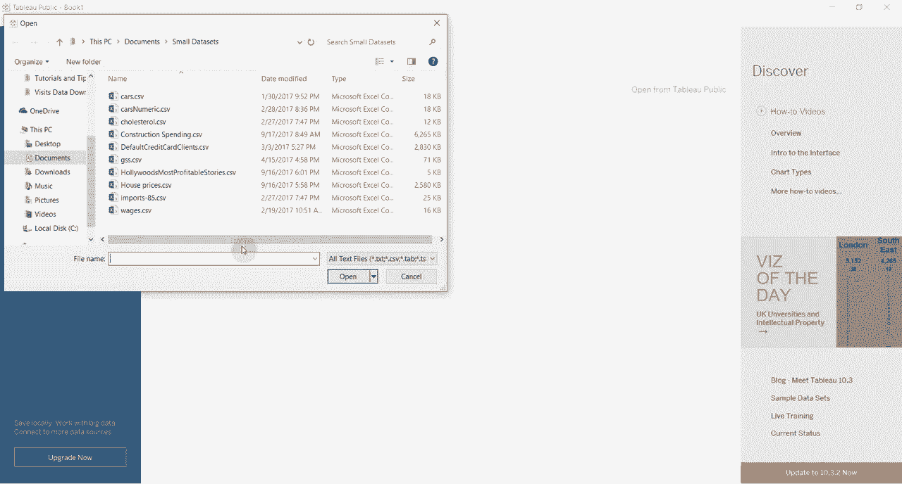
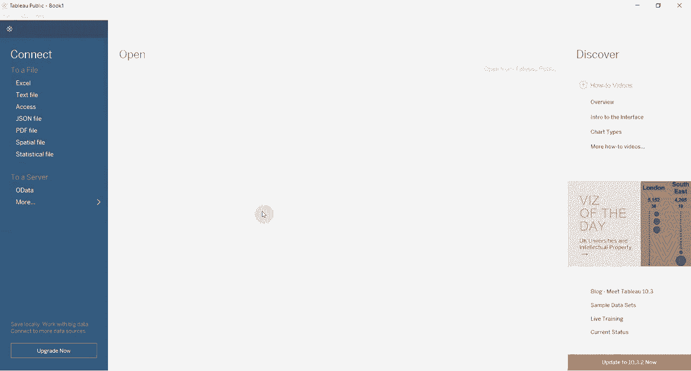
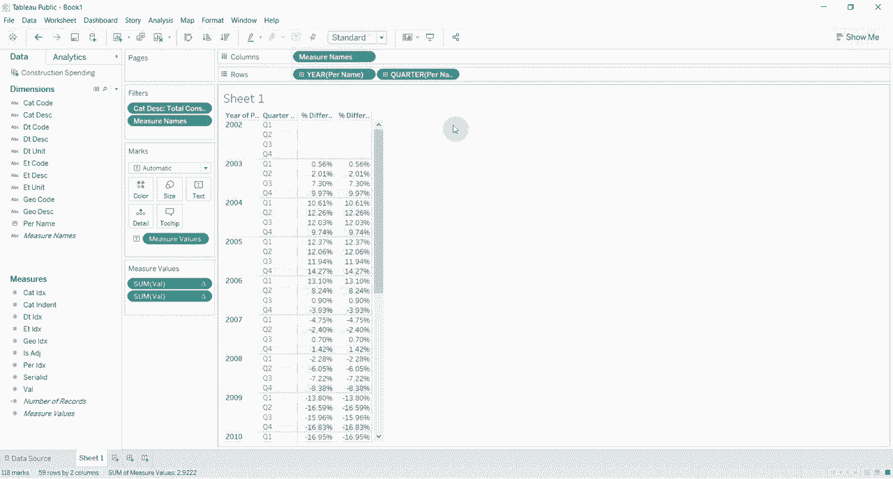

# Tableau操作详解 P10：使用表计算获取同比增长 📊

在本节课中，我们将学习如何在Tableau中使用表计算功能来计算数据的同比增长。这是一个非常实用的技巧，能帮助你快速分析时间序列数据的变化趋势。

## 概述与数据准备

首先，我们需要准备一个合适的数据集。理想情况下，数据应布局为时间序列。在本例中，我们使用一个关于美国建筑支出的数据集，它按细分市场分类，并包含了从2002年至今的季度数据。这为我们计算年度变化提供了足够的时间跨度。

以下是创建分析视图的初始步骤：
*   将“期间名称”（代表年份和季度）字段拖放至列功能区。
*   将“类别描述”字段放入筛选器，并选择“总建筑支出”。这一步是为了确保我们只分析总体数据，避免无意中汇总过多类别。
*   将表示支出的“值”字段拖放至行功能区。

完成上述步骤后，视图会显示每个季度的原始支出数字。

## 计算同比增长的两种方法

上一节我们创建了显示原始数据的时间序列表。本节中，我们来看看如何计算同比增长。

Tableau提供了两种主要方式来计算同比增长，我们将逐一介绍。

### 方法一：使用“快速表计算”功能

如果你的数据中包含标准的日期字段，Tableau提供了一个便捷的“快速表计算”选项。

操作步骤如下：
1.  右键单击行功能区上的“值”胶囊（即度量字段）。
2.  在弹出菜单中选择“快速表计算”。
3.  从子菜单中选择“年同比增长”。Tableau会自动完成计算。

这种方法简单快捷，但要求你的数据是基于Tableau可识别的日期维度。

### 方法二：手动配置表计算

当你的时间数据不是标准日期格式，或者你需要更灵活的控制时，可以手动创建表计算。这也是我们重点介绍的方法。

首先，复制一个“值”字段到行功能区，以便对比原始数据和计算后的数据。

以下是手动配置同比增长计算的步骤：
1.  右键单击新复制的“值”胶囊，选择“快速表计算” -> “百分比差异”。
2.  初始计算可能是基于前一个时间点（如上一季度）的差异，而非年度对比。
3.  再次右键单击该胶囊，选择“编辑表计算”。
4.  在“计算类型”中，确保选择“百分比差异”。
5.  在“计算依据”部分，选择“特定维度”。
6.  在维度列表中，**仅勾选“年”维度**，并确保“季度”维度未被勾选。这个操作是关键，它告诉Tableau在计算差异时，跳过同一年内的季度，只与上一年的同一季度进行比较。
7.  配置完成后，关闭对话框。

此时，第二个“值”字段显示的数字就是每个季度相对于去年同季度的百分比变化，即我们所需的同比增长率。你可以验证，此结果与方法一使用“年同比增长”得到的结果是一致的。

## 方法对比与总结

本节课中，我们一起学习了在Tableau中计算同比增长的两种方法。

*   **“快速表计算”中的“年同比增长”**：适用于标准日期字段，操作最为简便。
*   **手动配置“百分比差异”表计算**：灵活性更高，通过指定“计算依据”的维度（例如仅依据“年”），可以应对更复杂的数据结构，如单独的年列和季度列。

核心操作在于理解表计算的逻辑：**Table Calculation = 基于视图布局和指定维度进行的跨行/列计算**。在计算同比增长时，我们通过指定“按年计算差异”，实现了跨年度周期的比较。

掌握这项技能后，你就能轻松分析任何时间序列数据的年度增长趋势了。