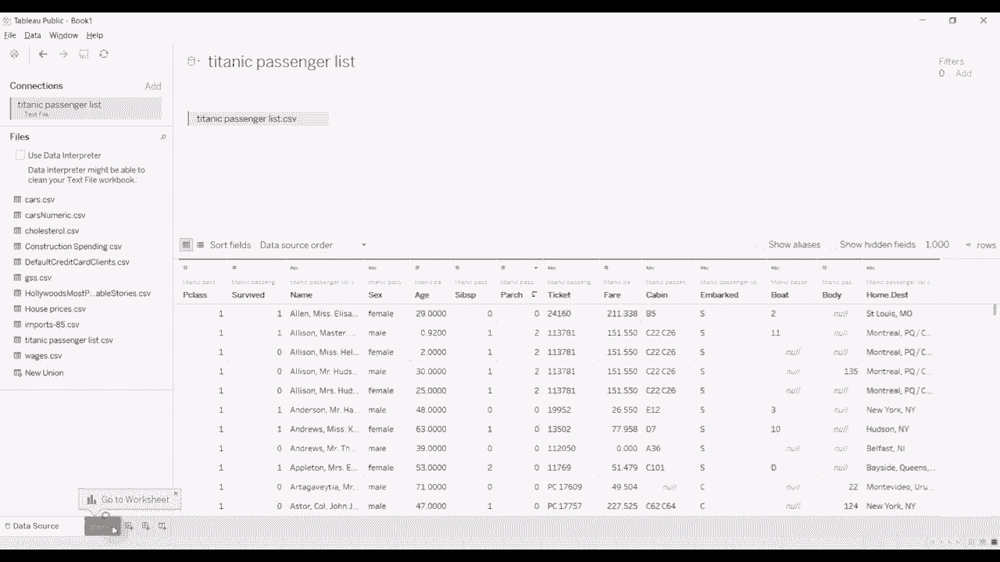
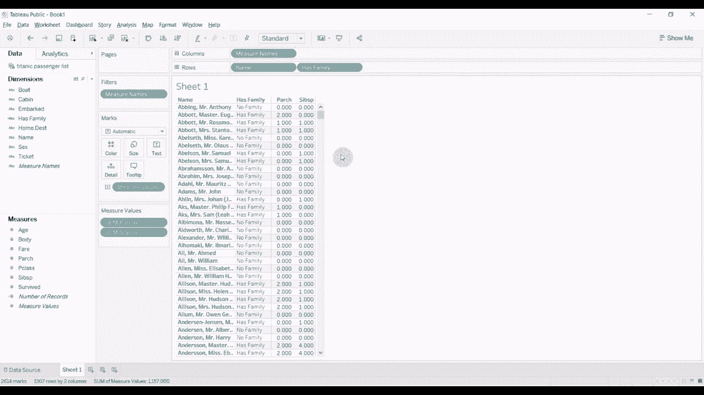

# Tableau操作详解P11：11） If Then 计算 🧮

在本节课中，我们将学习如何在Tableau中使用 **If Then** 语句创建计算字段。我们将通过一个具体案例，将两个现有字段合并为一个名为“有家庭”的新字段，以帮助初学者理解这一核心功能。

## 概述 📋

我们将使用著名的泰坦尼克号乘客数据集进行演示。该数据集包含每位乘客的详细信息，如是否幸存、姓名、性别、年龄等。本节课的重点是利用“兄弟配偶”和“父子关系”这两个字段，通过 **If Then** 逻辑判断，创建一个新的复合字段“有家庭”。


## 数据准备与视图搭建


首先，我们需要将数据导入Tableau并搭建一个基础视图，以便后续验证我们的计算。

1.  将“姓名”字段添加到“行”功能区。系统可能会提示“成员太多”，我们可以忽略此警告。
2.  将“父子关系”字段拖放至视图区域。
3.  将“兄弟配偶”字段也拖放至视图区域。

这样做的目的是在创建计算字段后，能有一个直观的方式验证其计算结果是否正确。



## 创建“有家庭”计算字段

接下来，我们将创建核心的计算字段。

以下是创建“有家庭”字段的步骤：

1.  在“数据”窗格中，点击维度右侧的下拉箭头，选择“创建计算字段”。
2.  将计算字段命名为“有家庭”。
3.  在公式编辑区输入以下逻辑判断代码：

```tableau
IF [父子关系] > 0 THEN
    "有家庭"
ELSEIF [兄弟配偶] > 0 THEN
    "有家庭"
ELSE
    "没有家庭"
END
```

**代码解释**：
*   `IF [父子关系] > 0 THEN “有家庭”`：首先判断“父子关系”数量是否大于0。如果是，则结果为“有家庭”。
*   `ELSEIF [兄弟配偶] > 0 THEN “有家庭”`：如果上一个条件不满足，则接着判断“兄弟配偶”数量是否大于0。如果是，结果也为“有家庭”。
*   `ELSE “没有家庭”`：如果以上两个条件均不满足，则结果为“没有家庭”。
*   `END`：每个完整的 **If Then** 语句块都必须以 `END` 关键字结束。在嵌套复杂逻辑时，确保每个层级都有对应的 `END` 至关重要。

4.  点击“应用”或“确定”保存该计算字段。

## 验证计算结果

创建好计算字段后，我们需要验证其逻辑是否正确。

将新建的“有家庭”字段拖放到视图中的标记卡或行列功能区。此时，表格会显示每位乘客的“有家庭”状态。你可以观察到：
*   当“父子关系”和“兄弟配偶”均为0时，标记为“没有家庭”。
*   当其中任意一个字段大于0时，则标记为“有家庭”。

这个新字段可以作为一个有用的变量，用于后续分析，例如预测乘客的生存率。

## 总结 🎯



本节课我们一起学习了Tableau中 **If Then** 计算字段的创建与应用。我们掌握了如何通过逻辑判断（`IF`, `ELSEIF`, `ELSE`, `END`）将多个字段的信息合并到一个新字段中。通过泰坦尼克号数据集的实践，我们成功创建了“有家庭”字段，并验证了其逻辑。掌握这项技能，能帮助你更灵活地处理和分类数据，为深入的数据分析奠定基础。