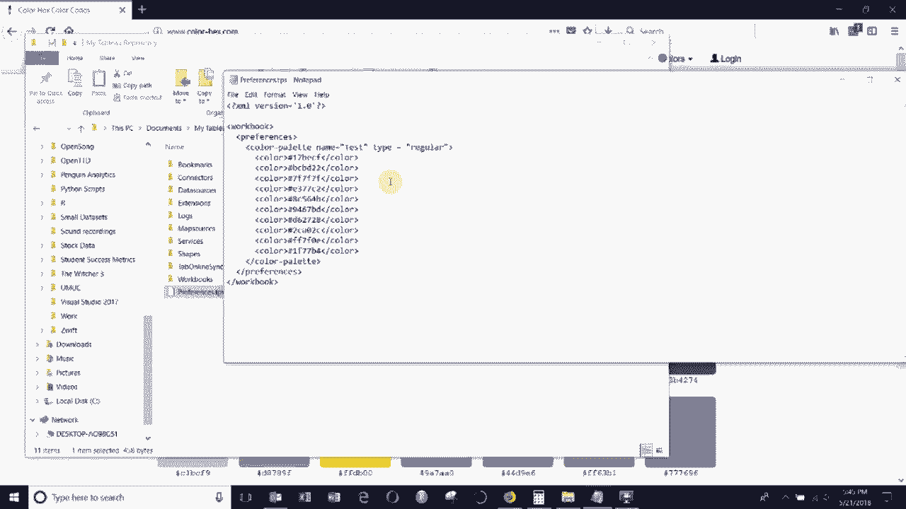
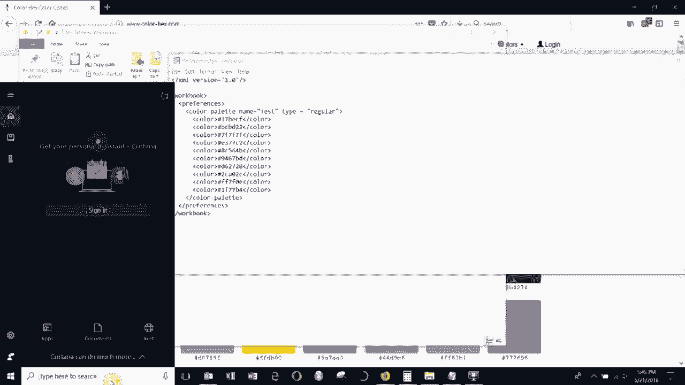
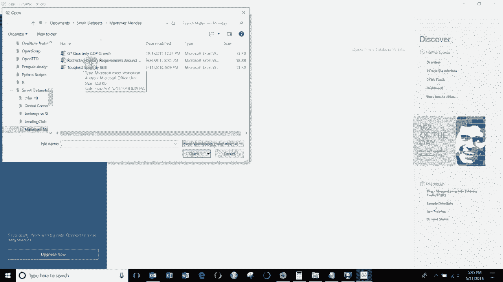
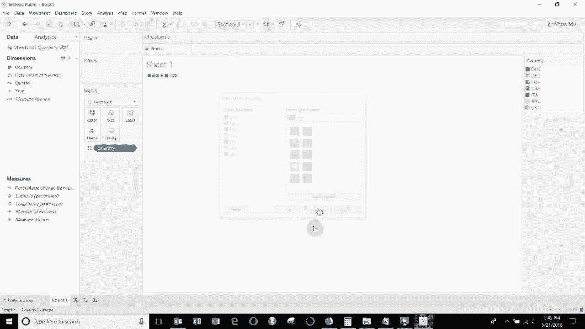
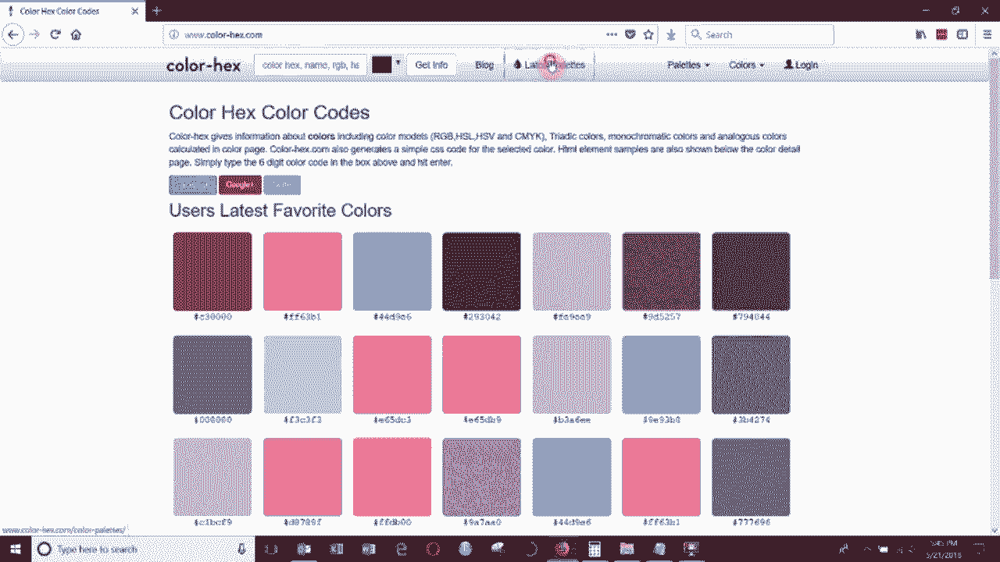
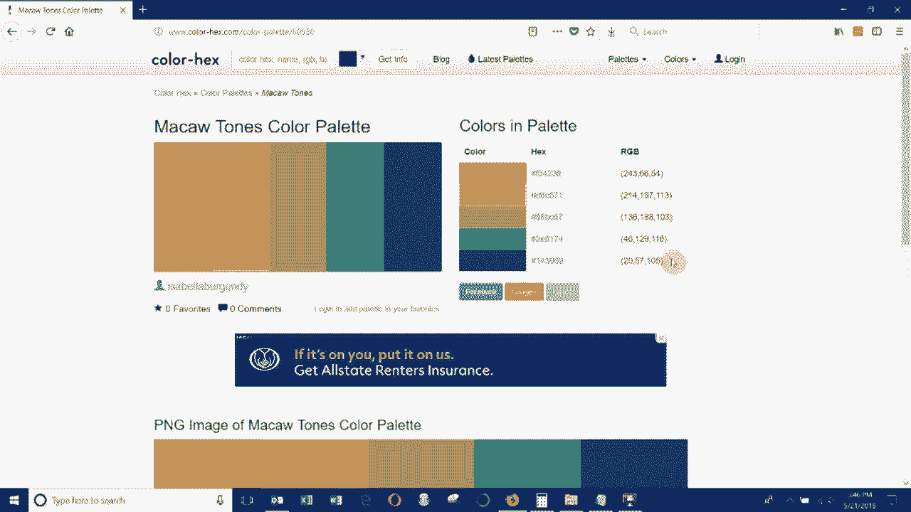
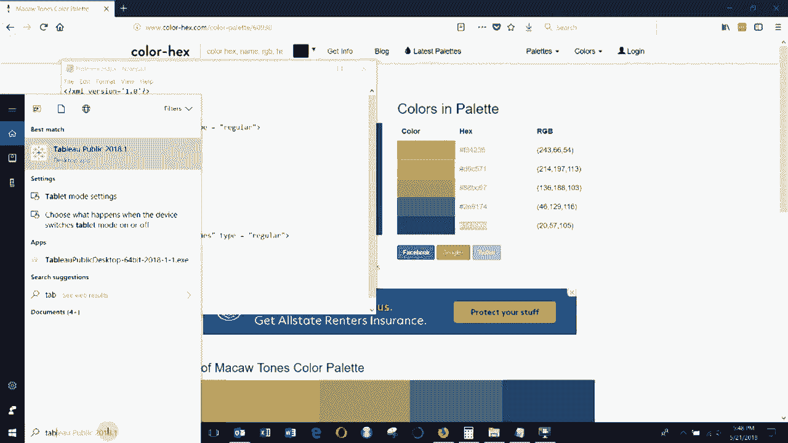
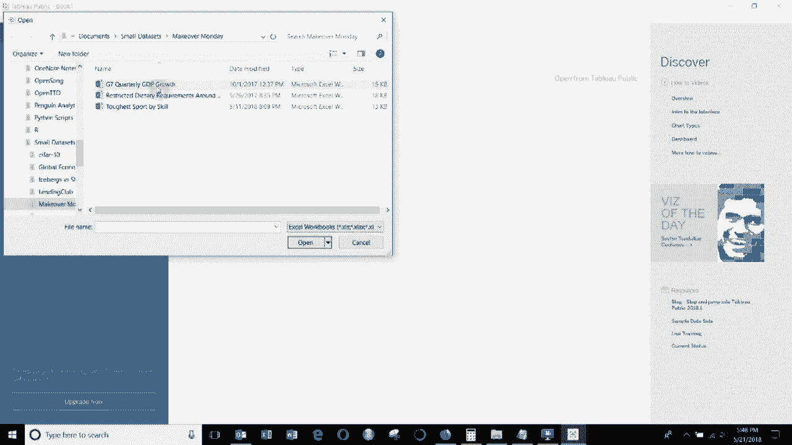
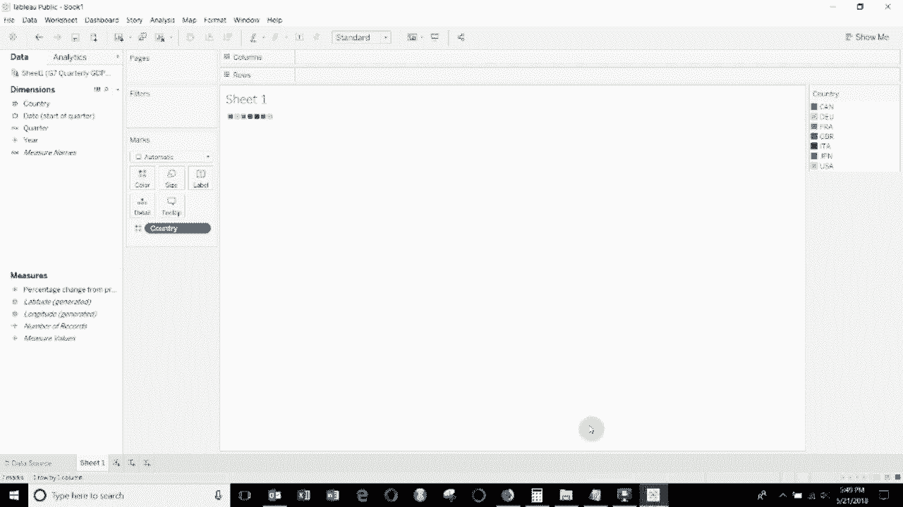

# Tableau操作详解 P12：添加自定义颜色 🎨

在本节课中，我们将学习如何为Tableau添加自定义颜色调色板。这对于希望使用公司品牌色或特定配色方案的用户来说非常实用。整个过程主要在Tableau软件外部通过编辑一个配置文件来完成。

## 概述：理解自定义颜色的原理

Tableau允许用户通过编辑一个名为`Preferences.tps`的XML配置文件来添加自定义颜色。这个文件位于你的“我的Tableau存储库”目录中。所有操作都在文本编辑器（如记事本）中完成，然后需要在Tableau中重启以生效。

## 第一步：定位并打开配置文件

首先，你需要找到并打开`Preferences.tps`文件。



1.  导航至你的“我的Tableau存储库”文件夹。
2.  找到名为`Preferences.tps`的文件。
3.  使用记事本（Notepad）或其他文本编辑器打开此文件。



打开后，你可能会看到一个基本为空或结构简单的XML文件。



## 第二步：理解XML文件结构

上一节我们找到了配置文件，本节中我们来看看它的基本结构。这是一个XML文件，所有内容都包含在特定的标签内。

文件的基本框架如下：
```xml
<workbook>
    <preferences>
        <!-- 颜色调色板将添加在这里 -->
    </preferences>
</workbook>
```
你需要确保颜色调色板的代码被正确地放置在`<preferences>`标签内部。

## 第三步：编写自定义调色板代码





以下是添加一个自定义调色板所需的XML代码示例。你需要根据你的颜色进行修改。



```xml
<color-palette name="Mac色调" type="regular">
    <color>#FF6B6B</color>
    <color>#4ECDC4</color>
    <color>#FFD166</color>
    <color>#06D6A0</color>
    <color>#118AB2</color>
</color-palette>
```
对代码关键部分的解释：
*   **`name`**：这是调色板在Tableau颜色列表中显示的名称。
*   **`type=”regular”`**：这表示这是一个“常规”调色板，用于为离散的维度数据（如国家、产品类别）分配独立的颜色块。
*   **`<color>`**：每个`<color>`标签内需要填入一个颜色的十六进制（HEX）值，例如`#FF6B6B`。

## 第四步：获取颜色的十六进制值

现在我们需要获取想要使用的颜色的具体代码。你可以通过设计网站或工具获取颜色的十六进制值。

一个推荐的网站是 `color-hex.com`。在该网站上，你可以浏览或搜索喜欢的配色方案，并直接复制每种颜色对应的六位HEX代码（例如`#4ECDC4`）。



## 第五步：编辑文件并应用调色板

获取颜色值后，即可完成配置并应用。



1.  将第三步中的代码块，粘贴到`Preferences.tps`文件的`<preferences>`标签内。
2.  将示例代码中的`<color>`标签内容替换为你自己获取的HEX颜色值，并确保`name`是你想要的调色板名称。
3.  保存并关闭`Preferences.tps`文件。
4.  **重要**：完全关闭并重新启动Tableau Desktop，新的调色板才会加载。
5.  重启Tableau后，连接任意数据源，将某个维度字段（如“国家”）拖到标记卡上。
6.  点击标记卡中的“颜色”按钮，在调色板列表的最底部，就能找到你刚添加的自定义调色板（如“Mac色调”），点击即可应用。

## 总结



本节课中我们一起学习了如何为Tableau添加自定义颜色调色板。关键步骤包括：定位`Preferences.tps`配置文件、理解其XML结构、编写包含颜色HEX值的调色板代码，以及最后重启Tableau以应用更改。掌握这个方法后，你就能轻松地将品牌色或任何喜爱的配色方案融入你的数据可视化作品中。