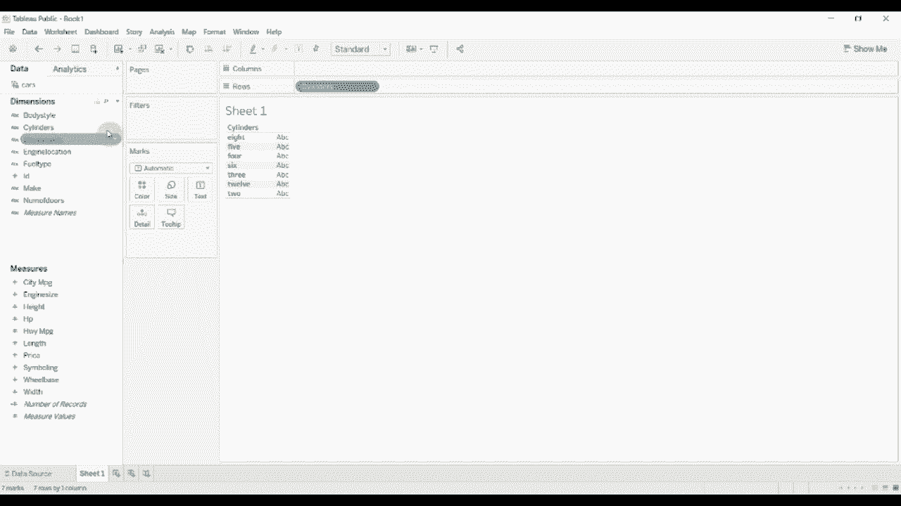
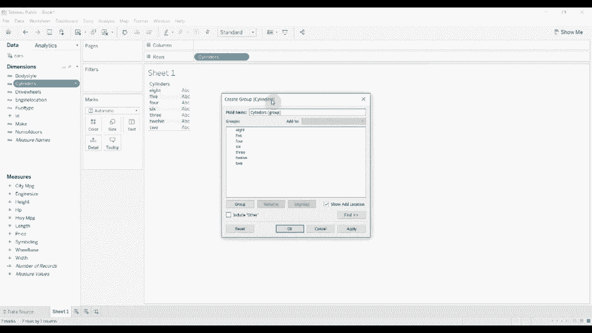
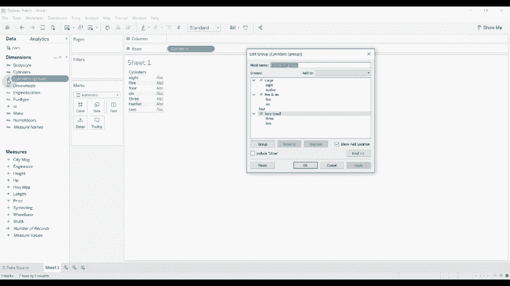
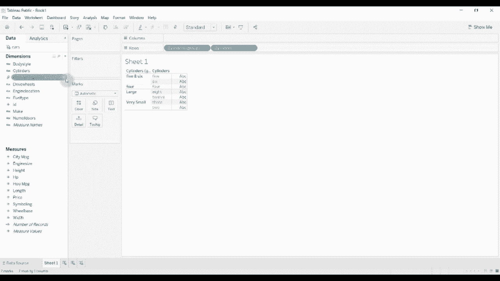
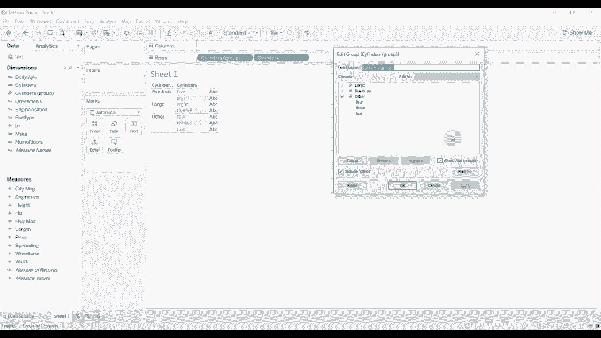
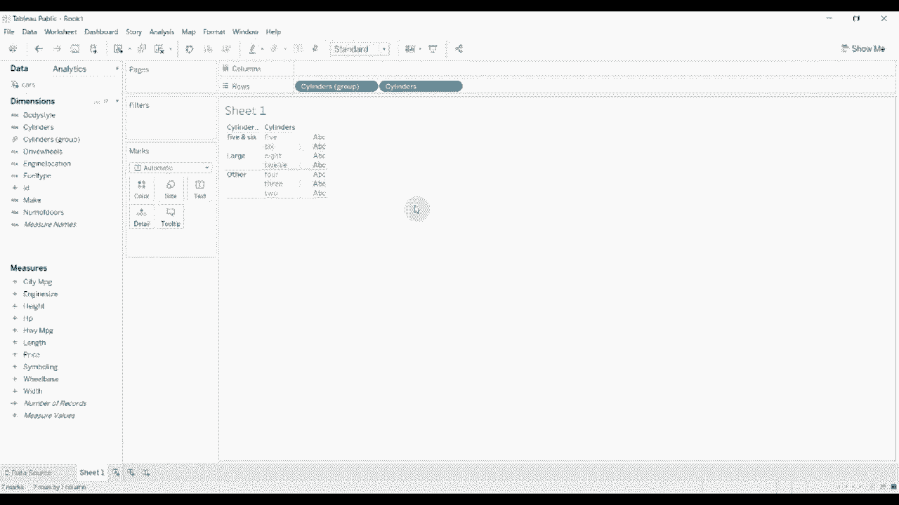

# Tableau操作详解 P13：创建和使用组 🧩

在本节课中，我们将学习如何在Tableau中创建和使用“组”功能。通过将维度中的不同成员组合成更高层级的类别，我们可以简化数据视图，使其更具洞察力。

## 概述

“组”功能允许我们将维度中的多个值组合成一个新的类别。例如，我们可以将不同气缸数的汽车引擎归类为“大型引擎”、“中型引擎”等。这有助于我们从更宏观的视角分析数据。

## 创建组

上一节我们介绍了组的概念，本节中我们来看看如何具体创建一个组。

首先，需要连接到数据集。本例中使用的是一个关于汽车信息的数据集，其中包含“气缸数”维度。

以下是创建组的具体步骤：

1.  在“数据”窗格或视图中的胶囊上，右键点击目标维度（例如“气缸数”）。
2.  在弹出的菜单中选择“创建”，然后选择“组”。
3.  系统会弹出一个对话框，列出该维度的所有唯一值。

## 配置组类别

创建组对话框后，我们就可以开始将不同的值归类到自定义的组中。

以下是配置组的操作：

*   选择想要合并的值（例如，按住Ctrl键点击“12缸”和“8缸”）。
*   点击“分组”按钮，并为这个新组命名，例如“大型引擎”。
*   重复此过程，将“5缸”和“6缸”分为一组，命名为“中型引擎”。
*   将“3缸”和“2缸”分为一组，命名为“小型引擎”。
*   未被分组的单个值（如“4缸”）将保持独立。
*   配置完成后，点击“应用”按钮。

应用后，数据窗格中会出现一个新的字段，其默认名称为原维度名后加“（组）”，例如“气缸数（组）”。该字段旁会有一个纸张图标，表示这是一个计算组。

## 组的使用与特性

现在我们已经创建了一个组，可以像使用其他维度一样，将其拖放到行、列或标记卡中。视图将根据我们定义的组类别来聚合数据。

关于组，有几个重要的特性需要注意：

*   **非动态性**：组是基于创建时数据中的现有值定义的。如果后续数据中出现了新值（例如，新增了“10缸”引擎），该新值不会自动归入任何现有组，而是会单独显示或归入“其他”类别（如果启用），需要手动将其添加到某个组中。
*   **“其他”类别**：在创建组对话框中，有一个“包括‘其他’”选项。如果勾选此选项，所有未被明确分组的成员将自动归入一个名为“其他”的类别。如果不勾选，则这些成员会保持独立显示。
*   **灵活性**：是否使用“其他”类别取决于分析需求。当不希望看到过多独立项，或者想为未来可能出现的新值预留位置时，启用“其他”类别会很有帮助。

## 总结

本节课中我们一起学习了Tableau中“组”功能的创建与使用。我们了解到，“组”是一个强大的数据整理工具，它可以将细粒度的维度值归纳为更有意义的业务类别，从而简化分析视图。关键点在于：通过右键菜单创建组，在对话框中手动组合值并命名，理解组的**非动态**特性，以及根据需求决定是否使用**“其他”** 类别来收纳未分组项。掌握这个功能，能让你的数据可视化层次更加清晰。