# Tableau操作详解 P14：创建组合轴图 📊

在本节课中，我们将学习如何在Tableau中创建组合轴图。这是一种在同一坐标轴上组合多个度量的基础图表类型，也是Tableau Desktop认证助理级别考试的一部分。

## 概述

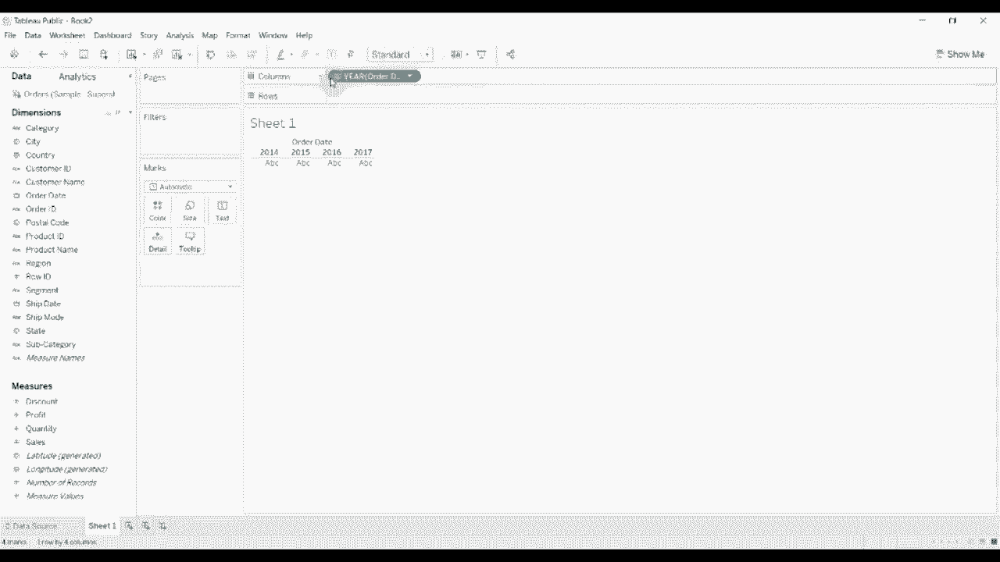

组合轴图允许我们将两个或多个度量值绘制在同一Y轴上，使用相同的比例尺。这与双轴图不同，双轴图使用两个独立的Y轴。组合图适用于比较在同一量级或单位下的多个度量。

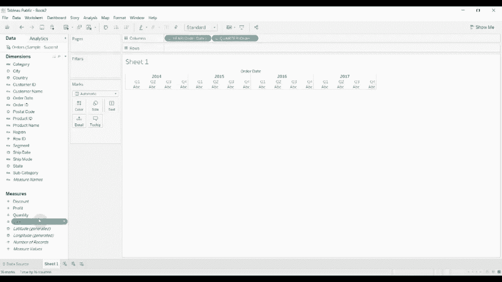

上一节我们介绍了基础图表创建，本节中我们来看看如何将多个度量组合到同一轴线上。

## 创建基础折线图

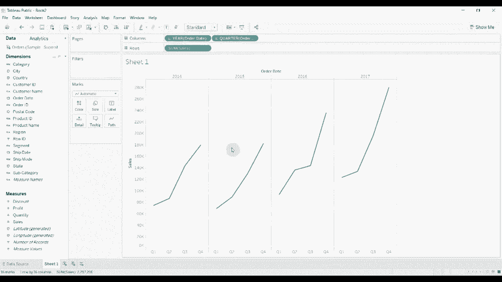

首先，我们需要创建一个基础图表。我们使用Tableau自带的“示例-超级商店”数据集。

1.  将“订单日期”字段拖放到“列”功能区。
2.  右键单击“列”功能区上的“订单日期”胶囊，选择“季度”，以便按季度聚合数据。
3.  将“销售额”字段拖放到“行”功能区。

完成以上步骤后，视图区会生成一个显示各季度销售额的折线图。

## 添加第二个度量并创建组合轴

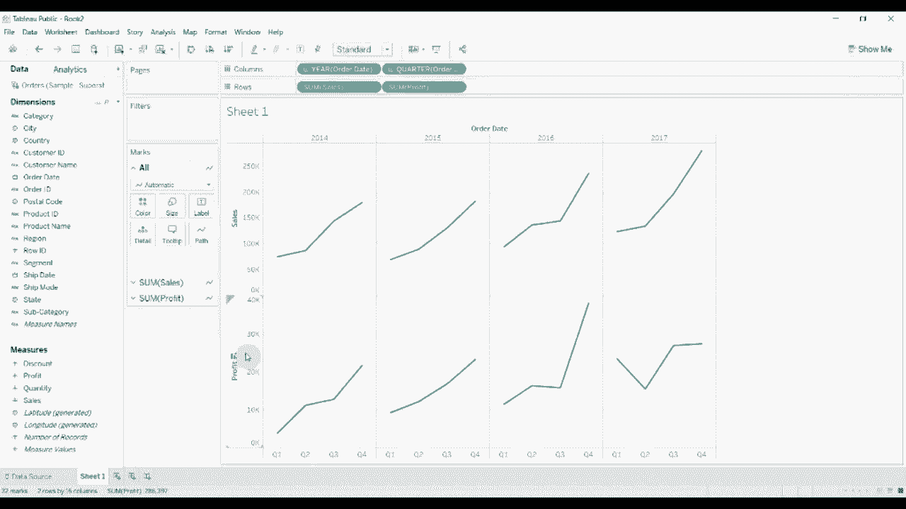

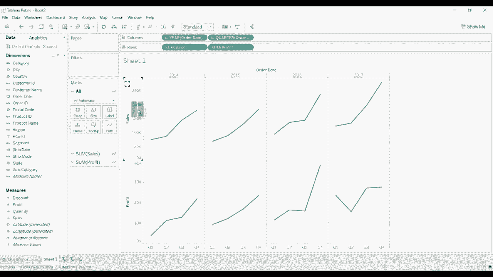

接下来，我们将第二个度量“利润”添加到同一视图中。

1.  将“利润”字段也拖放到“行”功能区。
2.  此时，视图会并排显示两个独立的折线图。
3.  为了将它们组合到同一轴线上，请将鼠标悬停在“行”功能区上“利润”胶囊左侧的绿色三角形上。
4.  按住鼠标左键，将该三角形向上拖动，直到与“销售额”胶囊的轴线重合，然后释放鼠标。

操作完成后，两个度量将共享同一个Y轴，并以不同颜色的线条显示在同一图表中。此时，“行”功能区会变成一个名为“度量值”的胶囊，下方列出了当前显示的度量（如销售额、利润）。

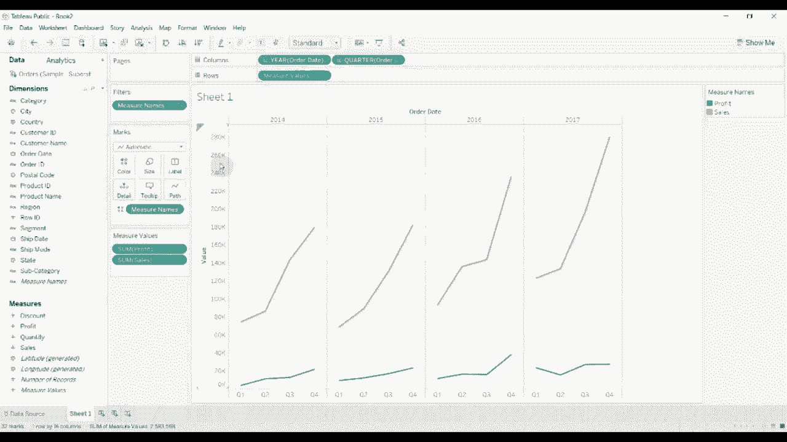

## 理解组合轴与双轴的区别

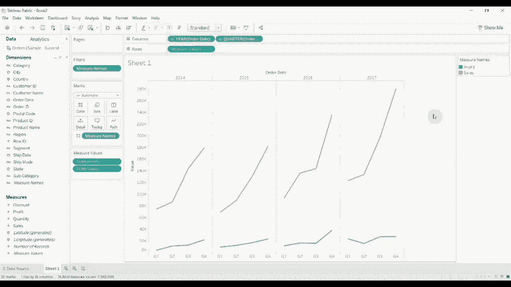

组合轴图的核心特征是**多个度量共享同一个Y轴比例尺**。其视觉表现可以概括为：
`图表 = 单Y轴 + 度量A的图形 + 度量B的图形 + ...`

而双轴图则为每个度量提供独立的Y轴，其结构为：
`图表 = 左Y轴（度量A比例尺）+ 右Y轴（度量B比例尺）+ 叠加的图形`

组合图适用于度量值单位相同或量级相近的比较。如果度量值单位不同或数值范围差异巨大，则应考虑使用双轴图。

## 管理与修改组合度量

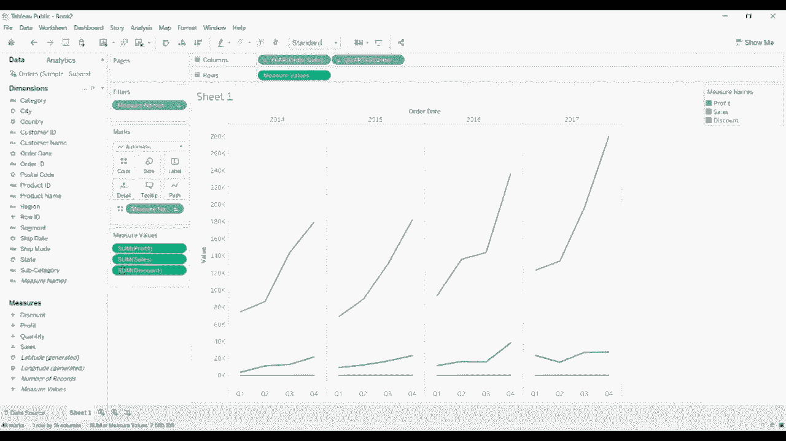

在创建组合轴后，我们可以轻松地添加、移除或替换度量。

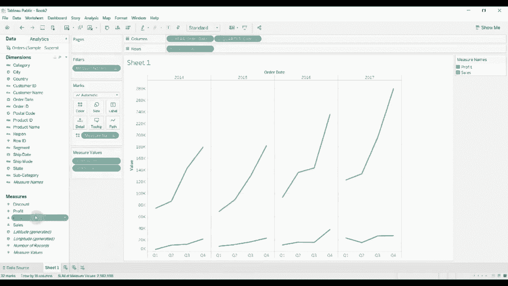

以下是管理“度量值”架上度量的方法：
*   **添加度量**：将新的度量字段（如“折扣”、“数量”）直接拖放到“行”功能区的“度量值”胶囊上。
*   **移除度量**：点击“度量值”胶囊右侧的下拉箭头，在弹出菜单中取消勾选不希望显示的度量。
*   **调整顺序**：在“度量值”胶囊的弹出菜单中，通过拖拽可以调整各度量在图例中的显示顺序。

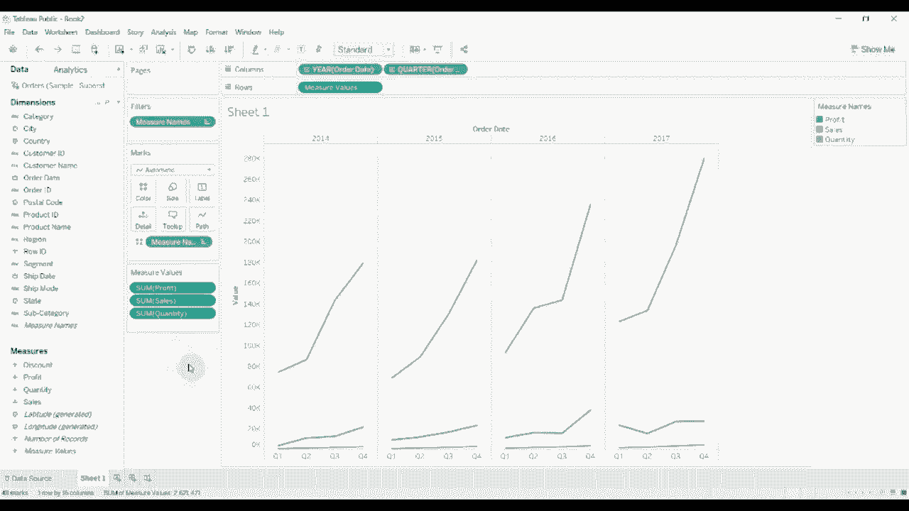

## 总结

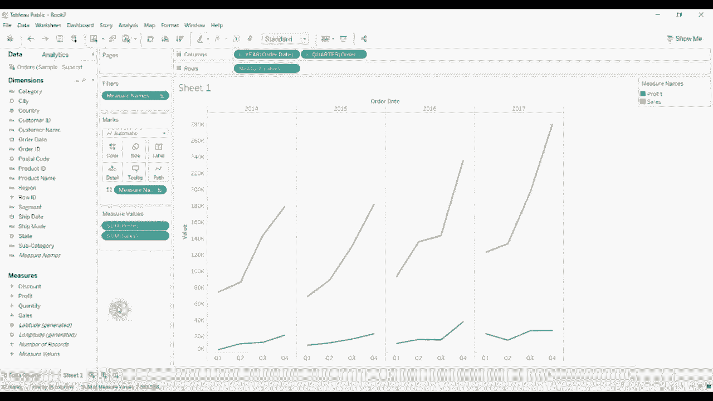

本节课中我们一起学习了在Tableau中创建组合轴图的方法。我们首先创建了一个销售额折线图作为基线，然后通过拖拽操作将利润度量添加到同一轴线上，形成了组合图表。我们明确了组合轴图（共享同一比例尺）与双轴图（拥有独立比例尺）的关键区别。最后，我们还了解了如何在组合轴图中灵活地管理多个度量值。掌握这一技能，能帮助我们在同一视图中更有效地比较多个相关指标。