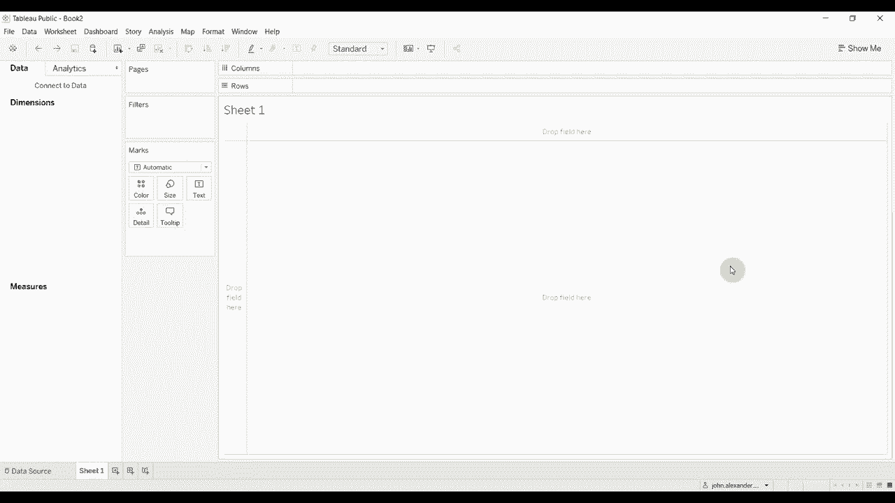
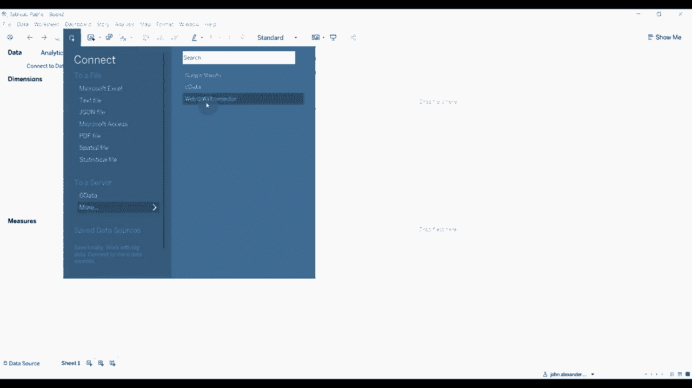
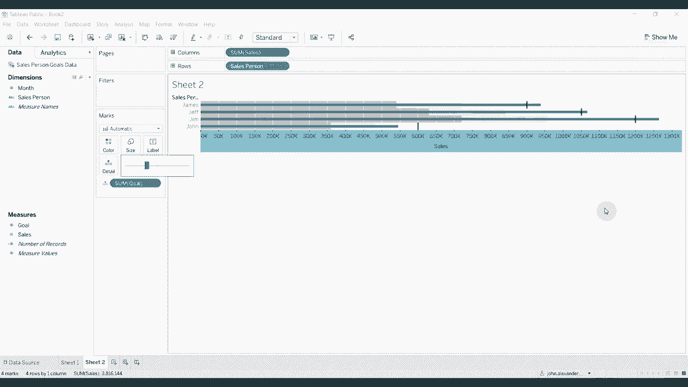

# Tableau操作详解 P15：创建子弹图 📊

在本节课中，我们将学习如何在Tableau中创建子弹图。子弹图是一种高效的数据可视化图表，它能在有限的空间内清晰地展示实际业绩与预设目标之间的对比关系，并通常包含表示不同绩效水平（如及格、良好）的背景色带。

## 概述与数据准备

首先，我们连接一个包含虚构销售人员数据的数据集。数据中记录了四位销售人员（约翰、吉姆、詹姆斯、杰夫）在不同月份的“销售”额和“目标”额。

## 使用“显示我”功能快速创建

创建子弹图最简单的方法是使用Tableau的“显示我”功能。

以下是具体步骤：
1.  将“销售人员”字段拖放至**行**功能区。
2.  将“目标”和“销售”字段依次拖放至**列**功能区。
3.  在右侧的“显示我”面板中，选择“子弹图”图表类型。

此时，视图会生成一个初步的子弹图，其中条形代表“目标”，黑色细线代表“销售”。这个顺序可能不符合常规认知（通常条形表示实际值）。

我们可以通过点击工具栏上的“交换参考线字段”按钮来交换两者。交换后，视图变为：蓝色条形图表示“销售”额，黑色细线则表示“目标”额。当蓝色条形超过黑线时，即表示该销售人员超额完成了目标。

## 手动创建以获得更多控制

虽然“显示我”功能快捷，但手动创建允许我们进行更细致的自定义。接下来，我们将一步步手动构建子弹图。

上一节我们介绍了快速创建方法，本节中我们来看看如何从零开始构建。

### 步骤一：创建基础条形图

首先，我们建立表示实际销售业绩的条形图。
1.  将“销售人员”拖至**行**功能区。
2.  将“销售”拖至**列**功能区。
此时，视图显示每位销售人员的销售业绩条形图。

### 步骤二：添加目标参考线

接下来，我们需要添加代表目标的参考线。
1.  将“目标”字段拖放至视图中的任意位置，当出现“详细信息”提示时松开，将其添加到**标记**卡的“详细信息”中。
2.  在菜单栏选择“分析” -> “参考线” -> “添加参考线”。
3.  在弹窗中，将“范围”设置为“每单元格”。
4.  将“线”的值设置为“总和(目标)”。
5.  可以调整线的格式，例如加粗线条并设置为深色。
6.  取消勾选“标签”，最后点击“确定”。

现在，每个条形上都出现了一条代表该销售人员销售目标的参考线。

### 步骤三：添加绩效区间背景色带

一个完整的子弹图通常包含表示不同绩效水平的背景色带。我们将添加两个色带：一个表示目标值的60%（深灰色），另一个表示80%（浅灰色）。

以下是添加第一个色带的步骤：
1.  再次点击“分析” -> “参考线” -> “添加参考线”。
2.  在弹窗中，将“范围”设置为“每单元格”。
3.  将“参考线类型”从“线”更改为“分布”。
4.  在“分布”选项中，选择“百分比”，并设置为从0%到60%。
5.  确保计算依据是“总和(目标)”，而不是“总和(销售)”。
6.  在“格式”区域，选择“填充下方”，并选取一种深灰色。
7.  取消勾选“标签”，点击“确定”。

重复上述过程添加第二个色带，将分布设置为从0%到80%，并选择一种更浅的灰色进行填充。

添加完成后，你可能会发现条形图变细了。这是因为参考线区域默认有填充。我们可以选中条形图，在“标记”卡中将“大小”滑块适当调大，使条形恢复合适的宽度。

## 最终效果与总结

至此，我们完成了子弹图的手动创建。最终的图表包含以下元素：
*   **蓝色条形**：代表销售人员的实际“销售”业绩。
*   **黑色细线**：代表预设的“目标”值。
*   **深灰色背景带**：填充至目标的60%，可视为“待改进”区间。
*   **浅灰色背景带**：填充从60%至80%，可视为“良好”区间。
*   条形超过黑色细线即表示“超额完成”目标。

本节课中，我们一起学习了在Tableau中创建子弹图的两种方法：利用“显示我”功能快速生成，以及手动分步构建以获得更高自定义自由度。子弹图成功地在紧凑的空间内，整合了实际值、目标值以及绩效区间等多重信息，是一种非常实用的业务分析工具。