# Tableau操作详解 P16：突出显示条形图上的最大值和最小值 📊

在本节课中，我们将学习如何在Tableau条形图中，快速突出显示数据系列中的最大值和最小值。这是一种有效的数据可视化技巧，能帮助观众迅速识别关键数据点。

上一节我们介绍了在折线图中突出显示极值的方法，过程相对复杂。本节中我们来看看如何在条形图中实现类似效果，其操作更为简便。

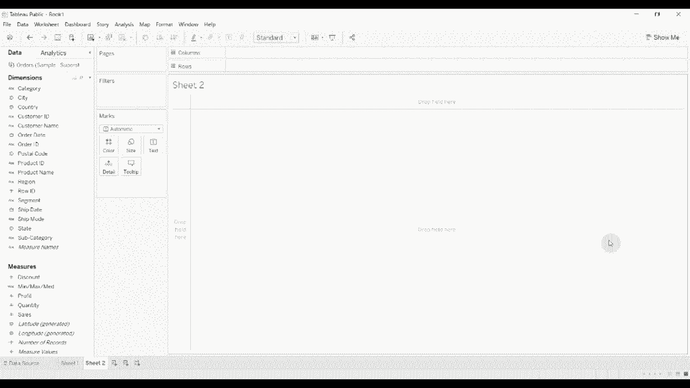

## 创建基础条形图

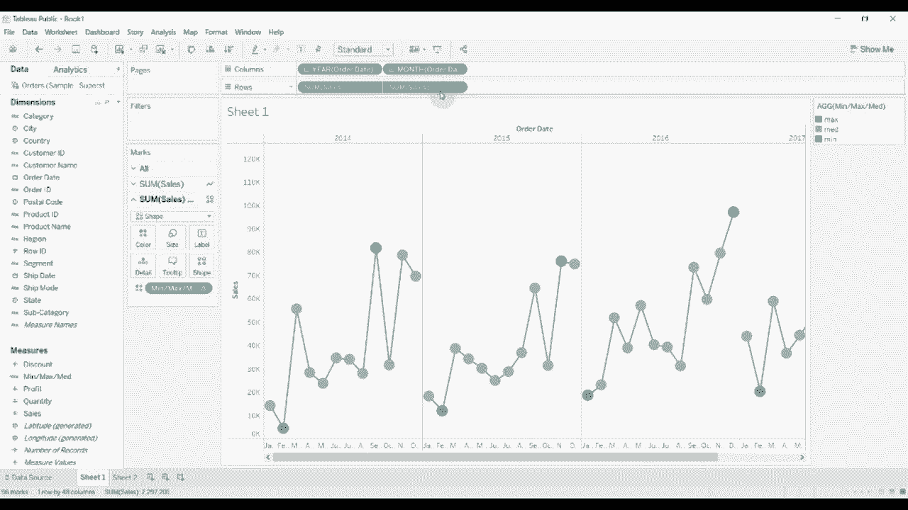

以下是创建基础条形图的步骤：

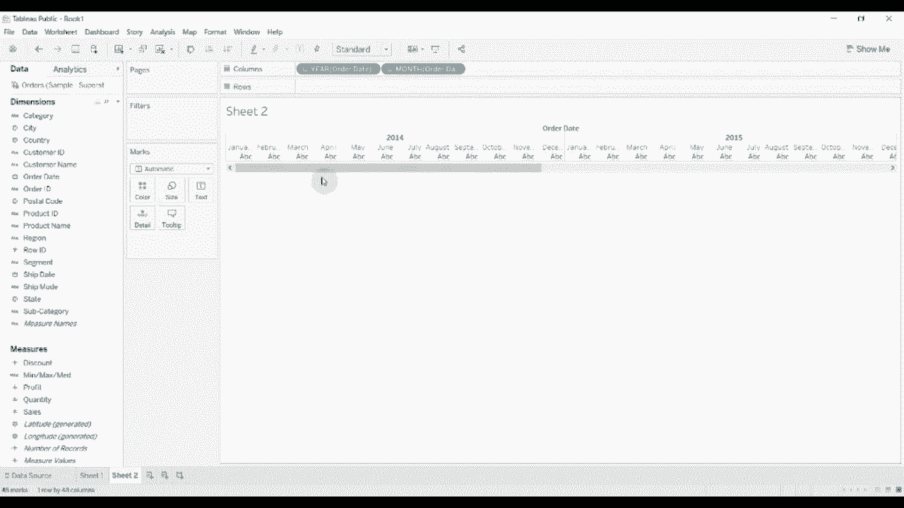

1.  将“订单日期”字段拖放至**列**功能区。
2.  在“订单日期”胶囊上点击下拉菜单，移除“季度”粒度，仅保留“年-月”。
3.  将“销售额”字段拖放至**行**功能区。
4.  在“标记”卡中，将图形类型从“自动”更改为“条形图”。

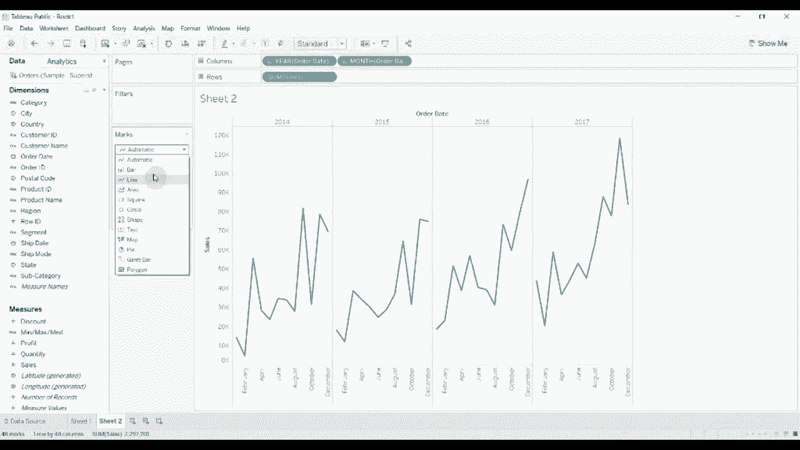

至此，一个按月份展示销售额的条形图就创建完成了。

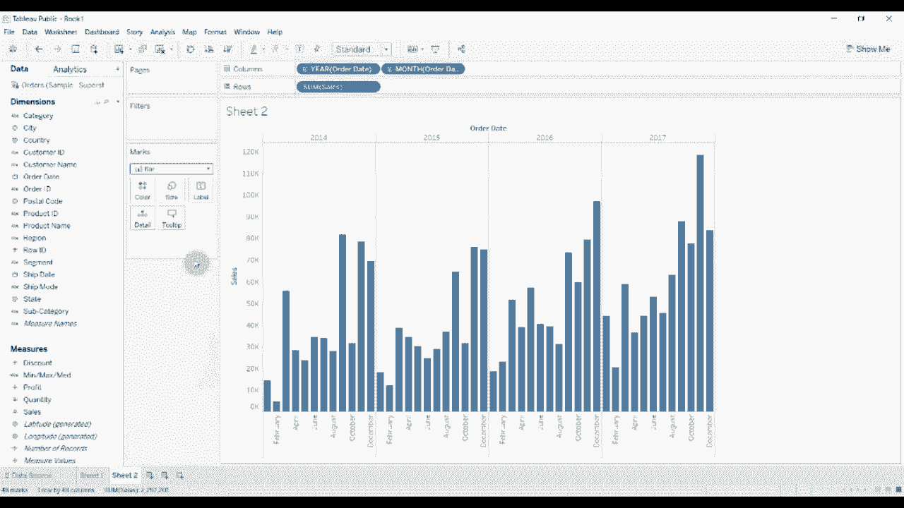

## 创建极值计算字段

为了区分最大值、最小值和其他值，我们需要创建一个计算字段。

该计算字段的逻辑是：判断当前月份的销售额是否等于其所在年份内的最高或最低销售额。

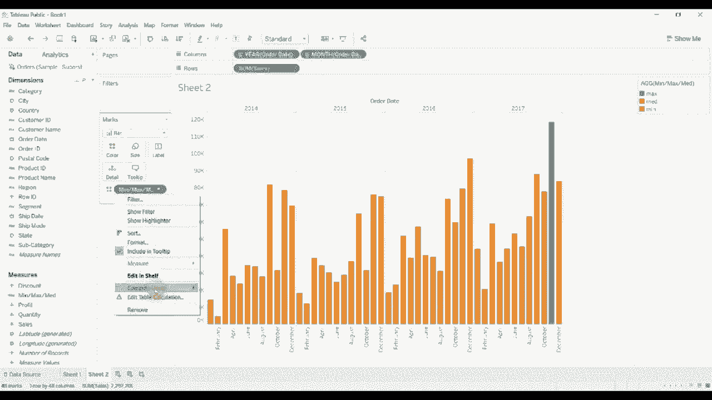

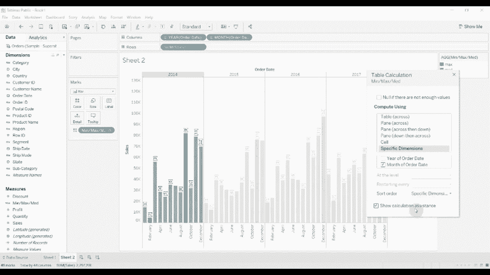

核心公式如下：
```
IF SUM([Sales]) = WINDOW_MAX(SUM([Sales])) THEN 'Max'
ELSEIF SUM([Sales]) = WINDOW_MIN(SUM([Sales])) THEN 'Min'
ELSE 'Other'
END
```
*   `WINDOW_MAX(SUM([Sales]))` 用于计算指定窗口（如一年）内的最大销售额。
*   `WINDOW_MIN(SUM([Sales]))` 用于计算指定窗口内的最小销售额。

## 应用计算字段并设置格式

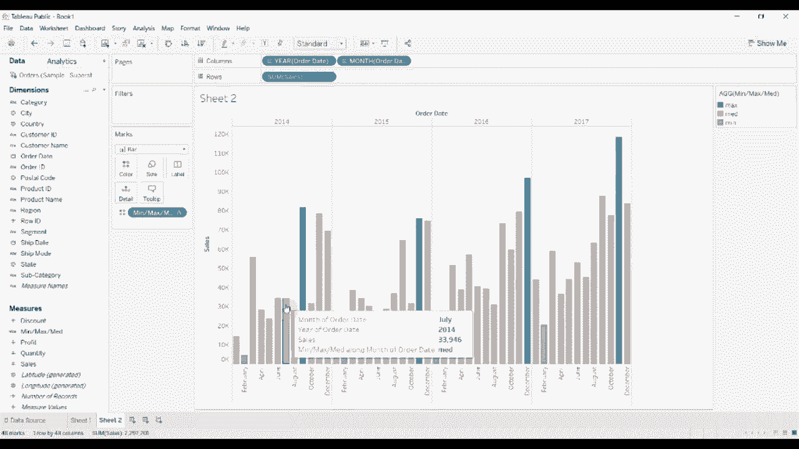

创建好计算字段后，我们需要将其应用到视图中并进行颜色编码。

1.  将新建的“极值标识”计算字段拖放至“标记”卡的**颜色**上。
2.  点击“颜色”图例，编辑颜色分配：
    *   将“Max”设置为醒目的**蓝色**。
    *   将“Min”设置为醒目的**红色**。
    *   将“Other”设置为**灰色**。

此时，条形图会根据年份自动高亮显示该年销售额最高和最低的月份。

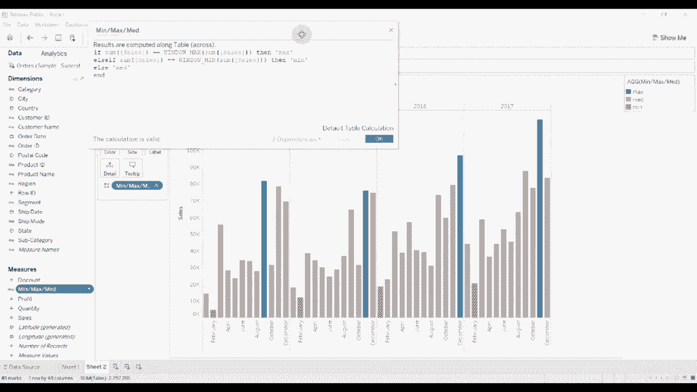

## 调整表计算范围

默认计算可能基于整个视图。为了确保极值是在每一年内分别计算，我们需要调整表计算的范围。

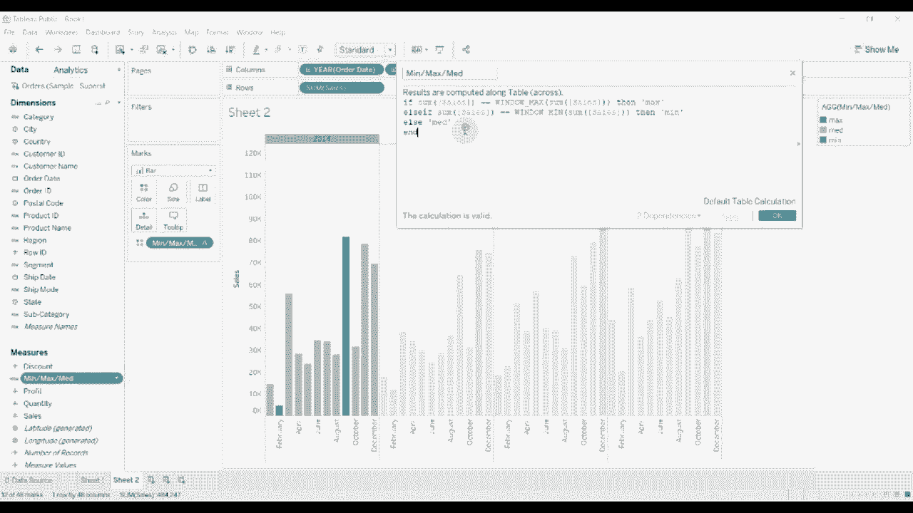

1.  右键单击“标记”卡上“极值标识”字段胶囊。
2.  选择“编辑表计算”。
3.  在“计算依据”选项中，选择“特定维度”。
4.  确保仅勾选了“年-月”字段，并取消勾选“年”。这表示计算将在每个“年”的分区内进行。

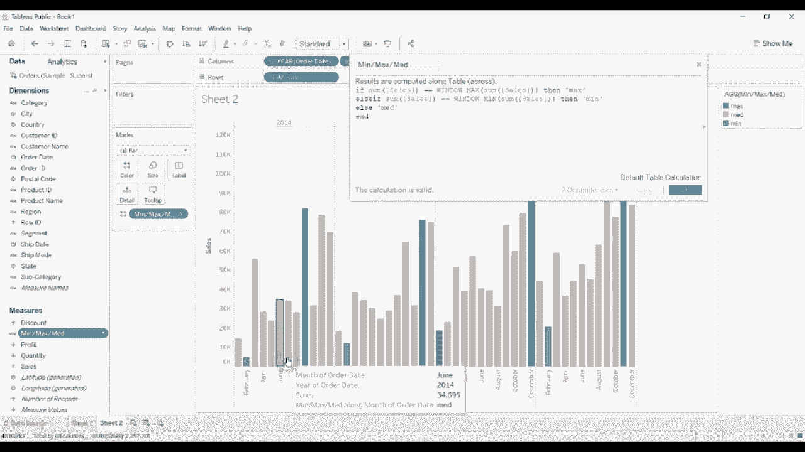

调整后，高亮效果将基于每一年内的数据独立判断最大值和最小值。

## 效果与应用总结

完成以上步骤后，你的条形图便能清晰地突出显示每年中的销售峰值和谷值月份。这种可视化方法非常实用：

*   **快速洞察**：帮助观众一眼识别出表现最佳和最差的时期。
*   **增强仪表板**：通过色彩对比为仪表板增添视觉亮点，强调数据的影响力。
*   **灵活应用**：此逻辑可适配于多种需要标识排名或特定阈值的数据场景。

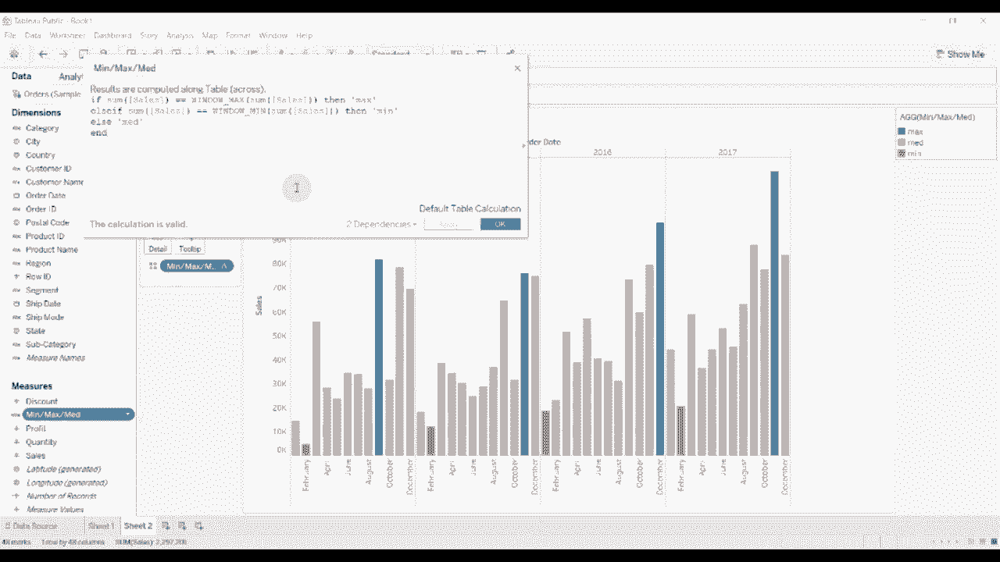

本节课中我们一起学习了在Tableau条形图中突出显示最大值和最小值的方法。我们首先创建了基础条形图，然后通过一个包含`WINDOW_MAX`和`WINDOW_MIN`函数的计算字段来标识极值，最后通过颜色编码和调整表计算范围完成了整个可视化过程。掌握这一技巧，能让你制作的数据图表更具表现力和洞察力。