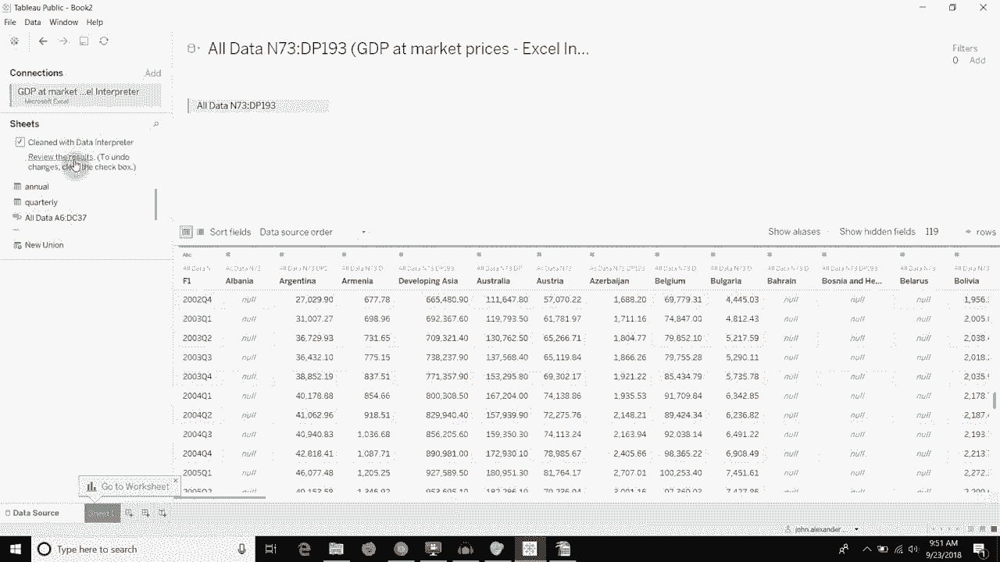

# Tableau操作详解 P17：使用数据解释器清理数据 📊

在本节课中，我们将学习如何使用Tableau的“数据解释器”功能，来清理那些格式不规范、包含多个表格或多余空行的Excel或CSV数据源。这个工具能自动识别并分离数据，让非标准格式的数据变得可用。

## 问题描述：非标准格式的数据

上一节我们介绍了连接标准数据源的方法。但在实际工作中，你可能会遇到格式混乱的数据文件。本节中我们来看看一个典型例子。

这里有一个Excel工作簿，其中包含多个工作表。前两个工作表的数据格式相对规整。然而，名为“所有数据”的工作表却存在问题。

该工作表顶部存在空白行。其内容实际上由两个独立的表格拼接而成：第一个表格位于左上方，第二个表格则错位地出现在右下方。如果直接将其作为单一数据表读取，会导致列数据错乱，底部出现大量空值，无法在Tableau中直接进行有效分析。

## 解决方案：启用数据解释器

面对这种非标准格式的数据，我们可以使用Tableau的“数据解释器”功能来修复。

1.  在Tableau的数据源页面，连接包含混乱数据的Excel文件。
2.  选中“所有数据”工作表后，你会在预览区域看到数据混杂在一起，第二个表格的数据以空值形式出现在错误的位置。
3.  此时，勾选左侧“连接”窗格下的“使用数据解释器”选项。

数据解释器会自动扫描工作簿，识别其中可能存在的独立数据表区域。处理完成后，你会发现数据源中不再是原来的三个工作表，而是新增了两个由数据解释器生成的工作表。

## 理解处理结果

以下是数据解释器处理后的关键变化：

*   **分离表格**：原始混乱的“所有数据”工作表，被拆分成了两个独立的新工作表。一个包含顶部的年度数据表，另一个包含右下方的季度数据表。
*   **清理无关内容**：数据解释器自动移除了表格之间的所有空行，使数据结构变得清晰。
*   **数据标准化**：工具会将某些特定文本（如“N/A”）自动转换为`null`值，这更利于后续的数据分析和计算。

你还可以点击“查看结果”按钮，Tableau会生成一个报告，以颜色高亮（如红色表示标题，绿色表示数值）和边框的形式，直观展示数据解释器是如何识别和分离原始数据中的各个表格的。

## 总结

本节课中我们一起学习了Tableau“数据解释器”的强大功能。它能够智能识别非标准格式数据源中的多个表格，自动清理空白行，并将数据分离到不同的工作表中。对于包含合并单元格、多个区块或多余标题行的Excel文件，这是一个非常高效的预处理工具。处理后的数据就可以像常规数据源一样，用于构建可视化和深入分析。