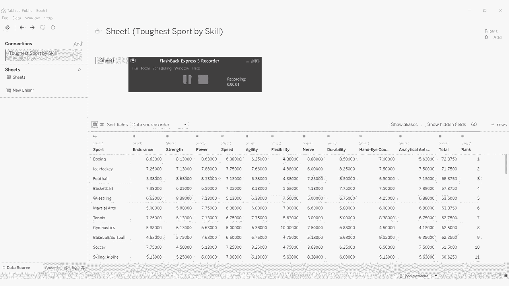
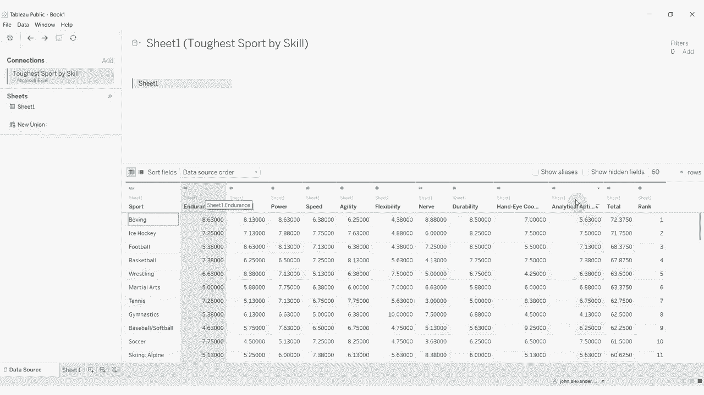
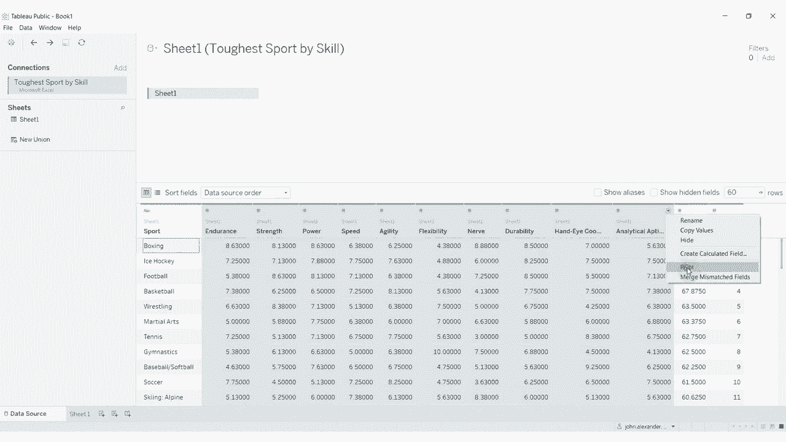
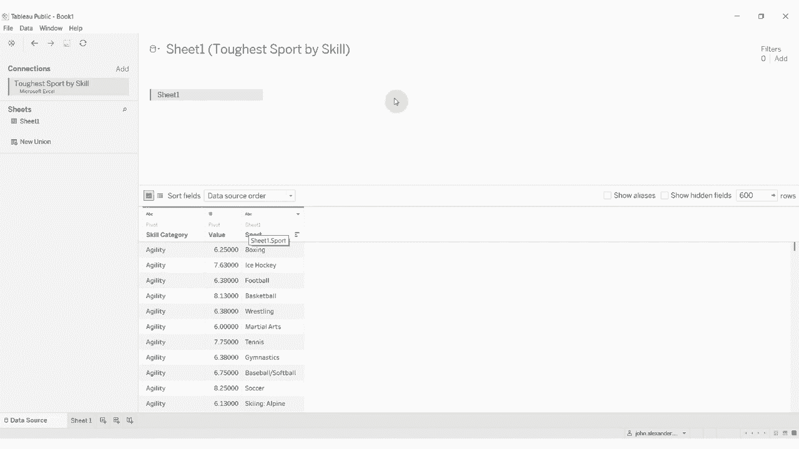
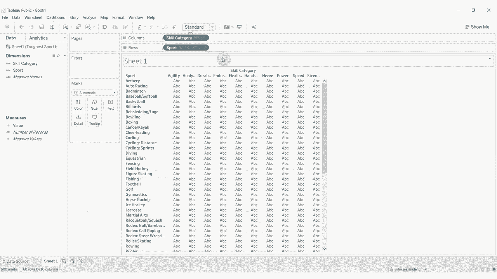
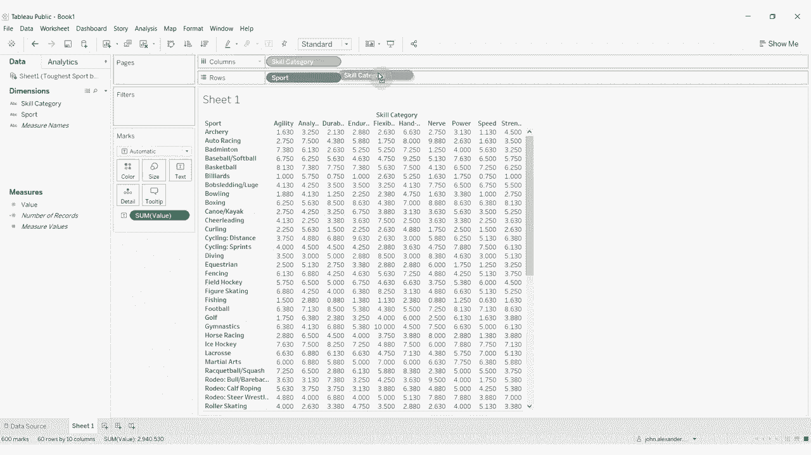
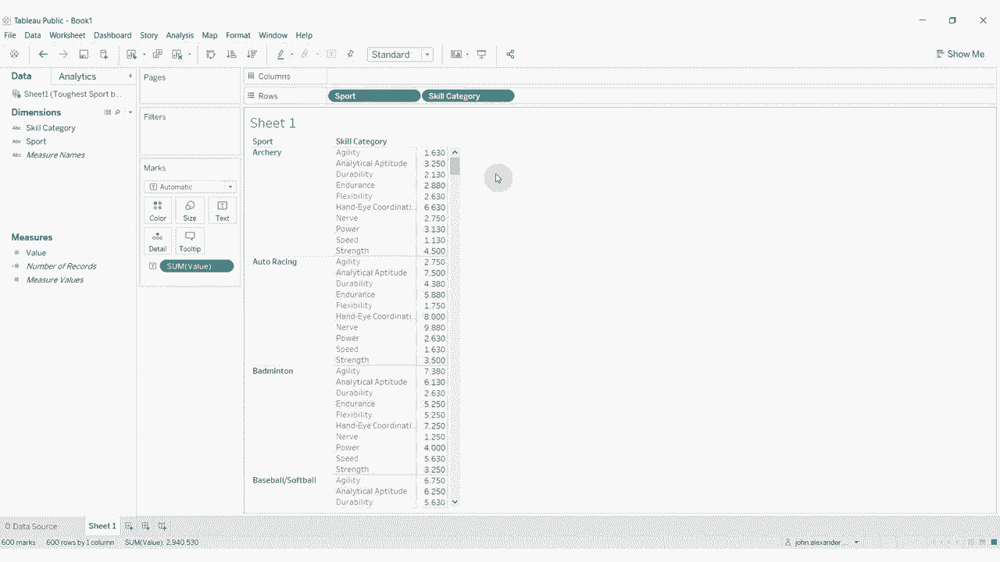

# Tableau操作详解 P18：透视数据源中的数据 🔄

在本节课中，我们将学习如何使用Tableau的“透视”功能，将数据从按列排列的结构转换为按行排列的结构。这种转换是数据整理中的常见操作，能让数据更符合Tableau的分析习惯。

## 概述：什么是数据透视？

在开始操作前，我们先理解一下“透视”的概念。有时，我们拿到的数据源中，同一类别的数据（例如不同技能的分值）会分布在多个列中。这种“宽表”格式虽然便于人类阅读，但在Tableau等分析工具中，更倾向于使用“长表”格式，即每个观测值独占一行。透视操作就是将多列数据“折叠”成两列：一列用于标识类别，另一列用于存放对应的值。

上一节我们介绍了数据连接的基础，本节中我们来看看如何通过透视来重塑数据。

## 操作步骤详解

以下是使用Tableau透视数据的具体步骤。

1.  **选择需要透视的列**
    在数据源界面，找到需要转换的列。在本例中，是代表不同技能类别的多个评分列。点击第一个列名，按住 `Shift` 键，再点击最后一个列名，即可选中连续的多个列。

    

2.  **执行透视操作**
    在任意一个被选中的列标题上，点击出现的向下箭头。在弹出的菜单中，选择“透视”选项。

    

3.  **理解透视结果**
    执行透视后，Tableau会生成两个新字段：
    *   **透视字段名称**：默认名为“透视字段”，它包含了原来那些列的名称（即各个技能类别）。
    *   **透视字段值**：默认名为“值”，它包含了原来各列下的具体数据（即各项技能的评分）。
    原有的数据列（技能评分列）会被这两个新字段取代。

4.  **重命名字段**
    为了使数据更清晰，建议重命名这两个新字段。例如，可以将“透视字段名称”重命名为“技能类别”，将“值”重命名为“评分”。

5.  **处理重复字段**
    透视后，原数据中其他未参与透视的字段（如“运动”、“总数”、“排名”）会为每个新的数据行重复出现。如果某些字段在分析中不再需要，可以在数据源界面右键点击它们，选择“隐藏”，以简化视图。

    

## 透视后的数据应用

完成透视后，数据就变成了Tableau更喜欢的“长格式”。让我们进入工作表视图看看效果。

1.  **构建视图**
    我们可以将“运动”字段拖到行功能区，将“技能类别”字段拖到列功能区。
2.  **添加度量**
    最后，将“评分”字段拖到“标记”卡的“文本”上或直接拖入视图。

    
    

现在，我们就得到了一个清晰的交叉表，展示了每项运动在不同技能类别上的评分。数据已经从“多列存储同类数据”转换为了“多行存储同类数据”。

## 总结

本节课中我们一起学习了Tableau中非常重要的数据整理功能——透视。我们掌握了如何将按列排列的“宽表”数据，通过选中多列并执行“透视”命令，转换为按行排列的“长表”数据。这种转换使得“技能类别”和“评分”成为了独立的字段，极大地便利了后续的筛选、分组和可视化操作。记住，Tableau更擅长处理“长格式”数据，透视是达成这一目标的关键步骤。

---
*数据集和工作簿链接可在视频描述中查找。*