# Tableau操作详解 P19：维度、度量与离散、连续 📊

在本节课中，我们将学习Tableau中两个核心概念：**维度**与**度量**，以及**离散**与**连续**字段的区别。理解这些概念是创建有效可视化的基础。

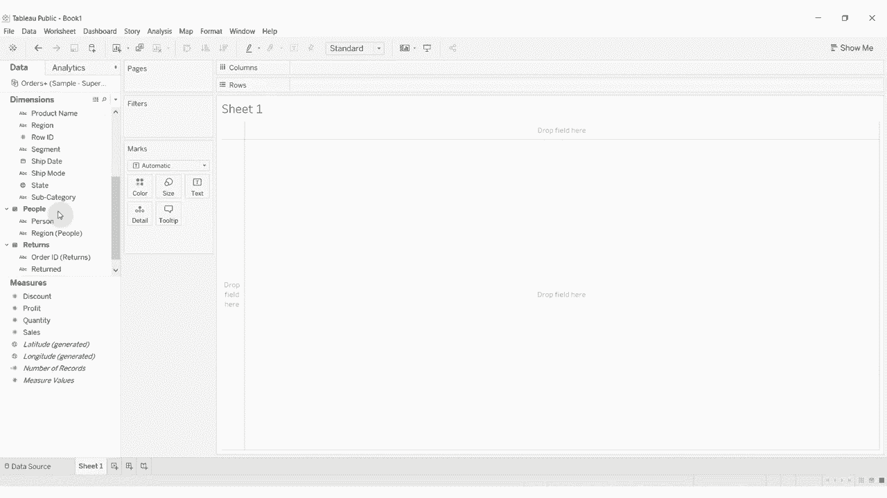

## 概述：数据字段的两种角色

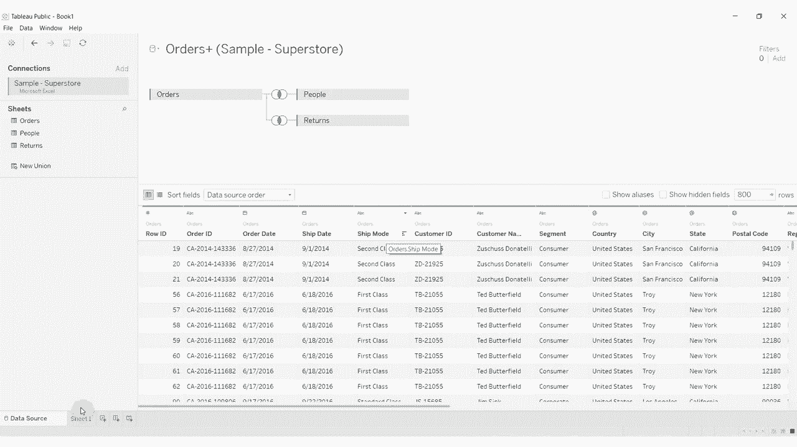

在Tableau中，数据源的每一列都会出现在“数据”窗格中，并分为“维度”和“度量”两个区域。这代表了它们在分析中扮演的不同角色。

上一节我们介绍了数据的基本导入，本节中我们来看看如何区分和使用这些不同类型的字段。

---

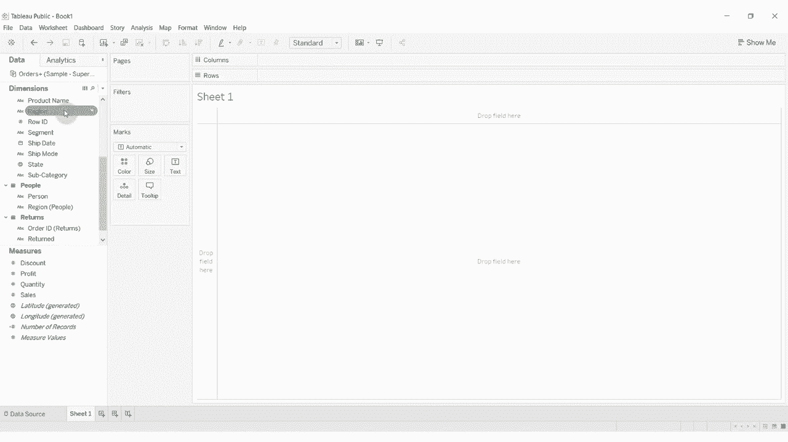

## 1. 维度与度量的区别

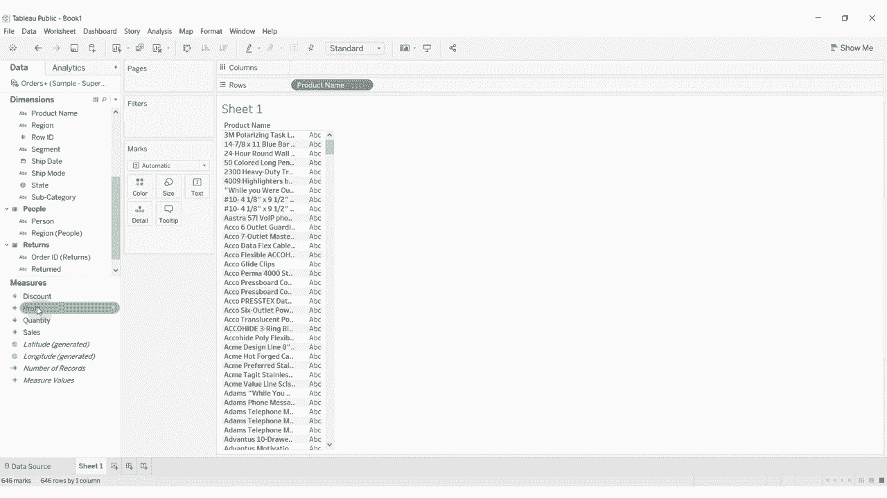

**维度**通常是我们用来**划分**或**细分**数据的字段。例如，产品类别、地区、年份等。它们为分析提供上下文和分类。

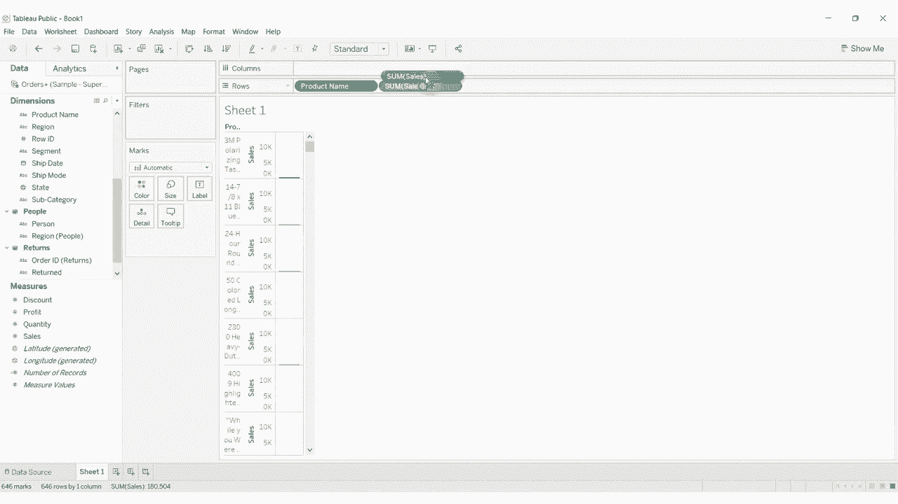

**度量**则是我们想要**测量**或**汇总**的数值型数据。例如，销售额、利润、数量等。我们通常会对度量进行求和、求平均等聚合计算。

以下是两者核心区别的总结：
*   **维度**：用于分类和分组。通常是文本、日期或布尔值（是/否）。
*   **度量**：用于计算和聚合。通常是数字。

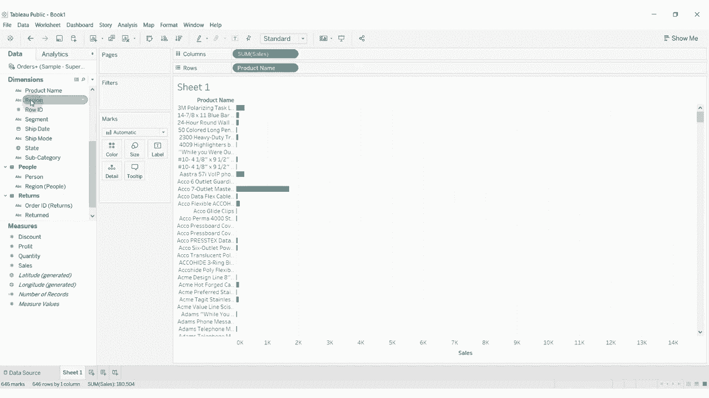

让我们通过一个例子来具体看看。将“产品名称”（一个维度）拖到“行”功能区，然后将“销售额”（一个度量）拖到“列”功能区。此时，视图会显示每个产品的销售额总和。这里，“产品名称”在划分数据，而“销售额”在被汇总。

---

## 2. 离散与连续的区别

在Tableau中，每个字段胶囊（数据字段的图标）都有颜色：蓝色代表**离散**，绿色代表**连续**。这是控制视图如何呈现的关键。

**离散**字段代表独立的、个别的类别。它们将数据分割成不连续的部分。在视图中，离散字段会创建独立的标题、图例或轴标签。
*   **公式/概念**：`蓝色胶囊` = 离散字段。例如：“区域”字段中的“东部”、“西部”、“中部”是三个独立的点，不能相加。

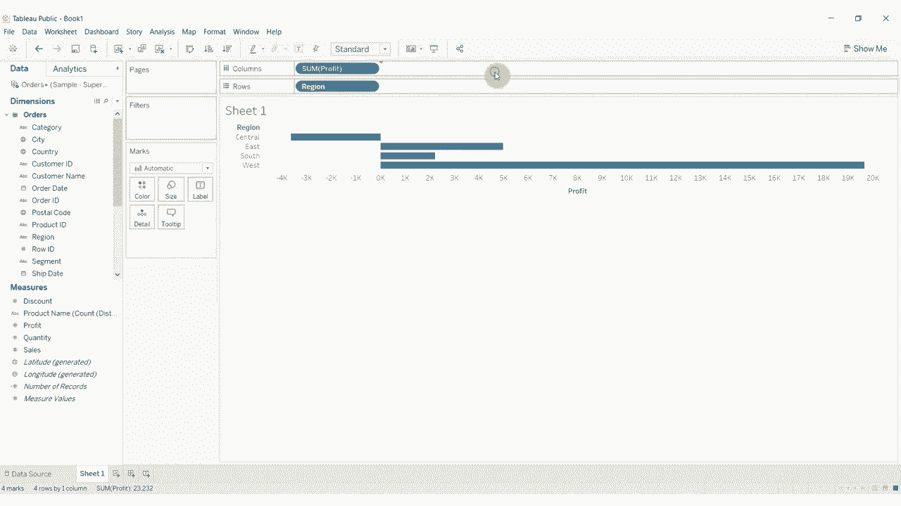

**连续**字段代表可以形成范围或区间的数值。它们会创建一个可以度量的轴。
*   **公式/概念**：`绿色胶囊` = 连续字段。例如：“利润”字段的值可以形成一个从最小值到最大值的连续区间，我们可以计算其总和或平均值。

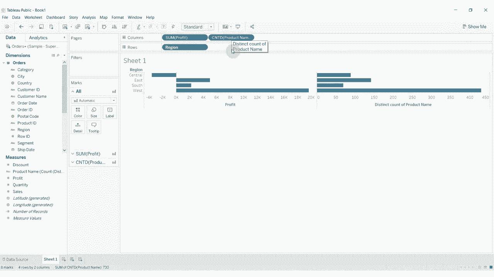

通常，维度字段是离散的（蓝色），度量字段是连续的（绿色）。但这不是绝对的规则。

---

## 3. 字段类型的转换与影响

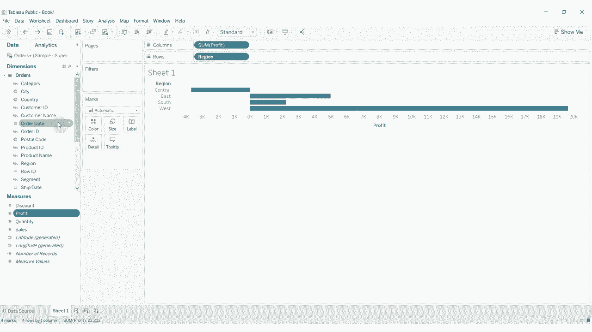

字段的角色和性质并非一成不变，理解其转换对可视化至关重要。

### 维度与度量的转换
有时，一个字段可以从维度转换为度量。例如，将“产品名称”从维度区拖到度量区，Tableau会默认将其转换为“产品名称的计数”。此时，它从一个分类字段（维度）变成了一个可计算的数值（度量）。

### 离散与连续的转换
日期字段是展示离散与连续转换的绝佳例子。默认情况下，日期字段是离散的（蓝色），并按年、季度、月等层级显示。

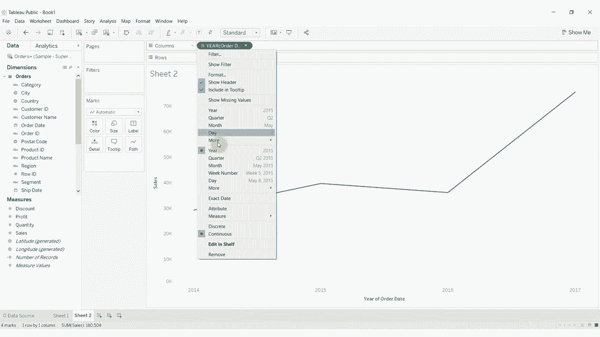

然而，你可以将其转换为连续字段（绿色）。点击日期字段右侧的下拉箭头，在“精确日期”下选择“连续”。此时，胶囊变为绿色，视图通常会从分段条形图变为连续的线图，因为时间被视作一个不间断的区间。

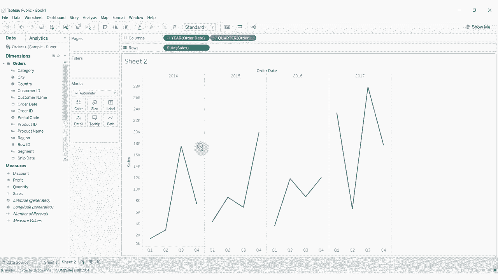

上一节我们介绍了字段的基本概念，本节中我们来看看这些转换如何具体改变视图。

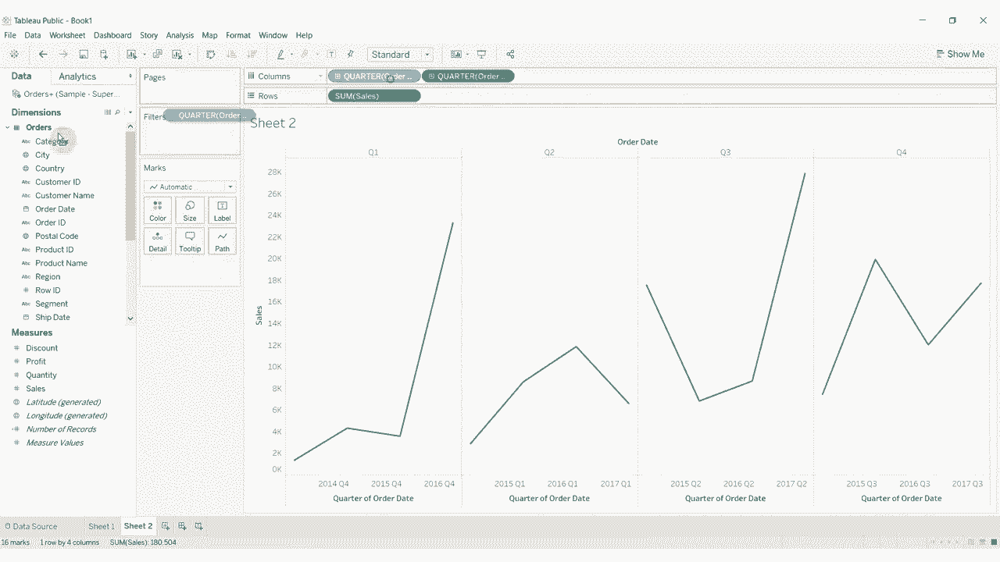

以下是一个操作示例：
1.  将离散的“订单日期（年）”拖到列功能区，生成按年分段的条形图。
2.  将其更改为连续的“订单日期”（精确日期），视图会变为一条跨越整个时间范围的连续折线图。
3.  如果再添加一个离散的“季度”到“颜色”标记卡，这条连续的线又会被按季度分段着色。

---

## 总结

本节课中我们一起学习了Tableau中四个相互关联的核心概念：
1.  **维度**：用于划分和分类数据的字段（通常是文本、日期）。
2.  **度量**：用于测量和汇总的数值字段。
3.  **离散**（蓝色）：代表独立的类别，创建分隔的视图元素。
4.  **连续**（绿色）：代表可形成范围的数值，创建连续的轴。

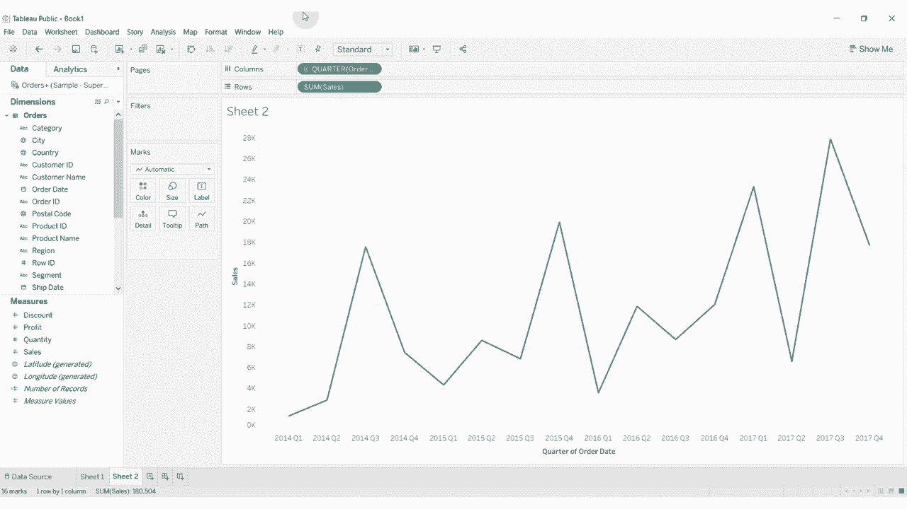

简单来说：我们常用**维度**（通常是离散的）来**切分**数据，然后用**度量**（通常是连续的）来**计算**每个部分的值。掌握维度/度量与离散/连续的区别及转换，是灵活运用Tableau构建各种图表的基础。