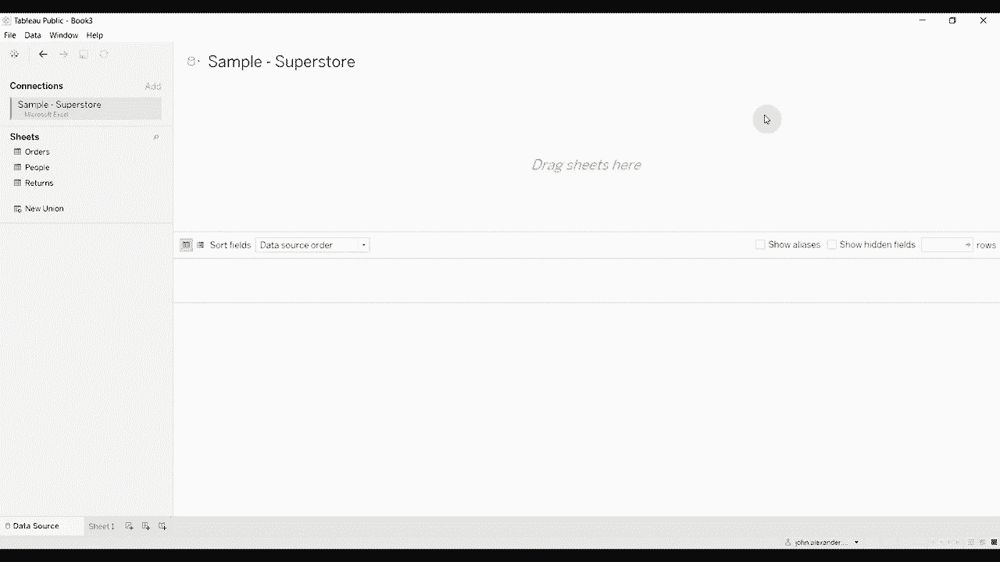
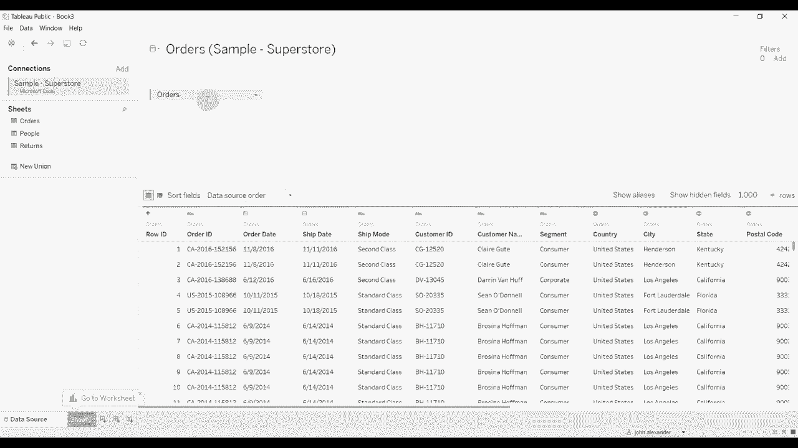
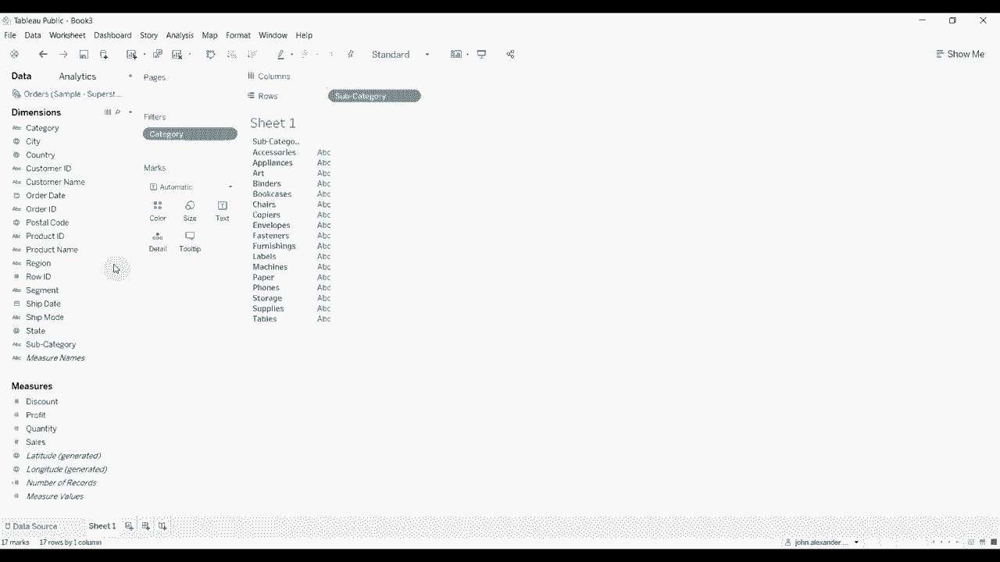
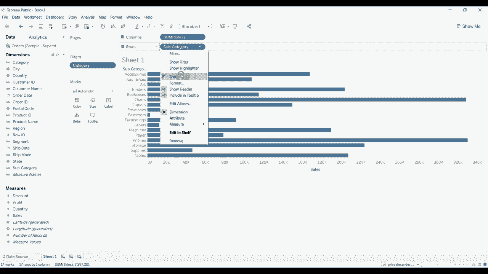
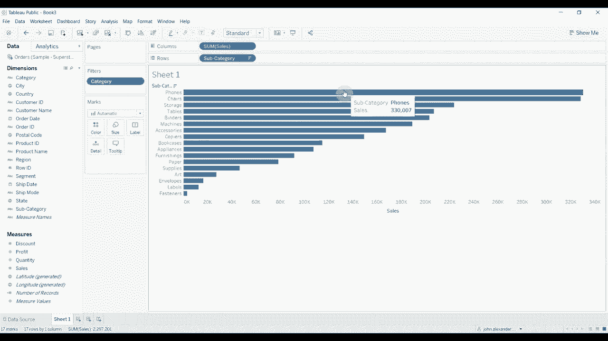
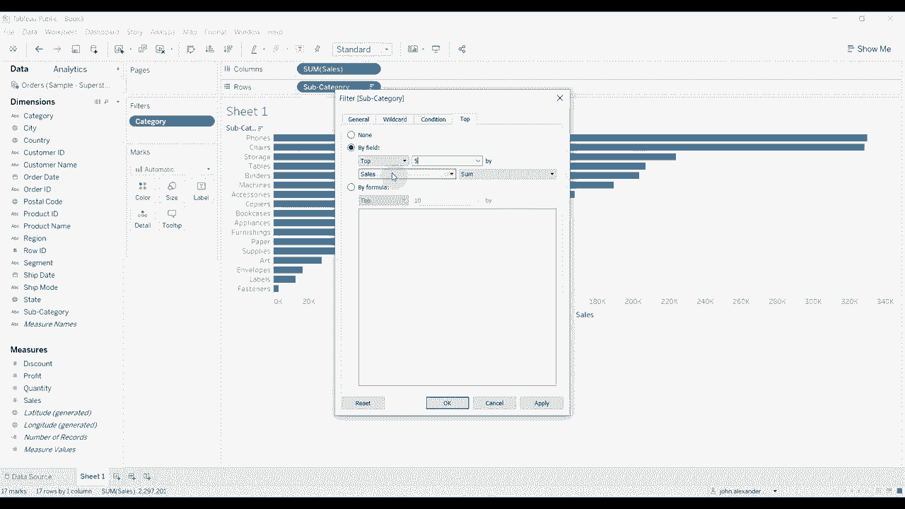
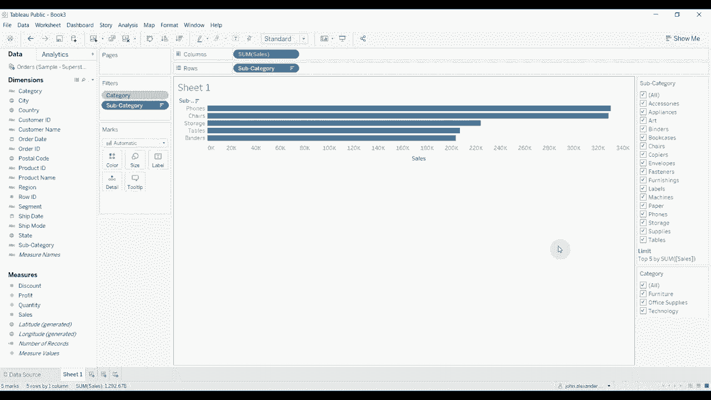

# Tableau操作详解 P2：上下文过滤器与仪表板性能优化 🚀

在本节课中，我们将学习Tableau中的**上下文过滤器**。我们将了解它的工作原理，以及如何利用它来提升仪表板的性能，并精确控制视图中所显示的数据内容。

---

## 数据准备与基础视图

首先，我们连接到“超市”数据集中的“订单”表。

接下来，我们创建一个简单的视图来演示。

1.  将“类别”字段拖到“筛选器”架上，并选择所有类别。
2.  将“子类别”字段拖到“行”功能区。
3.  将“销售额”字段拖到“列”功能区。

此时，我们得到了一个按子类别显示销售额的条形图。为了更清晰，我们可以对条形图进行排序，选择按销售额**降序**排列。

---

## 应用“前N个”过滤器及其问题

现在，假设我们只想在视图中显示销售额排名前五的子类别。我们可以轻松地通过添加一个“前N个”过滤器来实现。

操作步骤如下：
1.  将“子类别”字段再次拖到“筛选器”架上。
2.  在筛选器对话框中，选择“顶部”选项卡。
3.  按字段“销售额”的总和，选择排名前“5”项。

应用后，视图确实只显示了五个条形。但这里存在一个问题：如果我们通过顶部的“类别”筛选器来排除某些类别（例如取消勾选“家具”），你会发现视图中显示的子类别数量可能会减少（例如变成三个），而不会用其他类别下的子类别来补足前五名。

**原因在于**：Tableau默认的筛选顺序是，先计算所有数据中的“前五名”，然后再应用“类别”筛选器。因此，当“家具”类别被排除后，属于该类别的前五名条目也被移除了，视图就只显示剩余类别中仍在原“前五名”列表里的项目。

---

## 引入上下文过滤器

为了解决上述问题，并优化性能，我们需要使用**上下文过滤器**。

上一节我们看到了默认筛选顺序导致的问题，本节中我们来看看如何通过改变筛选顺序来解决它。

操作非常简单：
1.  在“筛选器”架上，右键单击“类别”筛选器。
2.  在弹出的菜单中选择“添加到上下文”。

**关键变化**：将筛选器“添加到上下文”后，它会在**所有其他筛选器和计算之前优先执行**。这意味着，数据库会先根据“类别”筛选器返回过滤后的数据子集，然后Tableau再在这个子集上计算“前五名”子类别。

此时，如果我们再取消勾选“家具”类别，视图将显示在“办公用品”和“技术”这两个剩余类别中，销售额排名前五的子类别。数据是连贯且符合预期的。

---

## 上下文过滤器的核心优势

上下文过滤器主要带来两大好处：**功能准确性**和**性能提升**。

### 1. 确保计算与筛选的逻辑正确性
如上例所示，它能确保“前N个”、“百分比”等计算基于已通过上下文过滤的数据集，从而得到预期结果。

### 2. 显著提升仪表板性能
这是上下文过滤器更重要的一个作用。当我们将一个筛选器（如“类别”）设置为上下文后，它相当于在数据源层面进行了一次提前过滤。

以下是它提升性能的原理：
*   **减少后续计算量**：所有后续的筛选器、计算字段、视图渲染都只需要处理通过上下文过滤后的、数据量更小的数据集。
*   **优化筛选器列表**：在具有交互性的仪表板中，依赖上下文过滤器的其他筛选器（如下拉列表）将只显示在当前上下文中有意义的选项，这能加快筛选器本身的响应速度。

例如，在应用了“类别”上下文过滤器后，“子类别”筛选器下拉列表中就只会出现所选类别下的子类别，列表更短，加载和搜索更快。

---

## 总结

在本节课中，我们一起学习了Tableau中**上下文过滤器**的核心概念与应用。

*   **功能**：上下文过滤器通过**优先执行**，改变了默认的筛选顺序，确保了复杂计算（如排名、百分比）的正确性。
*   **性能**：它能**减少后续操作的数据集规模**，从而显著提升仪表板、计算字段和其他筛选器的响应速度。
*   **操作**：只需右键单击任意筛选器，选择“添加到上下文”即可启用。

合理使用上下文过滤器，是构建既准确又高效的Tableau仪表板的关键技巧之一。