# Tableau操作详解 P20：动态集操作 🎯

在本节课中，我们将学习Tableau 2018.3版本引入的新功能：**动态集**。我们将了解如何动态地向集合中添加或移除项目，并利用此功能创建交互式可视化图表。

## 概述

在Tableau 2018.3之前，创建集合是一个静态过程。用户需要右键点击字段，手动选择项目来定义集合成员。本节教程将展示如何创建动态集，并通过仪表板交互实时更新集合内容，从而改变另一个视图的展示效果。

## 创建基础可视化

首先，我们需要创建两个基础工作表，为后续的动态集交互做准备。

### 1. 创建时间序列图

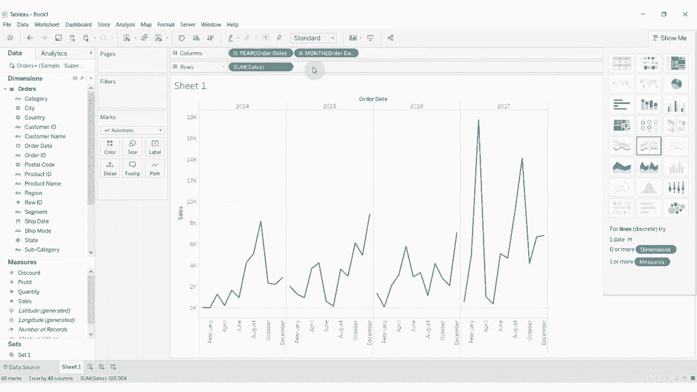

我们将创建一个展示月度销售额的柱状图。

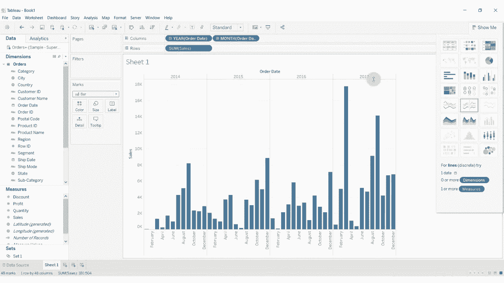

*   将 `订单日期` 字段拖放至**列**功能区。
*   将 `销售额` 字段拖放至**行**功能区。
*   在视图上右键点击 `订单日期` 胶囊，选择“月”以展开为月度视图。
*   在“标记”卡中，将图形类型改为“条形图”。

至此，我们得到了一个显示2014年至2017年各月销售额的柱状图。

### 2. 创建区域销售汇总图

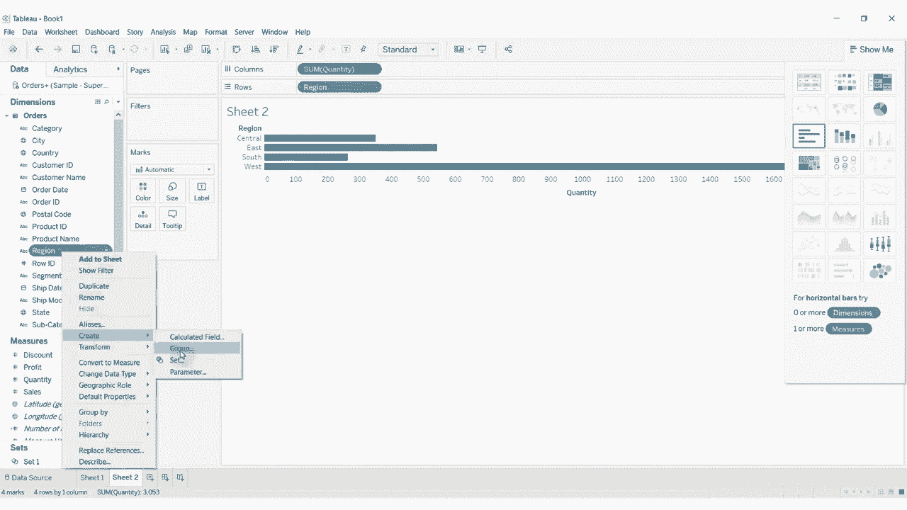

接下来，我们创建一个按区域汇总销售数量的条形图。

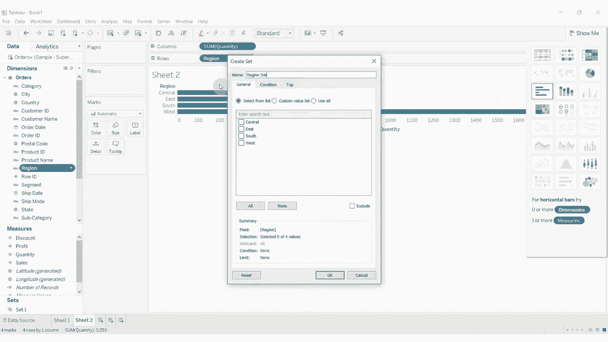

*   将 `区域` 字段拖放至**行**功能区。
*   将 `数量` 字段拖放至**列**功能区，Tableau会自动将其聚合为“总和(数量)”。

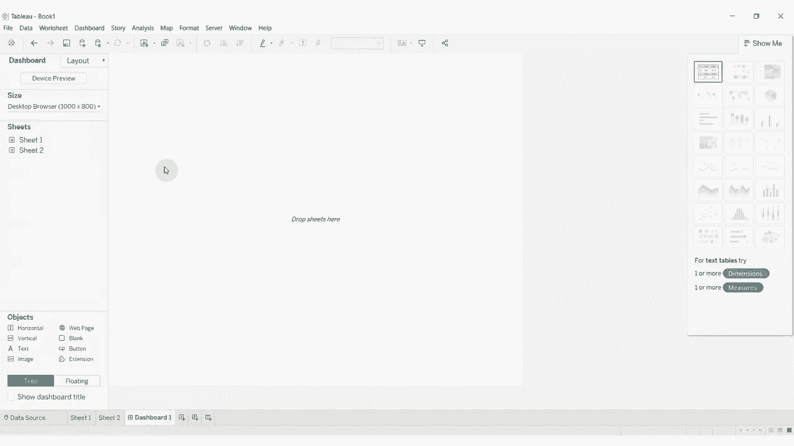

这个视图展示了四个区域的总销售单位数。

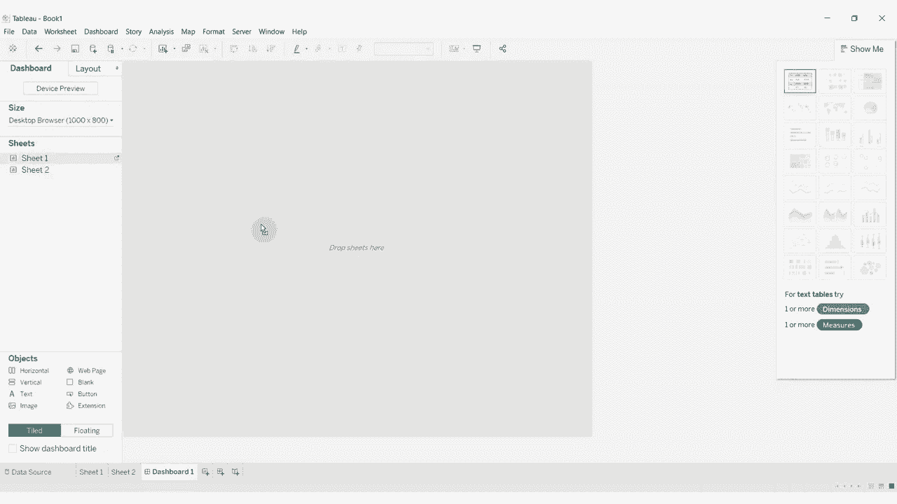

## 创建动态集

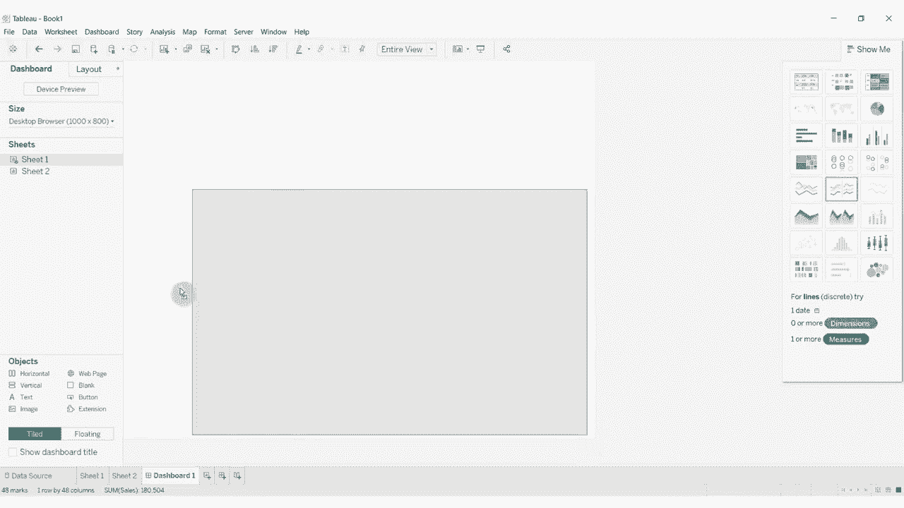

现在，我们来创建一个初始为空的动态集合，它将作为我们交互的核心。

*   在“数据”窗格中，右键点击 `区域` 字段。
*   选择“创建” -> “集...”。
*   在弹出的对话框中，将集合命名为“区域集合”。
*   在“成员”选项卡下，不选择任何项目，保持集合为空，然后点击“确定”。

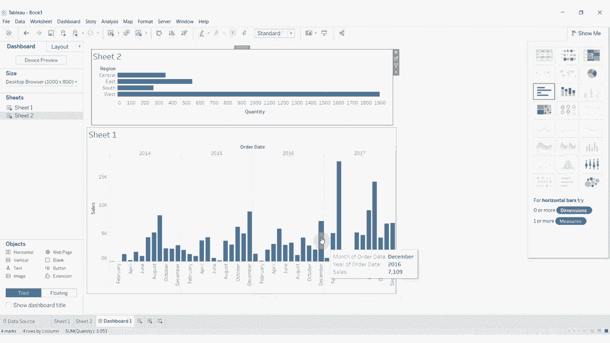

## 构建交互式仪表板

动态集的力量在仪表板中才能完全展现。我们将把两个工作表组合起来，并设置交互动作。

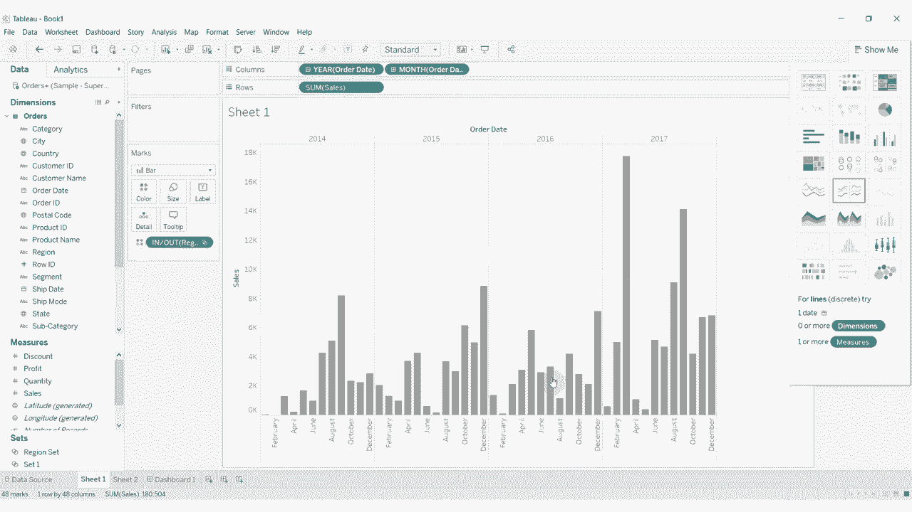

*   新建一个仪表板。
*   将**时间序列图**工作表拖入仪表板。
*   将**区域销售汇总图**工作表拖入仪表板，放置在上一个视图的下方。

接下来，我们需要将动态集应用到时间序列图中，并设置高亮颜色。

*   回到**时间序列图**工作表。
*   将刚刚创建的“区域集合”从“数据”窗格拖放至“标记”卡上的**颜色**。
*   此时，由于集合为空，所有条形都显示为灰色。

## 设置集操作实现动态交互

关键的一步是设置一个“集操作”，让点击区域图表能动态更新集合。

*   回到**仪表板**界面。
*   在顶部菜单栏选择“仪表板” -> “操作...”。
*   点击“添加动作”，并选择“更改集值...”。
*   配置集操作：
    *   **名称**：可保留默认或自定义。
    *   **源工作表**：选择包含区域条形图的表（即“表2”）。
    *   **目标集**：选择我们创建的“区域集合”。
    *   **运行操作方式**：选择“选择”，这样点击即可触发。
    *   **清除选定内容时**：选择“从集中移除所有值”。这确保当我们取消选择时，集合恢复为空，下方图表变回灰色。
*   点击“确定”保存动作。

现在，交互已经生效。点击上方区域图表中的某个条形（如“南部”），下方时间序列图中对应区域的月度销售额条柱就会高亮显示（变为蓝色），而其他区域保持灰色。点击其他区域可以累加选择。点击空白处取消选择，所有条柱恢复灰色。

## 优化视图效果

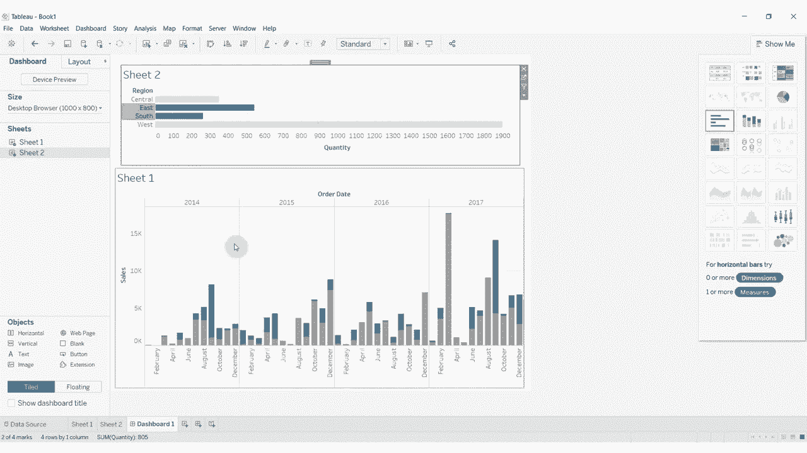

默认的交互和视图可能不够直观，我们可以进行两项优化。

### 1. 调整排序顺序

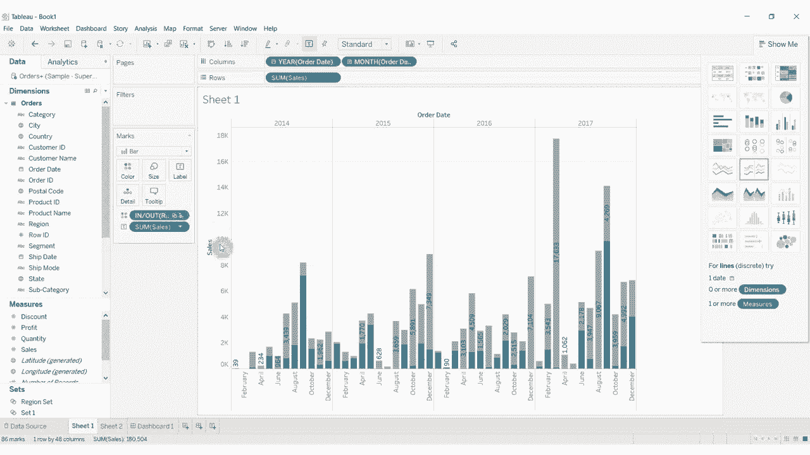

我们希望被选中（在集合内）的条柱显示在底部，未选中的显示在顶部，这样更符合视觉习惯。

*   在**时间序列图**工作表中，右键点击行上的 `订单日期` 胶囊。
*   选择“排序...”。
*   在排序对话框中，选择“按字段排序”。
*   排序顺序选择“降序”。
*   排序依据字段选择“区域集合（成员）”。这意味着属于集合成员（值为真）的条目会排在后面（底部）。

### 2. 添加数据标签

为了更清晰地看到销售额数值，我们可以为时间序列图添加标签。

*   在**时间序列图**工作表中，将 `销售额` 字段拖放至“标记”卡上的**标签**。
*   可以右键点击标签，选择“设置格式...”来调整数字显示格式。

## 总结

本节课我们一起学习了Tableau 2018.3的**动态集**功能。我们通过创建空集合、构建基础图表、在仪表板中设置**集操作**，实现了点击一个视图动态筛选并高亮另一个视图的效果。关键步骤包括：
1.  创建初始为空的集。
2.  将集应用于目标视图的颜色编码。
3.  在仪表板中创建“更改集值”操作，并正确配置源、目标和清除行为。
4.  通过调整排序优化高亮项目的显示位置。

这个功能极大地增强了仪表板的交互性，允许用户通过简单的点击探索数据子集在不同维度的表现。