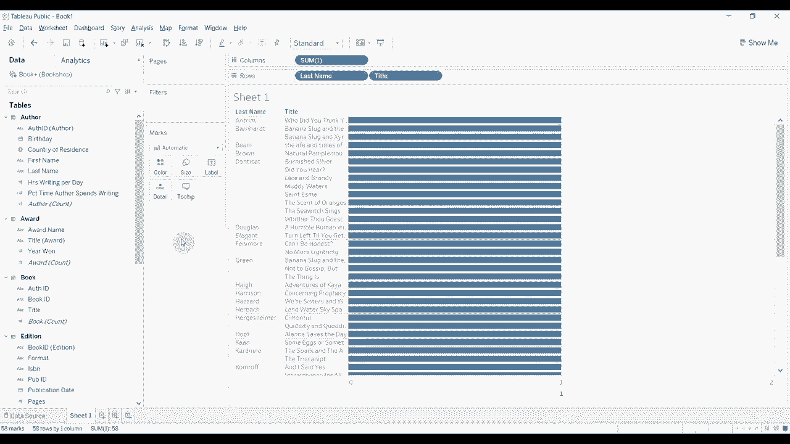

# Tableau操作详解 P21：关系、联接与合并 📊

在本节课中，我们将学习Tableau 2020版本中引入的新数据模型功能——关系。我们将探讨关系与传统的联接和合并有何不同，以及如何利用它们更灵活、更高效地准备和分析数据，而无需深入的SQL知识。

## 概述：为何使用关系？ 🤔

上一节我们介绍了课程主题，本节中我们来看看使用关系（Relationships）相较于传统联接（Joins）和合并（Unions）的优势。关系提供了更高的灵活性，允许你在不预先严格定义数据组合方式的情况下进行探索。这意味着你可以花更少时间准备数据，更多时间进行可视化和分析。

Tableau的关系功能还能帮助规避数据粒度不一致导致的问题，例如行重复。它引入了“智能聚合”概念，能根据每个视图的具体需求，在后台动态聚合数据，从而减少数据重复或计算错误的风险。

## 构建数据关系 🔗

现在，让我们通过一个书店数据集的实际例子，来看看如何构建关系。

首先，我们连接到“书籍”表，这将作为我们数据模型的基础表。

接下来，我们添加“奖项”表。此时，Tableau会弹出“编辑关系”对话框，我们需要定义两个表之间的匹配字段。

以下是定义关系时的关键选项：

*   **连接基数**：默认为“多对多”。仅当你确信键值在数据源中唯一时，才可设置为“一对一”。错误设置可能导致数据重复。
*   **引用完整性**：默认为“某些记录匹配”。如果你确定两个表的所有记录都能匹配，可选择“所有记录匹配”，这可能提升大数据集的查询性能。若不确定，建议保持默认。

然后，我们继续添加“作者”表。由于两个表中存在名称相同的字段（如`AuthorID`），Tableau会自动建议基于此字段建立关系。

## 处理复杂关系：关系计算 🧮

当我们尝试添加“信息”表时，遇到了挑战：两个表间没有名称相同的匹配字段。

这时，我们可以使用“关系计算”功能。例如，已知“书籍”表的`BookID`是“信息”表中`BookID1`和`BookID2`字段的组合。我们可以在编辑关系对话框中创建计算：`[BookID1] + [BookID2]`，从而成功建立连接。这比编写SQL语句更加简单灵活。

## 合并数据表 📂

除了关系，我们有时也需要合并结构相同的表，例如将Q1、Q2、Q3、Q4的季度销售数据堆叠在一起，形成全年的销售视图。这就要用到“合并”功能。

合并要求所有表的列结构和数据类型必须一致。操作时，只需将一个表拖放到另一个表下方，看到橙色“合并”图标后释放即可。合并后的表会显示为一个统一的逻辑表，你可以通过双击它来查看和编辑具体的合并细节。

## 回顾传统联接方式 ⚙️

尽管关系功能强大，但有时我们仍需要传统的联接所提供的精确控制。在数据源界面中，双击已通过关系连接的表，即可进入传统的联接视图。

以下是四种主要的联接类型及其含义：

*   **内连接**：仅包含两个表中匹配的记录。
*   **左连接**：包含左表所有记录，以及右表中匹配的记录。
*   **右连接**：包含右表所有记录，以及左表中匹配的记录。
*   **全外连接**：包含两个表中的所有记录，不匹配处填充空值。

例如，如果一本书有两位作者，使用内连接会导致书籍信息在结果中重复出现两次。这时，使用关系模型可能更能避免此类重复。

## 新数据模型下的重要变化 💡

使用关系型数据模型后，工作区界面和计算逻辑有一些重要变化：

1.  **字段组织**：字段不再统一按“维度”和“度量”分组，而是按来源表进行组织。每个表都有自己的维度和度量字段。
2.  **计算字段的存放**：仅使用单一表字段的计算会存放在该表下；而使用了多个表字段的计算则会出现在底部的“计算”区域。
3.  **常量计算的行为变化**：这是一个需要特别注意的地方。在新模型中，常量（如输入数字`1`）的计算是基于当前可视化所引用的数据行进行的，而非整个原始数据源的所有行。这意味着对常量求和的结果会随着视图中添加的字段不同而动态变化，在沿用一些旧的技巧方法时需要格外小心。

## 总结 📝

本节课中，我们一起学习了Tableau中关系、联接与合并的核心操作。关系是Tableau 2020引入的强大功能，它通过更灵活的数据模型，降低了数据准备门槛，并借助智能聚合减少了数据错误。同时，我们也回顾了传统的联接与合并方法，了解了它们在不同场景下的应用，并指出了在新数据模型下计算逻辑的一些重要变化，特别是常量计算行为的差异。掌握这些知识，将帮助你更高效、更准确地在Tableau中进行数据分析。