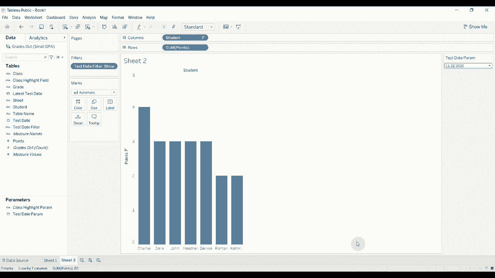

# Tableau操作详解 P22：动态参数 🎯

在本节课中，我们将学习Tableau中的动态参数功能。动态参数是Tableau 2020.1版本引入的新特性，它允许参数值根据数据源的变化自动更新，从而显著提升仪表板的交互性和灵活性。我们将通过两个具体示例，学习如何创建和使用动态参数。

## 概述 📋

参数是Tableau中用于创建交互式控件的重要工具。传统参数的值是静态的，需要手动维护。动态参数则能根据底层数据自动更新其可选值列表，例如当数据中添加了新门店或新区域经理时，参数列表会自动包含这些新选项。此外，动态参数还能用于实现诸如“始终显示最近两个月数据”这类动态筛选逻辑，使得工作簿更加智能和易于维护。

## 示例一：高亮特定班级的学生成绩

上一节我们介绍了动态参数的基本概念，本节中我们来看看如何创建一个用于高亮显示特定班级学生成绩的动态参数。

首先，我们连接到一个名为“我的小GPA数据集”的Excel数据源。该数据集包含学生、班级、成绩和得分等信息。我们将创建一个条形图来展示学生的总得分。

以下是创建动态参数并实现高亮功能的步骤：

1.  **创建动态参数**：右键单击“数据”窗格空白处，选择“创建参数”。
    *   将参数命名为“类高亮参数”。
    *   数据类型选择“字符串”。
    *   允许的值选择“列表”。
    *   在“值列表”下方，勾选“工作簿打开时刷新值”，并从字段列表中选择“班级”。这确保了参数列表会随数据中的班级列表自动更新。
    *   点击“确定”。

2.  **创建计算字段以实现高亮**：接下来创建一个计算字段来决定是否高亮显示。
    *   右键单击“数据”窗格空白处，选择“创建计算字段”。
    *   将字段命名为“类高亮”。
    *   输入公式：`IF [班级] = [类高亮参数] THEN “高亮” ELSE “不” END`
    *   点击“确定”。

3.  **应用高亮效果**：将创建好的“类高亮”字段拖放至“标记”卡片的“颜色”上。此时，视图中的条形图会根据参数的选择，高亮显示特定班级的所有学生得分。

**测试动态更新**：为了验证参数的动态性，我们回到数据源，通过“联合”操作添加一份新的成绩数据（例如十一月成绩）。返回工作表后，无需任何手动操作，参数控件中会自动出现新数据中包含的班级（如“地理”），实现了列表的自动更新。

这个功能避免了在数据变更后需要手动更新参数列表的麻烦，提供了更大的灵活性。

## 示例二：默认显示最新测试日期

在第一个示例中，我们实现了参数列表的动态更新。接下来，我们看看如何利用动态参数设置一个智能的默认值，例如让视图默认显示最新的测试日期。

假设我们正在为老师构建一个仪表板，需要展示每次测试的分数。我们希望视图默认显示最新的测试，同时也允许老师查看历史测试数据。

以下是实现步骤：

1.  **构建基础视图**：新建一个工作表，将“学生”拖至列，将“分数”拖至行，并排序以便于观察。

2.  **创建动态日期参数**：
    *   创建一个新参数，命名为“测试日期参数”。
    *   数据类型选择“日期”，允许的值选择“列表”。
    *   同样勾选“工作簿打开时刷新值”，并从字段列表中选择“测试日期”。

3.  **创建计算字段以获取最新日期**：动态参数可以更新列表，但默认选中哪个值需要额外设置。我们需要一个计算字段来标识数据中的最大日期（即最新测试日期）。
    *   创建一个计算字段，命名为“最后测试日期”。
    *   输入公式：`{ FIXED : MAX([测试日期]) }`
    *   这是一个详细级别表达式（LOD），`{FIXED}`表示在整个数据源层面进行计算，`MAX([测试日期])`会返回所有数据中的最晚日期。

4.  **设置参数的默认值**：
    *   右键单击刚创建的“测试日期参数”，选择“编辑”。
    *   在“当前值”设置中，将“值”从“手动输入”改为“字段”，然后选择我们刚刚创建的“最后测试日期”字段。
    *   点击“确定”。现在，每次工作簿打开时，该参数都会自动设置为数据中的最新测试日期。

5.  **创建筛选器**：最后，我们需要一个计算字段来根据参数筛选数据。
    *   创建计算字段，命名为“测试日期筛选器”。
    *   输入公式：`[测试日期] = [测试日期参数]`
    *   将该字段拖至“筛选器”卡，并选择“真”（True）。

**测试效果**：完成上述步骤后，视图将默认显示最新测试日期的学生分数。当我们在数据源中添加新的测试数据（如十一月成绩）后，返回工作表，视图会自动更新为显示这个最新的日期。同时，用户仍然可以通过参数控件自由选择查看其他历史测试日期。

这种方法为仪表板设置了合理的默认视图，同时保留了用户自主探索全部数据的能力。

## 总结 🎓

本节课我们一起学习了Tableau中动态参数的两个核心应用。
*   **动态更新参数列表**：通过设置“工作簿打开时刷新值”，让参数的可选列表随数据源自动更新，无需手动维护。
*   **设置动态默认值**：结合详细级别表达式（LOD）创建计算字段（如`{ FIXED : MAX([Date]) }`），并将其设置为参数的当前值，可以实现“默认显示最新数据”等智能效果。

动态参数功能强大，能够极大地增强工作簿的自动化程度和交互体验。鼓励你下载示例数据在Tableau Public中亲自实践，这是掌握该功能的最佳方式。