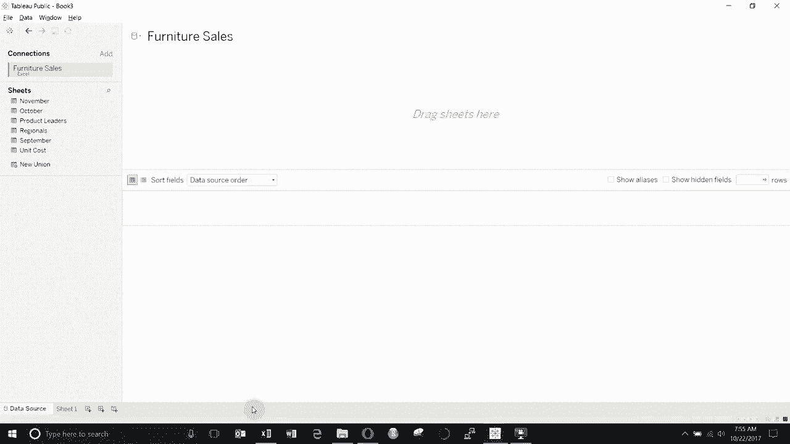
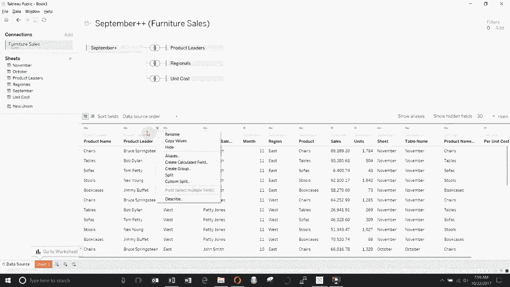
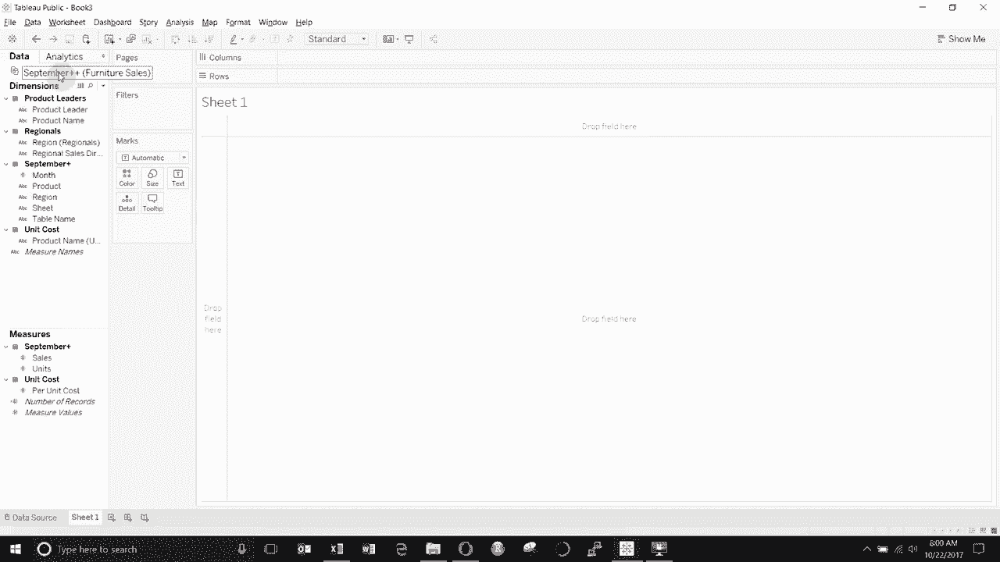

# Tableau操作详解P3：连接与合并数据源 📊

在本节课中，我们将学习如何在Tableau的数据源窗口中，通过连接与合并操作，将多个数据表整合为一个统一的数据源。我们将使用一个家具销售数据集作为示例，演示具体的操作步骤。

## 概述：合并多个月份的销售数据

首先，我们有一个包含九、十、十一月销售数据的家具数据集。为了便于分析，我们需要将这三个月的销售表合并为一张大表。

以下是具体操作步骤：

1.  在Tableau中，连接到包含数据的Excel文件。
2.  将“九月份销售”表拖入主工作区。
3.  将“十月份销售”表拖到“九月份销售”表下方，直到出现“拖动到合并”的提示区域后松开。此操作会将两张表上下堆叠。
4.  对“十一月份销售”表重复上述操作，将其拖放至已合并数据的底部。

完成合并后，数据源中会新增两个字段：`表名`和`表名2`。这两个字段会自动记录每条数据所属的原始月份表，方便我们后续进行区分和筛选。

## 连接其他相关数据表

上一节我们合并了核心的销售数据，本节中我们来看看如何连接其他维度的数据表，例如区域领导和产品信息。

以下是连接“区域领导”表的步骤：

1.  将“区域领导”表拖到左侧的联接区域。
2.  Tableau会显示一个维恩图图标，用于选择联接类型。当两个圆圈重叠部分高亮时，表示**内连接**；仅左侧圆圈高亮为**左连接**；仅右侧圆圈高亮为**右连接**；两个圆圈都高亮则为**完全连接**。
3.  由于两个表中都有“区域”字段，Tableau会自动将其设为联接条件。我们保持默认的**内连接**即可。这相当于SQL中的：`INNER JOIN 区域领导 ON 销售表.区域 = 区域领导表.区域`。

接下来，我们连接“产品领导”表。操作略有不同，因为字段名不完全匹配。

以下是连接“产品领导”表的步骤：

1.  将“产品领导”表拖入联接区域。
2.  此时会出现红色感叹号，提示联接条件不明确。我们需要手动指定匹配的字段。
3.  点击联接条件，从左侧（销售表）选择“产品”字段，从右侧（产品领导表）选择“名称”字段。
4.  设置完成后，联接图标会恢复正常。这相当于SQL中的：`INNER JOIN 产品领导 ON 销售表.产品 = 产品领导表.名称`。

最后，我们可以用同样的方法连接“单位成本”表，通常根据“产品名称”进行联接。

## 重要注意事项与数据组织

在进行数据连接时，有几个关键点需要牢记：

*   **字段类型必须一致**：用于联接的字段必须是相同的数据类型（例如，字符串对字符串，数字对数字）。如果类型不匹配，需要先在数据源窗口中进行转换。
*   **检查和调整联接**：你可以随时点击联接图标，查看和修改联接类型与条件。
*   **视图切换**：在数据源窗口，你可以点击图标在“数据预览”视图和“列表”视图之间切换。“列表”视图有时更方便检查和更改字段属性。

完成所有连接后，进入工作表视图。你会发现Tableau已将字段按来源表进行了清晰的组织。所有维度（如区域、产品）和度量（如销售额）都分类排列，方便你直接拖拽使用，进行可视化分析。

## 总结

本节课中我们一起学习了Tableau中整合数据的核心操作。我们首先通过**合并**将结构相同的多个月份销售表上下堆叠；然后通过**连接**，根据共同的字段将区域、产品等维度表与主销售表关联起来。掌握这些操作，你就能将分散的数据整合为一个强大、统一的分析数据源，为后续深入的数据探索与可视化打下坚实基础。