# Tableau操作详解 P4：混合数据源 📊

在本节课中，我们将学习如何在Tableau中混合多个数据源。数据混合功能允许您在不进行物理连接的情况下，将不同数据源中的字段关联起来，并在同一个视图中使用它们。这对于分析来自不同系统的数据（如销售数据和人员数据）非常有用。

## 概述与准备工作

上一节我们介绍了数据连接，本节中我们来看看如何使用数据混合实现类似的分析效果。

首先，我已经连接了一个名为“家具销售”的虚构数据。主数据源是销售表，它包含了九月到十二月的销售数据。除此之外，我们还有几个独立的表格：区域领导者表、产品负责人表和单位成本表。

## 第一步：添加并混合第一个数据源

我们将从创建一个新工作表开始。当前，数据窗格中只显示销售表的字段。

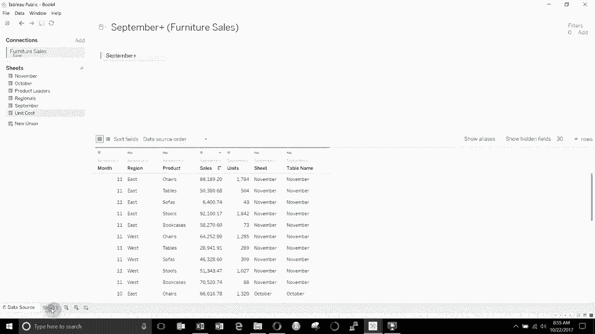

我们需要做的第一件事是添加一个新数据源。点击“数据”菜单，选择“新建数据源”，然后重新连接到同一个“家具销售”Excel文件。这次，我们选择“区域领导者”表。

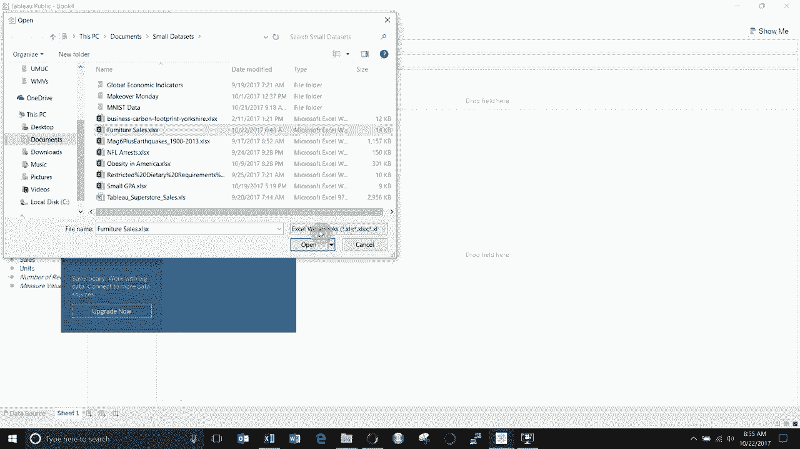

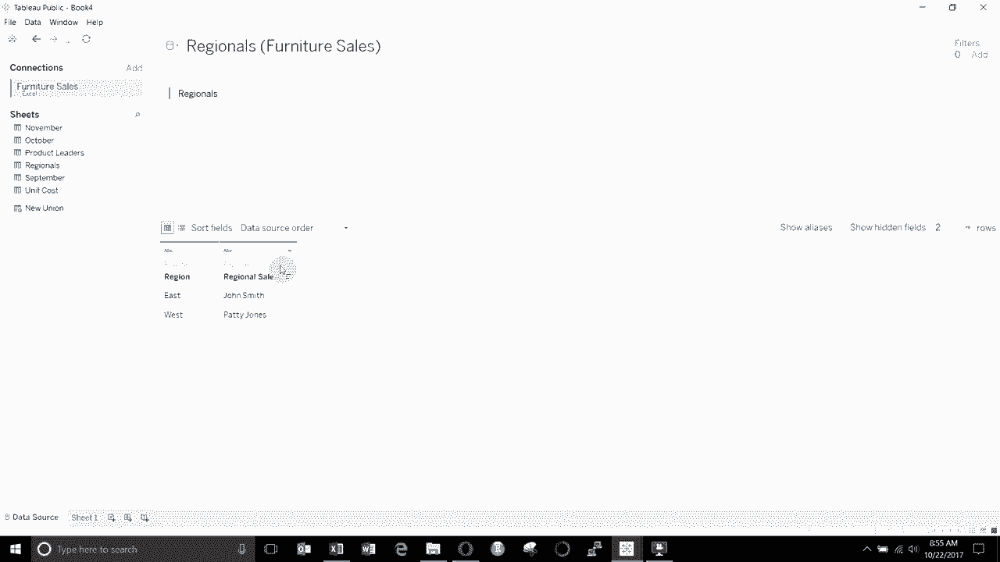

该表包含“区域”和“区域销售主管”两个字段。添加后，您会看到数据窗格中现在有两个数据源：“销售”和“区域领导者”。

现在，让我们开始构建视图。将“销售”表中的“区域”字段拖到行功能区，将“销售额”拖到列功能区。

接下来，我们希望将“区域销售主管”信息添加到这个视图中。在混合数据时，Tableau会自动尝试基于同名字段建立关系。您可以看到，“销售”表和“区域领导者”表都有一个名为“区域”的字段，Tableau已用橙色链状图标标记了这种关系。

这个橙色链接表示两个数据源已基于“区域”字段关联。您可以点击该图标来编辑或禁用关系。如果链接是灰色且带有一条横线，则表示关系未激活。

确认关系激活后，您就可以将次要数据源（此处是“区域领导者”）的字段拖入视图。让我们将“区域销售主管”拖到“区域”字段的旁边。

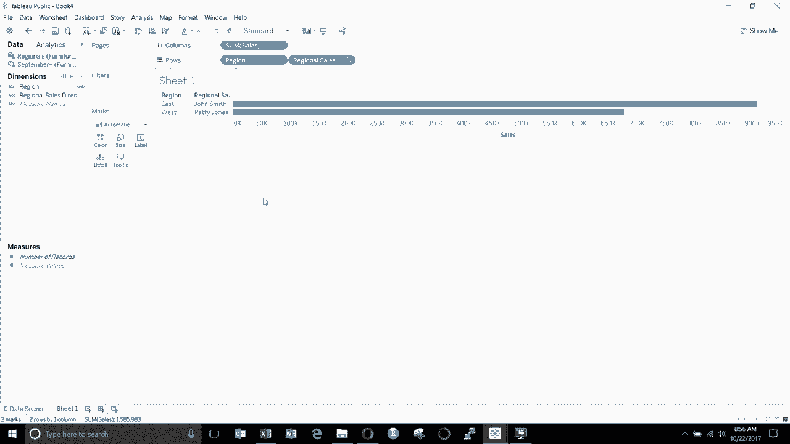

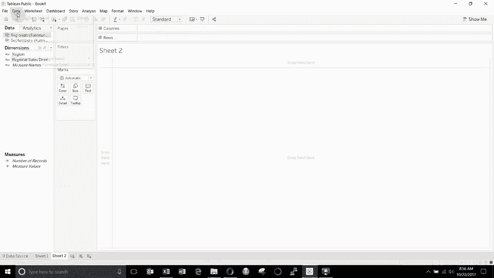

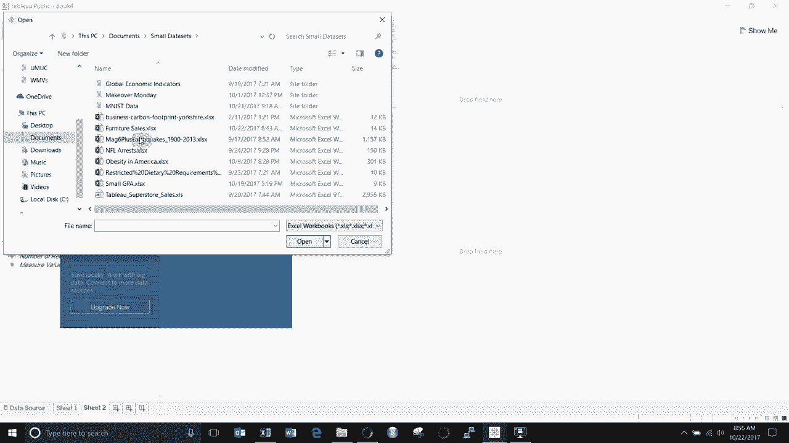

现在，视图中同时显示了每个区域的销售额及其对应的销售主管。

## 第二步：混合第二个数据源并自定义关系

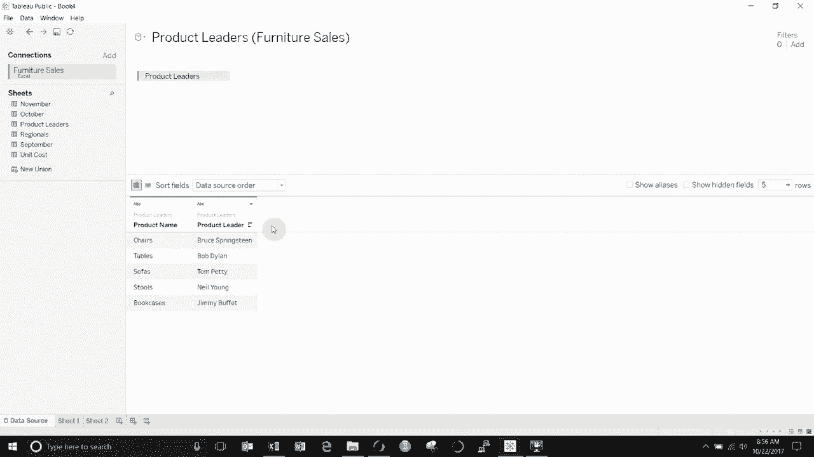

接下来，我们尝试混合“产品负责人”表。创建一个新的工作表（Sheet2）。

同样，通过“数据”菜单添加一个新数据源，选择“家具销售”文件中的“产品负责人”表。该表包含“产品名称”和“产品负责人”字段。

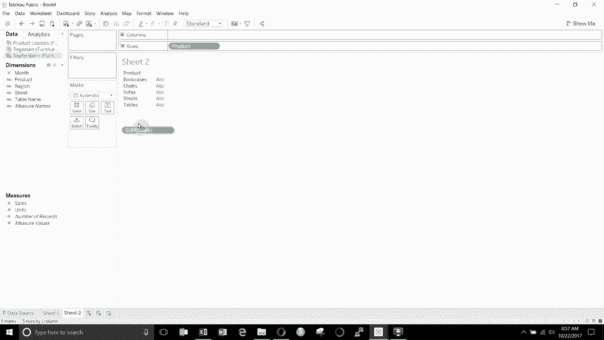

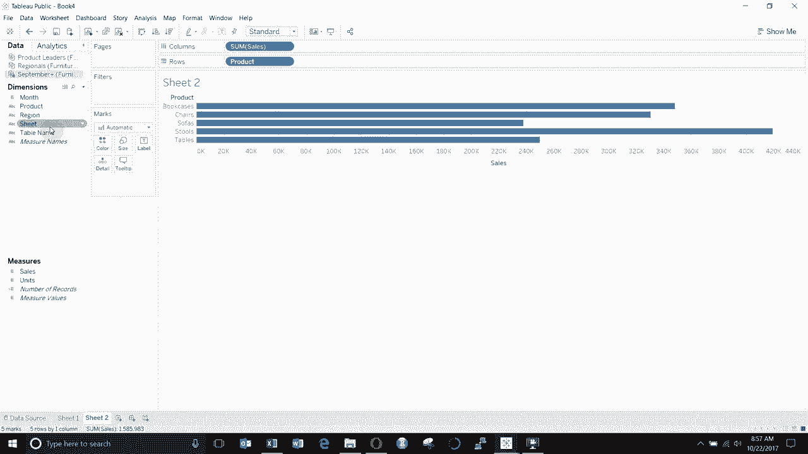

回到Sheet2，从“销售”表中将“产品”拖到行功能区，将“销售额”拖到列功能区。

当我们尝试从“产品负责人”表中拖出“产品负责人”字段时，会发现没有自动建立链接。这是因为主数据源中的字段叫“产品”，而次要数据源中的对应字段叫“产品名称”，名称不匹配导致Tableau无法自动关联。

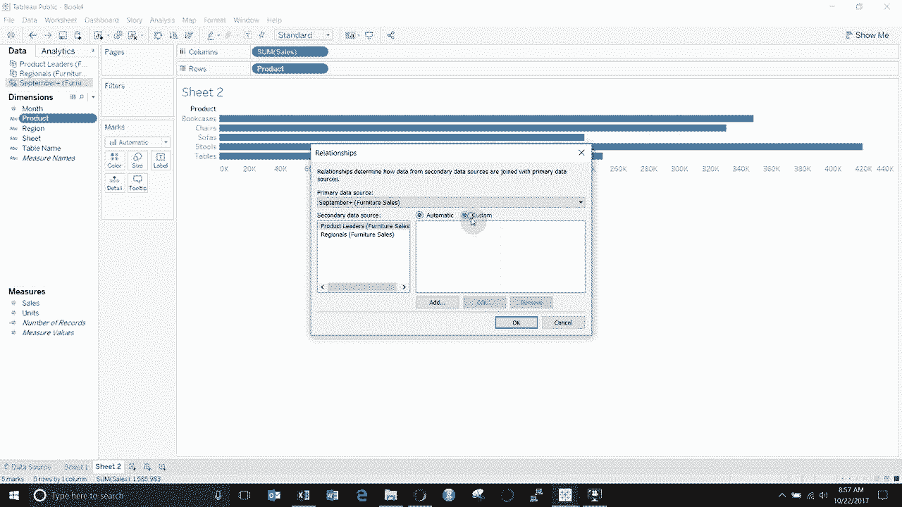

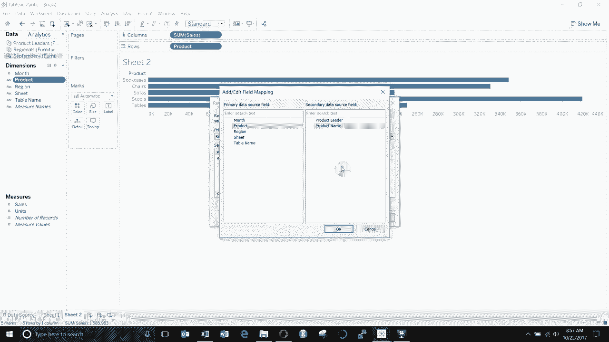

以下是解决方法：

1.  点击数据窗格中“产品负责人”数据源旁边的橙色/灰色链状图标。
2.  选择“编辑关系...”。
3.  在弹出的对话框中，将“自动”切换为“自定义”。
4.  点击“添加”。
5.  在“主数据源字段”下选择“销售”表中的“产品”字段。
6.  在“辅助数据源字段”下选择“产品负责人”表中的“产品名称”字段。
7.  点击“确定”保存关系。

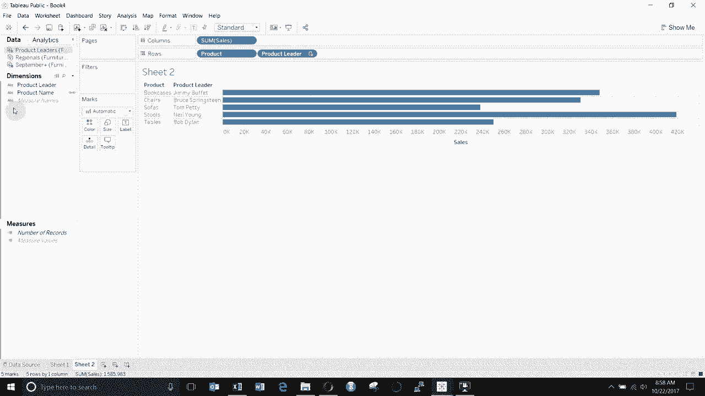

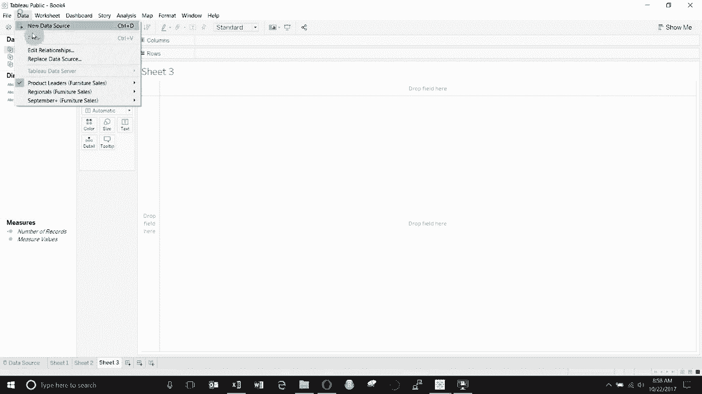

建立关系后，链状图标会变为橙色。现在，您就可以将“产品负责人”字段拖入视图，与产品信息并列显示。

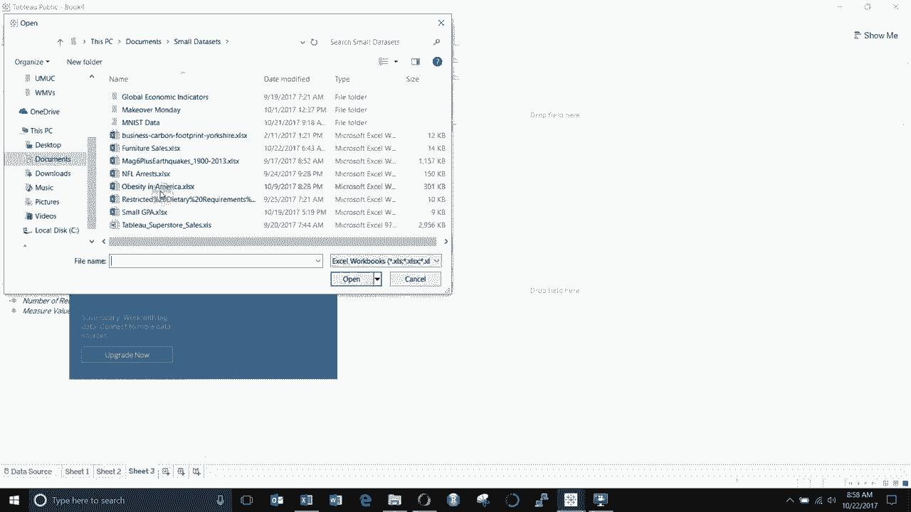

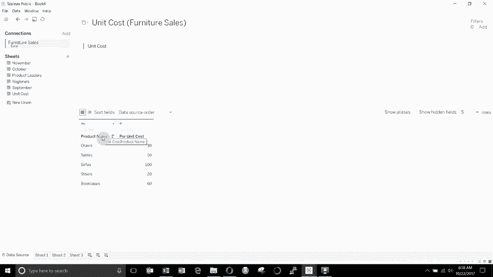

## 第三步：使用混合数据进行计算

最后，我们来看一个涉及计算的混合数据例子。我们将混合“单位成本”表来计算总成本。

创建一个新的工作表（Sheet3）。添加“单位成本”数据源，它包含“产品名称”和“每单位成本”字段。

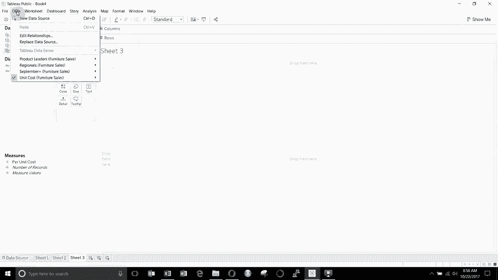

回到Sheet3，我们需要先建立自定义关系，关联“销售.产品”和“单位成本.产品名称”。

然后，将“销售”表中的“产品”和“单位”（即销售数量）拖到行功能区，将“单位成本”表中的“每单位成本”拖到视图上。

现在，我们想计算每个产品的总成本，公式是：`总成本 = 单位 * 每单位成本`。

我们需要创建一个计算字段。**请注意创建计算字段时所在的数据源上下文**。如果我在“单位成本”数据源下创建，那么这个计算字段将位于该数据源下。

创建过程如下：
1.  在“单位成本”数据源上右键，选择“创建计算字段”。
2.  将新字段命名为“总成本”。
3.  在公式编辑器中，输入 `SUM([单位]) * AVG([每单位成本])`。

这里有一个关键点：当混合不同数据源的字段进行计算时，**所有字段必须被聚合**（如使用SUM、AVG等）。您不能直接使用行级别的字段（如`[单位] * [每单位成本]`），因为数据混合是在聚合级别进行的。Tableau会强制对来自其他数据源的字段进行聚合。

创建完成后，将“总成本”字段拖到视图中。您会看到，来自次要数据源（单位成本）的字段旁边会有一个小的“勾选”图标，这有助于您识别字段的来源。

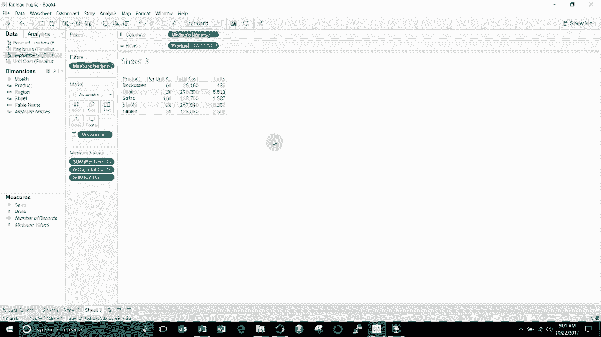

## 总结

本节课中我们一起学习了Tableau中数据混合的核心操作。我们了解到，数据混合允许您关联不同数据源，而无需进行物理连接。关键步骤包括：添加数据源、利用同名字段自动关联或自定义关联字段、以及在聚合级别使用混合字段进行计算。

记住以下要点：
*   关联通过数据源旁的链状图标管理。
*   橙色链接表示关系已激活，灰色链接表示未激活。
*   字段名称不一致时，需使用“编辑关系”功能自定义关联。
*   跨数据源计算时，必须使用聚合函数（如 `SUM()`, `AVG()`）。

通过灵活运用数据混合，您可以轻松整合来自不同系统的数据，进行更全面的分析。