# Tableau操作详解 P5：固定详细级别计算 📊

在本节课中，我们将学习Tableau中一种强大的计算类型——详细级别计算。我们将重点介绍其中最简单的一种：固定详细级别计算。通过本教程，你将学会如何创建和使用固定计算，来分析特定维度层级上的聚合数据。

## 概述

详细级别计算允许我们在不同于视图详细级别的层级上执行聚合运算。固定详细级别计算是其中一种，它会在我们指定的维度层级上固定执行计算，不受视图中其他字段的影响。接下来，我们将通过一个实例来逐步掌握它的用法。

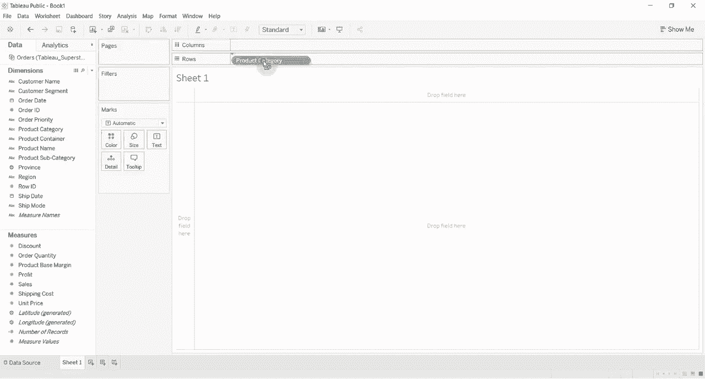

## 创建基础数据视图

首先，我们需要连接到一个数据集并创建一个基础表格。这里我们使用“超级商店销售数据集”。

1.  将“产品子类别”字段拖到行功能区。
2.  将“销售额”字段拖到列功能区。

此时，视图会显示每个产品子类别的销售额总和。

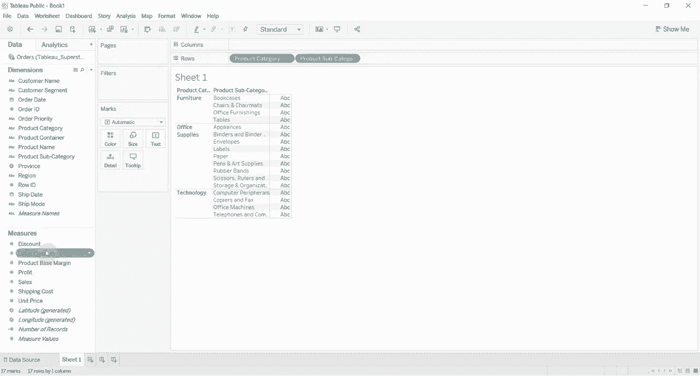

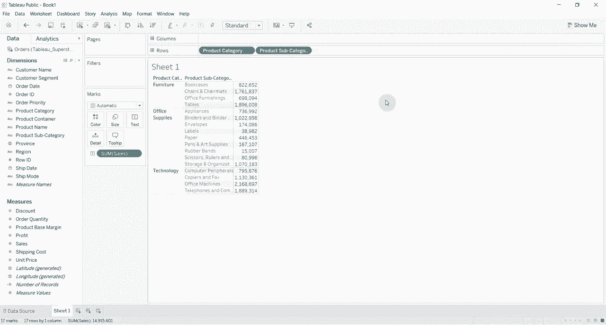

## 创建固定详细级别计算

上一节我们创建了按产品子类别汇总的视图。本节中，我们来看看如何创建一个计算，使其固定在产品类别层级上汇总销售额，而不是随着产品子类别变化。

以下是创建固定计算字段的步骤：

1.  在“数据”窗格中右键单击，选择“创建计算字段”。
2.  将新字段命名为“固定销售额总和”。
3.  在公式编辑器中输入以下代码：
    `{ FIXED [产品类别] : SUM([销售额]) }`
4.  点击“确定”保存计算字段。

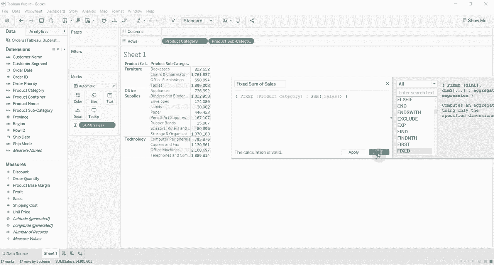

这个公式的含义是：**固定**在 **[产品类别]** 这个详细级别上，计算 **销售额的总和**。

## 应用并理解固定计算

创建好计算字段后，将其拖拽到视图中的标记卡或行列功能区上。

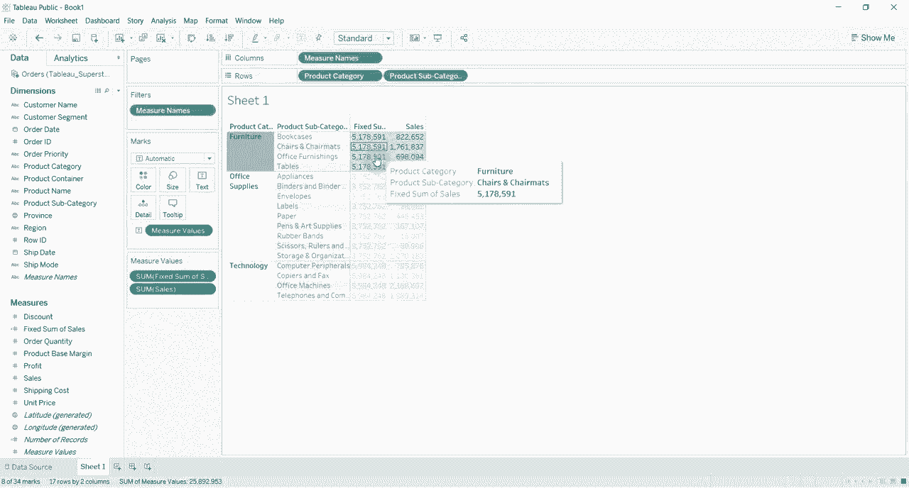

现在，你可以观察到，“固定销售额总和”这个值在每个产品类别内部是相同的。例如，所有属于“家具”类别的子类别，其“固定销售额总和”值都相同；所有“办公用品”类别的子类别也共享另一个相同的总和值。

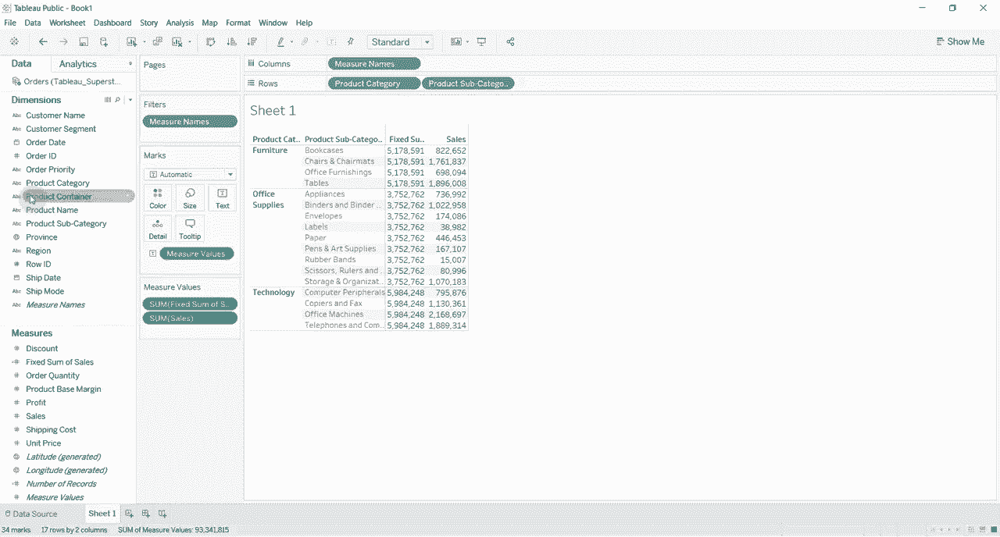

为了进一步验证其“固定”特性，我们可以向视图中添加其他维度，例如“省份”。

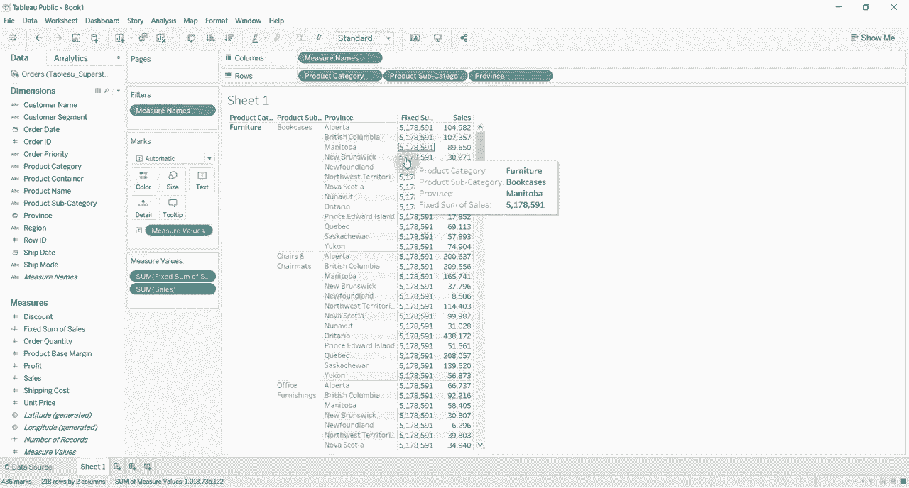

即使添加了“省份”，每个产品类别下的“固定销售额总和”数值依然保持不变。这证明了该计算是独立于视图当前详细级别（产品子类别、省份）的，它始终在我们指定的“产品类别”层级上进行聚合。

## 实际应用案例：计算占比

理解了固定计算的基本原理后，我们来看一个实际应用。假设我们想分析每个产品子类别的销售额占其所属产品类别总销售额的百分比。

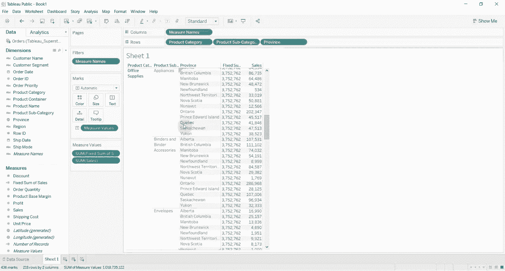

我们可以利用已创建的“固定销售额总和”字段来实现这个目标。

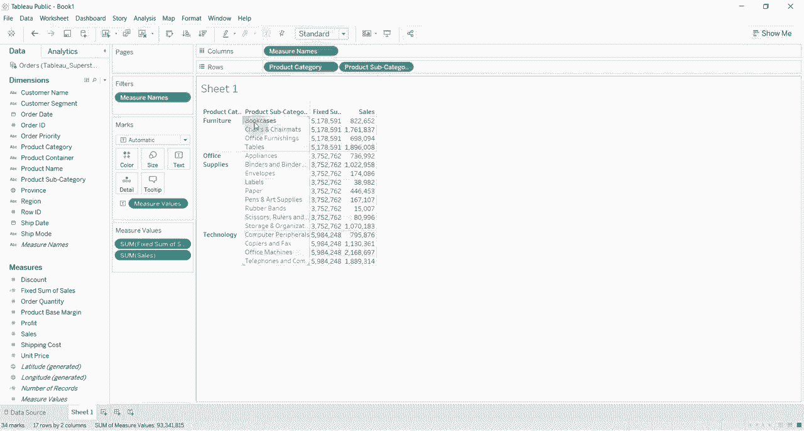

以下是创建占比计算字段的步骤：

1.  创建一个新的计算字段，命名为“类别销售百分比”。
2.  在公式编辑器中输入以下表达式：
    `SUM([销售额]) / [固定销售额总和]`
    这个公式表示：用当前视图级别的销售额总和，除以固定在产品类别级别的销售额总和。
3.  点击“确定”。

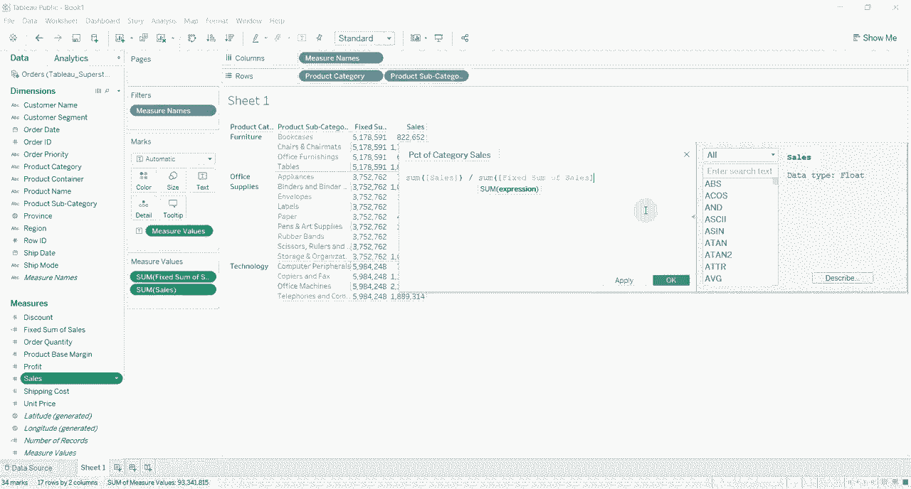

将“类别销售百分比”字段拖入视图后，可能需要将其数字格式设置为百分比。

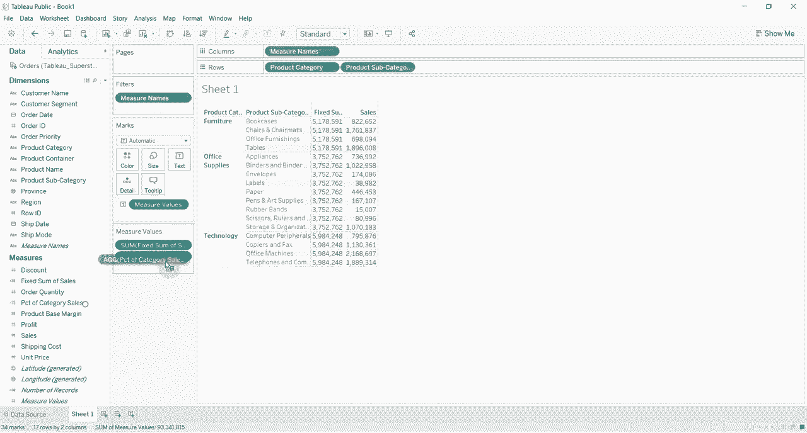

设置完成后，视图会清晰显示每个子类别在其所属大类中的销售贡献占比。例如，可以直观地看到“书柜”的销售额占“家具”类别总销售额的15.9%。

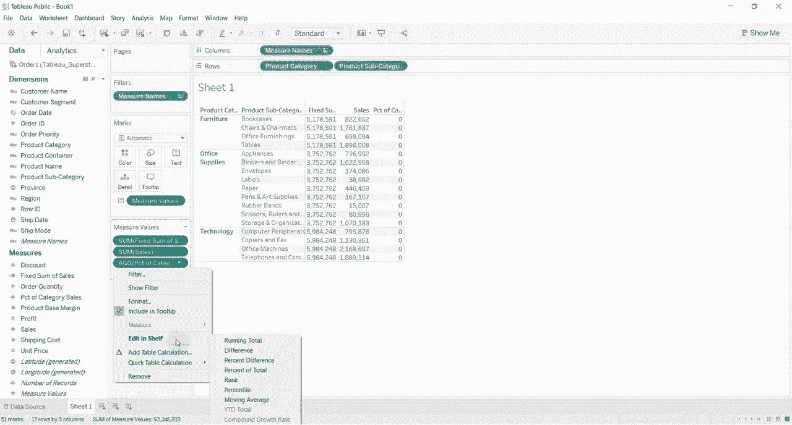

## 总结

本节课中，我们一起学习了Tableau中的固定详细级别计算。

我们首先创建了一个基础视图，然后学习了`{FIXED [维度]: 聚合表达式}`公式的写法，用它创建了一个固定在产品类别层级的销售额总和字段。通过向视图添加其他维度，我们验证了该计算结果的“固定”特性。最后，我们应用这个固定计算完成了一个实际分析案例——计算产品子类别在所属大类中的销售占比。

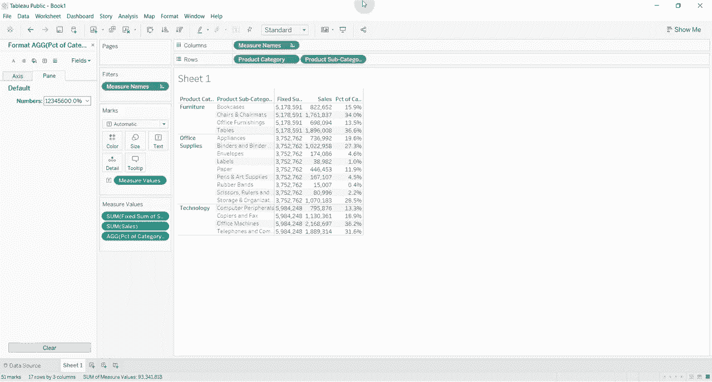

固定详细级别计算的核心在于，**它能够忽略视图中的其他筛选器和维度，始终在我们明确指定的维度组合上进行聚合运算**，这为跨层级的数据分析提供了极大的灵活性。

