# Tableau操作详解 P6：包含详细级别计算 📊

在本节课中，我们将学习Tableau中详细级别计算的第三种类型：包含详细级别计算。我们将了解它的定义、作用以及如何创建和使用它，以便在可视化中灵活地聚合数据。

在上一节中，我们介绍了固定和排除详细级别计算。本节中，我们来看看包含详细级别计算。与固定计算（始终聚合固定维度）和排除计算（聚合时排除特定维度）不同，包含计算允许我们在聚合一个度量时，始终包含一个指定的维度。

## 创建基础表格

首先，我们需要创建一个基础表格来演示包含计算的效果。

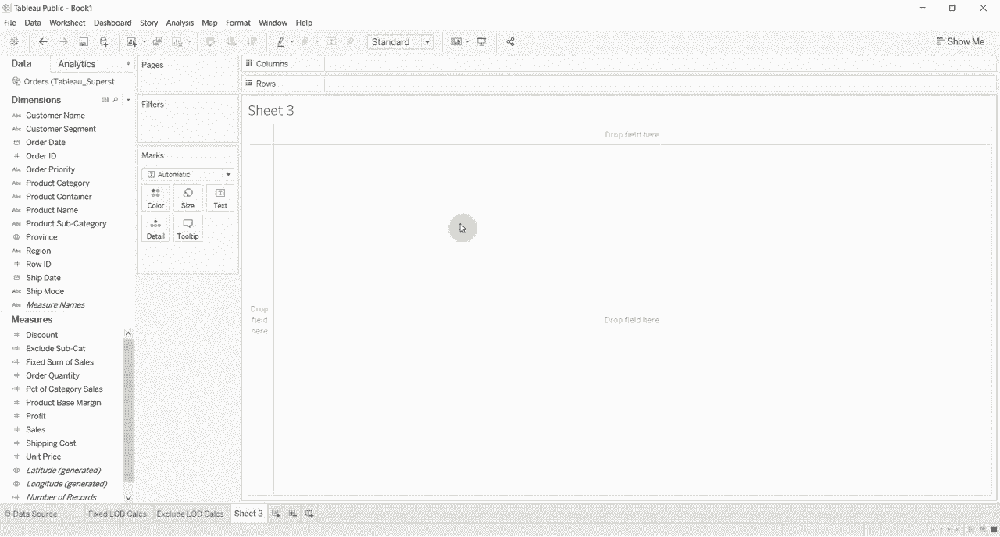

以下是创建步骤：
1.  将“产品类别”字段拖到行功能区。
2.  将“产品子类别”字段拖到行功能区，放置在“产品类别”右侧。
3.  将“销售额”字段拖到标记卡的“文本”上。

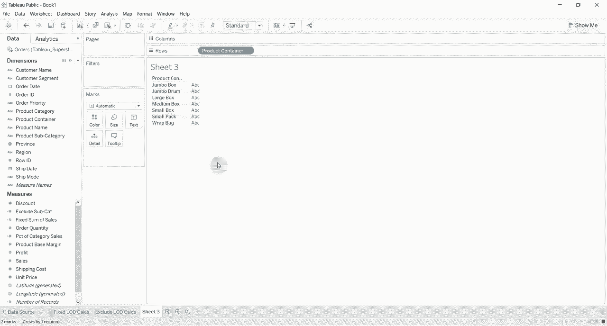

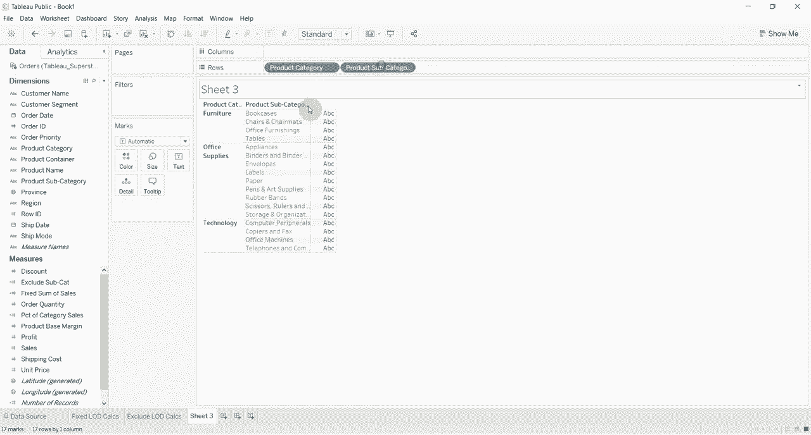

这样我们就得到了一个按产品类别和子类别显示销售额的表格。

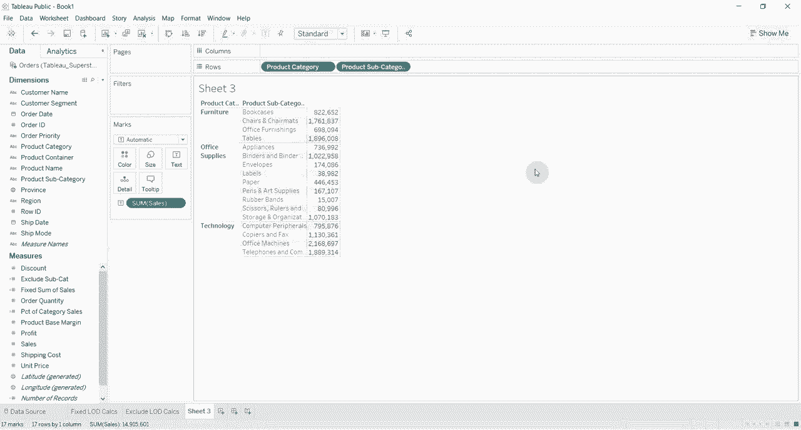

## 创建包含详细级别计算

接下来，我们创建一个包含详细级别计算。这个计算将确保在聚合“销售额”时，始终包含“产品子类别”维度。

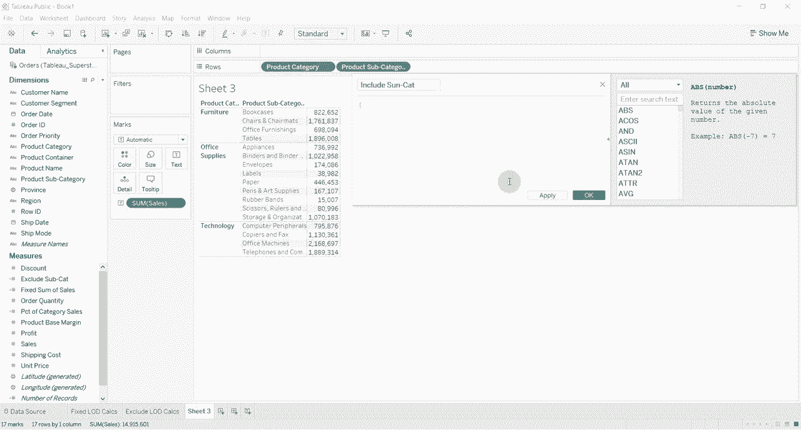

创建计算字段的公式如下：
```
{ INCLUDE [产品子类别] : SUM([销售额]) }
```
我们将这个计算字段命名为“包含子类别销售额”。

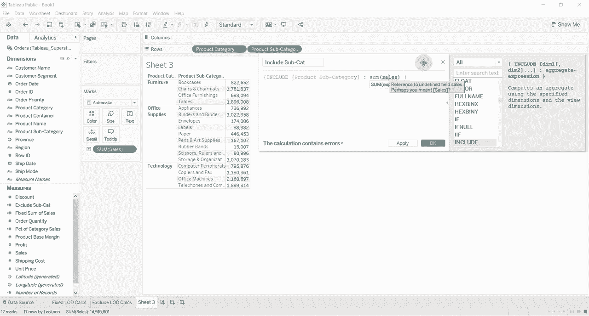

创建完成后，将这个新字段“包含子类别销售额”拖拽到表格的标记卡“文本”上。此时，由于视图本身已经包含了“产品子类别”，所以“销售额”和“包含子类别销售额”两列的数据看起来完全相同。

## 理解包含计算的效果

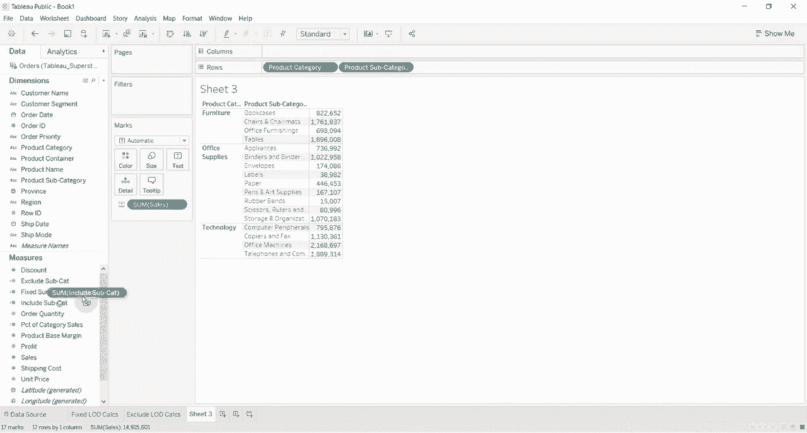

包含计算的真正效果在视图的详细级别发生变化时才会显现。

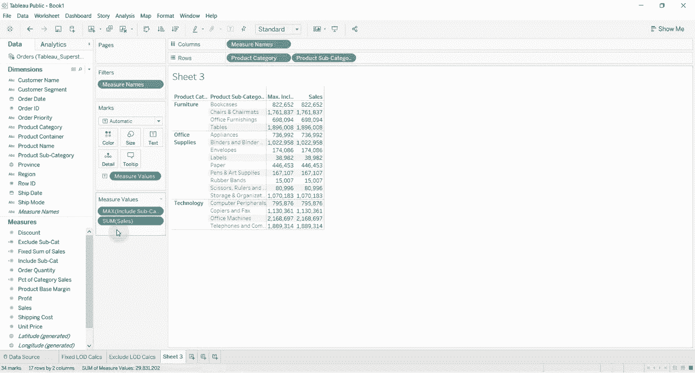

现在，我们从行功能区移除“产品子类别”字段。此时，视图的详细级别从“类别+子类别”提升到了仅“产品类别”。你会发现，“销售额”列显示的是每个产品类别的销售总额，而“包含子类别销售额”列的数字没有变化。这是因为包含计算强制在聚合时包含了“子类别”维度，但当前视图级别是“类别”，因此Tableau需要对这个包含计算的结果进行二次聚合。

默认的二次聚合方式是求和（SUM），所以两列数字依然相同。为了更清晰地看到区别，我们需要修改二次聚合的方式。

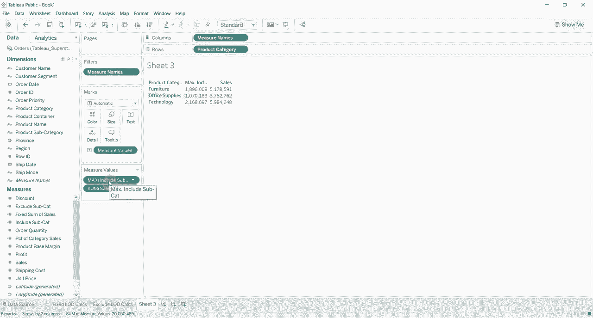

## 修改二次聚合方式

我们可以通过右键单击标记卡上的“包含子类别销售额”胶囊，选择“度量”，然后更换聚合方式，例如改为“最大值”。

操作步骤如下：
1.  右键单击标记卡中的“包含子类别销售额”胶囊。
2.  在菜单中选择“度量(合计)” -> “最大值”。

此时，“包含子类别销售额”列显示的数字发生了变化。它现在代表的是：在每个产品类别下，所有子类别的销售额总和中的最大值。例如，对于“家具”类别，它显示的是其下属所有子类别（如桌子、椅子等）的销售额总和里，最大的那个数值。

如果我们把“产品子类别”字段重新拖回行功能区，可以看到“家具”类别下销售额总和最大的子类别是“桌子”，其总和为1,896,008。这与我们移除子类别后，“家具”行显示的“包含子类别销售额”最大值完全一致。

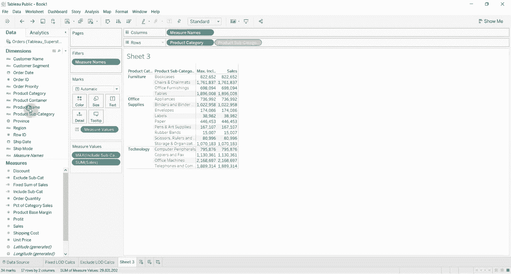

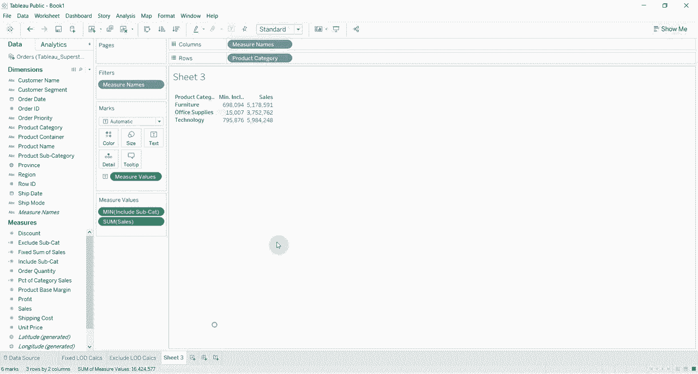

我们可以继续尝试其他二次聚合方式：
*   **最小值**：显示每个产品类别下，销售额总和最小的子类别的数值。
*   **平均值**：显示每个产品类别下，所有子类别销售额总和的平均值。

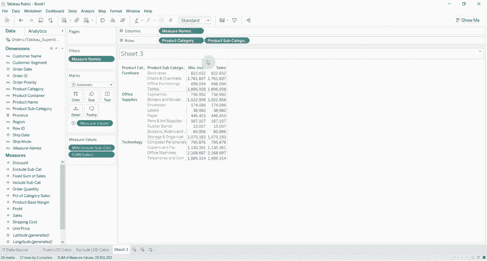

通过这种方式，我们可以在一个视图中同时获得两个不同详细级别的信息，例如既看到产品类别的总销售额，也能看到该类别下表现最好（销售额最高）的子类别的销售额。

## 总结

本节课中，我们一起学习了Tableau中的包含详细级别计算。

我们首先回顾了固定和排除计算，然后重点讲解了包含计算的核心概念：它允许在聚合度量时强制包含指定维度。我们通过创建计算字段、调整视图详细级别以及修改二次聚合方式，演示了包含计算如何帮助我们同时分析不同粒度级别的数据。

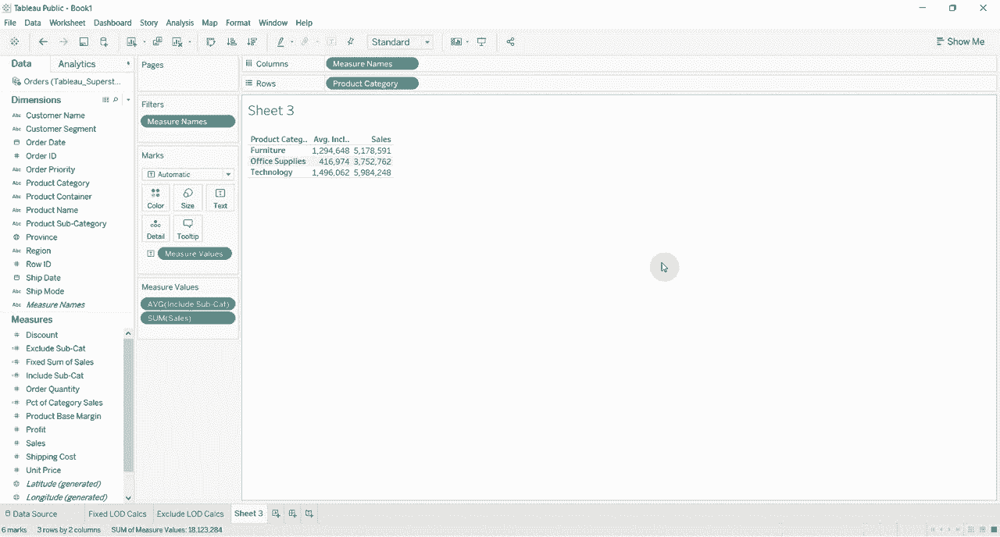

包含计算是一个强大的工具，特别适用于需要在较高汇总级别突出显示下级细分数据特征的场景。