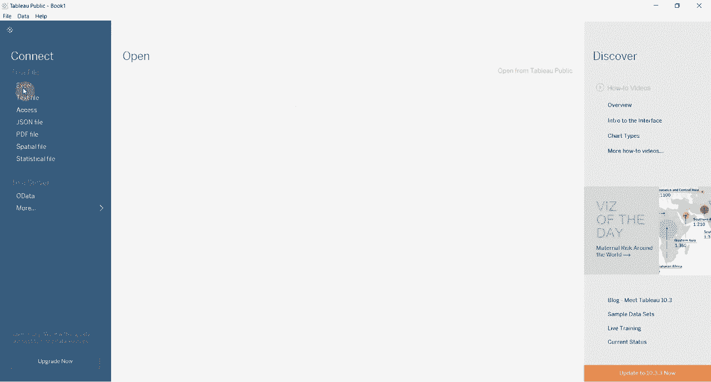
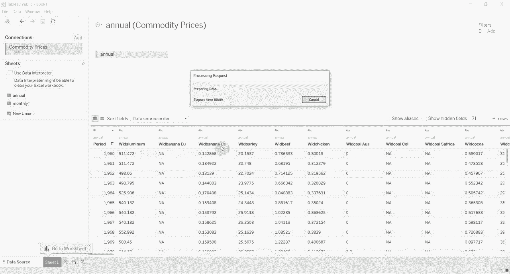
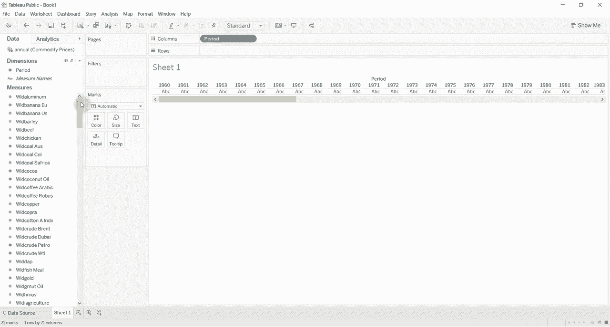
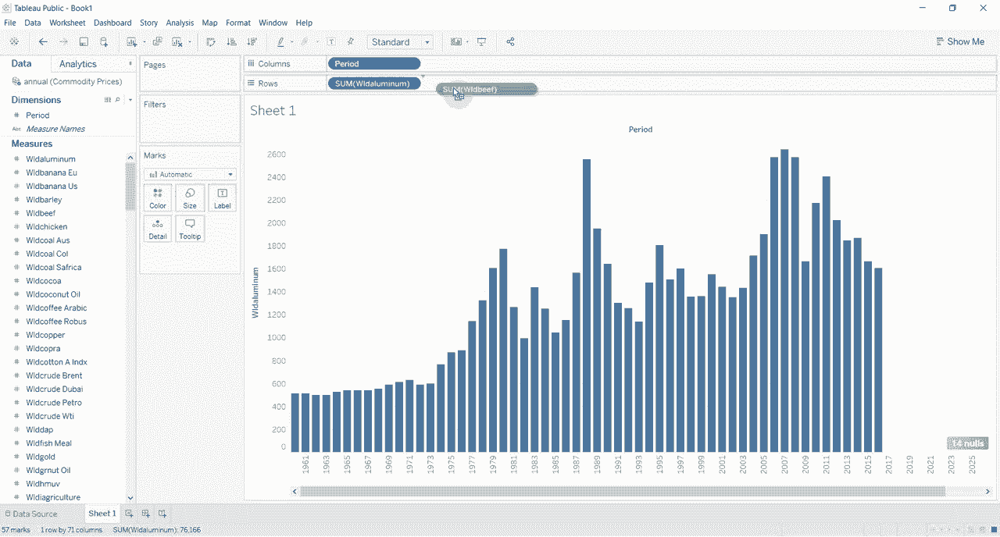
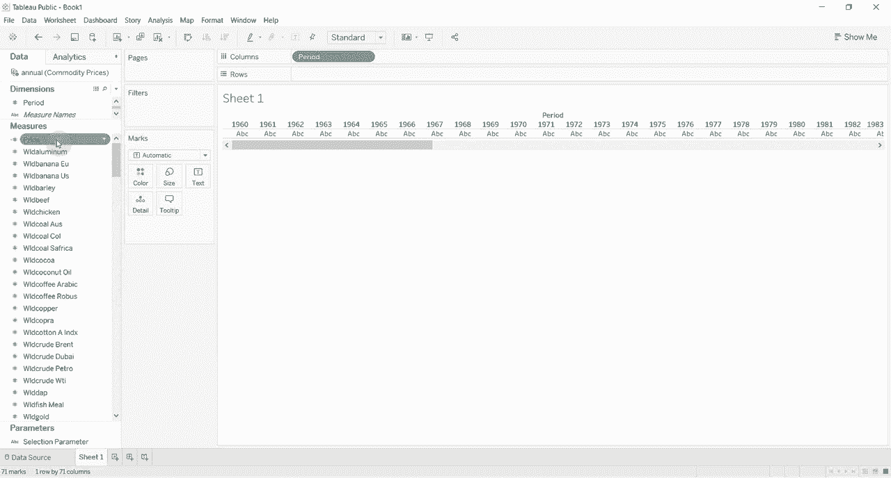
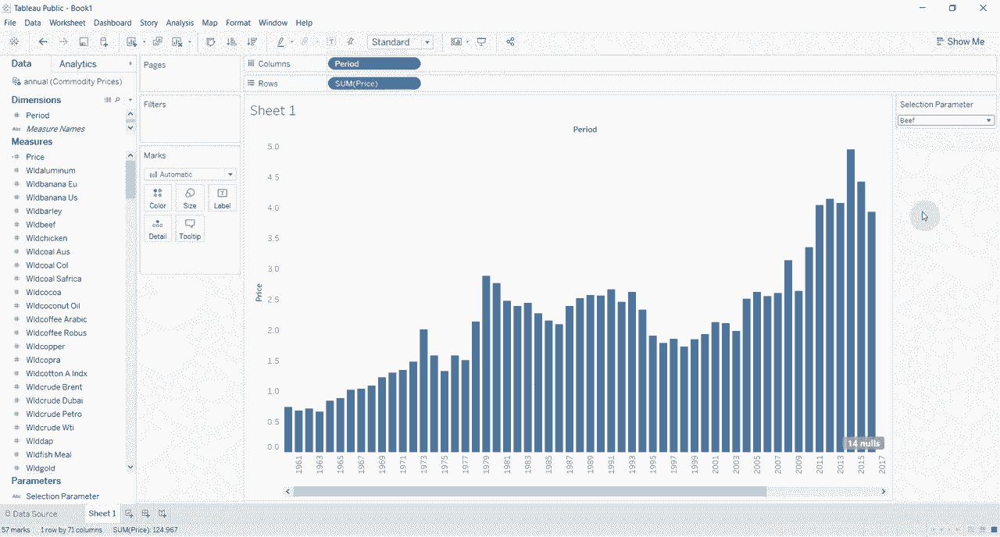
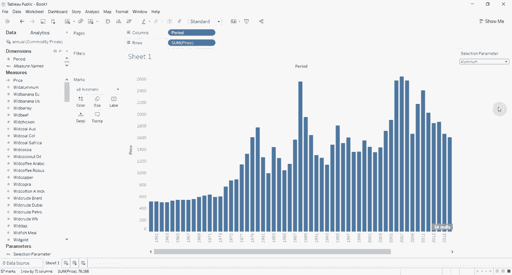

# Tableau操作详解 P7：使用参数与下拉菜单切换度量 📊

在本节课中，我们将学习如何在Tableau中创建并使用参数，结合计算字段，实现通过下拉菜单动态切换图表中显示的度量。这种方法能有效提升仪表板的交互性，让用户自由选择查看不同的数据指标。

---

## 概述与数据准备

首先，我们需要连接并准备数据。本节使用一个包含多种商品年度价格的数据集（例如铝、牛肉等）。我们将对数据进行清理，以便后续操作。



以下是数据准备步骤：

1.  将数据集中的价格列（如“铝”、“牛肉”）的数据类型更改为**数字（小数）**。
2.  将“期间”字段（代表年份）转换为度量，并拖放至**列**功能区。
3.  将清理后的价格字段拖放至**行**功能区，此时可以看到一个基本的年度趋势图。

通过以上步骤，我们得到了一个基础的可视化图表。例如，将“铝”的价格拖入后，会生成铝价格的柱状图。若想查看牛肉价格，传统方法需要手动替换字段，这不够灵活。接下来，我们将使用参数来实现动态切换。



---

## 创建参数

上一节我们准备好了基础图表，本节中我们来看看如何创建控制度量切换的核心——参数。

参数是一个可让用户动态输入值的容器。在这里，我们将创建一个字符串类型的参数，其可选值对应我们想要切换的商品名称。

创建步骤如下：

1.  右键单击**数据**窗格空白处，选择“创建参数”。
2.  将参数命名为“选择参数”。
3.  将**数据类型**设置为“字符串”。
4.  在“允许的值”部分，选择“列表”。
5.  在值列表中，手动添加我们想要切换的选项，例如“牛肉”和“铝”。
6.  点击“确定”完成创建。



此时，参数已创建完毕，但它还未与图表产生关联。



---


## 创建计算字段

参数本身不能直接改变图表。我们需要创建一个**计算字段**，根据参数的选择，返回对应商品的价格数据。

这个计算字段的逻辑是一个条件判断语句：

```
IF [选择参数] = "牛肉" THEN [牛肉]
ELSEIF [选择参数] = "铝" THEN [铝]
ELSE 0
END
```

以下是具体操作：

1.  右键单击**数据**窗格空白处，选择“创建计算字段”。
2.  将计算字段命名为“动态价格”。
3.  在公式编辑区，输入上述`IF`语句。请确保字段名与您的数据集中列名完全一致。
4.  点击“确定”完成创建。

现在，这个“动态价格”字段的值将随着“选择参数”的改变而动态变化。

---



## 构建动态图表并添加控制

我们已经有了参数和计算字段，现在需要将它们应用到图表中，并添加方便用户操作的下拉菜单控件。

操作步骤如下：



1.  将新创建的“动态价格”计算字段拖放至**行**功能区，替换原有的静态价格字段。
2.  在**数据**窗格中，右键单击之前创建的“选择参数”。
3.  在弹出的菜单中，选择“显示参数控件”。
4.  工作表视图右侧将出现一个下拉菜单控件。

现在，当您通过下拉菜单将参数值从“牛肉”切换为“铝”时，图表中的数据会立即更新，显示铝的价格趋势。您可以通过在参数列表中添加更多值，并在计算字段中补充对应的`ELSEIF`条件，来扩展可切换的度量选项。

这种方法的好处是，在构建仪表板时，您可以为观看者提供自主选择查看内容的权利，而无需准备多个重复的图表或进行复杂的操作。

---

## 总结

本节课中我们一起学习了Tableau中参数的高级应用。我们首先进行了数据清理，然后创建了一个字符串类型的参数列表，接着编写了一个基于`IF`语句的计算字段来响应参数的变化，最后将计算字段应用于图表并显示了参数控件。



通过**参数**与**计算字段**的结合，我们成功构建了一个可以通过下拉菜单动态切换度量的交互式图表。这个技巧能极大地增强数据可视化的灵活性和用户体验。您可以尝试将此方法应用到自己的项目中，切换不同的度量或维度。