# Tableau操作详解 P8：创建Excel样式条件格式 📊

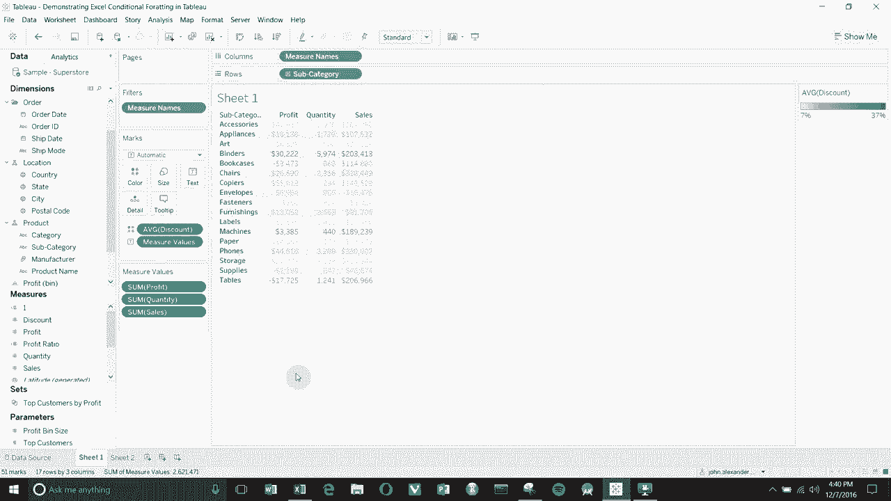

## 概述

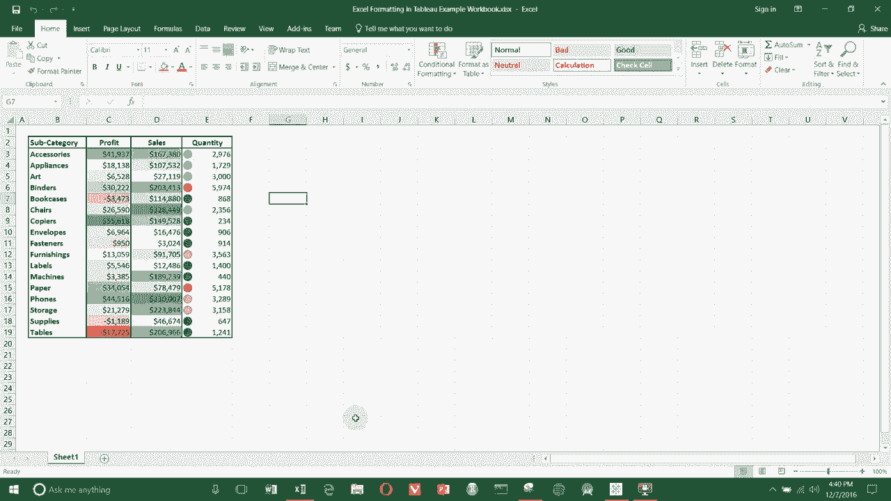

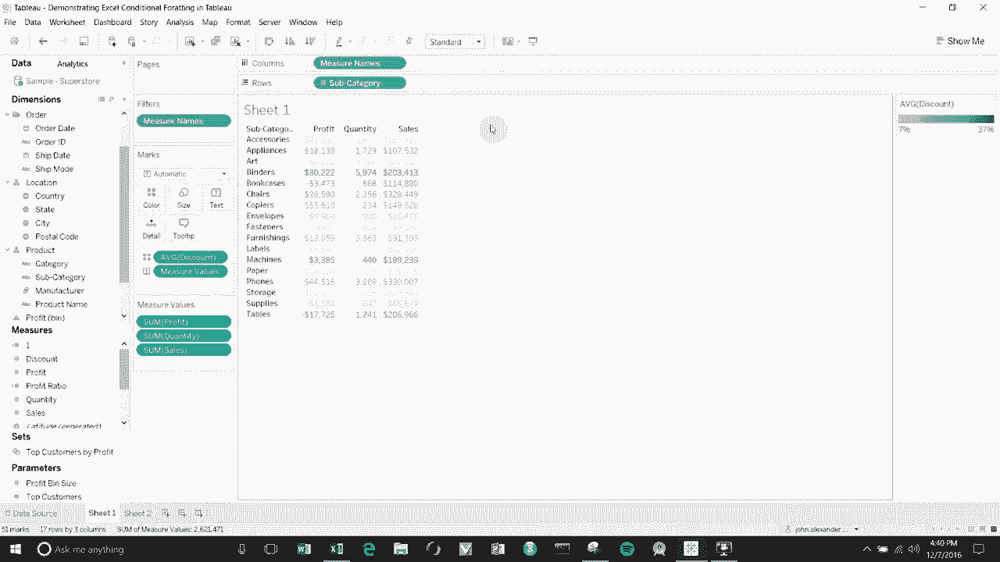

在本节课中，我们将学习如何在Tableau中创建类似Excel的条件格式化表格。这种格式允许我们为表格中的不同列（例如利润、销售额、数量）应用独立的颜色规则，从而实现更直观的数据可视化。

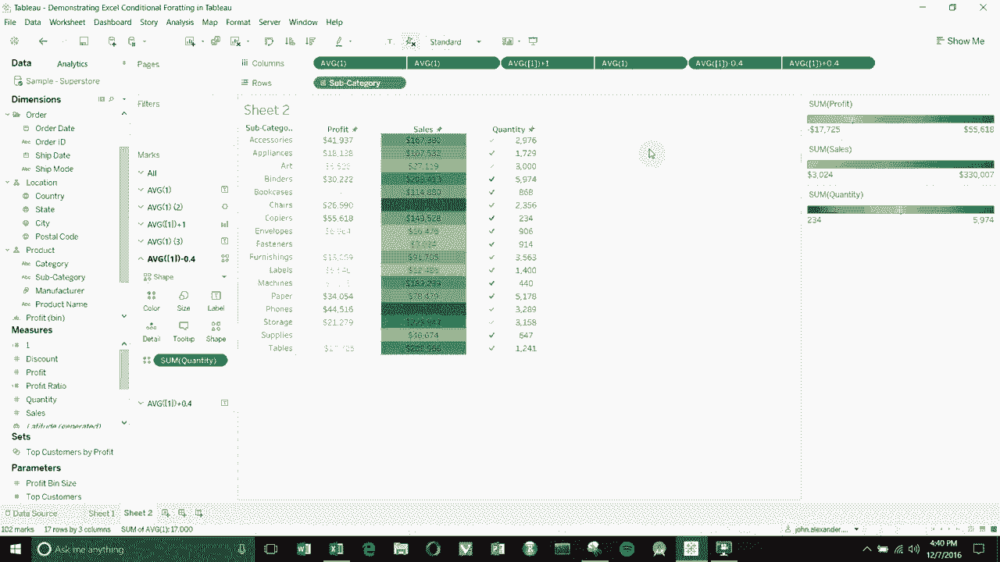

## 构建基础表格结构

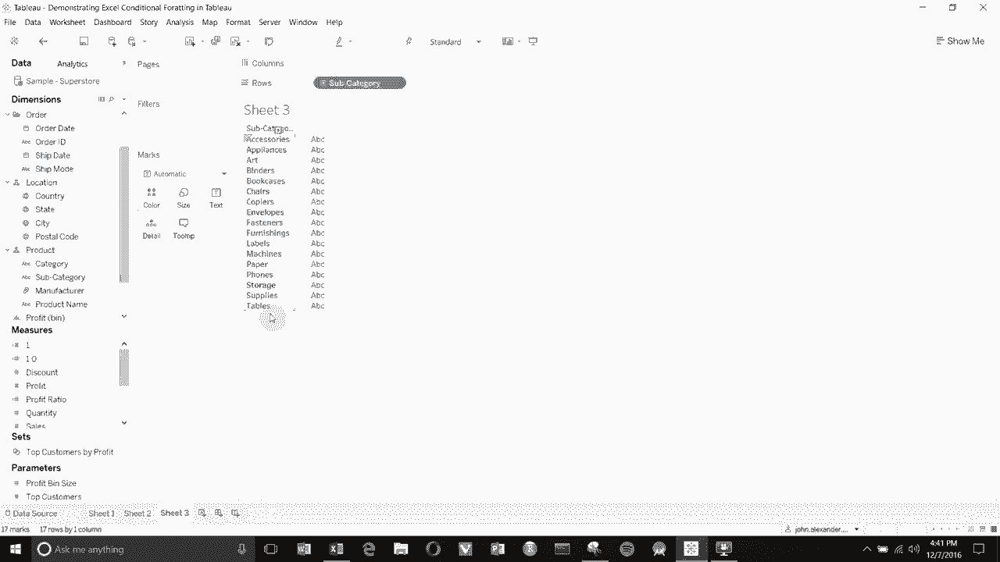

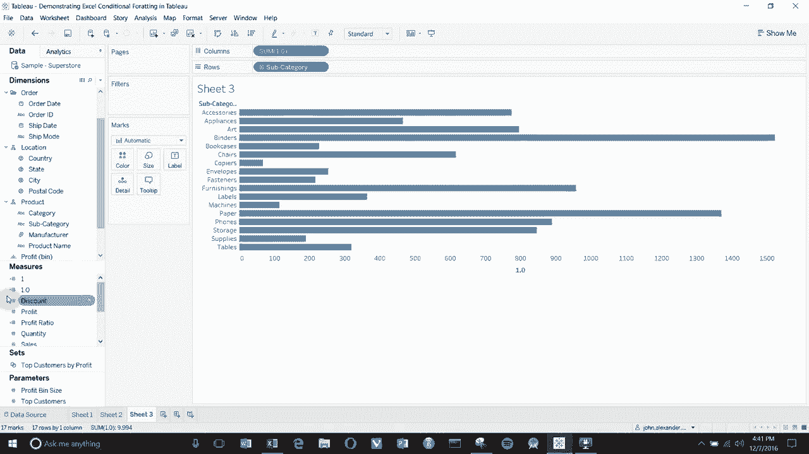

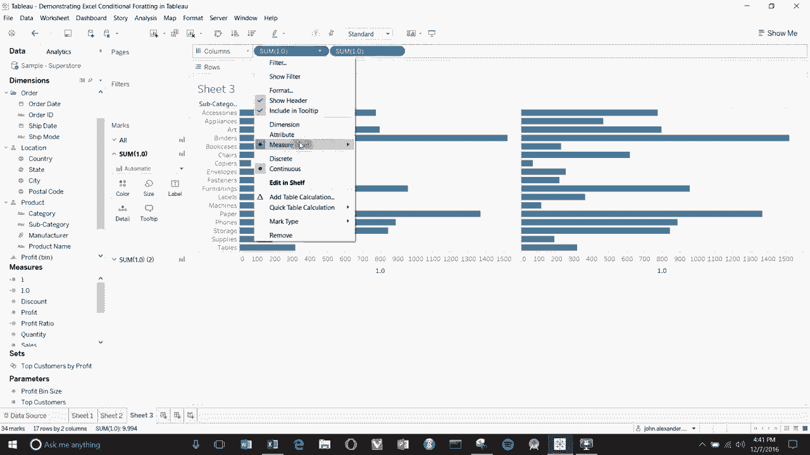

上一节我们介绍了条件格式化的概念，本节中我们来看看如何构建基础表格。

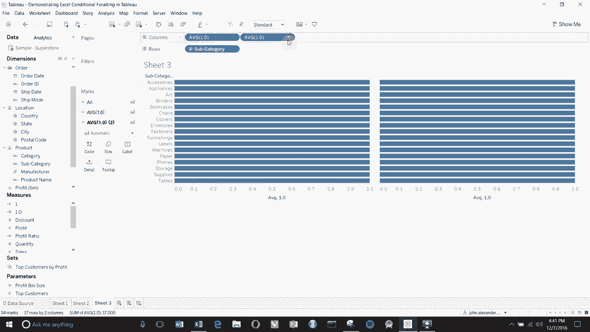

首先，我们需要创建一个用于调整布局的计算字段。

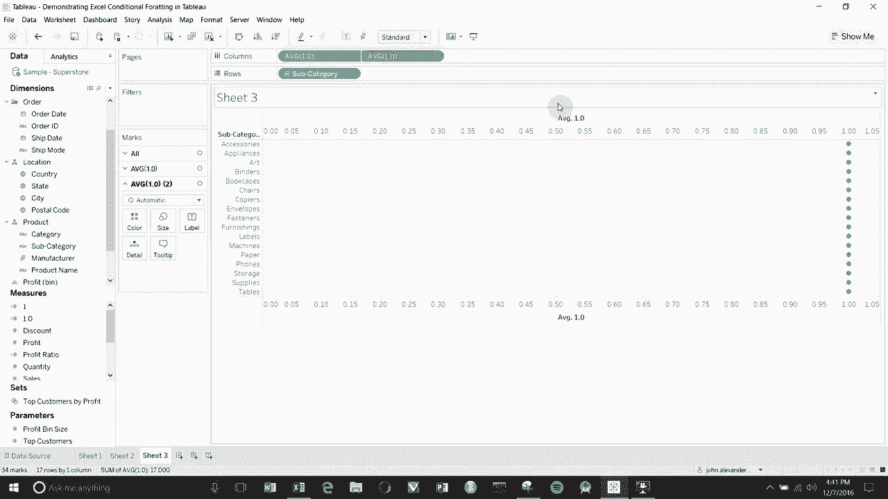

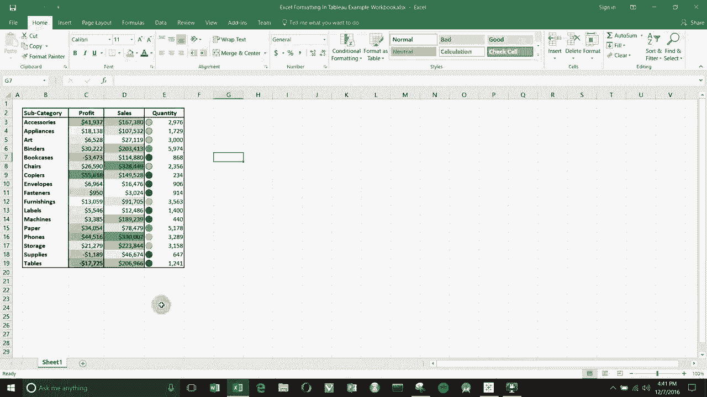

1.  创建一个名为 `1.0` 的计算字段，其值为 `1.0`。
    ```plaintext
    // 计算字段：1.0
    1.0
    ```
2.  将“子类别”字段拖到行功能区。
3.  将 `1.0` 字段拖到列功能区两次。
4.  将这两个 `1.0` 字段的聚合方式都改为“平均值”。
5.  右键单击第二个“平均值(1.0)”字段，选择“双轴”。

现在视图中有两个轴，但看起来还不像表格。接下来我们需要调整坐标轴。

## 配置坐标轴与格式

以下是配置坐标轴和视图格式的步骤。

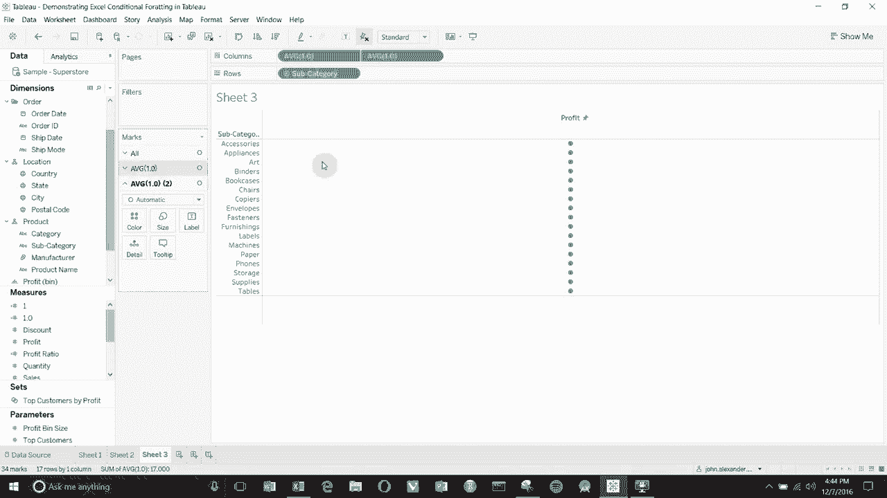

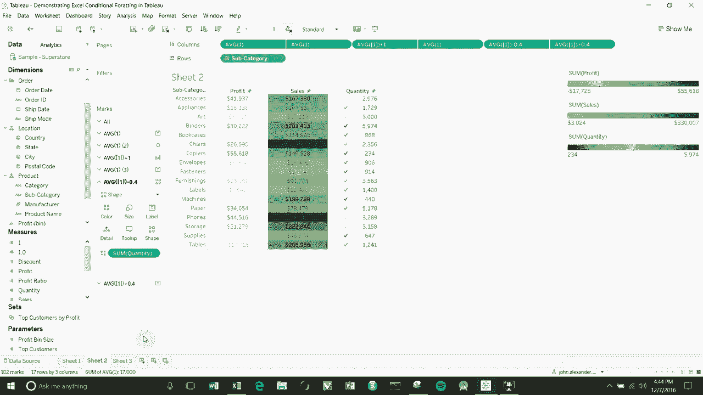

1.  右键单击顶部坐标轴，选择“编辑轴”。
2.  勾选“同步轴”并设置固定范围从 `0` 到 `2`。
3.  将轴标题改为“利润”。
4.  在“刻度线”选项卡下，将所有刻度线设置为“无”。
5.  右键单击底部坐标轴，同样选择“编辑轴”。
6.  删除轴标题，并将所有刻度线设置为“无”。
7.  点击菜单栏的“格式” -> “线”，在“列”部分将所有网格线设置为“无”。

完成这些步骤后，我们得到了一个干净的背景，中间有一条由点组成的线。标记卡中现在有三个独立的卡片。

## 创建利润列（文本颜色）

现在，我们来创建第一列，即根据利润值着色的文本列。

1.  在标记卡中，选择顶部的“平均值(1.0)”卡片。
2.  将“标记”类型改为“文本”。
3.  将“利润”字段拖到该卡片的“颜色”和“文本”上。
4.  选择另一个“平均值(1.0)”卡片（用于控制中间的点）。
5.  将标记类型改为“形状”（如圆形），并将大小调到最小。
6.  在该卡片的“颜色”设置中，将不透明度调至0%。

这样，我们就得到了一个用颜色表示利润高低的文本列。

## 创建销售额列（背景色）

上一节我们创建了利润列，本节中我们来看看如何创建用背景色表示销售额的列。

我们需要为销售额列再创建一组双轴。

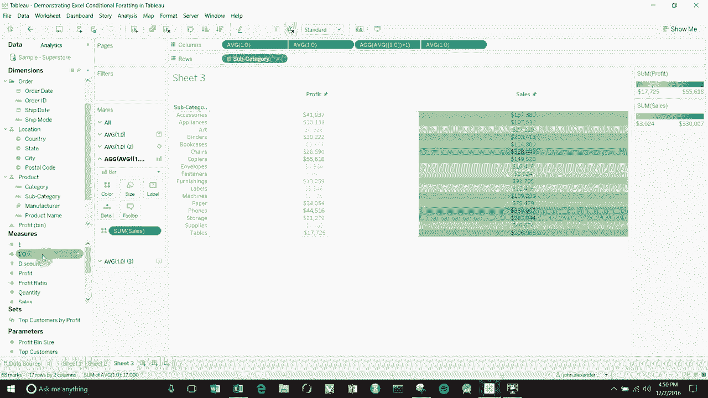

1.  再次将 `1.0` 字段拖到列功能区两次，并将聚合方式改为“平均值”。
2.  对第二个“平均值(1.0)”使用“双轴”。
3.  像之前一样，同步顶部和底部坐标轴，固定范围为 `0` 到 `2`，并移除所有刻度线和标题。
4.  在顶部的标记卡（控制文本）中，将标记类型改为“文本”，并将“销售额”字段拖到“文本”上。
5.  在底部的标记卡（控制背景）中，将标记类型改为“条形图”。
6.  将“销售额”字段拖到该卡片的“颜色”上。
7.  双击列功能区上对应此条形图的“平均值(1.0)”药丸，将其公式改为 `AVG(1.0) + 1`。这会使条形图填满整个单元格宽度。
8.  调整该条形图的颜色（例如绿色渐变）并调大其“大小”，使其覆盖整个单元格背景。
9.  可适当调整背景色的不透明度，使前景文字更清晰。

## 创建数量列（形状与文本）

最后，我们来创建同时显示数字和形状的数量列。

以下是创建数量列的步骤。

1.  第三次将 `1.0` 字段拖到列功能区两次，聚合为“平均值”并创建“双轴”。
2.  同样配置坐标轴：同步，范围 `0` 到 `2`，无刻度线和标题。
3.  在控制文本的标记卡中，将类型改为“文本”，并将“数量”字段拖到“文本”上。
4.  在控制形状的标记卡中，将类型改为“形状”。
5.  选择一个实心圆形状，并将“数量”字段拖到该卡片的“颜色”上，可自定义颜色（如紫色）。
6.  此时形状和文本会重叠。我们需要错开它们的位置。
    *   双击控制形状的“平均值(1.0)”药丸，将其公式改为 `AVG(1.0) - 0.333`。这会使形状向左移动。
    *   双击控制文本的“平均值(1.0)”药丸，将其公式改为 `AVG(1.0) + 0.333`。这会使文本向右移动。

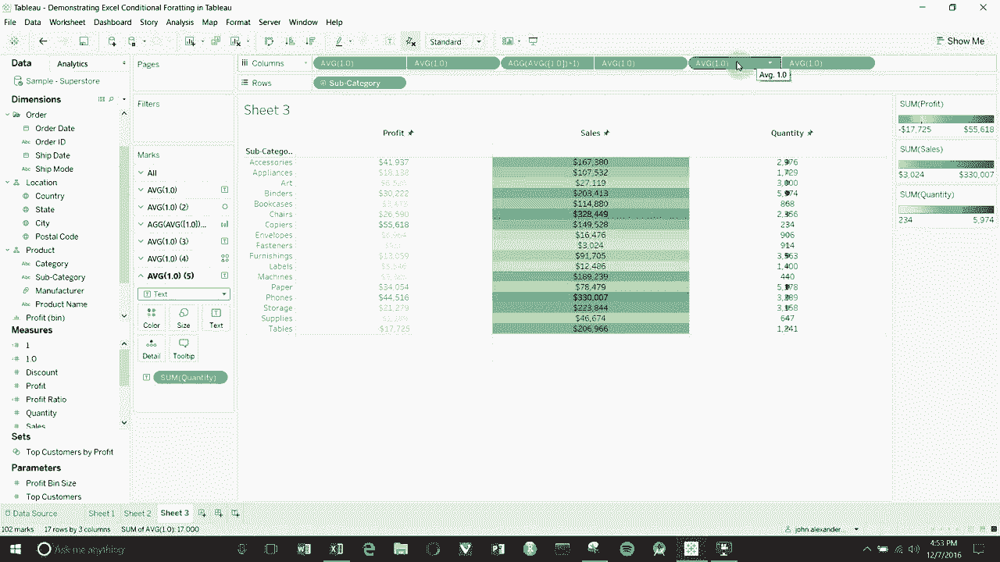

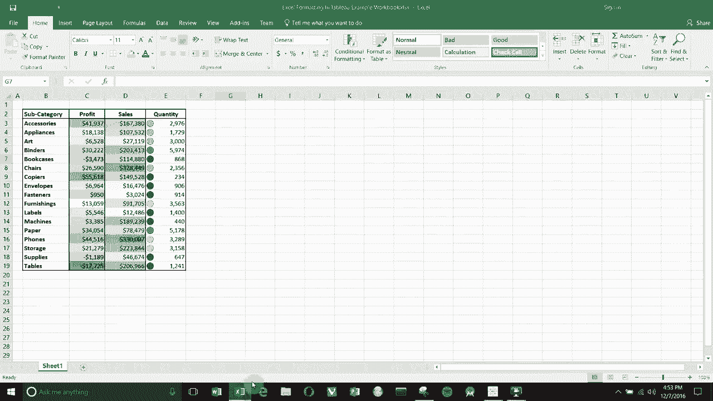

现在，形状和数字在单元格中并排显示。你可以通过拖动列边缘来调整各列的宽度，使其布局更合理。

## 总结

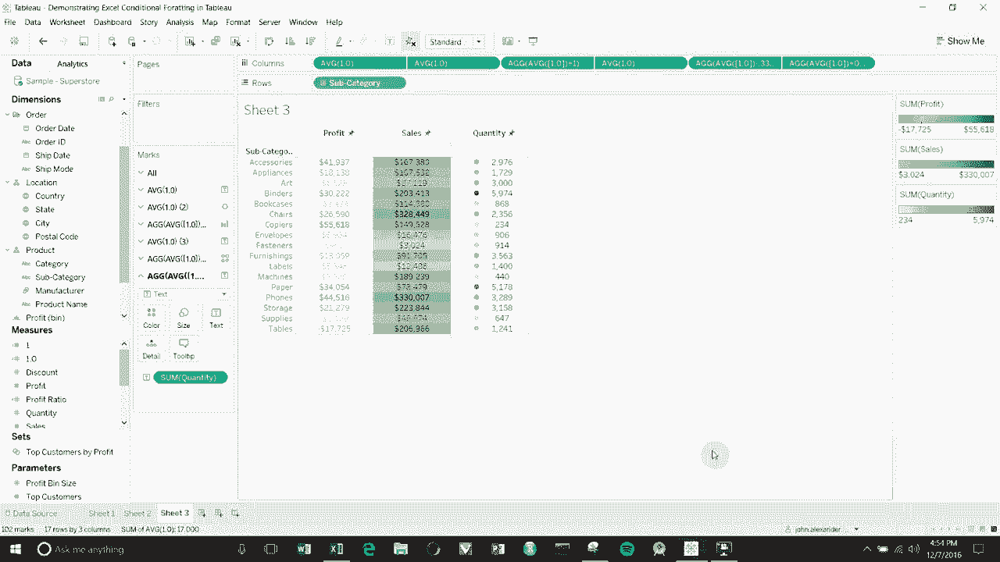

本节课中我们一起学习了在Tableau中构建类似Excel条件格式化表格的方法。我们通过创建多组双轴图表，并分别控制文本、背景色和形状，实现了为不同数据列应用独立可视化规则的目标。关键技巧在于使用 `1.0` 计算字段控制布局，并通过修改其聚合公式（如 `+1`、`±0.333`）来精确定位图表元素。