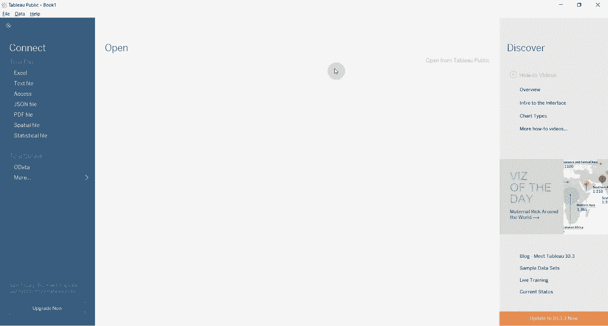
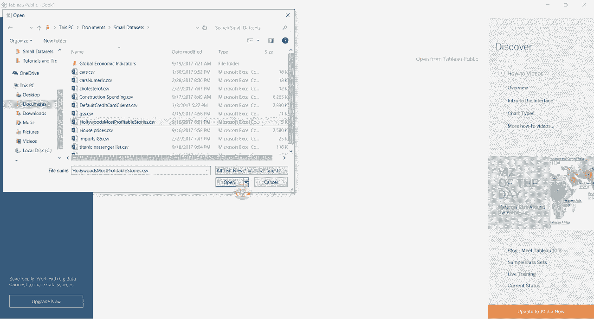
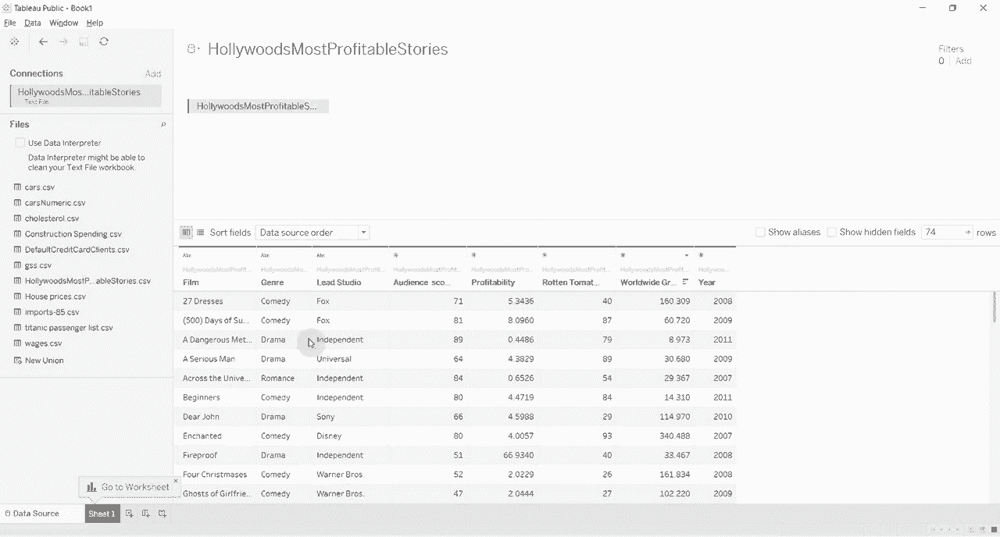
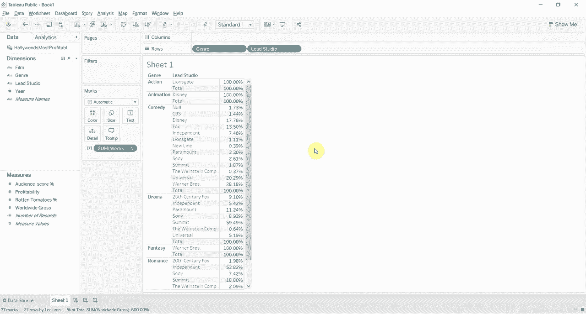

# Tableau操作详解 P9：使用表计算创建总计百分比 📊

在本节课中，我们将学习如何在Tableau中使用表计算功能，来计算某个数值占总计的百分比。我们将通过分析好莱坞电影盈利数据，来探索不同电影类型对各个电影工作室的利润贡献比例。

---

## 数据准备与视图构建

首先，我们打开包含好莱坞电影盈利数据的文本文件。数据集中包含电影名称、主工作室、电影制作年份以及全球票房收入。

为了分析哪个工作室从每种电影类型中获得的利润比例最大，我们需要构建一个视图。

以下是构建视图的步骤：

1.  将“主工作室”字段拖放至行功能区。
2.  将“类型”字段拖放至行功能区，放置在“主工作室”之后。此时，视图会显示每个工作室旗下的各种电影类型。
3.  将“全球总票房”字段拖放至标记卡的“文本”上，以显示具体数值。

为了后续计算百分比时有一个清晰的参考基准，我们需要为视图添加小计和总计。

以下是添加总计的步骤：

1.  点击菜单栏的“分析”。
2.  选择“总计”，然后点击“添加所有小计”。
3.  再次点击“分析” -> “总计”，然后选择“显示列总计”。

完成以上步骤后，视图中每个工作室下方会显示该工作室的票房小计，表格最底部会显示所有数据的总计。

---

## 应用“总计百分比”快速表计算

上一节我们构建了基础的数据视图并添加了总计。本节中，我们来看看如何使用表计算将具体票房数字转换为百分比。

我们的目标是查看每个工作室从每种类型中获得的收入占总收入的比例。这可以通过Tableau的“快速表计算”功能轻松实现。

以下是应用表计算的步骤：

1.  单击“全球总票房”胶囊上的下拉箭头。
2.  选择“快速表计算”。
3.  从子菜单中选择“总计百分比”。

应用后，所有票房数字都会转换为百分比。但此时，每个工作室的小计之和超过了100%，而底部的总总计是100%。这表明当前计算是基于整个表格的总计（即所有工作室所有类型的总和）进行的。例如，“狮门影业-动作片”的93%意味着它占**整个数据集**总票房的93%，这并非我们想要的比较方式。

---

## 调整表计算的详细级别（依据）

上一节我们发现，默认的“总计百分比”计算是基于整个视图的。本节中，我们将学习如何调整计算的依据，以在工作室内部进行比较。

我们希望计算的是每个工作室内部，各种类型的收入占比（即每个工作室的小计为100%）。这需要更改表计算的“计算依据”。

以下是调整计算依据的步骤：

1.  再次右键单击“全球总票房”胶囊。
2.  将鼠标悬停在“计算依据”上。
3.  在弹出的选项中选择“类型”。

调整后，你会发现每个工作室下方的“小计”行都变成了100%。这意味着现在的计算是：`(某个类型收入 / 该工作室总收入) * 100%`。之前添加的小计行此时非常有用，它能清晰地标示出每个计算区间的边界。

---

## 切换视角：分析类型对工作室的贡献

我们刚刚学会了如何计算每个工作室内部类型的占比。现在，让我们换个角度，看看每种电影类型的总收入中，各个工作室分别贡献了多少百分比。

这只需简单地交换行功能区上两个字段的位置即可实现新的分析视角。

以下是切换分析视角的步骤：

1.  将行功能区上的“主工作室”和“类型”两个胶囊互换位置。

视图结构随之改变。现在，我们可以轻松查看，例如在“喜剧”类型中，CBS工作室贡献了100%的收入，20世纪福克斯工作室贡献了74.7%的“戏剧”类收入。这展示了同一组数据，通过不同的计算依据和视图组织，可以回答不同的问题。

如果我们想计算每个工作室产生的喜剧收入占**所有工作室喜剧总收入**的百分比，可以再次调整“计算依据”。

以下是针对特定类型调整计算的步骤：

1.  右键单击“全球总票房”胶囊。
2.  选择“计算依据” -> “主工作室”。

此时，“喜剧”列下的数字会变小，因为现在计算的是每个工作室的喜剧收入占所有工作室喜剧总收入的百分比。同时，每种类型下方的“小计”行会恢复为100%，表示该类型下所有工作室的贡献百分比之和为100%。

---

## 课程总结

本节课中，我们一起学习了Tableau中“表计算”的核心应用之一：计算总计百分比。

我们掌握了以下关键操作：
*   使用**快速表计算** -> **总计百分比** 将数值转换为百分比。
*   通过调整 **计算依据**（例如“类型”或“主工作室”）来改变百分比计算的范围和意义。公式可以理解为：`百分比 = (当前值 / 依据字段分区内的总计) * 100%`。
*   通过**交换行/列上的字段**来快速切换分析维度。

本质上，通过灵活运用“计算依据”，我们可以从两个角度分析数据：一是计算每个工作室内部各种类型的收入占比；二是计算每种类型下各个工作室的收入贡献占比。这是进行深入对比分析的有效工具。